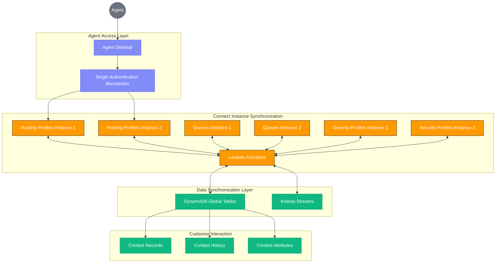

# Unified Agent Experience Across Amazon Connect Instances

## Overview

This document explains how our multi-region Amazon Connect architecture ensures a consistent, seamless experience for contact center agents regardless of which Amazon Connect instance they log into. Through synchronized data, unified state management, and transparent infrastructure, agents receive an identical experience with full access to customer information, routing profiles, and operational tools no matter which region serves them.

## The Agent Experience Challenge

In traditional multi-region contact center deployments, agents typically experience:
- Different logins for different regional instances
- Inconsistent access to customer data
- Inability to handle contacts routed to other regions
- Separate queue management and visibility
- Varied reporting and metrics

Our architecture eliminates these challenges by creating a truly unified backend that synchronizes all critical components of the agent experience.

## Architecture Components for Agent Unification

### 1. Single Agent Desktop Experience

Our architecture provides agents with a unified desktop experience through:

- **Single Sign-On Mechanism**: Agents use one set of credentials regardless of which instance they connect to
- **Instance-Agnostic Interface**: The agent desktop application appears identical across instances
- **Centralized Configuration**: Desktop layouts, tools, and widgets are synchronized across regions
- **Transparent Connectivity**: Backend connection logic automatically connects to the optimal instance

### 2. DynamoDB Global Tables for Unified Data Access

DynamoDB Global Tables ensure agents have consistent access to all required data:

- **Customer Profile Synchronization**: Complete customer histories, preferences, and attributes
- **Contact History Replication**: Full visibility into previous interactions regardless of handling instance
- **Context Attribute Sharing**: All contact attributes and contextual information synchronized in real-time
- **Agent Settings Persistence**: Personal settings, preferences, and configurations maintained across instances

### 3. Real-Time State Synchronization Via Kinesis and Lambda

The combination of Kinesis Streams and Lambda functions ensures agent state remains consistent:

- **Agent State Management**: Available, on contact, after-contact work states synchronized between instances
- **Login/Logout Synchronization**: Agent presence status maintained across environments
- **Skill and Profile Updates**: Changes to agent skills or routing profiles immediately reflected everywhere
- **Schedule Adherence Tracking**: Consistent schedule tracking regardless of login instance

### 4. Routing Profiles and Queue Management

Agents experience unified routing and queue visibility through:

- **Synchronized Routing Profiles**: Agent skills and capabilities consistently applied across instances
- **Global Queue Visibility**: Ability to view and access queues from both instances
- **Cross-Instance Transfers**: Seamless ability to transfer contacts to queues in either instance
- **Balanced Distribution**: Intelligent work distribution that considers agent load across both instances

### 5. Real-Time Metrics and Reporting

Our architecture ensures consistent operational visibility for agents:

- **Unified Dashboard Views**: Real-time metrics that combine data from both instances
- **Personal Performance Metrics**: Agent statistics that aggregate activity across instances
- **Team and Queue Visibility**: Comprehensive view of team performance regardless of instance distribution
- **Historical Reporting**: Consolidated reporting that presents a unified view of operations

## Technical Implementation

### Authentication Flow

When an agent logs in, the following process occurs:

1. Agent enters credentials in the Connect agent workspace/desktop application
2. Authentication request is validated against the centralized directory
3. Upon successful authentication, the system determines optimal instance connection
4. Agent session is established with the selected instance
5. DynamoDB Global Tables provide immediate access to all required agent configuration data
6. Kinesis Streams communicate the agent's login status to both instances

### Contact Handling Process

When an agent receives a contact, regardless of originating instance:

1. Contact is routed based on unified routing profiles and agent availability
2. DynamoDB provides instant access to customer information from either instance
3. Contact attributes and context are available regardless of which instance processed earlier stages
4. Agent actions (notes, dispositions, follow-ups) are captured and synchronized in real-time
5. After-contact work is tracked consistently regardless of originating instance

### Profile and Setting Synchronization

When agent profiles or settings change:

1. Updates are made in the source instance through administrative tools
2. Changes are written to DynamoDB Global Tables
3. Lambda functions process the changes and ensure consistency
4. Updates are applied to configuration in both instances
5. Kinesis Streams notify relevant systems of the changes
6. Agent experience updates seamlessly regardless of connected instance

## Benefits for Agents

This architecture delivers significant advantages for the agent workforce:

- **Simplified Experience**: Single login, consistent interface, and unified data access
- **Reduced Training Requirements**: No need to learn different systems or procedures for different instances
- **Improved Productivity**: Seamless access to all tools and information without instance-specific limitations
- **Flexible Workspace Options**: Ability to work from any location connecting to either instance
- **Comprehensive Customer Visibility**: Complete access to customer history regardless of which instance handled previous contacts
- **Consistent Performance Measurement**: Unified metrics and KPIs that don't vary by connected instance

## Administrator Benefits

Contact center administrators also benefit from:

- **Centralized Management**: Unified administration of agent profiles, skills, and routing
- **Simplified Onboarding**: Single process for adding and configuring new agents
- **Consistent Policy Enforcement**: Unified security profiles and access controls
- **Streamlined Updates**: Configuration changes automatically propagated across instances
- **Comprehensive Reporting**: Holistic visibility into agent performance across the environment

## Implementation Considerations

To achieve this unified agent experience, consider these implementation factors:

- **Network Latency**: Ensure consistent low-latency access to both instances
- **Data Synchronization Performance**: Optimize DynamoDB replication settings for minimal lag
- **Agent Desktop Deployment**: Deploy instance-agnostic desktop applications
- **Feature Parity**: Maintain identical features and capabilities across instances
- **Monitoring**: Implement comprehensive monitoring of the synchronization mechanisms

## Conclusion

Our multi-region Amazon Connect architecture with synchronized DynamoDB Global Tables, Kinesis Streams, and Lambda functions creates a truly unified experience for contact center agents. By eliminating the traditional boundaries between regional instances, we enable agents to work efficiently with full access to customer data, regardless of which instance they connect to.

This unified backend not only improves the agent experience but enhances overall contact center resilience, enables flexible workforce management, and ensures consistent customer service delivery across the entire operation.
