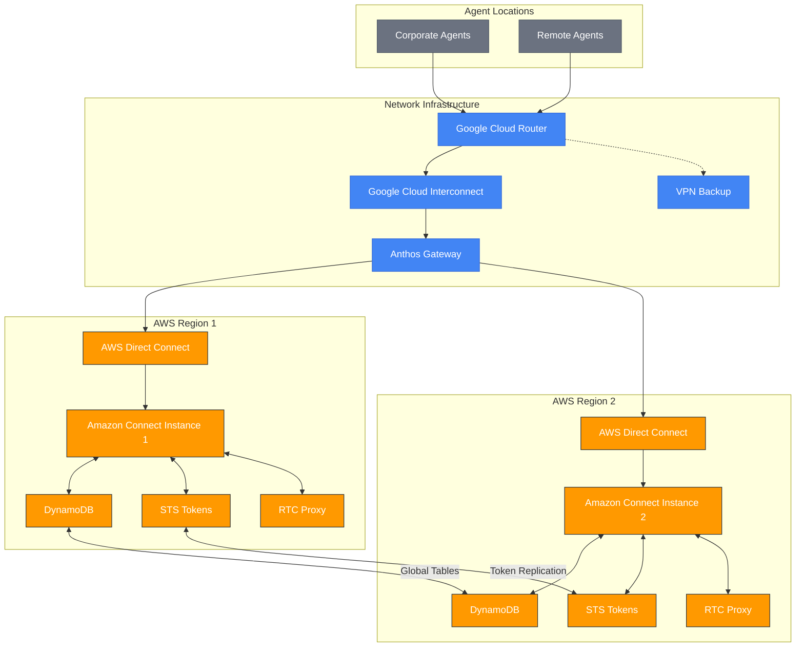

# Agent Failover Experience in Multi-Region Amazon Connect Architecture

## Overview

This document details the backend infrastructure that supports corporate agents during network or regional failures in an active-active Amazon Connect implementation. It specifically focuses on how Google Cloud Router orchestrates network traffic to ensure agents experience minimal disruption during failover events, maintaining call continuity and application functionality.

## The Agent Connectivity Challenge

Contact center agents working with Amazon Connect face unique challenges during infrastructure failures:

- Agents must maintain connectivity to their Amazon Connect instance
- Agent desktop applications require real-time data access
- Voice paths must remain stable for active calls
- Authentication and session management must persist
- Transition between instances must be seamless with minimal UI disruption

## Network Architecture for Agent Connectivity

## Google Cloud Router's Role in Agent Connectivity

Google Cloud Router serves as the critical network intelligence layer that ensures agents maintain seamless connectivity during failover events:

### 1. Transparent Network Path Redirection

- **Seamless Path Switching**: When a regional failure occurs, Cloud Router dynamically redirects agent traffic to the healthy Amazon Connect instance without requiring agent action
- **BGP Route Updates**: Uses BGP to immediately propagate new optimal paths throughout the network
- **Sub-Second Convergence**: Achieves network path convergence in under a second, minimizing disruption
- **Session Persistence**: Maintains TCP sessions where possible to prevent application disconnection

### 2. Load Balancing Agent Traffic

- **Intelligent Distribution**: Distributes agent traffic between regions based on network conditions and instance health
- **Connection Monitoring**: Continuously measures connection quality to both regions
- **Optimized Routing**: Considers factors like latency, packet loss, and jitter when determining optimal paths
- **QoS Implementation**: Applies Quality of Service policies to prioritize voice traffic during congestion

### 3. Traffic Engineering for Voice Quality

- **Voice Path Prioritization**: Ensures RTP (Real-time Transport Protocol) traffic receives priority treatment
- **Minimal Voice Interruption**: Reduces voice artifacts during path transitions through packet queuing techniques
- **Path Diversity**: Utilizes multiple network paths when available to increase resilience
- **Latency Management**: Routes agent voice traffic through the lowest-latency paths available

### 4. Corporate Network Integration

- **On-Premises Connectivity**: Integrates with corporate network infrastructure via BGP
- **SD-WAN Compatibility**: Works with modern SD-WAN solutions for optimized branch office connectivity
- **VPN Integration**: Provides secure connectivity for remote agents through VPN infrastructure
- **Last-Mile Awareness**: Considers corporate network conditions when selecting optimal paths

## Agent Experience During Failover Events

The network architecture creates the following experience for agents during regional failures:

### 1. Normal Operations

- Agents connect to their assigned Amazon Connect instance through the corporate network
- Google Cloud Router dynamically routes their traffic through the optimal network path
- Agent desktop applications access data from DynamoDB and other services
- Voice calls utilize the RTC proxy in their connected region

### 2. Detection of Regional Issues

- Monitoring systems detect a problem with an AWS region or network component
- Cloud Router receives BGP updates indicating path changes
- Lambda functions update Traffic Distribution Groups to redistribute incoming calls
- Anthos Gateways prepare to handle increased traffic through the healthy region

### 3. Agent Traffic Transition

- **Immediate Traffic Redirection**:
  - Cloud Router updates routes to direct agent traffic to the healthy region
  - This happens without any action required from the agent
  - The transition occurs in under a second in most cases
- **Desktop Application Continuity**:
  - Agent desktop connections are maintained through session tokens that work in both regions
  - Applications reconnect to the secondary region's endpoints automatically
  - DynamoDB Global Tables ensure all necessary data is available in the new region
- **Voice Path Preservation**:
  - Active calls transition to use the RTC proxy in the healthy region
  - Brief audio interruption (typically <1 second) may occur during transition
  - Call metadata and context are preserved through DynamoDB replication

### 4. Post-Failover Experience

- Agents continue working in Amazon Connect with minimal disruption
- All functionalities (call handling, chat, screen pops, etc.) remain available
- Performance metrics show no significant degradation
- System logs indicate the successful transition for monitoring purposes

## Technical Implementation Details

### Session Token Synchronization

A critical component of seamless agent experience is the synchronization of session tokens:

- **Token Replication**: AWS STS tokens are replicated between regions
- **Single Sign-On Integration**: Agent authentication state is preserved across regions
- **API Gateway Compatibility**: API access tokens work in both regions
- **Lambda-Based Token Management**: Custom Lambda functions handle token refresh and synchronization

### Agent Application Redirection

Agent desktop applications are designed to handle region transitions smoothly:

- **Health-Check Endpoints**: Applications continuously check connectivity to both regions
- **Automatic Endpoint Switching**: Desktop SDKs detect issues and switch endpoints
- **Connection Retry Logic**: Sophisticated retry mechanisms with exponential backoff
- **Local Caching**: Critical data is cached locally to prevent disruption during transition

### Voice Path Management

Voice continuity is maintained through sophisticated RTC handling:

- **Dual RTC Proxy Registration**: Agent softphones register with RTC proxies in both regions
- **SIP Session Preservation**: SIP signaling is carefully maintained during transitions
- **Media Server Redundancy**: Media servers in both regions can handle the same call
- **Audio Buffering**: Brief audio buffering prevents noticeable gaps during transition

## Monitoring and Metrics

The following metrics help evaluate the effectiveness of agent failover:

- **Failover Success Rate**: Percentage of agent sessions successfully transferred
- **Transition Time**: Average time for complete agent transition between regions
- **Voice Quality Impact**: MOS (Mean Opinion Score) comparison before and after transition
- **Agent Productivity Impact**: Measurement of any workflow disruption during failover
- **Application Performance**: Response time of agent applications after transition

## Conclusion

Google Cloud Router plays a pivotal role in creating a seamless failover experience for contact center agents. By providing intelligent routing, dynamic path selection, and integration with both AWS and corporate networks, it enables a resilient agent experience even during significant infrastructure failures.

The architecture ensures that agents can continue serving customers with minimal disruption, maintaining call continuity and application functionality regardless of which Amazon Connect instance they are ultimately connected to. This level of resilience is critical for maintaining customer service levels and operational efficiency in modern contact centers.
