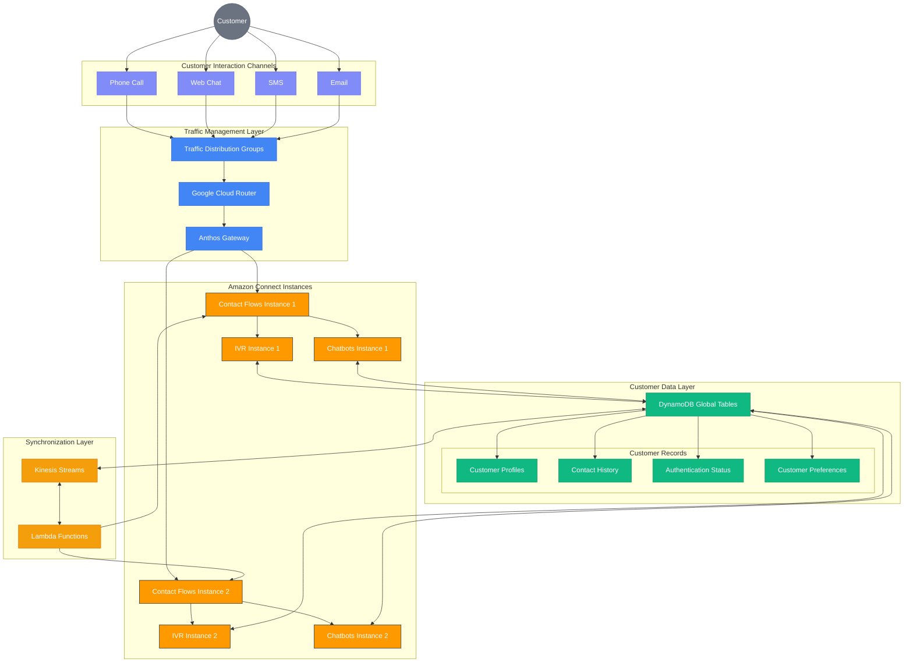

# Unified Customer Experience Across Amazon Connect Instances

## Overview

This document explains how our multi-region Amazon Connect architecture ensures a consistent, seamless experience for customers contacting our organization, regardless of which Amazon Connect instance handles their interaction. Through synchronized customer data, unified contact flows, and intelligent routing, customers receive an identical experience with appropriate personalization whether they're calling, chatting, or using other channels.

## The Customer Experience Challenge

In traditional multi-region contact center deployments, customers might experience:
- Inconsistent IVR or chatbot interactions depending on which region they connect to
- Need to re-authenticate or repeat information when reconnecting
- Disjointed conversation history when interacting through different channels
- Varied wait times and routing decisions based on regional configurations
- Inability to seamlessly continue conversations across channels or sessions

Our architecture eliminates these challenges by creating a unified customer experience layer backed by synchronized data across regions.

## Architecture Components for Customer Experience Unification

## Customer Interaction Flow

### 1. Initial Contact and Routing

When a customer initiates contact through any channel:

1. **Channel Entry**: Customer calls, starts a chat, sends an SMS, or emails the contact center
2. **Traffic Distribution**: Traffic Distribution Groups (TDGs) receive the initial contact
3. **Optimal Routing**: Based on factors like geographic proximity, load balancing, and availability, TDGs route the contact to one of the Amazon Connect instances
4. **Network Optimization**: Google Cloud Router and Anthos Gateway ensure the most efficient network path between the customer and selected instance

### 2. Authentication and Identification

Once routed to an Amazon Connect instance:

1. **Customer Identification**: The system attempts to identify the customer through phone number, chat metadata, or other identifiers
2. **Authentication Process**: If required, the customer is prompted to authenticate through appropriate methods (e.g., PIN, voice biometrics, SMS verification)
3. **DynamoDB Lookup**: Authentication status and customer identity are verified against DynamoDB Global Tables
4. **Contact Record Creation**: A new contact record is created in DynamoDB, accessible to both instances
5. **Real-Time Synchronization**: Authentication state is immediately synchronized via Kinesis Streams, ensuring the customer won't need to re-authenticate if transferred between instances

### 3. Personalized Experience Delivery

Based on the customer's identity and history:

1. **Profile Retrieval**: Customer profile data is pulled from DynamoDB Global Tables
2. **Contact History Access**: Previous interaction history is retrieved regardless of which instance handled prior contacts
3. **Preference Application**: Customer preferences (language, communication style, etc.) are applied to the current interaction
4. **Personalized Routing**: The contact is routed to the most appropriate queue or agent based on history and needs
5. **Context Awareness**: Any relevant context from previous interactions is made available to the system and eventually to agents

### 4. Seamless Cross-Channel and Cross-Instance Transitions

If a customer's journey involves multiple channels or instances:

1. **Context Preservation**: DynamoDB maintains all context as the customer moves between channels
2. **Session Continuity**: If transferred between instances, the customer experience continues without disruption
3. **Conversation Thread Maintenance**: Related interactions are linked together regardless of channel or instance
4. **Authentication Persistence**: Once authenticated, status is maintained across the customer journey
5. **Interaction History Updates**: All touchpoints are recorded in real-time to DynamoDB, accessible by both instances

## Technical Implementation Details

### Customer Database Structure

DynamoDB Global Tables serve as the central repository for customer data with the following key components:

- **Customer Profiles Table**:
  - Unique customer identifiers
  - Contact information (phone, email, etc.)
  - Demographic information
  - Service history and account details
  - Preference settings

- **Contact History Table**:
  - Complete record of all interactions
  - Timestamps and duration
  - Channel and contact type
  - Instance and agent identifiers
  - Interaction outcomes and resolutions
  - Link to recordings or transcripts

- **Authentication Table**:
  - Authentication methods and credentials
  - Security verification status
  - Recent authentication events
  - Fraud monitoring flags

- **Session Context Table**:
  - Active session identifiers
  - Current journey state
  - Collected information and inputs
  - Intent and needs identification
  - Cross-channel session mapping

### Real-Time Synchronization Mechanisms

To ensure seamless customer experiences, our architecture includes:

- **Kinesis Streams for Event Propagation**:
  - Contact initiation events
  - Authentication events
  - Customer input and response events
  - State transition events
  - Session completion events

- **Lambda Functions for Processing and Synchronization**:
  - Event validation and processing
  - DynamoDB updates and retrievals
  - Cross-instance notifications
  - Contact flow manipulations
  - System state management

### Contact Flow Synchronization

To maintain consistent experiences, contact flows are:

- **Centrally Managed**: All flows are created and updated in a central repository
- **Automatically Synchronized**: Changes are deployed simultaneously to both instances
- **Version Controlled**: All flows have consistent versioning across instances
- **Reference-Based**: Flows reference customer data from DynamoDB rather than instance-specific sources
- **Dynamic**: Flows can adapt based on real-time conditions while maintaining consistency

## Customer Experience Benefits

This architecture provides significant advantages for customers:

- **Consistent Experience**: Same IVR prompts, chatbots, and flows regardless of which instance they connect to
- **Recognition Across Touchpoints**: System recognizes and remembers customers across all channels and instances
- **Reduced Repetition**: Customers don't need to repeat information or re-authenticate unnecessarily
- **Contextual Continuity**: Previous interactions inform current handling regardless of instance or channel
- **Personalized Service**: Consistent application of preferences and history-based personalization

## Implementation Considerations

To achieve this unified customer experience, consider these key factors:

- **Data Synchronization Performance**: Optimize DynamoDB replication settings for minimal lag
- **Contact Flow Consistency**: Ensure identical contact flows across instances with synchronized updates
- **Authentication Security**: Balance security requirements with seamless customer experience
- **Privacy Compliance**: Ensure customer data handling complies with relevant regulations (GDPR, CCPA, etc.)
- **Monitoring and Metrics**: Implement comprehensive end-to-end tracking of customer journeys across instances

## Advanced Features

Our architecture enables several advanced customer experience capabilities:

### Journey Continuity

- **Cross-Channel Resumption**: Customers can start in one channel (e.g., chat) and continue in another (e.g., voice) with context preserved
- **Callback Preservation**: If a customer is offered a callback, all context is maintained when the callback occurs
- **Interrupted Journey Recovery**: If a connection is lost, the customer can reconnect and continue from where they left off

### Proactive Engagement

- **Unified Outbound Campaigns**: Outbound contacts are coordinated across instances
- **Consistent Proactive Messaging**: Notifications and proactive contacts maintain consistent tone and context
- **Cross-Channel Orchestration**: Coordinated outreach across multiple channels based on unified customer data

### Intelligent Routing

- **Global Skills-Based Routing**: Routes to best-skilled agent regardless of instance
- **Relationship-Based Continuity**: Routes to previous agents when beneficial
- **Intent-Based Prioritization**: Consistently applies prioritization based on customer intent and needs
- **Predictive Routing**: Uses historical data from both instances to optimize routing decisions

## Conclusion

Our multi-region Amazon Connect architecture with synchronized DynamoDB Global Tables creates a truly unified experience for customers contacting our organization. By eliminating the traditional boundaries between regional instances, we ensure customers receive consistent, personalized service with full context preservation regardless of which instance handles their interaction.

This unified customer experience not only improves satisfaction but enhances efficiency by eliminating repetition, enables more personalized service through comprehensive data access, and ensures business continuity through seamless regional failover without disrupting the customer journey.
