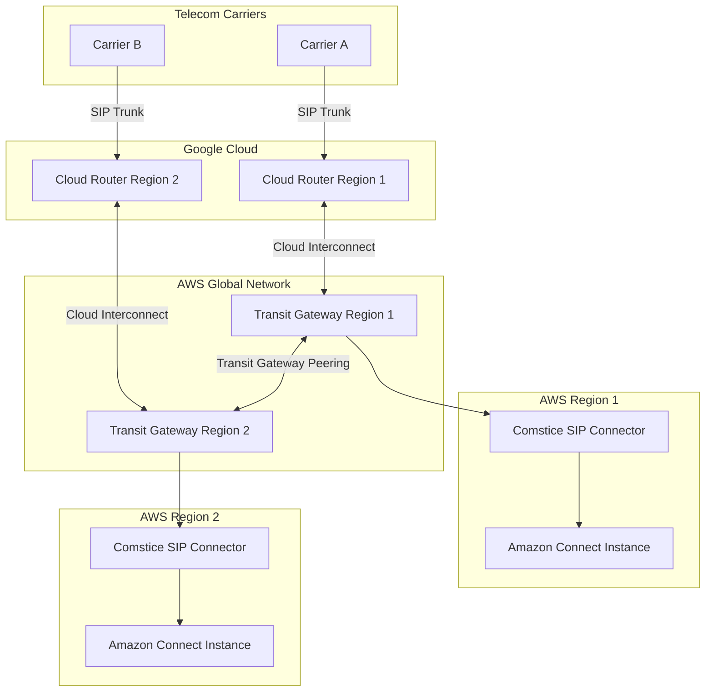
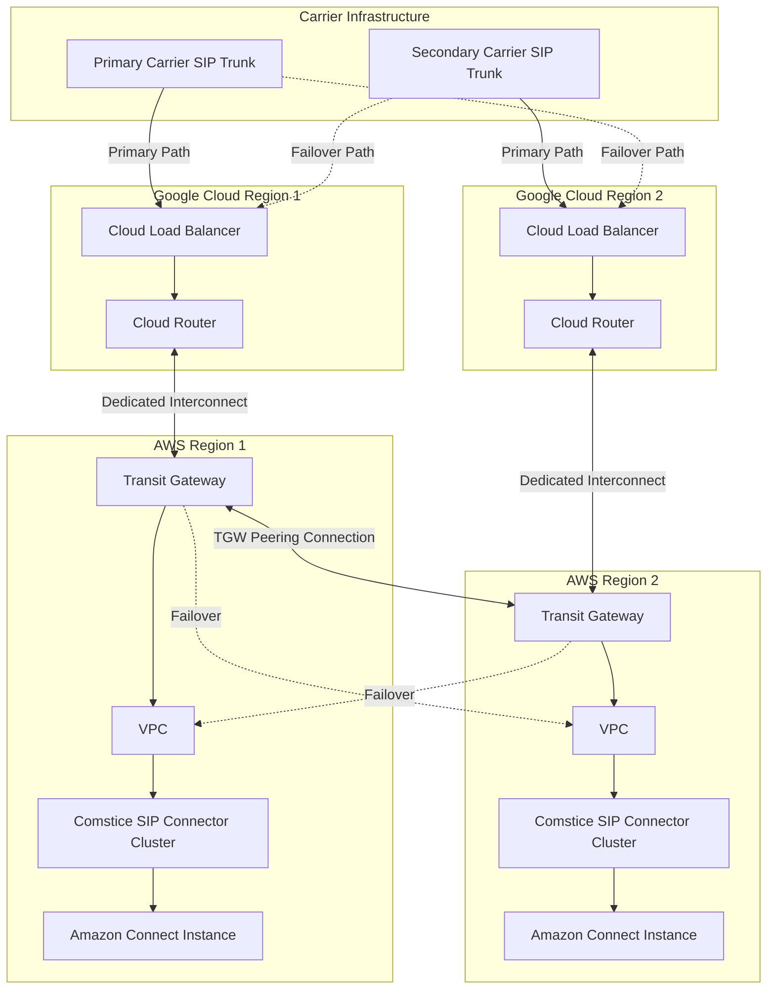
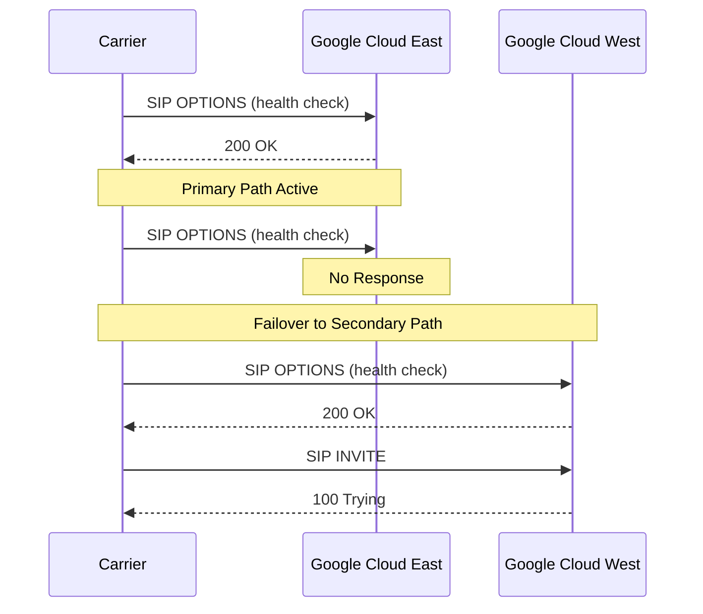

# Multi-Region Geo-Redundancy Implementation Guide 
# Using Google Cloud Router, AWS Transit Gateway, and Comstice SIP Connector

## Table of Contents

- [Overview](#overview)
- [Architecture](#architecture)
- [Components](#components)
- [Implementation Steps](#implementation-steps)
- [Configuration Details](#configuration-details)
- [Failover Mechanisms](#failover-mechanisms)
- [Monitoring and Management](#monitoring-and-management)
- [Best Practices](#best-practices)
- [Troubleshooting](#troubleshooting)

## Overview

This guide explains how to implement a geo-redundant, active-active configuration for Amazon Connect using Google Cloud Router, AWS Transit Gateway, and the Comstice SIP Connector. This architecture enables high availability and disaster recovery capabilities across multiple geographic regions.

### Key Benefits

- **Geographic Redundancy**: Distributed infrastructure across multiple regions
- **Active-Active Configuration**: All instances handle traffic simultaneously
- **Seamless Failover**: Automatic routing around failures
- **Balanced Load Distribution**: Traffic distributed based on optimal routing
- **Carrier Independence**: Multiple ingress points for carrier connectivity

## Architecture

The architecture uses Google Cloud Router and AWS Transit Gateway as core networking components to enable traffic routing between telecommunications carriers and multiple Comstice SIP Connector instances deployed across different AWS regions.

### High-Level Architecture



### Detailed Network Flow



## Components

### Google Cloud Components

1. **Google Cloud Router**:
   - Provides BGP-based dynamic routing
   - Enables traffic distribution across multiple paths
   - Supports health checks and automatic failover
   - Deployed in multiple regions for redundancy

2. **Google Cloud Load Balancer**:
   - Distributes SIP traffic across available paths
   - Performs health checks to ensure target availability
   - Provides traffic engineering capabilities

3. **Cloud Interconnect**:
   - Establishes high-bandwidth, low-latency connections to AWS
   - Supports redundant connections for reliability
   - Enables private connectivity between cloud providers

### AWS Components

1. **AWS Transit Gateway**:
   - Acts as a network transit hub for connecting VPCs and on-premises networks
   - Enables cross-region routing through Transit Gateway peering
   - Supports ECMP (Equal Cost Multi-Path) for load balancing
   - Provides route propagation and isolation capabilities

2. **VPCs**:
   - Isolated network environments for Comstice SIP Connector instances
   - Configured with appropriate subnets, route tables, and security groups
   - Connected to Transit Gateway for inter-region communication

3. **Comstice SIP Connector**:
   - Deployed as clusters in multiple AWS regions
   - Configured for active-active operation
   - Performs SIP to WebRTC conversion
   - Integrates with regional Amazon Connect instances

4. **Amazon Connect Instances**:
   - Deployed in multiple AWS regions
   - Configured with identical contact flows and agent configurations
   - Set up for independent operation in case of regional isolation

## Implementation Steps

### Phase 1: Google Cloud Setup

1. **Cloud Router Configuration**:
   ```
   # Create Cloud Routers in multiple regions
   gcloud compute routers create carrier-router-us-east1 \
     --network=carrier-network \
     --region=us-east1
   
   gcloud compute routers create carrier-router-us-west1 \
     --network=carrier-network \
     --region=us-west1
   ```

2. **Cloud Load Balancer Setup**:
   ```
   # Create health checks for SIP endpoints
   gcloud compute health-checks create tcp sip-health-check \
     --port=5060 \
     --check-interval=5s \
     --timeout=5s \
     --healthy-threshold=2 \
     --unhealthy-threshold=2
   
   # Create backend service
   gcloud compute backend-services create sip-backend-service \
     --load-balancing-scheme=EXTERNAL \
     --protocol=TCP \
     --health-checks=sip-health-check \
     --global
   ```

3. **Cloud Interconnect Configuration**:
   ```
   # Create Dedicated Interconnect connections
   gcloud compute interconnects dedicated create aws-interconnect-us-east1 \
     --requested-link-count=2 \
     --location=us-east1-interconnect-location
   
   gcloud compute interconnects dedicated create aws-interconnect-us-west1 \
     --requested-link-count=2 \
     --location=us-west1-interconnect-location
   ```

### Phase 2: AWS Transit Gateway Setup

1. **Create Transit Gateways**:
   ```
   # Create Transit Gateway in US East region
   aws ec2 create-transit-gateway \
     --description "TGW US East" \
     --amazon-side-asn 64512 \
     --region us-east-1
   
   # Create Transit Gateway in US West region
   aws ec2 create-transit-gateway \
     --description "TGW US West" \
     --amazon-side-asn 64513 \
     --region us-west-1
   ```

2. **Configure Transit Gateway Peering**:
   ```
   # Create peering attachment
   aws ec2 create-transit-gateway-peering-attachment \
     --transit-gateway-id tgw-east-id \
     --peer-transit-gateway-id tgw-west-id \
     --peer-region us-west-1 \
     --region us-east-1
   
   # Accept peering attachment
   aws ec2 accept-transit-gateway-peering-attachment \
     --transit-gateway-attachment-id tgw-attachment-id \
     --region us-west-1
   ```

3. **Attach VPCs to Transit Gateways**:
   ```
   # Attach East VPC to East Transit Gateway
   aws ec2 create-transit-gateway-vpc-attachment \
     --transit-gateway-id tgw-east-id \
     --vpc-id vpc-east-id \
     --subnet-ids subnet-a subnet-b \
     --region us-east-1
   
   # Attach West VPC to West Transit Gateway
   aws ec2 create-transit-gateway-vpc-attachment \
     --transit-gateway-id tgw-west-id \
     --vpc-id vpc-west-id \
     --subnet-ids subnet-c subnet-d \
     --region us-west-1
   ```

### Phase 3: Comstice SIP Connector Deployment

1. **Deploy in Multiple Regions**:
   ```
   # Launch Comstice instance in US East
   aws ec2 run-instances \
     --image-id ami-comstice \
     --instance-type m5.xlarge \
     --key-name comstice-key \
     --security-group-ids sg-comstice \
     --subnet-id subnet-a \
     --region us-east-1
   
   # Launch Comstice instance in US West
   aws ec2 run-instances \
     --image-id ami-comstice \
     --instance-type m5.xlarge \
     --key-name comstice-key \
     --security-group-ids sg-comstice \
     --subnet-id subnet-c \
     --region us-west-1
   ```

2. **Configure Clustering**:
   - Configure each regional cluster for high availability
   - Set up database replication between instances
   - Configure shared state management

### Phase 4: Amazon Connect Configuration

1. **Create Multi-Region Connect Instances**:
   - Create Amazon Connect instances in each target region
   - Configure identical contact flows, queues, and agent routing profiles
   - Set up identical phone numbers or create a mapping strategy

2. **Integrate with Comstice SIP Connector**:
   - Configure each regional Comstice instance to integrate with the corresponding Amazon Connect instance
   - Set up WebRTC API integration
   - Configure dial plans and routing rules

### Phase 5: Integration and Testing

1. **Carrier Integration**:
   - Configure carrier SIP trunks to point to Google Cloud load balancer endpoints
   - Set up redundant connections from carriers to multiple Google Cloud regions
   - Configure SIP OPTIONS keep-alives for health checking

2. **End-to-End Testing**:
   - Test call routing under normal conditions
   - Simulate regional failures and verify automatic failover
   - Verify call quality and performance metrics

## Configuration Details

### Google Cloud Router BGP Configuration

```
# Configure BGP sessions on Cloud Router
gcloud compute routers add-bgp-peer carrier-router-us-east1 \
  --peer-name=aws-transit-gateway \
  --interface=interconnect-interface \
  --peer-ip-address=169.254.0.1 \
  --peer-asn=64512 \
  --region=us-east1
```

### AWS Transit Gateway Route Tables

```
# Create route table
aws ec2 create-transit-gateway-route-table \
  --transit-gateway-id tgw-east-id \
  --region us-east-1

# Add routes
aws ec2 create-transit-gateway-route \
  --transit-gateway-route-table-id tgw-rtb-id \
  --destination-cidr-block 10.0.0.0/16 \
  --transit-gateway-attachment-id tgw-attachment-id \
  --region us-east-1
```

### Comstice SIP Connector Active-Active Configuration

Configure the Comstice admin interface:

1. **Global Settings**:
   - Navigate to System > Global Settings
   - Enable "Active-Active Mode"
   - Configure "Cluster Name" and "Region Identifier"
   - Set up database replication endpoints

2. **SIP Trunk Configuration**:
   - Configure identical SIP trunk settings across regions
   - Set "Region Preference" to "None" for active-active mode
   - Configure "Failover Detection Time" to desired threshold

3. **WebRTC Integration**:
   - Configure each instance to connect to its regional Amazon Connect instance
   - Set up identical dial plans with region-aware routing rules

## Failover Mechanisms

This architecture implements multiple layers of failover to ensure high availability:

### Layer 1: Carrier to Google Cloud Failover



### Layer 2: Google Cloud to AWS Transit Gateway Failover

BGP-based failover with route propagation enables automatic rerouting if a connection between Google Cloud and an AWS Transit Gateway fails.

### Layer 3: AWS Cross-Region Failover

Transit Gateway peering enables traffic to be rerouted to a healthy region if a regional outage occurs, with routes automatically updated through BGP.

### Layer 4: Comstice SIP Connector Cluster Failover

Within each region, the Comstice SIP Connector cluster provides internal failover if individual instances have issues.

## Monitoring and Management

### Monitoring Setup

1. **Google Cloud Monitoring**:
   - Create dashboards for Cloud Router metrics
   - Set up alerts for interconnect health and capacity
   - Monitor BGP session status

2. **AWS CloudWatch**:
   - Configure metrics for Transit Gateway
   - Set up alarms for cross-region traffic
   - Monitor VPC and EC2 health

3. **Comstice Monitoring**:
   - Enable detailed SIP and media logging
   - Configure centralized log aggregation
   - Set up alerting for call quality issues

### Management Plane

Implement a centralized management approach:

1. **Infrastructure as Code**:
   - Use Terraform to manage cloud resources
   - Implement CI/CD for configuration changes
   - Store configurations in version control

2. **Operational Runbooks**:
   - Document failover procedures
   - Create recovery processes
   - Establish testing protocols

## Best Practices

### Network Design

1. **IP Addressing**:
   - Use non-overlapping CIDR blocks across regions
   - Implement consistent IP addressing scheme
   - Reserve address space for future expansion

2. **Routing**:
   - Implement route aggregation where possible
   - Use consistent BGP ASN allocation strategy
   - Document all BGP peering relationships

### Security

1. **Defense in Depth**:
   - Implement security groups at all layers
   - Use network ACLs for additional protection
   - Enable flow logs for traffic analysis

2. **Encryption**:
   - Use SIP TLS for signaling encryption
   - Implement SRTP for media encryption
   - Secure inter-cloud links with IPsec

### Operational Excellence

1. **Change Management**:
   - Implement proper change control procedures
   - Test changes in non-production environment first
   - Use blue/green deployments for major changes

2. **Disaster Recovery**:
   - Conduct regular failover testing
   - Document recovery procedures
   - Practice regional isolation scenarios

## Troubleshooting

### Common Issues and Solutions

1. **BGP Peering Issues**:
   - Verify ASN configuration
   - Check for routing loops
   - Validate BGP session establishment

2. **SIP Connectivity Problems**:
   - Verify SIP signaling path
   - Check firewall and security group configuration
   - Confirm SIP message formatting

3. **Call Quality Issues**:
   - Check for network congestion
   - Monitor jitter and packet loss
   - Verify codec compatibility

### Diagnostic Commands

```bash
# Check Google Cloud Router BGP sessions
gcloud compute routers get-status carrier-router-us-east1 --region=us-east1

# Verify AWS Transit Gateway routes
aws ec2 search-transit-gateway-routes \
  --transit-gateway-route-table-id tgw-rtb-id \
  --filters '{"Name":"type","Values":["propagated"]}' \
  --region us-east-1

# Check Comstice SIP Connector status
curl -k -u admin:password https://comstice-ip:8443/api/v1/status
```

---

This implementation provides a robust, geo-redundant solution for Amazon Connect, ensuring high availability and disaster recovery capabilities. For specific configuration details for your environment, please consult with your network team, cloud architects, and Comstice support.
