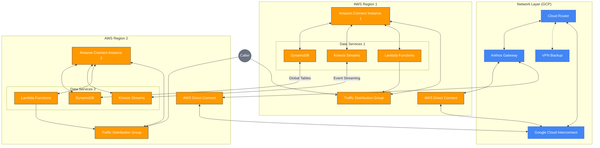

# GCP Cloud Router and AWS Services Integration for Active-Active Contact Centers

## Overview

This document explains how Google Cloud Platform's Cloud Router works in conjunction with AWS services (DynamoDB, Kinesis, and Lambda) to create a truly seamless active-active Amazon Connect infrastructure across multiple regions. This architecture provides edge-optimized routing, real-time data synchronization, and automated failover capabilities to ensure continuous contact center operations.

## Architecture Diagram

## GCP Cloud Router: The Network Intelligence Layer

### Dynamic Routing for Edge Proximity

Cloud Router serves as the intelligent network foundation of our multi-region architecture by:

- **Edge-Aware Routing**: Using BGP (Border Gateway Protocol) to dynamically learn the closest network path to each caller's location
- **Latency Optimization**: Routing calls to the Amazon Connect instance geographically closest to the caller
- **Traffic Distribution Coordination**: Working with Amazon Connect Traffic Distribution Groups (TDGs) to ensure network traffic follows optimal paths to the appropriate edge location
- **Real-Time Path Selection**: Continuously evaluating network conditions to select the most efficient routing path

### Enabling Active-Active Load Balancing

Cloud Router ensures balanced distribution of contact center traffic by:

- **Even Traffic Distribution**: Maintaining network routes that distribute traffic evenly across both Connect instances
- **Dynamic Route Updates**: Adjusting routing in real-time based on instance health and capacity
- **50/50 Split Enablement**: Providing the network foundation that makes true 50/50 traffic distribution possible
- **Weighted Route Preferences**: Supporting configurable routing weights when needed for maintenance or capacity management

### Seamless Failover for Edge Resilience

When network or instance failures occur, Cloud Router provides:

- **Automatic Rerouting**: Immediate detection of path failures and rerouting of traffic to healthy alternatives
- **Transparent Transition**: Failover that is invisible to callers, preventing disrupted communications
- **Edge Resilience**: Ability to bypass localized outages by leveraging alternative network paths
- **Sub-Second Convergence**: Rapid route updates that minimize the impact of network changes

### Network Connectivity Foundation

As the backbone of the multi-region infrastructure, Cloud Router:

- **Connects Disparate Environments**: Bridges AWS regions and GCP resources into a unified network
- **Optimizes Flow Paths**: Ensures traffic between Connect instances and agents follows the most efficient routes
- **Provides Interconnect Integration**: Works with Google Cloud Interconnect to create high-bandwidth, low-latency connections
- **Enables End-to-End Quality**: Maintains consistent network performance across the entire contact center infrastructure

## AWS Services: The Data and Logic Layer

### DynamoDB Global Tables for Unified Data

DynamoDB Global Tables provide a synchronized data foundation by:

- **Multi-Region Replication**: Automatically replicating critical data across AWS regions in real-time
- **Data Types Synchronized**:
  - Customer profiles and contact history
  - Agent states and availability
  - Contact flows and routing configurations
  - Queue metrics and real-time statistics
- **Consistent Experience Support**: Ensuring agents and customers have identical experiences regardless of which instance they connect to
- **Transaction Consistency**: Maintaining data integrity even during regional transitions

### Kinesis Streams for Real-Time State Synchronization

Kinesis Streams enable event-driven synchronization through:

- **Event Streaming**: Capturing and distributing state change events across both environments
- **High-Throughput Processing**: Handling millions of events per second to ensure real-time operations
- **Event Types Synchronized**:
  - Agent login/logout events
  - Status changes (available, offline, on break)
  - Contact initiation and termination
  - Queue updates
  - Routing decisions
- **Ordered Delivery**: Ensuring events are processed in the correct sequence to maintain state consistency

### Lambda Functions for Event Processing and Orchestration

Lambda functions provide the intelligent "glue" connecting all components by:

- **Event Processing**: Consuming events from Kinesis streams and translating them into actions
- **Cross-Service Integration**: Connecting DynamoDB, Kinesis, and Amazon Connect instances
- **Health Monitoring**: Continuously checking instance health and network connectivity
- **Failover Orchestration**: Coordinating failover activities including TDG adjustments and routing updates
- **Smart Decision Logic**: Implementing business rules for optimal contact routing and handling

### Unified Agent and Customer Experiences

The combined services create a truly unified experience through:

- **Unified Agent Experience**:
  - Consistent access to tools and data across instances
  - Seamless login to either instance with identical capabilities
  - Synchronized work state and queue visibility
- **Unified Customer Experience**:
  - Identical IVR experiences regardless of instance
  - Consistent routing based on customer profile
  - Seamless transfers between agents on different instances
- **Global Operational View**:
  - Cross-instance reporting and analytics
  - Holistic queue management
  - Unified administrative controls

## Integration: How Everything Works Together

### The Active-Active Flow

1. **Caller Connection and Routing**:
   - When a caller contacts the center, Cloud Router determines the optimal edge location based on proximity
   - TDGs work with Cloud Router to direct the call to the appropriate Connect instance
   - The call is connected to the optimal instance while maintaining overall 50/50 distribution

2. **Data Access and Synchronization**:
   - The Connect instance accesses customer data from DynamoDB Global Tables
   - Any updates to customer information are immediately replicated to both regions
   - Agent states and availability are continuously synchronized through Kinesis streams

3. **Agent Interaction**:
   - Agents can log into either instance and have access to the same tools and data
   - Lambda functions process events from the agent's actions and update state across the environment
   - If a transfer is needed, the system can seamlessly move the contact to an agent in either instance

4. **Failover Scenario**:
   - If a regional issue occurs, Lambda functions detect the problem and trigger failover procedures
   - Cloud Router immediately updates routing to redirect traffic away from the affected region
   - DynamoDB Global Tables ensure data continues to be available in the healthy region
   - Existing contacts are preserved with minimal disruption

### Technical Integration Points

- **Cloud Router + AWS Direct Connect**: Provides the physical connectivity between AWS regions and GCP
- **Cloud Router + TDGs**: Coordinates to ensure network traffic follows TDG distribution rules
- **DynamoDB + Lambda**: Lambda functions use DynamoDB as both a data source and destination for state management
- **Kinesis + Lambda**: Lambda functions process Kinesis events to drive actions in the environment
- **Lambda + Connect API**: Lambda uses the Connect API to control instance behavior during normal and failover operations

## Implementation Benefits

- **99.99% Availability**: Eliminates single points of failure across the contact center infrastructure
- **Optimal Call Quality**: Routes contacts through the lowest-latency path to improve customer experience
- **Resource Optimization**: Ensures even utilization of contact center resources across regions
- **Operational Simplicity**: Provides a unified management experience despite the distributed architecture
- **Seamless Scaling**: Allows for independent scaling of regional resources while maintaining a unified experience

## Conclusion

The integration of GCP Cloud Router with AWS DynamoDB, Kinesis, and Lambda creates a robust foundation for truly active-active Amazon Connect operations. This architecture not only provides high availability through redundancy but enables a seamlessly unified contact center experience across multiple regions.

By combining GCP's networking expertise with AWS's data synchronization and serverless computing capabilities, organizations can deploy a contact center infrastructure that is resilient, performant, and operationally efficient.

