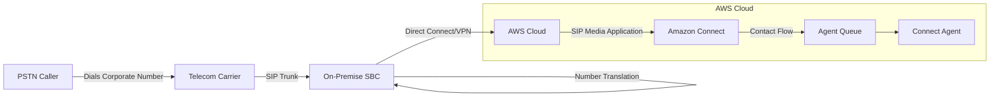
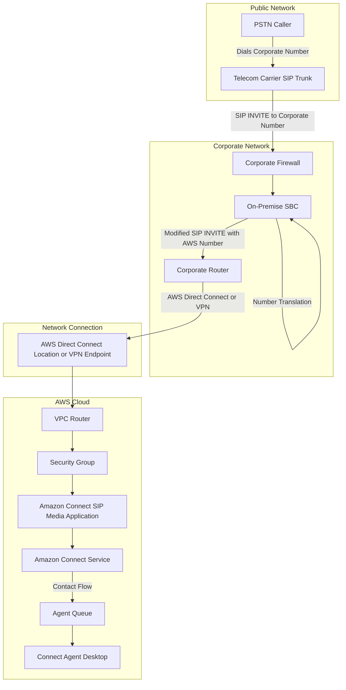
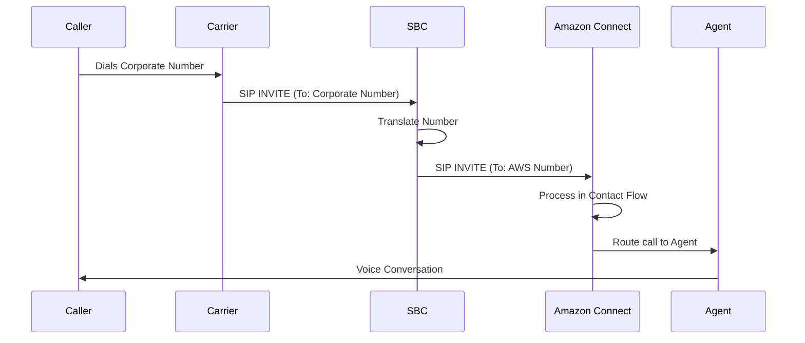

# SIP Trunk to Amazon Connect Integration Guide

This guide provides detailed instructions on how to implement a connection from a carrier SIP trunk to Amazon Connect via an on-premises Session Border Controller (SBC).

## Overview

This integration enables inbound calls from a telecommunications carrier to be routed to Amazon Connect through your on-site infrastructure. The solution involves:

1. Receiving calls from your carrier on your on-premises SBC
2. Translating phone numbers to match your AWS claimed numbers
3. Routing the calls to Amazon Connect via AWS Direct Connect or VPN
4. Processing the calls using Amazon Connect contact flows

## Network Topology

The network topology for this integration involves multiple components working together to route calls from the telecommunications carrier to Amazon Connect agents.

### High-Level Architecture



### Detailed Network Diagram



### SIP Message Flow



## Prerequisites

- A SIP trunk from a telecommunications carrier
- An on-premises Session Border Controller (SBC)
- An AWS account with Amazon Connect instance
- AWS claimed phone numbers
- AWS Direct Connect or site-to-site VPN connection to AWS

## Detailed Implementation Steps

### Step 1: Carrier SIP Trunk to On-Site SBC

#### Carrier Configuration:

1. Contact your telecommunications carrier to provision a SIP trunk
2. Provide the carrier with the public IP address or FQDN of your on-site SBC
3. Ensure the carrier is configured to include the dialed number (your corporate phone number) in the "To" or "Request-URI" header of SIP INVITE messages
4. Obtain the IP address range that the carrier will use to send calls to your SBC

#### SBC Configuration (Inbound Routing):

1. Access your SBC's management interface
2. Configure a SIP listener to accept incoming connections from your carrier's IP address range
3. Create an Access Control List (ACL) that allows traffic from the carrier's IP range
4. Set up an inbound routing rule that matches the dialed number pattern (your corporate number)
5. Configure the SBC to accept these incoming calls
6. Test that calls from the carrier are successfully received by the SBC

### Step 2: Number Mapping on the SBC

#### Translation Rule Creation:

1. Within your SBC's management interface, navigate to the call routing or dial plan section
2. Create a translation rule that maps your corporate phone numbers to the corresponding AWS claimed numbers
3. Configure the SBC to modify the "To" or "Request-URI" header in the SIP INVITE message
4. Example configuration (syntax will vary based on your SBC vendor):
   ```
   match: sip:15551234567@your-domain.com
   replace: sip:+18005551234@connect.region.amazonaws.com
   ```

#### Number Normalization:

1. Ensure the translated number is in E.164 format (with a leading '+')
2. Create a normalization rule if needed, for example:
   ```
   match: 18005551234
   replace: +18005551234
   ```
3. Validate that the SBC correctly formats the number for Amazon Connect compatibility
4. Test the translation rule by placing a test call to your corporate number

### Step 3: Routing to Amazon Connect via AWS Direct Connect or VPN

#### SBC Configuration (Outbound Routing):

1. Retrieve the IP address or FQDN of your Amazon Connect SIP media application
2. In your SBC's management interface, create an outbound peer or trunk that points to the Amazon Connect SIP endpoint
3. Configure the outbound routing rule to send calls with AWS claimed numbers to the Amazon Connect SIP media application
4. Set the appropriate codec and protocol settings (typically G.711 and SIP over UDP/TCP)
5. Configure the SDP (Session Description Protocol) settings according to Amazon Connect requirements

#### AWS Direct Connect or VPN Setup:

1. Choose between AWS Direct Connect or site-to-site VPN based on your requirements:
   - **Direct Connect**:
     - Order a Direct Connect connection through the AWS console or partner
     - Configure your on-premises router to establish BGP peering with AWS
     - Create and configure a virtual interface (VIF) to your AWS VPC
   - **Site-to-Site VPN**:
     - Create a Customer Gateway in the AWS VPC console
     - Create a Virtual Private Gateway and attach it to your VPC
     - Establish a VPN connection between your Customer Gateway and Virtual Private Gateway
     - Configure your on-premises VPN device to connect to AWS
2. Ensure the network route table includes paths to the Amazon Connect SIP media application
3. Verify connectivity between your SBC and the Amazon Connect SIP endpoint

#### Amazon Connect SIP Media Application Configuration:

1. In the AWS console, navigate to the Amazon Connect service
2. Configure the SIP media application to accept calls from your SBC's IP address
3. Associate the AWS claimed numbers with your Amazon Connect instance
4. Ensure that the security groups and network ACLs allow traffic from your SBC

### Step 4: Amazon Connect Call Flow

#### Contact Flow Creation:

1. In the Amazon Connect admin console, navigate to "Routing" > "Contact flows"
2. Create a new contact flow or edit an existing one
3. Add a "Get customer input" block to play a greeting and collect DTMF input if needed
4. Add conditional branches based on the caller's input or other attributes
5. Configure appropriate actions like "Transfer to queue," "Play prompt," or "Set working queue"
6. Save and publish the contact flow

#### Agent Routing Configuration:

1. In the Amazon Connect admin console, create agent queues based on your business requirements
2. Set up routing profiles that map agents to queues
3. Configure queue prioritization and agent skill sets if needed
4. Associate the contact flow with your AWS claimed number
5. Test the end-to-end call flow from dialing your corporate number to agent connection

## Key Considerations

### Security

- Implement SIP TLS and SRTP for encrypted signaling and media
- Use strong authentication between your SBC and the carrier
- Regularly update firmware and software on your SBC
- Implement SIP rate limiting to prevent DoS attacks
- Review and audit access controls regularly

### Number Formatting

- Carefully test number formatting in both directions
- Document all number translation rules
- Consider edge cases like international numbers
- Verify number display on agent screens

### Latency Management

- Monitor RTT (Round Trip Time) between your SBC and Amazon Connect
- Optimize Direct Connect or VPN configurations
- Consider geographic proximity when choosing your AWS region
- Implement QoS marking and prioritization for SIP traffic

### Testing Procedures

1. Place test calls from various sources to verify routing
2. Test during peak hours to ensure capacity
3. Monitor call quality metrics (MOS, jitter, packet loss)
4. Conduct periodic failover tests
5. Verify all features like transfers, holds, and conferences

### Firewall Configuration

- Open required SIP ports (typically 5060/5061 for signaling)
- Allow RTP media ports (typically 10000-20000 UDP)
- Configure stateful inspection for SIP traffic
- Document all firewall rules with justification

### SIP Header Manipulation

- Document all SIP header modifications
- Test with various carrier SIP implementations
- Be mindful of SIP extensions and their compatibility
- Consider maintaining original headers in custom fields for troubleshooting

### Documentation

- Create a detailed network diagram (see Network Topology section above)
- Document all SBC configurations with specific parameters
- Maintain a change log for all modifications with timestamps and responsible parties
- Create troubleshooting guides for common issues with step-by-step resolution procedures
- Document testing procedures and results with measurable success criteria

## Troubleshooting

### Common Issues and Solutions

1. **Calls not reaching SBC from carrier**
   - Verify IP addressing and DNS resolution
   - Check firewall rules
   - Review SIP trace logs from carrier

2. **Calls reaching SBC but not Amazon Connect**
   - Verify Direct Connect or VPN connectivity
   - Check number translation rules
   - Review SIP trace logs on SBC

3. **Audio quality issues**
   - Check network quality (jitter, packet loss)
   - Verify codec compatibility
   - Ensure QoS is properly configured

4. **One-way audio**
   - Check NAT traversal settings
   - Verify symmetric RTP is enabled
   - Review media IP addressing

## Monitoring and Maintenance

1. Implement monitoring for SBC health and call quality
2. Set up alerts for failed calls and connectivity issues
3. Schedule regular firmware updates for security patches
4. Perform capacity planning based on call volume trends
5. Conduct quarterly review of the entire configuration

---

For further assistance, contact AWS Support or your SBC vendor's technical support team.
