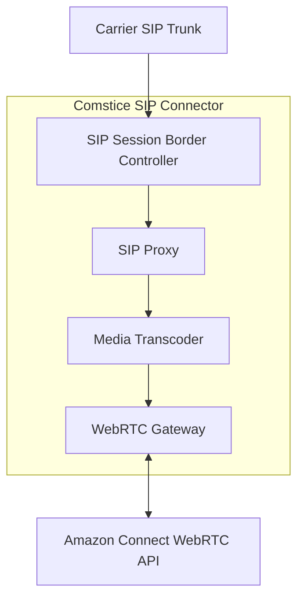
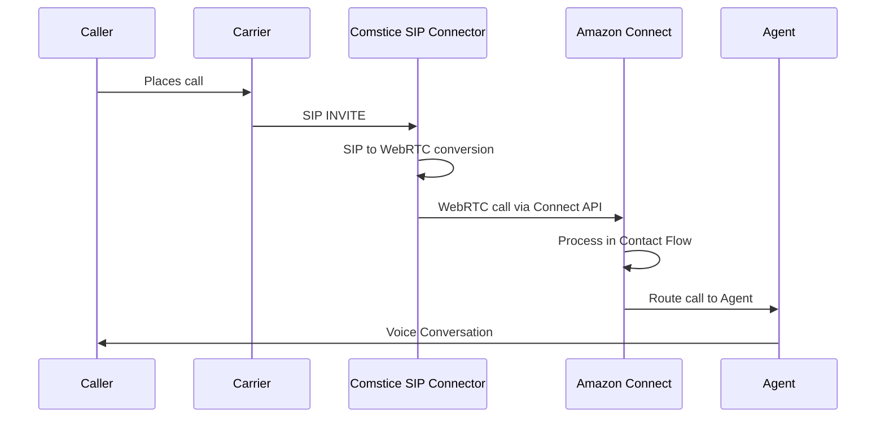
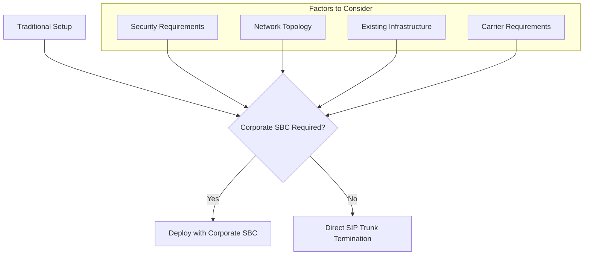
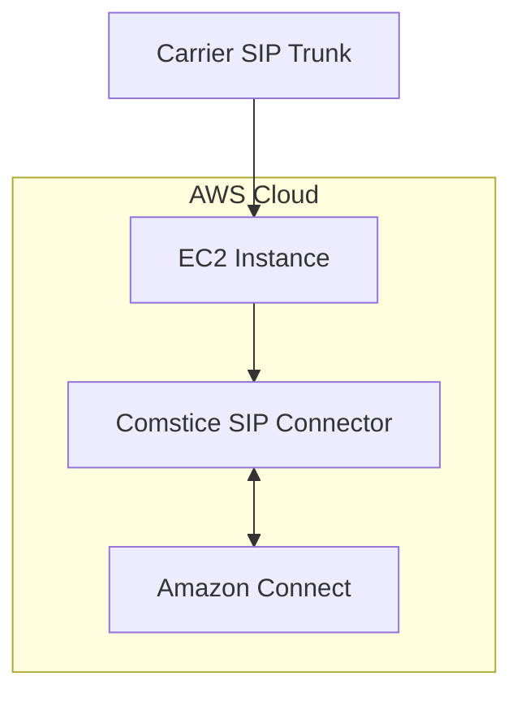
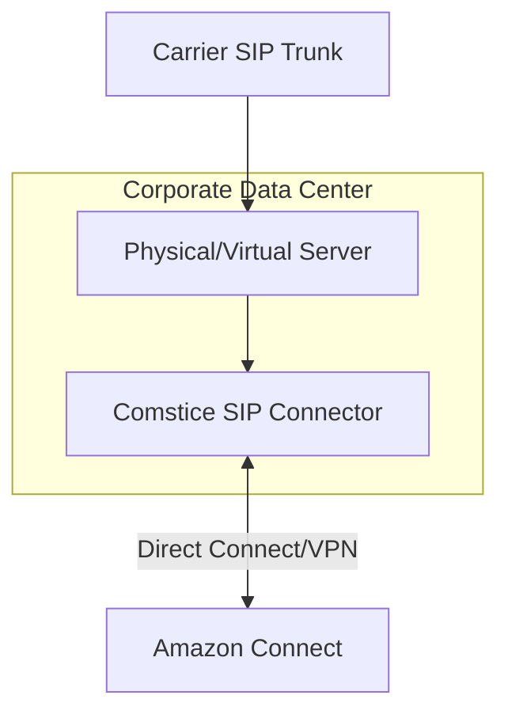
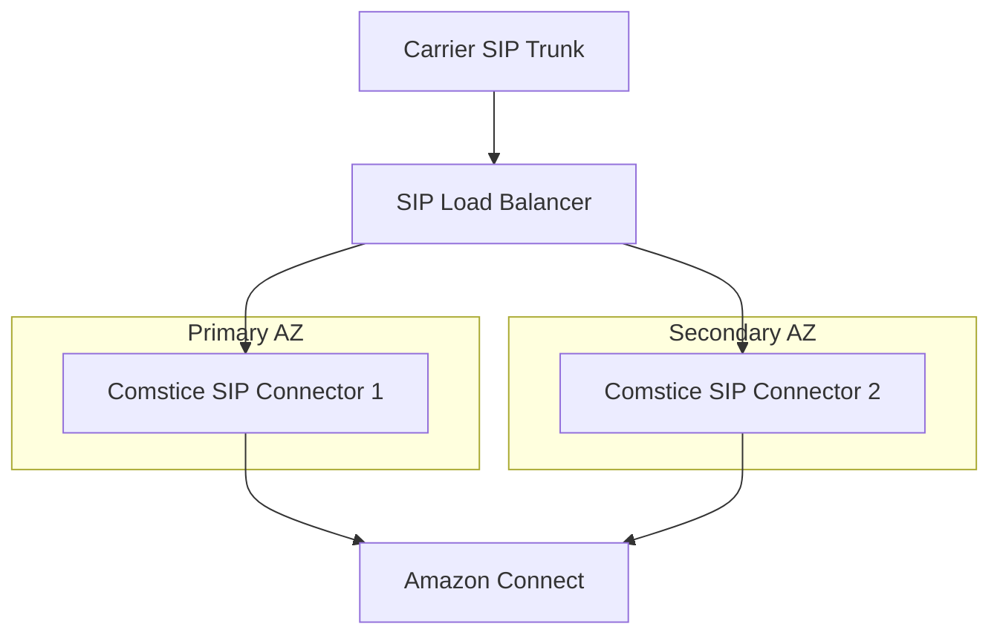

# Comstice SIP Connector: SIP to WebRTC Integration Guide

This guide explains how to implement SIP to WebRTC conversion using the Comstice SIP Connector to integrate traditional telephony systems with Amazon Connect.

## Table of Contents

- [Overview](#overview)
- [Architecture](#architecture)
- [Key Features](#key-features)
- [Deployment Options](#deployment-options)
- [Implementation Guide](#implementation-guide)
- [Advanced Configuration](#advanced-configuration)
- [Troubleshooting](#troubleshooting)
- [Best Practices](#best-practices)

## Overview

The Comstice SIP Connector provides a bridge between traditional SIP-based telephony systems and Amazon Connect's WebRTC-based contact center platform. This solution allows organizations to leverage their existing telephony infrastructure while taking advantage of Amazon Connect's cloud-based contact center capabilities.

### Core Functionality

## Architecture

The Comstice SIP Connector serves as a middleware component that handles protocol conversion between SIP and WebRTC. It includes the following key components:

### SIP Infrastructure Components

- **SIP Session Border Controller (SBC)**: Manages SIP sessions, provides security, and handles NAT traversal
- **SIP Proxy**: Routes SIP signaling traffic between endpoints
- **Media Transcoder**: Converts media codecs between SIP and WebRTC requirements
- **WebRTC Gateway**: Handles WebRTC protocol conversion and integration with Amazon Connect

### Integration Flow

## Key Features

### SIP to WebRTC Conversion

The Comstice SIP Connector provides bidirectional protocol conversion:

- **Inbound Conversion**: Transforms incoming SIP calls into WebRTC format compatible with Amazon Connect
- **Outbound Conversion**: Converts outbound WebRTC traffic from Amazon Connect to SIP for traditional telephony endpoints
- **Signaling Translation**: Maps SIP signaling (INVITE, BYE, etc.) to WebRTC signaling
- **Media Transcoding**: Converts between SIP codecs (G.711, G.729) and WebRTC codecs (Opus)

### Direct SIP Trunk Termination

The Comstice SIP Connector can potentially bypass the need for an on-premises corporate SBC:

- **Built-in SBC Functionality**: Includes security, NAT traversal, and SIP normalization
- **Direct Carrier Integration**: Can terminate SIP trunks directly from carriers
- **Simplified Architecture**: Reduces hardware footprint and potential points of failure

#### Considerations for Bypassing Corporate SBC

- **Security Analysis**: Evaluate whether the Comstice SIP Connector provides equivalent security to your corporate SBC
- **Network Assessment**: Ensure direct connectivity is possible between carrier and Comstice SIP Connector
- **Functionality Mapping**: Verify all required corporate SBC functions are available in Comstice
- **Carrier Compatibility**: Confirm your carrier supports direct termination to the Comstice SIP Connector

## Deployment Options

### AWS EC2 Deployment

1. **Instance Sizing**: Select appropriate EC2 instance type based on expected call volume
   - Recommended: m5.xlarge or larger for production environments
   - Minimum: t3.large for testing/development

2. **Network Configuration**:
   - Configure security groups to allow SIP traffic (ports 5060/5061 TCP/UDP)
   - Allow RTP media ports (typically 10000-20000 UDP)
   - Enable connectivity to Amazon Connect endpoints

3. **High Availability**:
   - Deploy across multiple Availability Zones
   - Use Auto Scaling Groups for automated recovery
   - Implement load balancing for SIP traffic

### On-Premises or Private Cloud Deployment

1. **Server Requirements**:
   - CPU: 8+ cores recommended for production
   - RAM: 16GB+ recommended
   - Storage: 100GB+ SSD recommended
   - Network: 1Gbps+ connectivity

2. **AWS Connectivity**:
   - Establish Direct Connect or site-to-site VPN to AWS
   - Ensure low latency connection to Amazon Connect regions
   - Configure proper routing and firewall rules

## Implementation Guide

### Step 1: Installation and Basic Setup

1. **Deploy Comstice SIP Connector**:
   - For EC2: Launch instance from Comstice AMI or install on generic EC2 instance
   - For on-premises: Install on physical or virtual server according to Comstice documentation

2. **Network Configuration**:
   - Assign static IP address or Elastic IP (for EC2)
   - Configure firewall to allow required ports
   - Ensure connectivity to both carrier and Amazon Connect

3. **Initial Configuration**:
   - Access admin interface (typically https://[server-ip]:8443/admin)
   - Set admin credentials
   - Upload license file
   - Configure network settings

### Step 2: SIP Trunk Configuration

1. **Carrier SIP Trunk Setup**:
   - Configure carrier SIP trunk to point to Comstice SIP Connector IP/FQDN
   - Set authentication credentials if required by carrier
   - Configure codecs (G.711 recommended for highest quality)

2. **SBC Configuration in Comstice**:
   - Navigate to SIP > Trunks in admin interface
   - Add new trunk with carrier details
   - Configure authentication parameters
   - Set traffic limits and failover options

3. **SIP Normalization**:
   - Configure header manipulation rules for carrier compatibility
   - Set up number translation rules if required
   - Configure codec preferences and transcoding options

### Step 3: Amazon Connect Integration

1. **Amazon Connect Instance Setup**:
   - Ensure your Amazon Connect instance is properly configured
   - Note your instance ARN and endpoint details

2. **WebRTC API Integration**:
   - In Comstice admin, navigate to Integrations > Amazon Connect
   - Enter your Connect instance details and API credentials
   - Configure WebRTC parameters
   - Test connectivity

3. **Phone Number Configuration**:
   - Map inbound DID numbers to Amazon Connect contact flows
   - Configure DNIS routing rules
   - Set up caller ID management

### Step 4: Dial Plan Configuration

1. **Create Routing Rules**:
   - Access Dial Plan Manager in Comstice admin interface
   - Create inbound routing rules based on:
     - Called number (DNIS)
     - Calling number (ANI)
     - Time of day
     - Source trunk

2. **Configure Contact Flow Mapping**:
   - Associate dial plan entries with specific Amazon Connect contact flows
   - Set default routing for unmapped numbers

3. **Advanced Routing Logic**:
   - Implement failover routing
   - Configure time-based routing
   - Set up load balancing across contact flows if needed

### Step 5: Testing and Validation

1. **Basic Connectivity Testing**:
   - Place test calls from carrier to verify inbound routing
   - Test outbound calls if applicable
   - Verify audio quality and latency

2. **Load Testing**:
   - Simulate concurrent calls to verify capacity
   - Monitor system performance under load
   - Adjust resources if needed

3. **Failover Testing**:
   - Test failover scenarios
   - Verify high availability configurations
   - Document recovery procedures

## Advanced Configuration

### High Availability Setup

1. **Active-Active Configuration**:
   - Deploy multiple Comstice instances across AZs
   - Configure SIP load balancing
   - Set up database replication
   - Enable session replication for seamless failover

2. **Monitoring and Alerting**:
   - Implement health checks
   - Configure alerts for system failures
   - Set up automated recovery procedures

### Advanced Security Configuration

1. **SIP TLS Setup**:
   - Generate and install TLS certificates
   - Configure SIP TLS for signaling encryption
   - Implement SRTP for media encryption

2. **Authentication Enhancements**:
   - Configure SIP digest authentication
   - Implement IP-based access controls
   - Set up rate limiting for DDoS protection

### Advanced Dial Plan Features

1. **Time-Based Routing**:
   - Configure business hours routing
   - Set up holiday routing exceptions
   - Implement after-hours call handling

2. **Geographic Routing**:
   - Route calls based on caller location
   - Implement geographic redundancy
   - Configure region-specific contact flows

## Troubleshooting

### Common Issues and Solutions

1. **SIP Registration Failures**:
   - Verify network connectivity
   - Check authentication credentials
   - Review SIP logs for specific error codes
   - Ensure firewall rules allow SIP traffic

2. **One-Way Audio Issues**:
   - Check NAT traversal settings
   - Verify RTP port ranges are open
   - Review codec compatibility
   - Check for asymmetric routing

3. **Call Quality Problems**:
   - Monitor network quality metrics
   - Check for packet loss and jitter
   - Review transcoding settings
   - Adjust QoS settings if available

4. **Amazon Connect Integration Issues**:
   - Verify API credentials
   - Check connectivity to Connect endpoints
   - Review WebRTC configuration
   - Ensure contact flows are properly configured

### Logging and Diagnostics

1. **SIP Trace Analysis**:
   - Enable SIP tracing in admin interface
   - Capture SIP traffic for analysis
   - Use filtering to isolate specific issues

2. **System Logs**:
   - Review application logs at /var/log/comstice/
   - Check system resource utilization
   - Monitor for error patterns

3. **Performance Monitoring**:
   - Track call statistics and quality metrics
   - Monitor system resource utilization
   - Set up trending and historical analysis

## Best Practices

### Security Best Practices

1. **Implement Defense in Depth**:
   - Use SIP TLS and SRTP for encryption
   - Configure strong authentication
   - Implement IP-based access controls
   - Regular security patching

2. **Regular Auditing**:
   - Review access logs
   - Conduct periodic security assessments
   - Validate configuration against best practices

### Performance Optimization

1. **Resource Allocation**:
   - Size instances appropriately for call volume
   - Monitor CPU, memory, and network utilization
   - Implement auto-scaling where possible

2. **Network Optimization**:
   - Ensure low latency to both carrier and Amazon Connect
   - Implement QoS marking
   - Monitor bandwidth utilization

### Operational Excellence

1. **Documentation**:
   - Maintain detailed configuration documentation
   - Document troubleshooting procedures
   - Keep network diagrams updated

2. **Backup and Recovery**:
   - Regular configuration backups
   - Document restoration procedures
   - Test recovery processes periodically

3. **Change Management**:
   - Implement proper change control
   - Test changes in non-production environment
   - Maintain change history

---

For detailed configuration information and support, please contact Comstice support or consult the official Comstice documentation.
