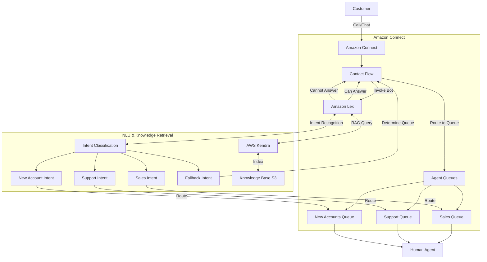

# AWS Kendra + Lex + Amazon Connect Integration

This README provides step-by-step instructions for implementing an intelligent customer service solution using AWS Kendra, Amazon Lex, and Amazon Connect. This solution handles incoming calls and chats, uses RAG (Retrieval Augmented Generation) for answering common customer questions, and seamlessly transfers to live agents when necessary.

## Table of Contents

1. [System Overview](#system-overview)
2. [Prerequisites](#prerequisites)
3. [Implementation Steps](#implementation-steps)
   - [Step 1: Set Up AWS Kendra Index](#step-1-set-up-aws-kendra-index)
   - [Step 2: Prepare Your Knowledge Base](#step-2-prepare-your-knowledge-base)
   - [Step 3: Create Amazon Lex Bot](#step-3-create-amazon-lex-bot)
   - [Step 4: Set Up Amazon Connect Instance](#step-4-set-up-amazon-connect-instance)
   - [Step 5: Create Contact Flows](#step-5-create-contact-flows)
   - [Step 6: Configure Agent Queues](#step-6-configure-agent-queues)
   - [Step 7: Integrate Lex with Kendra](#step-7-integrate-lex-with-kendra)
   - [Step 8: Set Up Human Handoff](#step-8-set-up-human-handoff)
4. [Testing](#testing)
5. [Monitoring and Maintenance](#monitoring-and-maintenance)
6. [Troubleshooting](#troubleshooting)
7. [Security Considerations](#security-considerations)

## System Overview

This implementation creates an intelligent customer service system that:

- Handles incoming calls and chat requests
- Uses AWS Kendra's semantic search capabilities to retrieve relevant answers from your knowledge base
- Processes natural language with Amazon Lex to understand customer intent
- Routes interactions to three different queues (Sales, Support, New Accounts) based on topic
- Transfers to human agents when the AI cannot confidently answer questions

Below is a visual representation of the system architecture:



## Prerequisites

- AWS Account with administrative access
- Knowledge of AWS services, particularly Kendra, Lex, and Connect
- Customer service knowledge base content (FAQs, articles, procedures, etc.)
- Basic understanding of conversation design
- AWS CLI installed and configured (optional, for advanced configurations)

## Implementation Steps

### Step 1: Set Up AWS Kendra Index

1. **Create a Kendra Index**:
   ```bash
   aws kendra create-index \
     --name "CustomerServiceIndex" \
     --edition "ENTERPRISE_EDITION" \
     --role-arn "arn:aws:iam::123456789012:role/KendraIndexRole"
   ```

   Or using the AWS Console:
   - Navigate to AWS Kendra
   - Click "Create index"
   - Provide index name "CustomerServiceIndex"
   - Select Edition (Enterprise recommended for production)
   - Create or select IAM role with appropriate permissions
   - Configure encryption settings
   - Click "Create"

2. **Note the Index ID for later reference**

### Step 2: Prepare Your Knowledge Base

1. **Organize your knowledge base content by topic**:
   - Sales-related documents (pricing, products, promotions)
   - Support-related documents (troubleshooting, how-to guides)
   - New Accounts documents (account creation, requirements, procedures)

2. **Create S3 bucket for content**:
   ```bash
   aws s3 mb s3://customer-service-knowledge-base
   ```

3. **Upload content to S3**:
   ```bash
   aws s3 cp /path/to/documents/ s3://customer-service-knowledge-base/ --recursive
   ```

4. **Create and configure a Kendra data source**:
   - In the Kendra console, select your index
   - Click "Add data sources"
   - Choose "S3" as source
   - Configure access to your S3 bucket
   - Set up field mappings and sync schedule
   - Start initial sync

### Step 3: Create Amazon Lex Bot

1. **Create a new Lex bot**:
   - Navigate to Amazon Lex console
   - Click "Create bot"
   - Select "Create a blank bot"
   - Name: "CustomerServiceBot"
   - IAM role: Create or select appropriate role
   - COPPA: Select appropriate option
   - Session timeout: 5 minutes (recommended)
   - Click "Create"

2. **Define intents for each service area**:
   - Create "SalesIntent"
     - Sample utterances: "I want to purchase", "pricing information", "discount available"
   - Create "SupportIntent"
     - Sample utterances: "having trouble with", "how do I fix", "technical issue"
   - Create "NewAccountIntent"
     - Sample utterances: "open an account", "new customer", "sign up for service"
   - Create "FallbackIntent" (will trigger human handoff)

3. **Define slots for gathering additional information**:
   - For SalesIntent: ProductType, PriceRange, Urgency
   - For SupportIntent: ProductName, IssueDescription, AccountNumber
   - For NewAccountIntent: AccountType, PersonalBusiness, ContactMethod

4. **Configure dialog** for each intent to collect necessary information

5. **Build and test** the bot

### Step 4: Set Up Amazon Connect Instance

1. **Create Amazon Connect instance**:
   - Navigate to Amazon Connect console
   - Click "Create instance"
   - Provide identity and admin details
   - Configure telephony options (enable inbound/outbound calls)
   - Configure data storage
   - Review and create

2. **Claim a phone number**:
   - In Connect console, navigate to "Phone numbers"
   - Click "Claim a number"
   - Select country and type
   - Choose a number and confirm

3. **Set up chat widget** (for web-based chat):
   - In Connect console, navigate to "Channels" > "Chat"
   - Configure widget appearance and behavior
   - Get embeddable code snippet for your website

### Step 5: Create Contact Flows

1. **Create Main Contact Flow**:
   - In Connect console, go to "Routing" > "Contact flows"
   - Click "Create contact flow"
   - Name: "Main Incoming Flow"
   - Design flow:
     - Start with "Get customer input" block to determine channel (voice/chat)
     - Add "Set working queue" blocks for each queue type
     - Add "Get customer input" to determine intent
     - Add "Connect to Lex" block to interact with Lex bot
     - Add conditional branches based on Lex output
     - Add transfer blocks to route to appropriate queues
   - Save and publish flow

2. **Create Specialized Flows** for each queue:
   - Create "Sales Queue Flow"
   - Create "Support Queue Flow"
   - Create "New Accounts Queue Flow"
   - Include appropriate Lex interactions and prompts in each

3. **Assign Flows** to phone numbers and chat endpoints

### Step 6: Configure Agent Queues

1. **Create Agent Queues**:
   - In Connect console, go to "Routing" > "Queues"
   - Create "Sales" queue
   - Create "Support" queue
   - Create "New Accounts" queue

2. **Set Up Routing Profiles**:
   - Create routing profiles for each agent type
   - Assign appropriate queues to each profile

3. **Create Agent Hierarchy** (optional):
   - Define agent teams and reporting structure

### Step 7: Integrate Lex with Kendra

1. **Enable Kendra search in Lex**:
   - In Lex console, select your bot
   - Navigate to "KENDRA_SEARCH" slot type
   - Enable "Use Kendra to suggest answers" 
   - Select your Kendra index
   - Configure response template

2. **Add AMAZON.KendraSearchIntent** to your Lex bot:
   ```json
   {
     "name": "AMAZON.KendraSearchIntent",
     "slots": [],
     "sampleUtterances": []
   }
   ```

3. **Configure fallback strategy**:
   - In Lex console, select your bot
   - Go to "Intents" > "FallbackIntent"
   - Enable "Use Kendra as the fallback"
   - Select your Kendra index
   - Configure response template

4. **Lambda Function for Enhanced RAG** (optional but recommended):
   - Create Lambda function to process Kendra results
   - Enhance answers with context
   - Handle multiple document retrieval
   - Format responses for voice/chat appropriately

### Step 8: Set Up Human Handoff

1. **Configure Confidence Threshold**:
   - In your Lambda function, set threshold for handoff (e.g., 70%)
   
2. **Create Transfer Logic**:
   - When bot confidence is below threshold, trigger transfer
   - Use intent to determine appropriate queue
   - Pass conversation context to agent

3. **Implement Queue-Specific Flow**:
   - For SalesIntent → Sales Queue
   - For SupportIntent → Support Queue
   - For NewAccountIntent → New Accounts Queue
   - For uncertain intent → determine by customer response

4. **Configure Agent UI**:
   - Customize Contact Control Panel (CCP)
   - Display conversation history
   - Show retrieved knowledge articles

## Testing

1. **Test Bot Responses**:
   - Use Lex console testing functionality
   - Try questions from each category
   - Verify Kendra integration is retrieving relevant answers

2. **Test Voice Channel**:
   - Call your Amazon Connect phone number
   - Go through the conversation flow
   - Test handoff scenarios

3. **Test Chat Channel**:
   - Implement test widget on development site
   - Conduct test conversations
   - Verify multi-turn capabilities

4. **Test Queue Routing**:
   - Verify calls/chats route to correct queues
   - Test waiting logic and callbacks if implemented

## Monitoring and Maintenance

1. **Set Up CloudWatch Monitoring**:
   - Create dashboards for key metrics
   - Set up alarms for critical thresholds

2. **Review and Improve**:
   - Analyze conversation logs
   - Identify common fallback scenarios
   - Update knowledge base regularly

3. **Performance Optimizations**:
   - Tune confidence thresholds
   - Optimize Lambda processing
   - Review and refine conversational paths

## Troubleshooting

Common issues and solutions:

1. **Low Confidence Scores**:
   - Add more training phrases to Lex intents
   - Improve knowledge base content
   - Adjust Kendra query configurations

2. **Routing Issues**:
   - Check contact flow logic
   - Verify queue configurations
   - Ensure agent routing profiles are correct

3. **Handoff Problems**:
   - Verify Lambda function logic
   - Check Connect flow configuration
   - Ensure session attributes are passed correctly

## Security Considerations

1. **Data Protection**:
   - Encrypt sensitive data in transit and at rest
   - Implement session timeouts
   - Consider PII handling requirements

2. **Access Control**:
   - Use IAM roles with least privilege
   - Implement resource-based policies
   - Regularly audit access

3. **Compliance**:
   - Ensure solution meets industry regulations
   - Consider call recording compliance requirements
   - Implement appropriate data retention policies

---

This implementation provides a scalable, intelligent customer service solution that leverages AWS Kendra's powerful search capabilities with natural language understanding from Lex, all delivered through Amazon Connect's omnichannel contact center platform.
