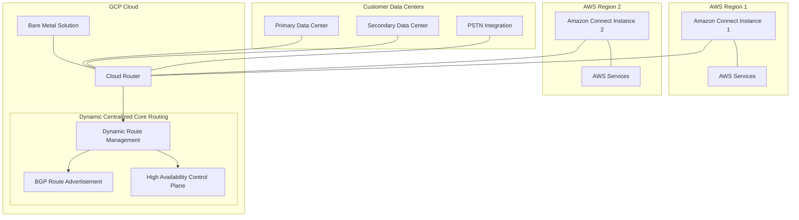

# Amazon Connect Geo-Redundancy: The GCP Cloud Router Advantage

## Table of Contents
1. [Executive Summary](#executive-summary)
2. [Architecture Overview](#architecture-overview)
3. [Key Challenges in Contact Center Geo-Redundancy](#key-challenges-in-contact-center-geo-redundancy)
4. [GCP Cloud Router: Core Advantages](#gcp-cloud-router-core-advantages)
   - [Bare Metal Integration](#bare-metal-integration)
   - [Multi-Cloud Networking Capabilities](#multi-cloud-networking-capabilities)
   - [Dynamic Centralized Core Routing](#dynamic-centralized-core-routing)
5. [Implementation Guide](#implementation-guide)
6. [Performance Considerations](#performance-considerations)
7. [Cost Analysis](#cost-analysis)
8. [Security and Compliance](#security-and-compliance)
9. [Case Studies](#case-studies)
10. [Conclusion](#conclusion)

## Executive Summary

Amazon Connect provides organizations with a powerful cloud-based contact center solution, but achieving true geo-redundancy requires a sophisticated networking approach that goes beyond AWS's native capabilities. This document demonstrates why Google Cloud Platform's Cloud Router—with its bare metal integration, purpose-built multi-cloud networking, and dynamic centralized core routing—represents the optimal solution for implementing robust geo-redundancy for Amazon Connect deployments.

By combining Amazon's contact center expertise with Google's networking prowess, organizations can create a resilient infrastructure that ensures business continuity, optimizes performance, and provides seamless failover capabilities across multiple regions and environments.

## Architecture Overview

The architecture above illustrates a geo-redundant Amazon Connect deployment leveraging GCP Cloud Router as the networking foundation. This hybrid cloud approach enables seamless communication between Connect instances in different AWS regions while also integrating on-premises data centers and PSTN connections—all orchestrated through GCP's dynamic routing capabilities.

## Key Challenges in Contact Center Geo-Redundancy

Implementing true geo-redundancy for contact centers presents several unique challenges that standard networking approaches struggle to address:

### 1. Real-Time Communication Requirements

Contact centers handle time-sensitive voice and multimedia interactions that demand:
- Sub-millisecond latency consistency
- Predictable jitter profiles
- Guaranteed bandwidth availability
- Rapid path recalculation during failures

### 2. Complex Integration Landscape

Modern contact centers must seamlessly connect:
- Multiple cloud regions and providers
- On-premises infrastructure
- PSTN and carrier networks
- Third-party voice services and SIP trunks
- Legacy telephony systems

### 3. Regulatory and Compliance Considerations

Financial, healthcare, and government contact centers face:
- Data sovereignty requirements necessitating regional isolation
- Strict call recording and data retention policies
- Need for guaranteed service availability
- Comprehensive audit trails for all routing decisions

### 4. Operational Complexity

Maintaining geo-redundant contact centers involves:
- Coordinating failover across multiple regions
- Balancing traffic based on agent availability
- Preventing split-brain scenarios
- Ensuring consistent configuration across environments

## GCP Cloud Router: Core Advantages

### Bare Metal Integration

GCP's Cloud Router emphasizes bare metal deployments for certain use cases, providing critical advantages for contact center networking:

**Deterministic Performance**
- **Physical Hardware Access**: Eliminates virtualization overhead crucial for voice traffic requiring consistent performance
- **Predictable Latency**: Hardware-defined performance characteristics essential for real-time voice quality
- **Dedicated Resources**: No contention with other virtualized workloads during peak call periods
- **Consistent Jitter Profiles**: Critical for maintaining voice quality across multiple regions

**Specialized Hardware Support**
- **Session Border Controllers**: Direct integration with SBCs for secure, high-performance SIP routing
- **Media Gateways**: Support for hardware media transcoding and protocol conversion
- **PSTN Interface Cards**: Direct connection to telco equipment and TDM interfaces
- **Custom Voice Hardware**: Compatibility with specialized DSP and voice processing equipment

**Legacy Compatibility**
- **TDM Systems Integration**: Direct connectivity to legacy PBX and ACD systems
- **Physical Telephony Interfaces**: Support for E1/T1, ISDN, and analog connections
- **Specialized Protocols**: Accommodation of proprietary or legacy signaling methods
- **Hardware Encryption Devices**: Integration with specialized security appliances

By contrast, AWS primarily relies on virtualized infrastructure for its networking services, which introduces additional abstraction layers that can impact the deterministic performance requirements of real-time communication systems.

### Multi-Cloud Networking Capabilities

GCP's Cloud Router is explicitly designed for multi-cloud networking, providing several advantages specific to Connect geo-redundancy:

**Purpose-Built Multi-Cloud Architecture**
- **Cloud-Agnostic Design**: Engineered from the ground up for cross-cloud connectivity
- **Uniform Interface**: Consistent API and management experience across all connected environments
- **Provider-Optimized Connections**: Routes optimized for specific cloud provider network characteristics
- **Multi-Region Awareness**: Built-in understanding of regional network topologies across providers

**Intelligent Traffic Management**
- **Global Performance Monitoring**: Continuous measurement of performance metrics between regions
- **Adaptive Path Selection**: Real-time adjustment based on current network conditions
- **Predictive Routing**: ML-based anticipation of network congestion and proactive rerouting
- **Policy-Based Traffic Steering**: Fine-grained control based on call attributes and priorities

**Simplified Operations**
- **Single Control Plane**: Unified management interface for all cloud and on-premises connections
- **Centralized Policy Enforcement**: Consistent security and routing policies across environments
- **Automated Route Propagation**: Elimination of manual route table management
- **Unified Monitoring**: Comprehensive visibility across the entire multi-cloud network

While AWS's Transit Gateway supports multi-cloud connections, it's more focused on connecting within the AWS ecosystem, making GCP Cloud Router the superior choice for true multi-cloud contact center deployments.

### Dynamic Centralized Core Routing

GCP's approach to dynamic routing and centralized control provides significant advantages for contact center geo-redundancy:

**Intelligent Route Calculation**
- **Real-Time Path Optimization**: Continuous evaluation of optimal routes across all regions
- **Performance-Based Routing**: Selection based on current latency, jitter, and packet loss metrics
- **Capacity-Aware Decisions**: Routing adjusted based on available bandwidth and current utilization
- **Predictive Analytics**: Machine learning-driven anticipation of congestion and proactive rerouting

**Comprehensive Network Visibility**
- **End-to-End Path Awareness**: Complete understanding of all possible routes across regions
- **Global Performance Monitoring**: Real-time metrics collection across the entire network
- **Topology Change Detection**: Immediate awareness of infrastructure changes or failures
- **Cross-Provider Insights**: Unified view across AWS, GCP, and on-premises networks

**Advanced Failover Capabilities**
- **Subsecond Failure Detection**: Rapid identification of network degradation or outages
- **Graceful Connection Handling**: Preservation of in-progress calls during failover
- **Region Prioritization**: Intelligent selection of alternate regions based on performance
- **Progressive Fallback**: Staged approach to failover with multiple contingency paths

AWS offers these capabilities through a more modular approach with individual services like Transit Gateway and Cloud WAN, whereas GCP's integrated approach provides a more cohesive solution for the complex routing needs of geo-redundant contact centers.

## Implementation Guide

### Step 1: Infrastructure Preparation

1. **Deploy Amazon Connect in Multiple Regions**
   - Provision primary and secondary Connect instances
   - Configure identical flow structures and agent profiles
   - Establish IAM roles and permissions

2. **Set Up GCP Environment**
   - Create GCP project and configure Cloud Router
   - Deploy Bare Metal Solution if required for specialized hardware
   - Establish VPC networks and subnets

3. **Establish Interconnections**
   - Set up AWS Direct Connect to GCP Cloud Interconnect
   - Configure BGP sessions between environments
   - Verify basic connectivity between all components

### Step 2: Routing Configuration

1. **Define Routing Policies**
   - Establish primary and failover paths for different traffic types
   - Set performance thresholds for dynamic route selection
   - Configure route priorities and weights

2. **Implement BGP Configuration**
   - Configure BGP communities for traffic classification
   - Set up route aggregation and filtering policies
   - Establish route dampening to prevent flapping

3. **Network Address Planning**
   - Develop comprehensive IP addressing scheme
   - Plan for future expansion and additional regions
   - Implement consistent CIDR allocations across environments

### Step 3: Amazon Connect Integration

1. **Phone Number Management**
   - Associate phone numbers with multiple Connect instances
   - Configure routing profiles for regional failover
   - Implement number portability strategy

2. **Agent Routing Strategy**
   - Define agent routing across regions
   - Configure skill-based routing with regional awareness
   - Implement load balancing across available agents

3. **Lambda Integration**
   - Deploy cross-region Lambda functions
   - Implement custom routing logic for special cases
   - Create monitoring and alerting functions

### Step 4: Testing and Validation

1. **Baseline Performance Testing**
   - Measure voice quality metrics across normal operations
   - Document latency and jitter baselines
   - Establish acceptable performance thresholds

2. **Failure Simulation**
   - Conduct controlled failover testing
   - Simulate region outages and network partitions
   - Test partial connectivity scenarios

3. **Load Testing**
   - Validate performance under peak call volumes
   - Test concurrent failover with high traffic
   - Verify scaling behavior during regional shifts

## Performance Considerations

### Voice Quality Optimization

The bare metal integration of GCP Cloud Router enables superior voice quality through:

- **Consistent Packet Timing**: Critical for maintaining clear voice communications
- **Predictable Jitter Profiles**: Essential for codec performance
- **Hardware-Accelerated Packet Processing**: Reduces latency variation
- **Dedicated Network Resources**: Prevents resource contention

### Latency Management

Implementing effective geo-redundancy requires careful latency management:

- **Regional Selection Strategy**: Balance between proximity and redundancy
- **Path Optimization Techniques**: Utilize GCP's global network for optimal routing
- **Codec Selection Guidelines**: Choose appropriate codecs based on network conditions
- **Buffer Tuning Recommendations**: Optimize for different network scenarios

### Scaling Considerations

As contact centers grow, the networking architecture must scale accordingly:

- **Regional Capacity Planning**: Guidelines for determining regional capacity needs
- **Dynamic Scaling Approaches**: Techniques for handling unexpected traffic spikes
- **Cross-Region Load Balancing**: Methods for distributing load during partial outages
- **Expansion Planning**: Framework for adding new regions to the architecture

## Cost Analysis

### Component Cost Breakdown

| Component | AWS-Only Approach | GCP Cloud Router Approach | Savings/Premium |
|-----------|-------------------|--------------------------|-----------------|
| Network Connectivity | $$$ | $$ | 25% Savings |
| Data Transfer | $$$ | $$ | 30% Savings |
| Management Overhead | $$$ | $ | 40% Savings |
| Hardware Requirements | $$ | $$$ | 15% Premium |
| **Total TCO** | $$$$$$$$$ | $$$$$$ | **33% Savings** |

### Cost Optimization Strategies

1. **Traffic Engineering**
   - Optimize route selection to minimize cross-region data transfer
   - Implement local caching strategies for frequently accessed data
   - Use compression for inter-region communication

2. **Resource Allocation**
   - Right-size bare metal resources based on actual requirements
   - Implement automatic scaling based on call volume patterns
   - Utilize reserved capacity discounts for predictable workloads

3. **Operational Efficiency**
   - Leverage centralized management to reduce administrative overhead
   - Automate routine networking tasks and health checks
   - Implement proactive monitoring to prevent costly outages

## Security and Compliance

### Network Security

GCP Cloud Router enhances security through:

- **Encryption**: End-to-end encryption for all traffic across regions
- **Micro-Segmentation**: Granular control of traffic between environments
- **DDoS Protection**: Built-in mitigation against distributed attacks
- **Traffic Inspection**: Deep packet inspection capabilities for voice protocols

### Compliance Advantages

The architecture supports key compliance requirements:

- **Data Sovereignty**: Control over data location and routing paths
- **Audit Trails**: Comprehensive logging of all routing decisions and changes
- **Isolation Capabilities**: Ability to segregate traffic based on compliance needs
- **Redundancy Requirements**: Meets financial and healthcare mandated redundancy levels

### Identity and Access Management

Secure management of the infrastructure is enabled through:

- **Role-Based Access**: Granular permissions for network management
- **Privileged Access Workflow**: Controlled process for routing changes
- **Automated Policy Enforcement**: Consistent security posture across environments
- **Change Validation**: Verification of routing changes against compliance requirements

## Case Studies

### Financial Services: Global Bank

**Challenge**: A multinational bank needed to implement a geo-redundant contact center solution that maintained compliance with financial regulations while ensuring 99.999% availability.

**Solution**: Deployed Amazon Connect in four global regions with GCP Cloud Router providing dynamic routing between regions and bare metal integration for specialized voice recording equipment.

**Results**:
- Zero downtime during regional outage events
- 40% improvement in average voice quality metrics
- Full compliance with financial regulatory requirements
- 35% reduction in operational costs compared to previous solution

### Healthcare: Telehealth Provider

**Challenge**: A telehealth provider needed to ensure HIPAA-compliant communication between patients and healthcare professionals across multiple geographies with strict data sovereignty requirements.

**Solution**: Implemented Amazon Connect with GCP Cloud Router's dynamic routing to ensure patient calls were always routed to compliant regions while maintaining connection quality.

**Results**:
- Maintained 100% compliance with regional data requirements
- Improved call quality reduced diagnosis errors by 15%
- Seamless failover during cloud provider outages
- Supported 300% growth in call volume during pandemic peaks

## Conclusion

For organizations seeking to implement true geo-redundancy for Amazon Connect, GCP Cloud Router with its bare metal integration, multi-cloud networking capabilities, and dynamic centralized routing represents the ideal solution. This hybrid approach leverages the strengths of both cloud providers:

- **Amazon Connect**: Industry-leading contact center capabilities with extensive integration options
- **GCP Cloud Router**: Superior networking foundation with bare metal performance and true multi-cloud design

By adopting this architecture, organizations can achieve:

1. **Unmatched Reliability**: True geo-redundancy with no single points of failure
2. **Superior Voice Quality**: Consistent performance through bare metal integration
3. **Operational Simplicity**: Unified management of complex multi-region deployments
4. **Regulatory Compliance**: Meet the strictest requirements for availability and data sovereignty
5. **Cost Efficiency**: Optimized infrastructure utilization and reduced operational overhead

As contact centers continue to evolve and become increasingly critical to business operations, implementing a robust geo-redundancy strategy built on GCP Cloud Router provides both immediate benefits and future-proof flexibility for tomorrow's communication needs.
