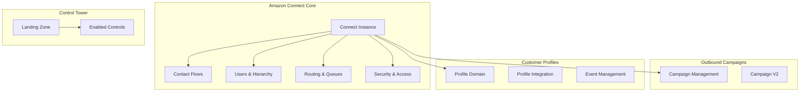

# Amazon Connect CloudFormation Configuration Guide

This guide provides detailed information about CloudFormation templates for Amazon Connect and its related services. The infrastructure is organized into four main service categories.

## System Architecture



## 1. Amazon Connect Core Resources

### Instance Configuration

#### AWS::Connect::Instance
```yaml
Resources:
  ConnectInstance:
    Type: AWS::Connect::Instance
    Properties:
      Attributes:
        InboundCalls: true
        OutboundCalls: true
      IdentityManagementType: SAML
      InstanceAlias: my-contact-center
```
Creates and configures a new Amazon Connect instance.

#### AWS::Connect::InstanceStorageConfig
```yaml
Resources:
  StorageConfig:
    Type: AWS::Connect::InstanceStorageConfig
    Properties:
      InstanceArn: !Ref ConnectInstance
      ResourceType: CHAT_TRANSCRIPTS
      StorageType: S3
```
Configures storage settings for various Connect resources.

### Contact Flow Management

#### AWS::Connect::ContactFlow
```yaml
Resources:
  MainFlow:
    Type: AWS::Connect::ContactFlow
    Properties:
      InstanceArn: !Ref ConnectInstance
      Name: Main Customer Flow
      Type: CONTACT_FLOW
      Content: !Sub |
        {
          "Version": "2019-10-30",
          "StartAction": "12345678-1234-1234-1234-123456789012"
        }
```
Defines customer interaction flows.

#### AWS::Connect::ContactFlowModule
Creates reusable modules for contact flows.

#### AWS::Connect::ContactFlowVersion
Manages versions of contact flows for change control.

### User Management

#### AWS::Connect::User
```yaml
Resources:
  Agent:
    Type: AWS::Connect::User
    Properties:
      InstanceArn: !Ref ConnectInstance
      Username: agent.name
      PhoneConfig:
        PhoneType: SOFT_PHONE
      RoutingProfileArn: !Ref AgentRoutingProfile
      SecurityProfileArns: 
        - !Ref AgentSecurityProfile
```
Creates and configures Connect users.

#### AWS::Connect::UserHierarchyGroup
```yaml
Resources:
  TeamGroup:
    Type: AWS::Connect::UserHierarchyGroup
    Properties:
      InstanceArn: !Ref ConnectInstance
      Name: SalesTeam
```
Organizes users into hierarchical groups.

#### AWS::Connect::UserHierarchyStructure
Defines the overall structure of user hierarchy.

### Routing Configuration

#### AWS::Connect::Queue
```yaml
Resources:
  SalesQueue:
    Type: AWS::Connect::Queue
    Properties:
      InstanceArn: !Ref ConnectInstance
      Name: Sales
      Description: Sales team queue
      HoursOfOperationArn: !Ref BusinessHours
```
Creates queues for routing contacts.

#### AWS::Connect::RoutingProfile
```yaml
Resources:
  AgentRoutingProfile:
    Type: AWS::Connect::RoutingProfile
    Properties:
      InstanceArn: !Ref ConnectInstance
      Name: SalesAgent
      DefaultOutboundQueueArn: !Ref SalesQueue
      MediaConcurrencies:
        - Channel: VOICE
          Concurrency: 1
```
Defines how contacts are routed to agents.

### Security Settings

#### AWS::Connect::SecurityProfile
```yaml
Resources:
  AgentSecurityProfile:
    Type: AWS::Connect::SecurityProfile
    Properties:
      InstanceArn: !Ref ConnectInstance
      Name: BasicAgent
      Permissions:
        - BasicAgentAccess
```
Manages security permissions for users.

#### AWS::Connect::SecurityKey
Manages security keys for the instance.

## 2. Amazon Connect Outbound Campaigns

### AWS::ConnectCampaigns::Campaign
```yaml
Resources:
  OutboundCampaign:
    Type: AWS::ConnectCampaigns::Campaign
    Properties:
      Name: SalesOutreach
      DialerConfig:
        PredictiveDialerConfig:
          BandwidthAllocation: 1.0
      InstanceArn: !Ref ConnectInstance
```

### AWS::ConnectCampaignsV2::Campaign
Enhanced version of outbound campaign management.

## 3. AWS Control Tower Integration

### AWS::ControlTower::LandingZone
```yaml
Resources:
  ConnectLandingZone:
    Type: AWS::ControlTower::LandingZone
    Properties:
      ManifestVersion: 2.0
```

### AWS::ControlTower::EnabledControl
Enables specific controls for Connect environment.

## 4. Customer Profiles

### AWS::CustomerProfiles::Domain
```yaml
Resources:
  CustomerDomain:
    Type: AWS::CustomerProfiles::Domain
    Properties:
      DomainName: customers
      DefaultEncryptionKey: aws/crm
```

### AWS::CustomerProfiles::Integration
```yaml
Resources:
  SalesforceIntegration:
    Type: AWS::CustomerProfiles::Integration
    Properties:
      DomainName: !Ref CustomerDomain
      ObjectTypeName: Account
      Uri: salesforce://connection
```

### AWS::CustomerProfiles::ObjectType
Defines customer profile object schemas.

## Parameters and Outputs

Common parameters used across templates:

```yaml
Parameters:
  InstanceAlias:
    Type: String
    Description: Alias for the Connect instance
  
  EnvironmentType:
    Type: String
    AllowedValues: [development, production]
    Default: development

Outputs:
  InstanceId:
    Description: ID of the Connect instance
    Value: !Ref ConnectInstance
```

## Best Practices

1. Security:
   - Use IAM roles with least privilege
   - Implement encryption for sensitive data
   - Regular security audits

2. Scalability:
   - Design queues for optimal capacity
   - Configure appropriate concurrency limits
   - Plan for peak load handling

3. Maintenance:
   - Version control contact flows
   - Regular backup of configurations
   - Monitoring and alerting setup

## Deployment Process

1. Deploy core Connect instance:
```bash
aws cloudformation create-stack \
    --stack-name connect-core \
    --template-body file://connect-instance.yaml
```

2. Configure storage and security:
```bash
aws cloudformation create-stack \
    --stack-name connect-security \
    --template-body file://connect-security.yaml
```

3. Set up routing and flows:
```bash
aws cloudformation create-stack \
    --stack-name connect-routing \
    --template-body file://connect-routing.yaml
```

## Troubleshooting

Common issues and solutions:

1. Instance Creation:
   - Verify IAM permissions
   - Check resource limits
   - Validate instance alias

2. Contact Flows:
   - Validate flow content
   - Check resource references
   - Verify Lambda permissions

3. Integration:
   - Validate ARNs
   - Check connectivity
   - Verify API access

## Contributing

1. Fork the repository
2. Create a feature branch
3. Submit a pull request with:
   - Clear description
   - Updated documentation
   - Test results

## License

MIT License - See LICENSE file for details