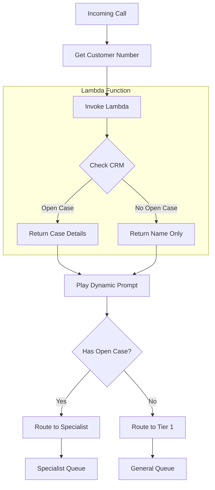

# Customer Information Retrieval Contact Flow

## Overview
This project implements an intelligent routing solution for AnyCompany Inc.'s contact center using Amazon Connect and AWS Lambda. The solution automatically identifies callers with open cases and routes them directly to specialist teams, reducing customer effort and improving satisfaction scores.

## Business Context
- **Problem**: Repeat callers with open cases must speak with tier 1 agents before being transferred to specialists
- **Impact**: Increased AHT and decreased customer satisfaction
- **Solution**: Automated CRM checking and intelligent routing based on case status

## Architecture


## Project Structure
```
crm-integration/
├── contact-flows/
│   └── customer-lookup.json
├── lambda/
│   ├── crm-lookup/
│   │   ├── index.js
│   │   ├── package.json
│   │   └── crm-client.js
│   └── tests/
│       └── crm-lookup.test.js
├── prompts/
│   ├── existing-case.json
│   └── new-customer.json
└── terraform/
    ├── main.tf
    ├── variables.tf
    └── outputs.tf
```

## Implementation Guide

### 1. Lambda Function Setup

Create the CRM lookup Lambda function that will handle customer information retrieval:

```javascript
// lambda/crm-lookup/index.js

const CRMClient = require('./crm-client');

exports.handler = async (event) => {
    try {
        const phoneNumber = event.Details.ContactData.CustomerEndpoint.Address;
        const crm = new CRMClient(process.env.CRM_API_KEY);
        
        // Query CRM for customer information
        const customerInfo = await crm.lookupCustomer(phoneNumber);
        
        // Check for open cases
        const openCases = await crm.getOpenCases(customerInfo.customerId);
        
        if (openCases.length > 0) {
            return {
                customerName: customerInfo.name,
                hasOpenCase: true,
                caseNumber: openCases[0].caseNumber,
                caseSummary: openCases[0].summary
            };
        }
        
        return {
            customerName: customerInfo.name,
            hasOpenCase: false
        };
        
    } catch (error) {
        console.error('Error in CRM lookup:', error);
        return {
            error: 'Failed to retrieve customer information'
        };
    }
};
```

### 2. Contact Flow Configuration

1. Create a new contact flow in Amazon Connect
2. Add the following blocks:
   - Entry point
   - Get customer input (phone number)
   - Invoke AWS Lambda function
   - Set contact attributes
   - Play prompt
   - Check contact attributes
   - Transfer to queue

Example Contact Flow JSON:
```json
{
    "Version": "2019-10-30",
    "StartAction": "GetCustomerInput",
    "Actions": [
        {
            "Identifier": "GetCustomerInput",
            "Type": "GetCustomerInput",
            "Parameters": {
                "CustomerInputType": "PhoneNumber"
            },
            "Transitions": {
                "NextAction": "InvokeLambda"
            }
        },
        {
            "Identifier": "InvokeLambda",
            "Type": "InvokeLambdaFunction",
            "Parameters": {
                "LambdaFunctionARN": "${CRMLookupLambdaARN}"
            },
            "Transitions": {
                "NextAction": "CheckOpenCase"
            }
        }
        // Additional flow configuration...
    ]
}
```

### 3. Dynamic Prompts

Configure the following prompts in your contact flow:

1. For customers with open cases:
```
"Hello ${customerName}, I see you have an open case number ${caseNumber} regarding ${caseSummary}. I'll connect you directly with a specialist who can help."
```

2. For customers without open cases:
```
"Hello ${customerName}, how can we help you today?"
```

### 4. Queue Configuration

Set up two queues in Amazon Connect:
1. Specialist Queue (for open cases)
2. General Queue (for new cases)

### 5. Testing

Test the flow using the following scenarios:

1. Caller with open case:
```bash
aws lambda invoke \
    --function-name crm-lookup \
    --payload '{"Details":{"ContactData":{"CustomerEndpoint":{"Address":"+1234567890"}}}}' \
    response.json
```

2. Caller without open case:
```bash
aws lambda invoke \
    --function-name crm-lookup \
    --payload '{"Details":{"ContactData":{"CustomerEndpoint":{"Address":"+1987654321"}}}}' \
    response.json
```

## Deployment

1. Deploy Lambda function:
```bash
cd lambda/crm-lookup
npm install
zip -r function.zip .
aws lambda create-function \
    --function-name crm-lookup \
    --runtime nodejs16.x \
    --handler index.handler \
    --role arn:aws:iam::ACCOUNT_ID:role/crm-lookup-role \
    --zip-file fileb://function.zip
```

2. Import contact flow:
```bash
aws connect create-contact-flow \
    --instance-id your-instance-id \
    --name "Customer Lookup Flow" \
    --type CONTACT_FLOW \
    --content file://contact-flows/customer-lookup.json
```

## Monitoring and Metrics

Monitor the following metrics in Amazon Connect:
- Transfer rate from tier 1 to specialist queue
- Average Handle Time (AHT)
- Customer Satisfaction Score (CSAT)
- First Contact Resolution (FCR)

CloudWatch metrics to monitor:
- Lambda function errors
- CRM API response times
- Flow execution times

## Troubleshooting

Common issues and solutions:

1. Lambda Timeout
   - Check CRM API response times
   - Increase Lambda timeout if needed
   - Implement retry logic

2. Invalid Phone Number Format
   - Implement phone number normalization
   - Log invalid formats for analysis
   - Add error handling in Lambda

3. CRM API Issues
   - Monitor API response codes
   - Implement circuit breaker
   - Set up alerts for API failures

## Security Considerations

1. CRM API Authentication
   - Store API keys in AWS Secrets Manager
   - Implement role-based access control
   - Regular key rotation

2. Data Protection
   - Encrypt sensitive data in transit
   - Implement logging restrictions
   - Regular security audits

## Contributing

Follow these steps to contribute:
1. Fork the repository
2. Create a feature branch
3. Commit changes
4. Create pull request
5. Update documentation

## Support

For issues and support:
- Create GitHub issue
- Contact DevOps team
- Refer to internal documentation

## License

This project is licensed under the MIT License.
