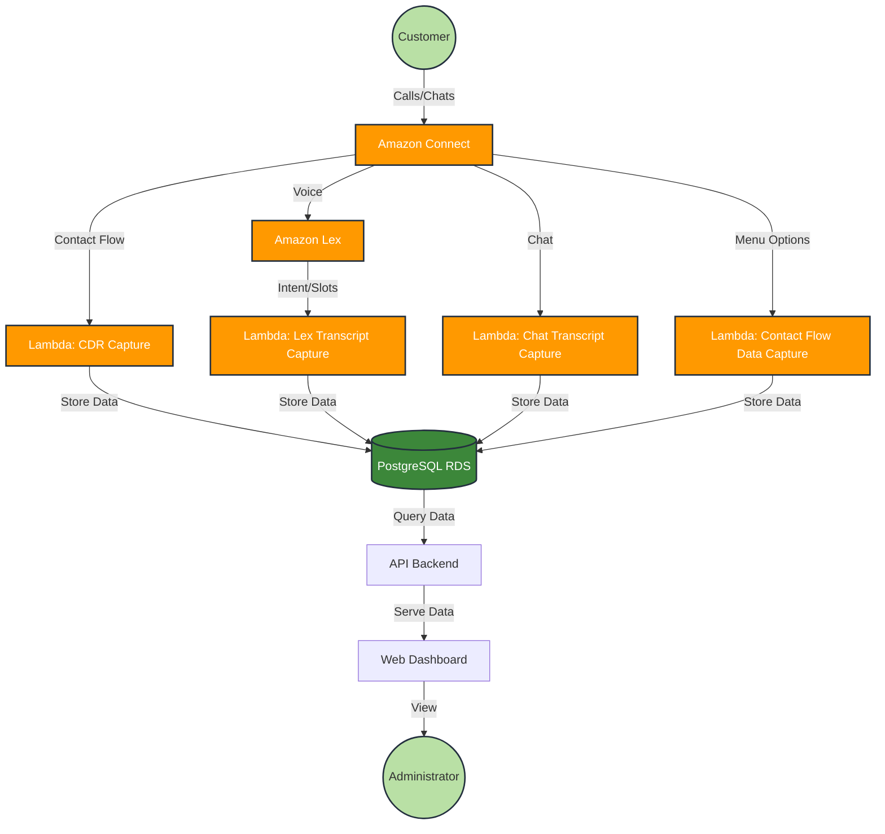

# Amazon Connect Lambda Integration for CDR Dashboard

This guide provides comprehensive instructions for setting up an Amazon Connect contact center with Lambda integration to capture all customer interaction data and store it in a PostgreSQL database. The database will serve as the backend for a web dashboard that enables searchable data reports, logs, and custom graphs.

## Architecture Overview



The solution consists of the following components:
- Amazon Connect instance with Contact Flows
- Amazon Lex bots for automated interactions
- AWS Lambda functions for data processing
- Amazon RDS PostgreSQL for data storage
- Web Dashboard for visualization and reporting

## 1. Prerequisites

- AWS account with administrative access
- Basic understanding of AWS services
- PostgreSQL knowledge
- Web development experience

## 2. Setting Up Amazon Connect

### 2.1 Create an Amazon Connect Instance

1. Navigate to the Amazon Connect console
2. Click "Add an instance"
3. Follow the wizard:
   - Set identity management
   - Create an admin account
   - Set telephony options (enable both inbound and outbound)
   - Configure data storage (for call recordings and reports)
   - Review and create

### 2.2 Claim a Phone Number

1. In your Amazon Connect instance, go to "Channels" > "Phone numbers"
2. Click "Claim a number"
3. Select your country and a number
4. Assign it to a basic contact flow for now (we'll update this later)

## 3. Creating the PostgreSQL Database

### 3.1 Launch an Amazon RDS PostgreSQL Instance

1. Navigate to the Amazon RDS console
2. Click "Create database"
3. Select "PostgreSQL"
4. Configure:
   - DB instance identifier: `connect-cdr-db`
   - Master username and password
   - DB instance size (recommended t3.medium for production)
   - Storage and availability settings
   - VPC and security group settings (ensure it can be accessed by Lambda)
5. Create database

### 3.2 Set Up the Database Schema

Connect to your PostgreSQL instance and execute the following SQL:

```sql
CREATE DATABASE connect_cdr;

\c connect_cdr

CREATE TABLE contact_records (
    id SERIAL PRIMARY KEY,
    contact_id VARCHAR(255) NOT NULL,
    timestamp TIMESTAMP NOT NULL,
    ani VARCHAR(50),
    dnis VARCHAR(50),
    queue_name VARCHAR(100),
    agent_id VARCHAR(100),
    contact_duration INTEGER,
    wait_time INTEGER,
    call_recording_url VARCHAR(255),
    created_at TIMESTAMP DEFAULT CURRENT_TIMESTAMP
);

CREATE TABLE lex_interactions (
    id SERIAL PRIMARY KEY,
    contact_id VARCHAR(255) NOT NULL,
    intent_name VARCHAR(100),
    slot_data JSONB,
    confidence_score FLOAT,
    timestamp TIMESTAMP,
    FOREIGN KEY (contact_id) REFERENCES contact_records(contact_id)
);

CREATE TABLE contact_flow_data (
    id SERIAL PRIMARY KEY,
    contact_id VARCHAR(255) NOT NULL,
    flow_name VARCHAR(100),
    module_name VARCHAR(100),
    menu_options_selected JSONB,
    timestamp TIMESTAMP,
    FOREIGN KEY (contact_id) REFERENCES contact_records(contact_id)
);

CREATE TABLE chat_transcripts (
    id SERIAL PRIMARY KEY,
    contact_id VARCHAR(255) NOT NULL,
    participant_type VARCHAR(50),
    participant_id VARCHAR(100),
    message TEXT,
    timestamp TIMESTAMP,
    FOREIGN KEY (contact_id) REFERENCES contact_records(contact_id)
);

CREATE INDEX idx_contact_id ON contact_records(contact_id);
CREATE INDEX idx_timestamp ON contact_records(timestamp);
CREATE INDEX idx_ani ON contact_records(ani);
CREATE INDEX idx_dnis ON contact_records(dnis);
```

## 4. Setting Up Lambda Functions

### 4.1 Create IAM Role for Lambda

1. Navigate to IAM console
2. Create a new role with the following permissions:
   - AmazonConnectFullAccess
   - AmazonRDSDataFullAccess
   - AWSLambdaBasicExecutionRole
   - CloudWatchLogsFullAccess

### 4.2 Create Lambda Function for CDR Capture

1. Navigate to Lambda console
2. Click "Create function"
3. Configure:
   - Name: `ConnectCDRCapture`
   - Runtime: Node.js 18.x
   - Execution role: Use the IAM role created above
4. Click "Create function"
5. Replace the default code with the following:

```javascript
const { Client } = require('pg');
const AWS = require('aws-sdk');

// Database configuration
const dbConfig = {
  host: process.env.DB_HOST,
  database: process.env.DB_NAME,
  user: process.env.DB_USER,
  password: process.env.DB_PASSWORD,
  port: process.env.DB_PORT || 5432,
  ssl: {
    rejectUnauthorized: false
  }
};

exports.handler = async (event, context) => {
  console.log('Event received:', JSON.stringify(event, null, 2));
  
  // Extract contact details from the event
  const contactId = event.Details.ContactId;
  const ani = event.Details.Parameters.ANI || '';
  const dnis = event.Details.Parameters.DNIS || '';
  const queueName = event.Details.Parameters.QueueName || '';
  const agentId = event.Details.Parameters.AgentId || '';
  
  // Connect to the database
  const client = new Client(dbConfig);
  
  try {
    await client.connect();
    
    // Insert contact record
    const query = `
      INSERT INTO contact_records (
        contact_id, timestamp, ani, dnis, queue_name, agent_id
      ) VALUES ($1, NOW(), $2, $3, $4, $5)
      RETURNING id;
    `;
    
    const values = [contactId, ani, dnis, queueName, agentId];
    const result = await client.query(query, values);
    
    console.log('Contact record created with ID:', result.rows[0].id);
    
    return {
      statusCode: 200,
      body: JSON.stringify({
        message: 'Contact record created successfully',
        contactId: contactId
      })
    };
  } catch (error) {
    console.error('Error:', error);
    throw error;
  } finally {
    await client.end();
  }
};
```

6. Configure environment variables:
   - DB_HOST: Your PostgreSQL endpoint
   - DB_NAME: connect_cdr
   - DB_USER: Your master username
   - DB_PASSWORD: Your master password
   - DB_PORT: 5432

7. Add the PostgreSQL client library:
   - Click "Code" > "Upload from" > "Amazon S3 location"
   - Create a layer with the pg module (or use a pre-existing PostgreSQL layer)

### 4.3 Create Lambda Function for Lex Transcript Capture

Follow similar steps to create a `LexTranscriptCapture` Lambda function:

```javascript
const { Client } = require('pg');

exports.handler = async (event, context) => {
  console.log('Lex event received:', JSON.stringify(event, null, 2));
  
  // Extract Lex data
  const contactId = event.sessionState.sessionAttributes.contactId;
  const intentName = event.sessionState.intent.name;
  const slots = event.sessionState.intent.slots;
  const confidenceScore = event.interpretations[0].nluConfidence.score;
  
  // Connect to database
  const client = new Client({
    host: process.env.DB_HOST,
    database: process.env.DB_NAME,
    user: process.env.DB_USER,
    password: process.env.DB_PASSWORD,
    port: process.env.DB_PORT || 5432,
    ssl: { rejectUnauthorized: false }
  });
  
  try {
    await client.connect();
    
    const query = `
      INSERT INTO lex_interactions (
        contact_id, intent_name, slot_data, confidence_score, timestamp
      ) VALUES ($1, $2, $3, $4, NOW())
    `;
    
    const values = [contactId, intentName, JSON.stringify(slots), confidenceScore];
    await client.query(query, values);
    
    return {
      sessionState: event.sessionState,
      messages: event.messages
    };
  } catch (error) {
    console.error('Error:', error);
    throw error;
  } finally {
    await client.end();
  }
};
```

### 4.4 Create Lambda Function for Chat Transcript Capture

Similarly, create a `ChatTranscriptCapture` Lambda function:

```javascript
const { Client } = require('pg');
const AWS = require('aws-sdk');

exports.handler = async (event, context) => {
  console.log('Chat event received:', JSON.stringify(event, null, 2));
  
  const contactId = event.Details.ContactId;
  const transcripts = event.Details.Transcripts || [];
  
  // Connect to database
  const client = new Client({
    host: process.env.DB_HOST,
    database: process.env.DB_NAME,
    user: process.env.DB_USER,
    password: process.env.DB_PASSWORD,
    port: process.env.DB_PORT || 5432,
    ssl: { rejectUnauthorized: false }
  });
  
  try {
    await client.connect();
    
    // Process each message in the transcript
    for (const message of transcripts) {
      const query = `
        INSERT INTO chat_transcripts (
          contact_id, participant_type, participant_id, message, timestamp
        ) VALUES ($1, $2, $3, $4, $5)
      `;
      
      const values = [
        contactId,
        message.ParticipantType,
        message.ParticipantId,
        message.Content,
        new Date(message.Timestamp)
      ];
      
      await client.query(query, values);
    }
    
    return {
      statusCode: 200,
      body: JSON.stringify({
        message: 'Chat transcript saved successfully',
        contactId: contactId
      })
    };
  } catch (error) {
    console.error('Error:', error);
    throw error;
  } finally {
    await client.end();
  }
};
```

### 4.5 Create Lambda Function for Contact Flow Data Capture

Create a `ContactFlowDataCapture` Lambda function:

```javascript
const { Client } = require('pg');

exports.handler = async (event, context) => {
  console.log('Contact flow event received:', JSON.stringify(event, null, 2));
  
  const contactId = event.Details.ContactId;
  const flowName = event.Details.Parameters.FlowName || '';
  const moduleName = event.Details.Parameters.ModuleName || '';
  const menuOptionsSelected = event.Details.Parameters.MenuOptions || '{}';
  
  // Connect to database
  const client = new Client({
    host: process.env.DB_HOST,
    database: process.env.DB_NAME,
    user: process.env.DB_USER,
    password: process.env.DB_PASSWORD,
    port: process.env.DB_PORT || 5432,
    ssl: { rejectUnauthorized: false }
  });
  
  try {
    await client.connect();
    
    const query = `
      INSERT INTO contact_flow_data (
        contact_id, flow_name, module_name, menu_options_selected, timestamp
      ) VALUES ($1, $2, $3, $4, NOW())
    `;
    
    const values = [contactId, flowName, moduleName, JSON.parse(menuOptionsSelected)];
    await client.query(query, values);
    
    return {
      statusCode: 200,
      body: JSON.stringify({
        message: 'Contact flow data saved successfully',
        contactId: contactId
      })
    };
  } catch (error) {
    console.error('Error:', error);
    throw error;
  } finally {
    await client.end();
  }
};
```

## 5. Setting Up Amazon Lex

### 5.1 Create an Amazon Lex Bot

1. Navigate to the Amazon Lex console
2. Click "Create bot"
3. Configure:
   - Bot name: `ConnectCustomerBot`
   - IAM permissions: Create a new role
   - COPPA: Choose appropriate option
   - Idle session timeout: 5 minutes
4. Create intents for your common customer inquiries
5. Build and test your bot

### 5.2 Integrate Lex with Lambda

1. In your Lex bot, go to the intent configuration
2. Under "Fulfillment", select "AWS Lambda function"
3. Choose the `LexTranscriptCapture` function
4. Enable "Code hook for" both "Initialization and validation" and "Fulfillment"
5. Save the intent and rebuild the bot

## 6. Setting Up Amazon Connect Contact Flows

### 6.1 Create a Basic Contact Flow

1. In your Amazon Connect instance, go to "Routing" > "Contact flows"
2. Create a new contact flow
3. Add the following blocks:
   - Set contact attributes (set FlowName to the current flow name)
   - Check contact attributes (ANI/DNIS)
   - Play prompt
   - Get customer input
   - Transfer to queue
   - Disconnect

### 6.2 Integrate Lambda Functions with Contact Flow

1. In your contact flow, add an "Invoke AWS Lambda function" block
2. Select the `ConnectCDRCapture` function
3. Connect this block at the beginning of your flow
4. Add another "Invoke AWS Lambda function" block before the "Disconnect" block
5. Select the `ContactFlowDataCapture` function
6. Save and publish your contact flow

### 6.3 Set Up a Contact Flow with Lex Integration

1. Create a new contact flow
2. Add a "Get customer input" block
3. Configure it to use your Lex bot
4. Add appropriate branches based on the Lex bot responses
5. Add Lambda invocation blocks as needed
6. Save and publish your contact flow

### 6.4 Update Phone Number Assignment

1. Go to "Channels" > "Phone numbers"
2. Select your claimed number
3. Set the contact flow to your newly created flow
4. Save

## 7. Setting Up Chat Integration

### 7.1 Configure Amazon Connect Chat

1. In Amazon Connect, go to "Channels" > "Chat"
2. Set up a chat widget for your website
3. Configure the chat flow to include the Lambda invocations

### 7.2 Implement Chat Transcript Capture

1. In your chat contact flow, add an "Invoke AWS Lambda function" block
2. Select the `ChatTranscriptCapture` function
3. Configure appropriate error handling
4. Save and publish the flow

## 8. Creating the Web Dashboard

### 8.1 Set Up a Basic Web Application

Create a new web application using your preferred framework (React, Angular, etc.) with the following structure:

```
project-root/
├── backend/
│   ├── config/
│   │   ├── database.js
│   │   └── env.js
│   ├── controllers/
│   │   ├── contactController.js
│   │   ├── analyticsController.js
│   │   ├── searchController.js
│   │   └── userController.js
│   ├── models/
│   │   ├── contactRecord.js
│   │   ├── lexInteraction.js
│   │   ├── contactFlowData.js
│   │   └── chatTranscript.js
│   ├── routes/
│   │   ├── apiRoutes.js
│   │   ├── contactRoutes.js
│   │   └── analyticsRoutes.js
│   ├── middleware/
│   │   ├── auth.js
│   │   └── errorHandler.js
│   ├── utils/
│   │   ├── logger.js
│   │   └── dbHelpers.js
│   ├── app.js
│   ├── server.js
│   └── package.json
│
├── frontend/
│   ├── public/
│   │   ├── index.html
│   │   └── assets/
│   ├── src/
│   │   ├── components/
│   │   │   ├── dashboard/
│   │   │   │   ├── Dashboard.js
│   │   │   │   ├── CallVolumeChart.js
│   │   │   │   └── KPICards.js
│   │   │   ├── reports/
│   │   │   │   ├── CallReports.js
│   │   │   │   ├── ChatReports.js
│   │   │   │   └── LexAnalytics.js
│   │   │   ├── search/
│   │   │   │   ├── SearchForm.js
│   │   │   │   └── SearchResults.js
│   │   │   ├── contact/
│   │   │   │   ├── ContactDetails.js
│   │   │   │   ├── TranscriptViewer.js
│   │   │   │   └── FlowDataViewer.js
│   │   │   ├── common/
│   │   │   │   ├── Header.js
│   │   │   │   ├── Sidebar.js
│   │   │   │   └── Footer.js
│   │   │   └── charts/
│   │   │       ├── BarChart.js
│   │   │       ├── LineChart.js
│   │   │       └── PieChart.js
│   │   ├── services/
│   │   │   ├── api.js
│   │   │   ├── authService.js
│   │   │   └── analyticsService.js
│   │   ├── utils/
│   │   │   ├── formatters.js
│   │   │   └── helpers.js
│   │   ├── hooks/
│   │   │   ├── useAuth.js
│   │   │   └── useFetch.js
│   │   ├── context/
│   │   │   └── AuthContext.js
│   │   ├── App.js
│   │   ├── index.js
│   │   └── routes.js
│   ├── package.json
│   └── README.md
│
├── lambda/
│   ├── cdrCapture/
│   │   ├── index.js
│   │   ├── package.json
│   │   └── node_modules/
│   ├── lexTranscriptCapture/
│   │   ├── index.js
│   │   ├── package.json
│   │   └── node_modules/
│   ├── chatTranscriptCapture/
│   │   ├── index.js
│   │   ├── package.json
│   │   └── node_modules/
│   └── contactFlowDataCapture/
│       ├── index.js
│       ├── package.json
│       └── node_modules/
│
├── database/
│   ├── migrations/
│   │   ├── 01_create_tables.sql
│   │   └── 02_create_indexes.sql
│   ├── seeds/
│   │   └── sample_data.sql
│   └── queries/
│       ├── analytics_queries.sql
│       └── dashboard_queries.sql
│
├── docs/
│   ├── api_docs.md
│   ├── architecture.md
│   └── deployment.md
│
├── terraform/
│   ├── main.tf
│   ├── variables.tf
│   ├── outputs.tf
│   ├── rds.tf
│   ├── lambda.tf
│   └── connect.tf
│
├── scripts/
│   ├── deploy.sh
│   ├── backup_db.sh
│   └── restore_db.sh
│
├── .gitignore
├── README.md
└── package.json
```

### 8.2 Create an API Backend

Develop a backend API to serve data from the PostgreSQL database to your frontend:

```javascript
// Express.js example
const express = require('express');
const { Pool } = require('pg');
const cors = require('cors');

const app = express();
app.use(cors());
app.use(express.json());

const pool = new Pool({
  host: process.env.DB_HOST,
  database: process.env.DB_NAME,
  user: process.env.DB_USER,
  password: process.env.DB_PASSWORD,
  port: process.env.DB_PORT || 5432,
  ssl: { rejectUnauthorized: false }
});

// Get all contact records
app.get('/api/contacts', async (req, res) => {
  try {
    const result = await pool.query('SELECT * FROM contact_records ORDER BY timestamp DESC LIMIT 100');
    res.json(result.rows);
  } catch (error) {
    console.error(error);
    res.status(500).json({ error: error.message });
  }
});

// Get contact details by ID
app.get('/api/contacts/:contactId', async (req, res) => {
  try {
    const { contactId } = req.params;
    
    // Get contact record
    const contactResult = await pool.query(
      'SELECT * FROM contact_records WHERE contact_id = $1',
      [contactId]
    );
    
    // Get Lex interactions
    const lexResult = await pool.query(
      'SELECT * FROM lex_interactions WHERE contact_id = $1 ORDER BY timestamp',
      [contactId]
    );
    
    // Get contact flow data
    const flowResult = await pool.query(
      'SELECT * FROM contact_flow_data WHERE contact_id = $1 ORDER BY timestamp',
      [contactId]
    );
    
    // Get chat transcripts
    const chatResult = await pool.query(
      'SELECT * FROM chat_transcripts WHERE contact_id = $1 ORDER BY timestamp',
      [contactId]
    );
    
    res.json({
      contact: contactResult.rows[0] || null,
      lexInteractions: lexResult.rows,
      flowData: flowResult.rows,
      chatTranscripts: chatResult.rows
    });
  } catch (error) {
    console.error(error);
    res.status(500).json({ error: error.message });
  }
});

// Search contacts
app.post('/api/search', async (req, res) => {
  try {
    const { ani, dnis, fromDate, toDate, queueName } = req.body;
    
    let query = 'SELECT * FROM contact_records WHERE 1=1';
    const params = [];
    
    if (ani) {
      params.push(ani);
      query += ` AND ani = $${params.length}`;
    }
    
    if (dnis) {
      params.push(dnis);
      query += ` AND dnis = $${params.length}`;
    }
    
    if (fromDate) {
      params.push(fromDate);
      query += ` AND timestamp >= $${params.length}`;
    }
    
    if (toDate) {
      params.push(toDate);
      query += ` AND timestamp <= $${params.length}`;
    }
    
    if (queueName) {
      params.push(queueName);
      query += ` AND queue_name = $${params.length}`;
    }
    
    query += ' ORDER BY timestamp DESC LIMIT 100';
    
    const result = await pool.query(query, params);
    res.json(result.rows);
  } catch (error) {
    console.error(error);
    res.status(500).json({ error: error.message });
  }
});

// Analytics endpoints for dashboard
app.get('/api/analytics/calls-by-hour', async (req, res) => {
  try {
    const result = await pool.query(`
      SELECT 
        EXTRACT(HOUR FROM timestamp) as hour,
        COUNT(*) as call_count
      FROM contact_records
      WHERE timestamp >= NOW() - INTERVAL '24 HOURS'
      GROUP BY hour
      ORDER BY hour
    `);
    
    res.json(result.rows);
  } catch (error) {
    console.error(error);
    res.status(500).json({ error: error.message });
  }
});

app.get('/api/analytics/top-intents', async (req, res) => {
  try {
    const result = await pool.query(`
      SELECT 
        intent_name,
        COUNT(*) as count
      FROM lex_interactions
      WHERE timestamp >= NOW() - INTERVAL '7 DAYS'
      GROUP BY intent_name
      ORDER BY count DESC
      LIMIT 10
    `);
    
    res.json(result.rows);
  } catch (error) {
    console.error(error);
    res.status(500).json({ error: error.message });
  }
});

const PORT = process.env.PORT || 3000;
app.listen(PORT, () => {
  console.log(`API server running on port ${PORT}`);
});
```

### 8.3 Implement the Dashboard UI

Create the main dashboard component with KPIs and visualization widgets:

```jsx
// React example
import React, { useEffect, useState } from 'react';
import { BarChart, Bar, LineChart, Line, XAxis, YAxis, CartesianGrid, Tooltip, Legend, ResponsiveContainer } from 'recharts';
import ApiService from '../services/ApiService';

const Dashboard = () => {
  const [callsByHour, setCallsByHour] = useState([]);
  const [topIntents, setTopIntents] = useState([]);
  const [recentContacts, setRecentContacts] = useState([]);
  
  useEffect(() => {
    const fetchData = async () => {
      try {
        const callsData = await ApiService.getCallsByHour();
        const intentsData = await ApiService.getTopIntents();
        const contactsData = await ApiService.getRecentContacts();
        
        setCallsByHour(callsData);
        setTopIntents(intentsData);
        setRecentContacts(contactsData);
      } catch (error) {
        console.error('Error fetching dashboard data:', error);
      }
    };
    
    fetchData();
    const interval = setInterval(fetchData, 60000); // Refresh every minute
    
    return () => clearInterval(interval);
  }, []);
  
  return (
    <div className="dashboard">
      <h1>Customer Experience Dashboard</h1>
      
      <div className="kpi-row">
        <div className="kpi-card">
          <h3>Total Calls Today</h3>
          <div className="kpi-value">{callsByHour.reduce((sum, item) => sum + item.call_count, 0)}</div>
        </div>
        <div className="kpi-card">
          <h3>Active Agents</h3>
          <div className="kpi-value">12</div>
        </div>
        <div className="kpi-card">
          <h3>Avg. Wait Time</h3>
          <div className="kpi-value">3m 24s</div>
        </div>
      </div>
      
      <div className="chart-row">
        <div className="chart-card">
          <h3>Calls by Hour</h3>
          <ResponsiveContainer width="100%" height={300}>
            <BarChart data={callsByHour}>
              <CartesianGrid strokeDasharray="3 3" />
              <XAxis dataKey="hour" />
              <YAxis />
              <Tooltip />
              <Legend />
              <Bar dataKey="call_count" fill="#8884d8" name="Calls" />
            </BarChart>
          </ResponsiveContainer>
        </div>
        
        <div className="chart-card">
          <h3>Top Lex Intents</h3>
          <ResponsiveContainer width="100%" height={300}>
            <BarChart data={topIntents} layout="vertical">
              <CartesianGrid strokeDasharray="3 3" />
              <XAxis type="number" />
              <YAxis dataKey="intent_name" type="category" width={150} />
              <Tooltip />
              <Legend />
              <Bar dataKey="count" fill="#82ca9d" name="Frequency" />
            </BarChart>
          </ResponsiveContainer>
        </div>
      </div>
      
      <div className="recent-contacts">
        <h3>Recent Contacts</h3>
        <table>
          <thead>
            <tr>
              <th>Contact ID</th>
              <th>Timestamp</th>
              <th>ANI</th>
              <th>DNIS</th>
              <th>Queue</th>
              <th>Agent</th>
              <th>Duration</th>
              <th>Actions</th>
            </tr>
          </thead>
          <tbody>
            {recentContacts.map(contact => (
              <tr key={contact.contact_id}>
                <td>{contact.contact_id}</td>
                <td>{new Date(contact.timestamp).toLocaleString()}</td>
                <td>{contact.ani}</td>
                <td>{contact.dnis}</td>
                <td>{contact.queue_name}</td>
                <td>{contact.agent_id}</td>
                <td>{contact.contact_duration ? `${Math.floor(contact.contact_duration / 60)}m ${contact.contact_duration % 60}s` : 'N/A'}</td>
                <td>
                  <button onClick={() => window.location.href = `/contacts/${contact.contact_id}`}>
                    View Details
                  </button>
                </td>
              </tr>
            ))}
          </tbody>
        </table>
      </div>
    </div>
  );
};

export default Dashboard;
```

### 8.4 Implement Search Functionality

Create a search component:

```jsx
import React, { useState } from 'react';
import ApiService from '../services/ApiService';

const SearchComponent = () => {
  const [searchParams, setSearchParams] = useState({
    ani: '',
    dnis: '',
    fromDate: '',
    toDate: '',
    queueName: ''
  });
  
  const [searchResults, setSearchResults] = useState([]);
  const [loading, setLoading] = useState(false);
  
  const handleInputChange = (e) => {
    const { name, value } = e.target;
    setSearchParams({
      ...searchParams,
      [name]: value
    });
  };
  
  const handleSearch = async (e) => {
    e.preventDefault();
    setLoading(true);
    
    try {
      const results = await ApiService.searchContacts(searchParams);
      setSearchResults(results);
    } catch (error) {
      console.error('Error searching contacts:', error);
      alert('Error searching contacts. Please try again.');
    } finally {
      setLoading(false);
    }
  };
  
  return (
    <div className="search-container">
      <h2>Search Contact Records</h2>
      
      <form onSubmit={handleSearch}>
        <div className="form-row">
          <div className="form-group">
            <label htmlFor="ani">Caller Number (ANI)</label>
            <input
              type="text"
              id="ani"
              name="ani"
              value={searchParams.ani}
              onChange={handleInputChange}
              placeholder="e.g., +14155552671"
            />
          </div>
          
          <div className="form-group">
            <label htmlFor="dnis">Dialed Number (DNIS)</label>
            <input
              type="text"
              id="dnis"
              name="dnis"
              value={searchParams.dnis}
              onChange={handleInputChange}
              placeholder="e.g., +18005551234"
            />
          </div>
        </div>
        
        <div className="form-row">
          <div className="form-group">
            <label htmlFor="fromDate">From Date</label>
            <input
              type="datetime-local"
              id="fromDate"
              name="fromDate"
              value={searchParams.fromDate}
              onChange={handleInputChange}
            />
          </div>
          
          <div className="form-group">
            <label htmlFor="toDate">To Date</label>
            <input
              type="datetime-local"
              id="toDate"
              name="toDate"
              value={searchParams.toDate}
              onChange={handleInputChange}
            />
          </div>
          
          <div className="form-group">
            <label htmlFor="queueName">Queue Name</label>
            <input
              type="text"
              id="queueName"
              name="queueName"
              value={searchParams.queueName}
              onChange={handleInputChange}
              placeholder="e.g., SupportQueue"
            />
          </div>
        </div>
        
        <button type="submit" className="search-button" disabled={loading}>
          {loading ? 'Searching...' : 'Search'}
        </button>
      </form>
      
      {searchResults.length > 0 ? (
        <div className="search-results">
          <h3>Search Results ({searchResults.length})</h3>
          <table>
            <thead>
              <tr>
                <th>Contact ID</th>
                <th>Timestamp</th>
                <th>ANI</th>
                <th>DNIS</th>
                <th>Queue</th>
                <th>Agent</th>
                <th>Actions</th>
              </tr>
            </thead>
            <tbody>
              {searchResults.map(contact => (
                <tr key={contact.contact_id}>
                  <td>{contact.contact_id}</td>
                  <td>{new Date(contact.timestamp).toLocaleString()}</td>
                  <td>{contact.ani}</td>
                  <td>{contact.dnis}</td>
                  <td>{contact.queue_name}</td>
                  <td>{contact.agent_id}</td>
                  <td>
                    <button onClick={() => window.location.href = `/contacts/${contact.contact_id}`}>
                      View Details
                    </button>
                  </td>
                </tr>
              ))}
            </tbody>
          </table>
        </div>
      ) : (
        <div className="no-results">
          {loading ? 'Searching...' : searchParams.ani || searchParams.dnis || searchParams.fromDate ? 'No results found' : 'Enter search criteria to find contacts'}
        </div>
      )}
    </div>
  );
};

export default SearchComponent;
```

### 8.5 Deploy the Web Application

1. Build your frontend application
2. Deploy to AWS Amplify, S3, or your preferred hosting service
3. Deploy the API backend to AWS Elastic Beanstalk or Lambda + API Gateway
4. Configure CORS and security settings

## 9. Testing the Integration

### 9.1 Test the Contact Flow

1. Call your Amazon Connect phone number
2. Navigate through the IVR menu
3. Verify that data is being captured in the PostgreSQL database

### 9.2 Test the Chat Integration

1. Initiate a chat on your website
2. Have a conversation with the chatbot/agent
3. Verify that chat transcripts are being stored

### 9.3 Test the Dashboard

1. Access your web dashboard
2. Verify that contact data is displayed correctly
3. Test search functionality
4. Verify that graphs update with new data

## 10. Monitoring and Maintenance

### 10.1 Set Up CloudWatch Alarms

1. Create alarms for Lambda errors
2. Monitor database connection issues
3. Set up alerts for high contact volume

### 10.2 Implement Regular Database Maintenance

1. Set up automated backups
2. Implement a data retention policy
3. Consider implementing partitioning for large tables

### 10.3 Security Best Practices

1. Regularly rotate database credentials
2. Use AWS Secrets Manager for sensitive information
3. Implement API Gateway authorization
4. Set up WAF for web application protection

## 11. Future Enhancements

- Natural Language Processing for sentiment analysis
- AI-powered anomaly detection
- Integration with CRM systems
- Real-time agent