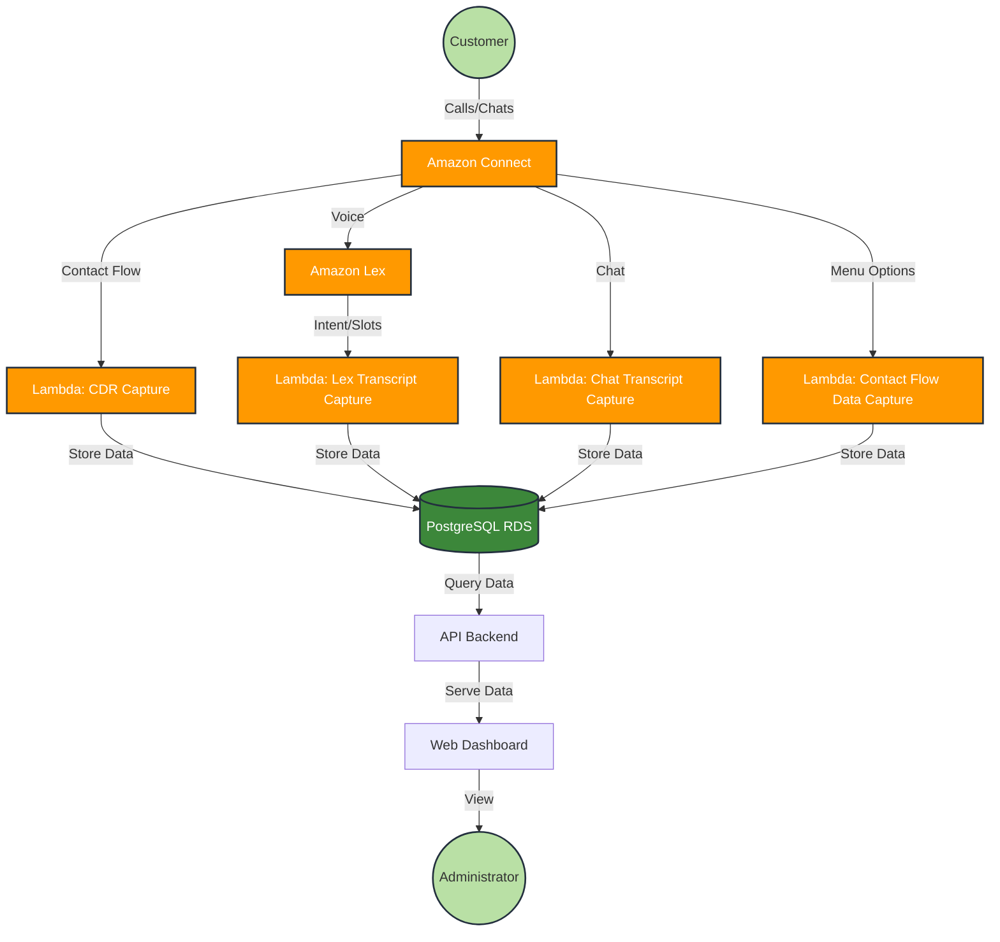

# Amazon Connect Dashboard Frontend Implementation Guide

This guide provides step-by-step instructions for implementing the Amazon Connect Customer Experience Dashboard frontend GUI using React and Tailwind CSS.



The solution consists of the following components:
- Amazon Connect instance with Contact Flows
- Amazon Lex bots for automated interactions
- AWS Lambda functions for data processing
- Amazon RDS PostgreSQL for data storage
- Web Dashboard for visualization and reporting

## 1. Prerequisites

- AWS account with administrative access
- Basic understanding of AWS services
- PostgreSQL knowledge
- Web development experience

## 2. Setting Up Amazon Connect

### 2.1 Create an Amazon Connect Instance

1. Navigate to the Amazon Connect console
2. Click "Add an instance"
3. Follow the wizard:
   - Set identity management
   - Create an admin account
   - Set telephony options (enable both inbound and outbound)
   - Configure data storage (for call recordings and reports)
   - Review and create

### 2.2 Claim a Phone Number

1. In your Amazon Connect instance, go to "Channels" > "Phone numbers"
2. Click "Claim a number"
3. Select your country and a number
4. Assign it to a basic contact flow for now (we'll update this later)

## 3. Creating the PostgreSQL Database

### 3.1 Launch an Amazon RDS PostgreSQL Instance

1. Navigate to the Amazon RDS console
2. Click "Create database"
3. Select "PostgreSQL"
4. Configure:
   - DB instance identifier: `connect-cdr-db`
   - Master username and password
   - DB instance size (recommended t3.medium for production)
   - Storage and availability settings
   - VPC and security group settings (ensure it can be accessed by Lambda)
5. Create database

### 3.2 Set Up the Database Schema

Connect to your PostgreSQL instance and execute the following SQL:

```sql
CREATE DATABASE connect_cdr;

\c connect_cdr

CREATE TABLE contact_records (
    id SERIAL PRIMARY KEY,
    contact_id VARCHAR(255) NOT NULL,
    timestamp TIMESTAMP NOT NULL,
    ani VARCHAR(50),
    dnis VARCHAR(50),
    queue_name VARCHAR(100),
    agent_id VARCHAR(100),
    contact_duration INTEGER,
    wait_time INTEGER,
    call_recording_url VARCHAR(255),
    created_at TIMESTAMP DEFAULT CURRENT_TIMESTAMP
);

CREATE TABLE lex_interactions (
    id SERIAL PRIMARY KEY,
    contact_id VARCHAR(255) NOT NULL,
    intent_name VARCHAR(100),
    slot_data JSONB,
    confidence_score FLOAT,
    timestamp TIMESTAMP,
    FOREIGN KEY (contact_id) REFERENCES contact_records(contact_id)
);

CREATE TABLE contact_flow_data (
    id SERIAL PRIMARY KEY,
    contact_id VARCHAR(255) NOT NULL,
    flow_name VARCHAR(100),
    module_name VARCHAR(100),
    menu_options_selected JSONB,
    timestamp TIMESTAMP,
    FOREIGN KEY (contact_id) REFERENCES contact_records(contact_id)
);

CREATE TABLE chat_transcripts (
    id SERIAL PRIMARY KEY,
    contact_id VARCHAR(255) NOT NULL,
    participant_type VARCHAR(50),
    participant_id VARCHAR(100),
    message TEXT,
    timestamp TIMESTAMP,
    FOREIGN KEY (contact_id) REFERENCES contact_records(contact_id)
);

CREATE INDEX idx_contact_id ON contact_records(contact_id);
CREATE INDEX idx_timestamp ON contact_records(timestamp);
CREATE INDEX idx_ani ON contact_records(ani);
CREATE INDEX idx_dnis ON contact_records(dnis);
```

## 4. Setting Up Lambda Functions

### 4.1 Create IAM Role for Lambda

1. Navigate to IAM console
2. Create a new role with the following permissions:
   - AmazonConnectFullAccess
   - AmazonRDSDataFullAccess
   - AWSLambdaBasicExecutionRole
   - CloudWatchLogsFullAccess

### 4.2 Create Lambda Function for CDR Capture

1. Navigate to Lambda console
2. Click "Create function"
3. Configure:
   - Name: `ConnectCDRCapture`
   - Runtime: Node.js 18.x
   - Execution role: Use the IAM role created above
4. Click "Create function"
5. Replace the default code with the following:

```javascript
const { Client } = require('pg');
const AWS = require('aws-sdk');

// Database configuration
const dbConfig = {
  host: process.env.DB_HOST,
  database: process.env.DB_NAME,
  user: process.env.DB_USER,
  password: process.env.DB_PASSWORD,
  port: process.env.DB_PORT || 5432,
  ssl: {
    rejectUnauthorized: false
  }
};

exports.handler = async (event, context) => {
  console.log('Event received:', JSON.stringify(event, null, 2));
  
  // Extract contact details from the event
  const contactId = event.Details.ContactId;
  const ani = event.Details.Parameters.ANI || '';
  const dnis = event.Details.Parameters.DNIS || '';
  const queueName = event.Details.Parameters.QueueName || '';
  const agentId = event.Details.Parameters.AgentId || '';
  
  // Connect to the database
  const client = new Client(dbConfig);
  
  try {
    await client.connect();
    
    // Insert contact record
    const query = `
      INSERT INTO contact_records (
        contact_id, timestamp, ani, dnis, queue_name, agent_id
      ) VALUES ($1, NOW(), $2, $3, $4, $5)
      RETURNING id;
    `;
    
    const values = [contactId, ani, dnis, queueName, agentId];
    const result = await client.query(query, values);
    
    console.log('Contact record created with ID:', result.rows[0].id);
    
    return {
      statusCode: 200,
      body: JSON.stringify({
        message: 'Contact record created successfully',
        contactId: contactId
      })
    };
  } catch (error) {
    console.error('Error:', error);
    throw error;
  } finally {
    await client.end();
  }
};
```

6. Configure environment variables:
   - DB_HOST: Your PostgreSQL endpoint
   - DB_NAME: connect_cdr
   - DB_USER: Your master username
   - DB_PASSWORD: Your master password
   - DB_PORT: 5432

7. Add the PostgreSQL client library:
   - Click "Code" > "Upload from" > "Amazon S3 location"
   - Create a layer with the pg module (or use a pre-existing PostgreSQL layer)

### 4.3 Create Lambda Function for Lex Transcript Capture

Follow similar steps to create a `LexTranscriptCapture` Lambda function:

```javascript
const { Client } = require('pg');

exports.handler = async (event, context) => {
  console.log('Lex event received:', JSON.stringify(event, null, 2));
  
  // Extract Lex data
  const contactId = event.sessionState.sessionAttributes.contactId;
  const intentName = event.sessionState.intent.name;
  const slots = event.sessionState.intent.slots;
  const confidenceScore = event.interpretations[0].nluConfidence.score;
  
  // Connect to database
  const client = new Client({
    host: process.env.DB_HOST,
    database: process.env.DB_NAME,
    user: process.env.DB_USER,
    password: process.env.DB_PASSWORD,
    port: process.env.DB_PORT || 5432,
    ssl: { rejectUnauthorized: false }
  });
  
  try {
    await client.connect();
    
    const query = `
      INSERT INTO lex_interactions (
        contact_id, intent_name, slot_data, confidence_score, timestamp
      ) VALUES ($1, $2, $3, $4, NOW())
    `;
    
    const values = [contactId, intentName, JSON.stringify(slots), confidenceScore];
    await client.query(query, values);
    
    return {
      sessionState: event.sessionState,
      messages: event.messages
    };
  } catch (error) {
    console.error('Error:', error);
    throw error;
  } finally {
    await client.end();
  }
};
```

### 4.4 Create Lambda Function for Chat Transcript Capture

Similarly, create a `ChatTranscriptCapture` Lambda function:

```javascript
const { Client } = require('pg');
const AWS = require('aws-sdk');

exports.handler = async (event, context) => {
  console.log('Chat event received:', JSON.stringify(event, null, 2));
  
  const contactId = event.Details.ContactId;
  const transcripts = event.Details.Transcripts || [];
  
  // Connect to database
  const client = new Client({
    host: process.env.DB_HOST,
    database: process.env.DB_NAME,
    user: process.env.DB_USER,
    password: process.env.DB_PASSWORD,
    port: process.env.DB_PORT || 5432,
    ssl: { rejectUnauthorized: false }
  });
  
  try {
    await client.connect();
    
    // Process each message in the transcript
    for (const message of transcripts) {
      const query = `
        INSERT INTO chat_transcripts (
          contact_id, participant_type, participant_id, message, timestamp
        ) VALUES ($1, $2, $3, $4, $5)
      `;
      
      const values = [
        contactId,
        message.ParticipantType,
        message.ParticipantId,
        message.Content,
        new Date(message.Timestamp)
      ];
      
      await client.query(query, values);
    }
    
    return {
      statusCode: 200,
      body: JSON.stringify({
        message: 'Chat transcript saved successfully',
        contactId: contactId
      })
    };
  } catch (error) {
    console.error('Error:', error);
    throw error;
  } finally {
    await client.end();
  }
};
```

### 4.5 Create Lambda Function for Contact Flow Data Capture

Create a `ContactFlowDataCapture` Lambda function:

```javascript
const { Client } = require('pg');

exports.handler = async (event, context) => {
  console.log('Contact flow event received:', JSON.stringify(event, null, 2));
  
  const contactId = event.Details.ContactId;
  const flowName = event.Details.Parameters.FlowName || '';
  const moduleName = event.Details.Parameters.ModuleName || '';
  const menuOptionsSelected = event.Details.Parameters.MenuOptions || '{}';
  
  // Connect to database
  const client = new Client({
    host: process.env.DB_HOST,
    database: process.env.DB_NAME,
    user: process.env.DB_USER,
    password: process.env.DB_PASSWORD,
    port: process.env.DB_PORT || 5432,
    ssl: { rejectUnauthorized: false }
  });
  
  try {
    await client.connect();
    
    const query = `
      INSERT INTO contact_flow_data (
        contact_id, flow_name, module_name, menu_options_selected, timestamp
      ) VALUES ($1, $2, $3, $4, NOW())
    `;
    
    const values = [contactId, flowName, moduleName, JSON.parse(menuOptionsSelected)];
    await client.query(query, values);
    
    return {
      statusCode: 200,
      body: JSON.stringify({
        message: 'Contact flow data saved successfully',
        contactId: contactId
      })
    };
  } catch (error) {
    console.error('Error:', error);
    throw error;
  } finally {
    await client.end();
  }
};
```

## 5. Setting Up Amazon Lex

### 5.1 Create an Amazon Lex Bot

1. Navigate to the Amazon Lex console
2. Click "Create bot"
3. Configure:
   - Bot name: `ConnectCustomerBot`
   - IAM permissions: Create a new role
   - COPPA: Choose appropriate option
   - Idle session timeout: 5 minutes
4. Create intents for your common customer inquiries
5. Build and test your bot

### 5.2 Integrate Lex with Lambda

1. In your Lex bot, go to the intent configuration
2. Under "Fulfillment", select "AWS Lambda function"
3. Choose the `LexTranscriptCapture` function
4. Enable "Code hook for" both "Initialization and validation" and "Fulfillment"
5. Save the intent and rebuild the bot

## 6. Setting Up Amazon Connect Contact Flows

### 6.1 Create a Basic Contact Flow

1. In your Amazon Connect instance, go to "Routing" > "Contact flows"
2. Create a new contact flow
3. Add the following blocks:
   - Set contact attributes (set FlowName to the current flow name)
   - Check contact attributes (ANI/DNIS)
   - Play prompt
   - Get customer input
   - Transfer to queue
   - Disconnect

### 6.2 Integrate Lambda Functions with Contact Flow

1. In your contact flow, add an "Invoke AWS Lambda function" block
2. Select the `ConnectCDRCapture` function
3. Connect this block at the beginning of your flow
4. Add another "Invoke AWS Lambda function" block before the "Disconnect" block
5. Select the `ContactFlowDataCapture` function
6. Save and publish your contact flow

### 6.3 Set Up a Contact Flow with Lex Integration

1. Create a new contact flow
2. Add a "Get customer input" block
3. Configure it to use your Lex bot
4. Add appropriate branches based on the Lex bot responses
5. Add Lambda invocation blocks as needed
6. Save and publish your contact flow

### 6.4 Update Phone Number Assignment

1. Go to "Channels" > "Phone numbers"
2. Select your claimed number
3. Set the contact flow to your newly created flow
4. Save

## 7. Setting Up Chat Integration

### 7.1 Configure Amazon Connect Chat

1. In Amazon Connect, go to "Channels" > "Chat"
2. Set up a chat widget for your website
3. Configure the chat flow to include the Lambda invocations

### 7.2 Implement Chat Transcript Capture

1. In your chat contact flow, add an "Invoke AWS Lambda function" block
2. Select the `ChatTranscriptCapture` function
3. Configure appropriate error handling
4. Save and publish the flow

## Project Directory Structure

```
amazon-connect-dashboard/
├── public/
│   ├── index.html
│   ├── favicon.ico
│   └── assets/
│       ├── images/
│       └── logos/
│
├── src/
│   ├── components/
│   │   ├── dashboard/
│   │   │   ├── Dashboard.jsx             # Main dashboard component
│   │   │   ├── KPICard.jsx               # Reusable KPI card component
│   │   │   ├── CallVolumeChart.jsx       # Call volume line chart
│   │   │   ├── IntentBarChart.jsx        # Intent bar chart
│   │   │   └── QueuePerformanceTable.jsx # Queue performance table
│   │   │
│   │   ├── contacts/
│   │   │   ├── ContactRecords.jsx        # Contact records view
│   │   │   ├── SearchForm.jsx            # Contact search form
│   │   │   ├── ContactTable.jsx          # Contacts display table
│   │   │   └── ContactDetails.jsx        # Individual contact detail view
│   │   │
│   │   ├── analytics/
│   │   │   ├── Analytics.jsx             # Analytics main view
│   │   │   ├── CallDistribution.jsx      # Call distribution pie chart
│   │   │   ├── QueueDistribution.jsx     # Queue distribution bar chart
│   │   │   └── AnalyticsSummary.jsx      # Analytics summary component
│   │   │
│   │   ├── reports/
│   │   │   ├── Reports.jsx               # Reports main view
│   │   │   ├── ReportGenerator.jsx       # Report generation form
│   │   │   ├── ReportsList.jsx           # Available reports grid
│   │   │   └── RecentReports.jsx         # Recent reports table
│   │   │
│   │   └── layout/
│   │       ├── Header.jsx                # Application header
│   │       ├── Navigation.jsx            # Tab navigation
│   │       ├── DateRangePicker.jsx       # Date range selector
│   │       └── Footer.jsx                # Application footer
│   │
│   ├── hooks/
│   │   ├── useAPI.js                     # Custom hook for API calls
│   │   ├── useAuth.js                    # Authentication hook
│   │   └── useContactData.js             # Hook for contact data
│   │
│   ├── services/
│   │   ├── api.js                        # API service for backend calls
│   │   ├── auth.js                       # Authentication service
│   │   ├── formatter.js                  # Data formatting utilities
│   │   └── mockData.js                   # Mock data for development
│   │
│   ├── contexts/
│   │   ├── AuthContext.js                # Authentication context
│   │   └── DashboardContext.js           # Dashboard state context
│   │
│   ├── utils/
│   │   ├── dateUtils.js                  # Date manipulation utilities
│   │   ├── formatUtils.js                # Data formatting utilities
│   │   └── chartUtils.js                 # Chart configuration helpers
│   │
│   ├── App.jsx                           # Main App component
│   ├── index.jsx                         # Application entry point
│   └── tailwind.css                      # Tailwind CSS imports
│
├── .env                                   # Environment variables
├── .env.development                       # Development environment variables
├── .env.production                        # Production environment variables
├── package.json                           # Project dependencies
├── tailwind.config.js                     # Tailwind CSS configuration
├── vite.config.js                         # Vite configuration
└── README.md                              # Project documentation
```
## Dashboard


## Implementation Steps

### 1. Project Setup

1. Create a new React project using Vite:
   ```bash
   npm create vite@latest amazon-connect-dashboard -- --template react
   cd amazon-connect-dashboard
   ```

2. Install dependencies:
   ```bash
   npm install recharts lucide-react tailwindcss postcss autoprefixer axios
   ```

3. Set up Tailwind CSS:
   ```bash
   npx tailwindcss init -p
   ```

4. Configure Tailwind CSS in `tailwind.config.js`:
   ```javascript
   /** @type {import('tailwindcss').Config} */
   export default {
     content: [
       "./index.html",
       "./src/**/*.{js,ts,jsx,tsx}",
     ],
     theme: {
       extend: {},
     },
     plugins: [],
   }
   ```

5. Create `src/tailwind.css`:
   ```css
   @tailwind base;
   @tailwind components;
   @tailwind utilities;
   ```

6. Update `src/index.jsx` to import the Tailwind styles:
   ```jsx
   import React from 'react'
   import ReactDOM from 'react-dom/client'
   import App from './App.jsx'
   import './tailwind.css'

   ReactDOM.createRoot(document.getElementById('root')).render(
     <React.StrictMode>
       <App />
     </React.StrictMode>,
   )
   ```

### 2. Create Layout Components

1. Create the Header component (`src/components/layout/Header.jsx`):
   ```jsx
   import React from 'react';
   import { Phone, Calendar, ChevronDown, ChevronUp, Filter } from 'lucide-react';

   const Header = ({ dateRange, setDateRange, filterOpen, setFilterOpen }) => {
     return (
       <header className="bg-blue-600 text-white shadow-md">
         <div className="container mx-auto px-4 py-3">
           <div className="flex justify-between items-center">
             <div className="flex items-center space-x-3">
               <Phone className="h-6 w-6" />
               <h1 className="text-xl font-bold">Amazon Connect Dashboard</h1>
             </div>
             <div className="flex items-center space-x-4">
               <div className="relative">
                 <button 
                   className="flex items-center space-x-1 bg-blue-700 hover:bg-blue-800 px-3 py-1 rounded"
                   onClick={() => setDateRange(dateRange === 'today' ? 'week' : 'today')}
                 >
                   <Calendar className="h-4 w-4" />
                   <span>{dateRange === 'today' ? 'Today' : 'This Week'}</span>
                   {dateRange === 'today' ? <ChevronDown className="h-4 w-4" /> : <ChevronUp className="h-4 w-4" />}
                 </button>
               </div>
               <div className="relative">
                 <button 
                   className="flex items-center space-x-1 bg-blue-700 hover:bg-blue-800 px-3 py-1 rounded"
                   onClick={() => setFilterOpen(!filterOpen)}
                 >
                   <Filter className="h-4 w-4" />
                   <span>Filters</span>
                   {filterOpen ? <ChevronUp className="h-4 w-4" /> : <ChevronDown className="h-4 w-4" />}
                 </button>
                 {filterOpen && (
                   <div className="absolute right-0 mt-2 w-64 bg-white rounded-md shadow-lg z-10">
                     <div className="p-3">
                       <h3 className="font-semibold mb-2 text-gray-800">Filter Options</h3>
                       <div className="space-y-2">
                         <div>
                           <label className="block text-sm text-gray-700">Queue</label>
                           <select className="w-full px-2 py-1 border rounded text-sm text-gray-700">
                             <option value="">All Queues</option>
                             <option value="technical">Technical Support</option>
                             <option value="billing">Billing</option>
                             <option value="sales">Sales</option>
                           </select>
                         </div>
                         <div>
                           <label className="block text-sm text-gray-700">Agent</label>
                           <select className="w-full px-2 py-1 border rounded text-sm text-gray-700">
                             <option value="">All Agents</option>
                             <option value="john">John Doe</option>
                             <option value="jane">Jane Smith</option>
                             <option value="mike">Mike Johnson</option>
                           </select>
                         </div>
                         <div className="pt-2 border-t flex justify-end">
                           <button className="bg-blue-600 text-white px-3 py-1 rounded text-sm">Apply</button>
                         </div>
                       </div>
                     </div>
                   </div>
                 )}
               </div>
             </div>
           </div>
         </div>
       </header>
     );
   };

   export default Header;
   ```

2. Create the Navigation component (`src/components/layout/Navigation.jsx`):
   ```jsx
   import React from 'react';

   const Navigation = ({ activeTab, setActiveTab }) => {
     return (
       <div className="bg-white border-b">
         <div className="container mx-auto px-4">
           <div className="flex">
             <button 
               className={`px-4 py-3 font-medium ${activeTab === 'dashboard' ? 'text-blue-600 border-b-2 border-blue-600' : 'text-gray-600 hover:text-blue-600'}`}
               onClick={() => setActiveTab('dashboard')}
             >
               Dashboard
             </button>
             <button 
               className={`px-4 py-3 font-medium ${activeTab === 'contacts' ? 'text-blue-600 border-b-2 border-blue-600' : 'text-gray-600 hover:text-blue-600'}`}
               onClick={() => setActiveTab('contacts')}
             >
               Contact Records
             </button>
             <button 
               className={`px-4 py-3 font-medium ${activeTab === 'analytics' ? 'text-blue-600 border-b-2 border-blue-600' : 'text-gray-600 hover:text-blue-600'}`}
               onClick={() => setActiveTab('analytics')}
             >
               Analytics
             </button>
             <button 
               className={`px-4 py-3 font-medium ${activeTab === 'reports' ? 'text-blue-600 border-b-2 border-blue-600' : 'text-gray-600 hover:text-blue-600'}`}
               onClick={() => setActiveTab('reports')}
             >
               Reports
             </button>
           </div>
         </div>
       </div>
     );
   };

   export default Navigation;
   ```

3. Create the Footer component (`src/components/layout/Footer.jsx`):
   ```jsx
   import React from 'react';

   const Footer = () => {
     return (
       <footer className="bg-white border-t mt-auto">
         <div className="container mx-auto px-4 py-4">
           <div className="text-center text-sm text-gray-500">
             <p>© 2025 Amazon Connect Dashboard. All rights reserved.</p>
           </div>
         </div>
       </footer>
     );
   };

   export default Footer;
   ```

### 3. Create Dashboard Components

1. Create the KPI Card component (`src/components/dashboard/KPICard.jsx`):
   ```jsx
   import React from 'react';

   const KPICard = ({ title, value, change, icon, color }) => {
     const IconComponent = icon;
     const isPositive = !change.includes('-');
     
     return (
       <div className="bg-white rounded-lg shadow p-6">
         <div className="flex justify-between items-start">
           <div>
             <p className="text-sm font-medium text-gray-500">{title}</p>
             <p className="text-2xl font-bold text-gray-800 mt-1">{value}</p>
           </div>
           <div className={`p-2 bg-${color}-100 rounded-md`}>
             <IconComponent className={`h-5 w-5 text-${color}-600`} />
           </div>
         </div>
         <div className="flex items-center mt-4">
           <span className={`text-sm ${isPositive ? 'text-green-500' : 'text-red-500'} font-medium`}>
             {change}{' '}
           </span>
           <span className="text-sm text-gray-500 ml-1">from yesterday</span>
         </div>
       </div>
     );
   };

   export default KPICard;
   ```

2. Create the Call Volume Chart component (`src/components/dashboard/CallVolumeChart.jsx`):
   ```jsx
   import React from 'react';
   import { LineChart, Line, XAxis, YAxis, CartesianGrid, Tooltip, Legend, ResponsiveContainer } from 'recharts';

   const CallVolumeChart = ({ data }) => {
     return (
       <div className="bg-white rounded-lg shadow p-6">
         <h2 className="text-lg font-semibold text-gray-800">Call Volume by Hour</h2>
         <div className="h-64 mt-4">
           <ResponsiveContainer width="100%" height="100%">
             <LineChart data={data} margin={{ top: 5, right: 30, left: 20, bottom: 5 }}>
               <CartesianGrid strokeDasharray="3 3" />
               <XAxis dataKey="hour" />
               <YAxis />
               <Tooltip />
               <Legend />
               <Line type="monotone" dataKey="inbound" stroke="#0088FE" name="Inbound" strokeWidth={2} />
               <Line type="monotone" dataKey="outbound" stroke="#00C49F" name="Outbound" strokeWidth={2} />
               <Line type="monotone" dataKey="abandoned" stroke="#FF8042" name="Abandoned" strokeWidth={2} />
             </LineChart>
           </ResponsiveContainer>
         </div>
       </div>
     );
   };

   export default CallVolumeChart;
   ```

3. Create remaining dashboard components (similar approach for other chart components)

### 4. Create Contact Records Components

1. Create the Contact Records component (`src/components/contacts/ContactRecords.jsx`):
   ```jsx
   import React, { useState } from 'react';
   import { Search } from 'lucide-react';
   import SearchForm from './SearchForm';
   import ContactTable from './ContactTable';

   const ContactRecords = ({ contacts }) => {
     const [searchQuery, setSearchQuery] = useState('');
     
     const filteredContacts = contacts.filter(contact => 
       contact.id.includes(searchQuery) || 
       contact.ani.includes(searchQuery) || 
       contact.dnis.includes(searchQuery) || 
       contact.queue.toLowerCase().includes(searchQuery.toLowerCase()) || 
       contact.agent.toLowerCase().includes(searchQuery.toLowerCase())
     );
     
     return (
       <div className="space-y-6">
         <div className="flex justify-between items-center">
           <h1 className="text-xl font-semibold text-gray-800">Contact Records</h1>
           <SearchForm searchQuery={searchQuery} setSearchQuery={setSearchQuery} />
         </div>
         
         <ContactTable contacts={filteredContacts} />
       </div>
     );
   };

   export default ContactRecords;
   ```

2. Create the Search Form component (`src/components/contacts/SearchForm.jsx`):
   ```jsx
   import React from 'react';
   import { Search } from 'lucide-react';

   const SearchForm = ({ searchQuery, setSearchQuery }) => {
     return (
       <div className="relative w-64">
         <input 
           type="text" 
           className="w-full pl-10 pr-4 py-2 border rounded-lg" 
           placeholder="Search contacts..."
           value={searchQuery}
           onChange={(e) => setSearchQuery(e.target.value)}
         />
         <div className="absolute left-3 top-2.5">
           <Search className="h-5 w-5 text-gray-400" />
         </div>
       </div>
     );
   };

   export default SearchForm;
   ```

3. Create the Contact Table component (`src/components/contacts/ContactTable.jsx`):
   ```jsx
   import React from 'react';

   const ContactTable = ({ contacts }) => {
     return (
       <div className="bg-white rounded-lg shadow">
         <div className="overflow-x-auto">
           <table className="min-w-full divide-y divide-gray-200">
             <thead className="bg-gray-50">
               <tr>
                 <th scope="col" className="px-6 py-3 text-left text-xs font-medium text-gray-500 uppercase tracking-wider">Contact ID</th>
                 <th scope="col" className="px-6 py-3 text-left text-xs font-medium text-gray-500 uppercase tracking-wider">Timestamp</th>
                 <th scope="col" className="px-6 py-3 text-left text-xs font-medium text-gray-500 uppercase tracking-wider">ANI</th>
                 <th scope="col" className="px-6 py-3 text-left text-xs font-medium text-gray-500 uppercase tracking-wider">DNIS</th>
                 <th scope="col" className="px-6 py-3 text-left text-xs font-medium text-gray-500 uppercase tracking-wider">Queue</th>
                 <th scope="col" className="px-6 py-3 text-left text-xs font-medium text-gray-500 uppercase tracking-wider">Agent</th>
                 <th scope="col" className="px-6 py-3 text-left text-xs font-medium text-gray-500 uppercase tracking-wider">Duration</th>
                 <th scope="col" className="px-6 py-3 text-left text-xs font-medium text-gray-500 uppercase tracking-wider">Status</th>
                 <th scope="col" className="px-6 py-3 text-left text-xs font-medium text-gray-500 uppercase tracking-wider">Actions</th>
               </tr>
             </thead>
             <tbody className="bg-white divide-y divide-gray-200">
               {contacts.map((contact) => (
                 <tr key={contact.id}>
                   <td className="px-6 py-4 whitespace-nowrap text-sm font-medium text-blue-600">{contact.id}</td>
                   <td className="px-6 py-4 whitespace-nowrap text-sm text-gray-500">
                     {new Date(contact.timestamp).toLocaleString()}
                   </td>
                   <td className="px-6 py-4 whitespace-nowrap text-sm text-gray-500">{contact.ani}</td>
                   <td className="px-6 py-4 whitespace-nowrap text-sm text-gray-500">{contact.dnis}</td>
                   <td className="px-6 py-4 whitespace-nowrap text-sm text-gray-500">{contact.queue}</td>
                   <td className="px-6 py-4 whitespace-nowrap text-sm text-gray-500">{contact.agent}</td>
                   <td className="px-6 py-4 whitespace-nowrap text-sm text-gray-500">
                     {Math.floor(contact.duration / 60)}m {contact.duration % 60}s
                   </td>
                   <td className="px-6 py-4 whitespace-nowrap">
                     <span className="px-2 py-1 inline-flex text-xs leading-5 font-semibold rounded-full bg-green-100 text-green-800">
                       {contact.status}
                     </span>
                   </td>
                   <td className="px-6 py-4 whitespace-nowrap text-sm font-medium">
                     <button className="text-blue-600 hover:text-blue-900">View Details</button>
                   </td>
                 </tr>
               ))}
             </tbody>
           </table>
         </div>
         {contacts.length === 0 && (
           <div className="p-6 text-center text-gray-500">
             No contacts found matching your search criteria.
           </div>
         )}
         <div className="px-6 py-4 bg-gray-50 border-t border-gray-200 flex items-center justify-between">
           <div className="text-sm text-gray-500">
             Showing <span className="font-medium">{contacts.length}</span> results
           </div>
           <div className="flex space-x-2">
             <button className="bg-white px-3 py-1 border rounded text-gray-600 hover:bg-gray-50">Previous</button>
             <button className="bg-blue-600 px-3 py-1 border border-blue-600 rounded text-white hover:bg-blue-700">Next</button>
           </div>
         </div>
       </div>
     );
   };

   export default ContactTable;
   ```

### 5. Create API Services

Create the API service to fetch data from your backend (`src/services/api.js`):

```javascript
import axios from 'axios';

const API_BASE_URL = import.meta.env.VITE_API_BASE_URL || 'http://localhost:3000/api';

const api = axios.create({
  baseURL: API_BASE_URL,
  headers: {
    'Content-Type': 'application/json',
  },
});

// Add request interceptor for authentication
api.interceptors.request.use(
  (config) => {
    const token = localStorage.getItem('auth_token');
    if (token) {
      config.headers.Authorization = `Bearer ${token}`;
    }
    return config;
  },
  (error) => Promise.reject(error)
);

export const fetchCallData = async (dateRange) => {
  try {
    const response = await api.get(`/analytics/calls?range=${dateRange}`);
    return response.data;
  } catch (error) {
    console.error('Error fetching call data:', error);
    throw error;
  }
};

export const fetchContactRecords = async (searchParams) => {
  try {
    const response = await api.get('/contacts', { params: searchParams });
    return response.data;
  } catch (error) {
    console.error('Error fetching contact records:', error);
    throw error;
  }
};

export const fetchQueueData = async () => {
  try {
    const response = await api.get('/analytics/queues');
    return response.data;
  } catch (error) {
    console.error('Error fetching queue data:', error);
    throw error;
  }
};

export const fetchIntentData = async () => {
  try {
    const response = await api.get('/analytics/intents');
    return response.data;
  } catch (error) {
    console.error('Error fetching intent data:', error);
    throw error;
  }
};

export const fetchContactDetails = async (contactId) => {
  try {
    const response = await api.get(`/contacts/${contactId}`);
    return response.data;
  } catch (error) {
    console.error(`Error fetching contact details for ${contactId}:`, error);
    throw error;
  }
};

export const generateReport = async (reportType, params) => {
  try {
    const response = await api.post('/reports/generate', { reportType, params });
    return response.data;
  } catch (error) {
    console.error('Error generating report:', error);
    throw error;
  }
};

export default api;
```

### 6. Create Main App Component

Assemble all components into the main App (`src/App.jsx`):

```jsx
import React, { useState, useEffect } from 'react';
import Header from './components/layout/Header';
import Navigation from './components/layout/Navigation';
import Footer from './components/layout/Footer';
import Dashboard from './components/dashboard/Dashboard';
import ContactRecords from './components/contacts/ContactRecords';
import Analytics from './components/analytics/Analytics';
import Reports from './components/reports/Reports';
import { fetchCallData, fetchContactRecords, fetchQueueData, fetchIntentData } from './services/api';
import { mockCallData, mockContactRecords, mockQueueData, mockIntentData } from './services/mockData';

function App() {
  const [dateRange, setDateRange] = useState('today');
  const [filterOpen, setFilterOpen] = useState(false);
  const [activeTab, setActiveTab] = useState('dashboard');
  
  const [callData, setCallData] = useState(mockCallData);
  const [contactRecords, setContactRecords] = useState(mockContactRecords);
  const [queueData, setQueueData] = useState(mockQueueData);
  const [intentData, setIntentData] = useState(mockIntentData);
  const [loading, setLoading] = useState(false);
  const [error, setError] = useState(null);

  useEffect(() => {
    const fetchData = async () => {
      setLoading(true);
      setError(null);
      
      try {
        // Uncomment when API is ready
        // const callDataResponse = await fetchCallData(dateRange);
        // const contactsResponse = await fetchContactRecords({});
        // const queueDataResponse = await fetchQueueData();
        // const intentDataResponse = await fetchIntentData();
        
        // setCallData(callDataResponse);
        // setContactRecords(contactsResponse);
        // setQueueData(queueDataResponse);
        // setIntentData(intentDataResponse);
        
        // Using mock data for now
        setCallData(mockCallData);
        setContactRecords(mockContactRecords);
        setQueueData(mockQueueData);
        setIntentData(mockIntentData);
      } catch (err) {
        console.error('Error fetching dashboard data:', err);
        setError('Failed to load dashboard data. Please try again later.');
      } finally {
        setLoading(false);
      }
    };
    
    fetchData();
  }, [dateRange]);

  return (
    <div className="flex flex-col min-h-screen bg-gray-50">
      <Header 
        dateRange={dateRange} 
        setDateRange={setDateRange} 
        filterOpen={filterOpen} 
        setFilterOpen={setFilterOpen} 
      />
      
      <Navigation activeTab={activeTab} setActiveTab={setActiveTab} />
      
      <main className="flex-grow container mx-auto px-4 py-6">
        {loading ? (
          <div className="flex justify-center items-center h-64">
            <div className="animate-spin rounded-full h-12 w-12 border-t-2 border-b-2 border-blue-500"></div>
          </div>
        ) : error ? (
          <div className="bg-red-100 border border-red-400 text-red-700 px-4 py-3 rounded">
            {error}
          </div>
        ) : (
          <>
            {activeTab === 'dashboard' && (
              <Dashboard 
                callData={callData} 
                queueData={queueData} 
                intentData={intentData} 
              />
            )}
            
            {activeTab === 'contacts' && (
              <ContactRecords contacts={contactRecords} />
            )}
            
            {activeTab === 'analytics' && (
              <Analytics 
                callData={callData} 
                queueData={queueData} 
                intentData={intentData} 
              />
            )}
            
            {activeTab === 'reports' && (
              <Reports />
            )}
          </>
        )}
      </main>
      
      <Footer />
    </div>
  );
}

export default App;
```

### 7. Create Mock Data Service

Create mock data service for development (`src/services/mockData.js`):

```javascript
// Mock call data with hourly breakdown
export const mockCallData = [
  { hour: '00:00', inbound: 12, outbound: 5, abandoned: 2 },
  { hour: '01:00', inbound: 8, outbound: 3, abandoned: 1 },
  // ... more hours
  { hour: '23:00', inbound: 14, outbound: 6, abandoned: 1 }
];

// Mock Lex intent data
export const mockIntentData = [
  { intent: 'Check Order Status', count: 245 },
  { intent: 'Technical Support', count: 187 },
  { intent: 'Billing Question', count: 156 },
  { intent: 'Product Information', count: 132 },
  { intent: 'Return Request', count: 98
