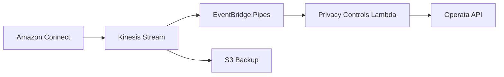

# Operata Amazon Connect Integration Guide

## Table of Contents
- [Overview](#overview)
- [Architecture](#architecture)
- [Prerequisites](#prerequisites)
- [Implementation Steps](#implementation-steps)
- [Security Configuration](#security-configuration)
- [Privacy Controls](#privacy-controls)
- [Monitoring and Logging](#monitoring-and-logging)
- [Troubleshooting](#troubleshooting)

## Overview

This guide outlines the implementation of Operata integration with Amazon Connect using Terraform. The integration enables:
- Real-time contact trace record (CTR) streaming
- Privacy-aware data handling
- Secure data transmission
- Advanced monitoring capabilities

## Architecture



### Key Components
1. **Kinesis Stream**
   - Primary data collection point for CTRs
   - Encrypted using KMS
   - Configurable retention period

2. **EventBridge Pipes**
   - Manages data flow to Operata
   - Handles transformation
   - Provides reliable delivery

3. **Privacy Controls Lambda** (Optional)
   - Field-level data redaction
   - Configurable allow/deny lists
   - Caches privacy settings

## Prerequisites

1. **AWS Account Requirements**
   - IAM permissions for CloudFormation
   - VPC access (if using Privacy Controls)
   - KMS key management permissions

2. **Operata Requirements**
   - Operata API key
   - Group ID
   - Privacy Controls configuration (if needed)

3. **Amazon Connect Setup**
   - Existing Connect instance
   - CTR streaming enabled
   - Instance alias (32 characters max)

## Implementation Steps

### 1. Initial Setup
```bash
# Clone the repository
git clone https://github.com/your-org/operata-connect-integration
cd operata-connect-integration

# Initialize Terraform
terraform init
```

### 2. Configure Variables
```hcl
# terraform.tfvars
aws_region = "us-west-2"
environment = "production"
connect_instance_alias = "your-instance-alias"
enable_privacy_controls = true  # if needed
vpc_id = "vpc-xxxxx"  # if using privacy controls
```

### 3. Deploy Infrastructure
```bash
# Review the plan
terraform plan

# Apply the configuration
terraform apply
```

## Security Configuration

### KMS Encryption
```hcl
resource "aws_kms_key" "ctr_key" {
  description             = "KMS key for CTR stream encryption"
  deletion_window_in_days = 7
  enable_key_rotation     = true
}
```

### IAM Roles
The following roles are created:
- EventBridge Pipe execution role
- Lambda execution role (if using Privacy Controls)
- KMS key users

### Networking
If using Privacy Controls:
- VPC configuration
- Security group setup
- Private subnet access

## Privacy Controls

### Configuration Options

1. **Allow List Mode**
```json
{
  "key": "REDACTION_CONFIG",
  "value": {
    "type": "WHITELIST",
    "fields": [
      "InitiationMethod",
      "Agent.Username",
      "Queue.Name"
    ]
  }
}
```

2. **Deny List Mode**
```json
{
  "key": "REDACTION_CONFIG",
  "value": {
    "type": "BLACKLIST",
    "fields": [
      "Attributes.CustomerDetails",
      "CustomerEndpoint.Address"
    ]
  }
}
```

### Mandatory Fields
The following fields cannot be excluded:
- Agent interaction details
- Queue metrics
- Contact IDs
- Timestamps
- System endpoints

## Monitoring and Logging

### CloudWatch Integration
1. **Metrics Available**
   - Stream throughput
   - Lambda execution stats
   - Privacy Controls performance
   - Error rates

2. **Log Groups**
   - CTR processing logs
   - Lambda function logs
   - EventBridge execution logs

### Health Checks
```bash
# Check Kinesis Stream health
aws kinesis describe-stream \
  --stream-name Connect_CTR_${environment}

# Verify Lambda function
aws lambda get-function \
  --function-name operata-privacy-controls-${environment}
```

## Troubleshooting

### Common Issues

1. **CTR Data Delays**
   - Check Kinesis Stream metrics
   - Verify EventBridge Pipe status
   - Review Lambda execution logs

2. **Privacy Controls Issues**
   - Verify API key validity
   - Check Lambda VPC access
   - Review privacy configuration cache

3. **Security Errors**
   - Validate IAM roles
   - Check KMS key permissions
   - Verify network access

### Validation Steps

1. **Test Integration**
```bash
# Make a test call
# Wait for CTR (up to 5 minutes)
# Check Operata console
```

2. **Verify Data Flow**
```bash
# Check Kinesis records
aws kinesis get-records --shard-iterator $(aws kinesis \
  get-shard-iterator \
  --stream-name Connect_CTR_${environment} \
  --shard-id shardId-000000000000 \
  --shard-iterator-type TRIM_HORIZON \
  --query 'ShardIterator' \
  --output text)
```

3. **Monitor Privacy Controls**
```bash
# Check Lambda logs
aws logs tail /aws/lambda/operata-privacy-controls-${environment}
```

## Support and Resources

- [Operata Documentation](https://docs.operata.com)
- [AWS Connect Documentation](https://docs.aws.amazon.com/connect)
- [Terraform Documentation](https://www.terraform.io/docs)
- [Contact Support](support@operata.com)

## Best Practices

1. **Security**
   - Regularly rotate API keys
   - Monitor KMS key usage
   - Review IAM permissions
   - Implement least privilege

2. **Performance**
   - Monitor stream capacity
   - Optimize Lambda memory
   - Configure proper retention
   - Set up alerts

3. **Maintenance**
   - Keep privacy controls updated
   - Monitor error rates
   - Regular testing
   - Document changes