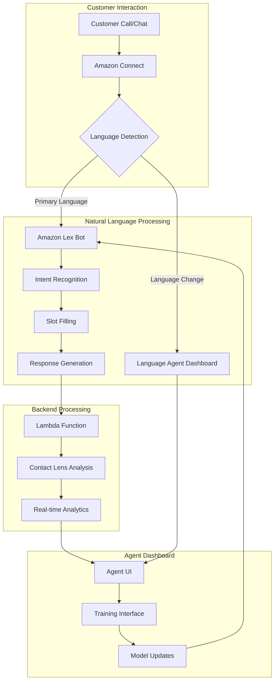

# Amazon Connect NLP Integration Project

## Overview
This project implements a natural language processing (NLP) solution for Amazon Connect, integrating Amazon Lex for conversational AI, AWS Lambda for backend processing, Contact Lens for analysis, and a custom Language Agent Dashboard for training and testing.

## Architecture


## Project Structure
```
amazon-connect-nlp/
├── .github/
│   └── workflows/
│       └── deploy.yml
├── src/
│   ├── lambda/
│   │   ├── integration/
│   │   │   ├── index.js
│   │   │   └── package.json
│   │   └── language-detection/
│   │       ├── index.js
│   │       └── package.json
│   ├── lex/
│   │   ├── intents/
│   │   │   ├── welcome.json
│   │   │   └── language-change.json
│   │   └── slots/
│   │       └── language-preferences.json
│   └── connect/
│       ├── contact-flows/
│       │   └── main-flow.json
│       └── prompts/
│           └── greetings.json
├── dashboard/
│   ├── frontend/
│   │   ├── src/
│   │   └── package.json
│   └── backend/
│       ├── src/
│       └── package.json
├── terraform/
│   ├── main.tf
│   ├── variables.tf
│   └── outputs.tf
├── tests/
│   ├── integration/
│   └── unit/
├── docs/
│   ├── setup.md
│   └── api-reference.md
├── .gitignore
├── package.json
└── README.md
```

## Prerequisites
- AWS Account with appropriate permissions
- Node.js 16.x or later
- AWS CLI configured locally
- Terraform 1.0.x or later
- Amazon Connect instance
- Access to Amazon Lex V2

## Installation

1. Clone the repository:
```bash
git clone https://github.com/your-org/amazon-connect-nlp.git
cd amazon-connect-nlp
```

2. Install dependencies:
```bash
npm install
```

3. Configure AWS credentials:
```bash
aws configure
```

4. Deploy infrastructure using Terraform:
```bash
cd terraform
terraform init
terraform plan
terraform apply
```

## Configuration

### Amazon Connect Setup

1. Create a new Amazon Connect instance:
```bash
aws connect create-instance \
    --identity-management-type CONNECT_MANAGED \
    --instance-alias "customer-service-center" \
    --inbound-calls-enabled \
    --outbound-calls-enabled
```

2. Import the contact flow:
```bash
aws connect create-contact-flow \
    --instance-id "your-instance-id" \
    --name "Main Customer Flow" \
    --type CONTACT_FLOW \
    --content file://src/connect/contact-flows/main-flow.json
```

### Amazon Lex Configuration

1. Create the Lex bot:
```bash
aws lexv2-models create-bot \
    --bot-name CustomerServiceBot \
    --data-privacy-type None \
    --idle-session-ttl-in-seconds 300
```

2. Import intents and slots:
```bash
aws lexv2-models create-intent \
    --bot-id "your-bot-id" \
    --intent-name "LanguageChange" \
    --description "Handle language change requests" \
    --sample-utterances file://src/lex/intents/language-change.json
```

### Lambda Function Deployment

1. Package the Lambda function:
```bash
cd src/lambda/integration
npm install
zip -r function.zip .
```

2. Deploy the function:
```bash
aws lambda create-function \
    --function-name connect-integration \
    --runtime nodejs16.x \
    --handler index.handler \
    --role "your-lambda-role-arn" \
    --zip-file fileb://function.zip
```

### Language Agent Dashboard Setup

1. Deploy the backend API:
```bash
cd dashboard/backend
npm install
npm run deploy
```

2. Configure the frontend:
```bash
cd dashboard/frontend
npm install
npm run build
```

## Usage

### Contact Flow Testing

1. Access your Amazon Connect instance
2. Navigate to "Contact Flows"
3. Import the main flow from `src/connect/contact-flows/main-flow.json`
4. Test the flow using the Amazon Connect simulator

### Language Agent Dashboard

1. Access the dashboard at `https://your-dashboard-url`
2. Log in with your credentials
3. Monitor real-time conversations
4. Access training interface for model improvements

## Monitoring and Analytics

### Contact Lens Analysis

1. Enable Contact Lens in your Connect instance:
```bash
aws connect update-instance-attribute \
    --instance-id "your-instance-id" \
    --attribute-type CONTACT_LENS \
    --value ENABLED
```

2. Access analytics in the Connect console:
- Navigate to "Analytics"
- Select "Contact Lens"
- View real-time and historical analysis

### Performance Metrics

Monitor key metrics through CloudWatch:
- Intent recognition accuracy
- Language detection confidence
- Response latency
- Customer satisfaction scores

## Troubleshooting

Common issues and solutions:

1. Language Detection Issues:
   - Verify Comprehend service permissions
   - Check language codes in configuration
   - Review detection confidence thresholds

2. Lex Integration Errors:
   - Validate bot aliases and versions
   - Check Lambda execution role permissions
   - Review Lex session management

3. Dashboard Connection Issues:
   - Verify API Gateway endpoints
   - Check WebSocket connections
   - Validate CORS settings

## Contributing

1. Fork the repository
2. Create a feature branch
3. Commit your changes
4. Push to the branch
5. Create a Pull Request

## Security

- All credentials should be stored in AWS Secrets Manager
- Enable AWS CloudTrail for audit logging
- Implement least privilege access
- Regular security reviews and updates

## License

This project is licensed under the MIT License - see the LICENSE file for details.

## Support

For support and questions:
- Create an issue in the repository
- Contact the development team
- Check documentation in the `/docs` directory
