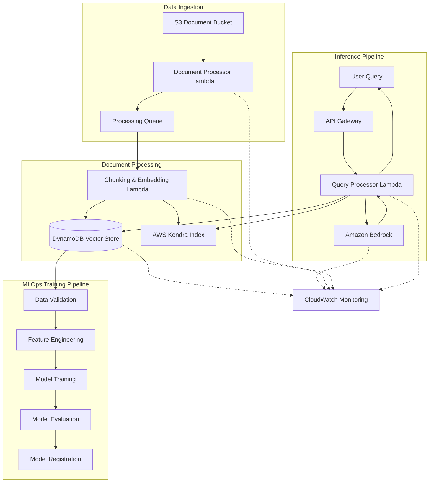

# RAG MLOps Pipeline: Step-by-Step Implementation Guide

This guide provides detailed, step-by-step instructions for implementing a Retrieval-Augmented Generation (RAG) MLOps pipeline that integrates Amazon Bedrock, DynamoDB, and AWS Kendra for efficient document management and intelligent search capabilities.

## Table of Contents

1. [Environment Setup](#1-environment-setup)
2. [Infrastructure Deployment](#2-infrastructure-deployment)
3. [Data Ingestion Pipeline](#3-data-ingestion-pipeline)
4. [Document Processing System](#4-document-processing-system)
5. [Vector Database Configuration](#5-vector-database-configuration)
6. [MLOps Training Pipeline](#6-mlops-training-pipeline)
7. [Inference System Implementation](#7-inference-system-implementation)
8. [Monitoring and Maintenance](#8-monitoring-and-maintenance)
9. [Security Implementation](#9-security-implementation)
10. [Testing and Validation](#10-testing-and-validation)

## Architecture

## 1. Environment Setup

### 1.1 AWS Account Configuration

1. Sign in to your AWS account with Administrator access
2. Create a new IAM user with programmatic access for pipeline deployment
3. Attach the necessary permissions policies:
   - AmazonS3FullAccess
   - AmazonDynamoDBFullAccess
   - AmazonKendraFullAccess
   - AmazonBedrockFullAccess
   - AWSLambdaFullAccess
   - AmazonSQSFullAccess
   - IAMFullAccess
   - CloudWatchFullAccess

### 1.2 Development Environment Setup

1. Install required tools:
   ```bash
   # Install AWS CLI
   curl "https://awscli.amazonaws.com/awscli-exe-linux-x86_64.zip" -o "awscliv2.zip"
   unzip awscliv2.zip
   sudo ./aws/install
   
   # Install Terraform
   wget -O- https://apt.releases.hashicorp.com/gpg | gpg --dearmor | sudo tee /usr/share/keyrings/hashicorp-archive-keyring.gpg
   echo "deb [signed-by=/usr/share/keyrings/hashicorp-archive-keyring.gpg] https://apt.releases.hashicorp.com $(lsb_release -cs) main" | sudo tee /etc/apt/sources.list.d/hashicorp.list
   sudo apt update && sudo apt install terraform
   
   # Install Python requirements
   pip install boto3 pandas numpy scikit-learn transformers torch
   ```

2. Configure AWS CLI:
   ```bash
   aws configure
   # Enter your IAM user credentials when prompted
   ```

## 2. Infrastructure Deployment

### 2.1 Create Project Structure

1. Set up your project directory:
   ```bash
   mkdir -p bedrock-rag-pipeline/{terraform,src/{data_ingestion,document_processing,vector_db,mlops,inference}}
   cd bedrock-rag-pipeline
   ```

2. Create a `requirements.txt` file:
   ```
   boto3>=1.26.0
   pandas>=1.3.5
   numpy>=1.21.0
   scikit-learn>=1.0.2
   transformers>=4.18.0
   torch>=1.12.0
   langchain>=0.0.267
   ```

### 2.2 Create Terraform Configuration

1. Create `terraform/main.tf`:
   ```hcl
   provider "aws" {
     region = var.aws_region
   }
   
   # S3 Bucket for documents
   resource "aws_s3_bucket" "document_bucket" {
     bucket = var.document_bucket_name
     acl    = "private"
   }
   
   # DynamoDB table for vector storage
   resource "aws_dynamodb_table" "vector_store" {
     name           = var.dynamodb_table_name
     billing_mode   = "PAY_PER_REQUEST"
     hash_key       = "id"
     
     attribute {
       name = "id"
       type = "S"
     }
     
     ttl {
       attribute_name = "ttl"
       enabled        = true
     }
   }
   
   # SQS Queue for document processing
   resource "aws_sqs_queue" "processing_queue" {
     name                      = var.sqs_queue_name
     delay_seconds             = 0
     max_message_size          = 262144
     message_retention_seconds = 86400
     receive_wait_time_seconds = 10
   }
   
   # Kendra Index
   resource "aws_kendra_index" "rag_index" {
     name        = var.kendra_index_name
     role_arn    = aws_iam_role.kendra_role.arn
     edition     = "DEVELOPER_EDITION"
   }
   
   # IAM roles and remaining resources...
   ```

2. Create `terraform/variables.tf` with your configuration parameters
3. Create `terraform/outputs.tf` to expose important resource IDs

### 2.3 Deploy Infrastructure

1. Initialize and apply Terraform configuration:
   ```bash
   cd terraform
   terraform init
   terraform plan
   terraform apply
   ```

2. Save the created resource IDs and ARNs for later use

## 3. Data Ingestion Pipeline

### 3.1 Set Up S3 Event Triggers

1. Create `src/data_ingestion/s3_trigger.py`:
   ```python
   import boto3
   import json
   import os
   
   def lambda_handler(event, context):
       """Process S3 upload events and send to SQS for processing"""
       s3_client = boto3.client('s3')
       sqs_client = boto3.client('sqs')
       
       # Get environment variables
       queue_url = os.environ['PROCESSING_QUEUE_URL']
       
       # Process each record in the event
       for record in event['Records']:
           bucket = record['s3']['bucket']['name']
           key = record['s3']['object']['key']
           
           # Send message to SQS queue
           message = {
               'bucket': bucket,
               'key': key,
               'eventTime': record['eventTime']
           }
           
           response = sqs_client.send_message(
               QueueUrl=queue_url,
               MessageBody=json.dumps(message)
           )
           
           print(f"Sent message to SQS for {bucket}/{key}: {response['MessageId']}")
       
       return {
           'statusCode': 200,
           'body': json.dumps('Document processing initiated')
       }
   ```

2. Create IAM role and policies for the Lambda function
3. Deploy the Lambda function and configure the S3 event trigger

### 3.2 Document Upload Utility

1. Create a utility script for manual document uploads:
   ```python
   import boto3
   import argparse
   import os
   
   def upload_document(file_path, bucket_name):
       """Upload a document to the S3 bucket"""
       s3_client = boto3.client('s3')
       file_name = os.path.basename(file_path)
       
       print(f"Uploading {file_name} to {bucket_name}...")
       s3_client.upload_file(file_path, bucket_name, file_name)
       print(f"Upload complete: s3://{bucket_name}/{file_name}")
   
   if __name__ == "__main__":
       parser = argparse.ArgumentParser(description='Upload documents to RAG pipeline')
       parser.add_argument('file_path', help='Path to the document file')
       parser.add_argument('--bucket', required=True, help='S3 bucket name')
       
       args = parser.parse_args()
       upload_document(args.file_path, args.bucket)
   ```

## 4. Document Processing System

### 4.1 Implement Document Processor Lambda

1. Create `src/document_processing/processor.py`:
   ```python
   import boto3
   import json
   import os
   import tempfile
   from document_parser import parse_document
   from text_chunker import chunk_text
   
   def lambda_handler(event, context):
       """Process documents from SQS queue"""
       s3_client = boto3.client('s3')
       sqs_client = boto3.client('sqs')
       
       # Process each message from SQS
       for record in event['Records']:
           message = json.loads(record['body'])
           bucket = message['bucket']
           key = message['key']
           
           # Download file to temp location
           with tempfile.NamedTemporaryFile(delete=False) as tmp_file:
               s3_client.download_file(bucket, key, tmp_file.name)
               
               # Parse document text
               text = parse_document(tmp_file.name)
               
               # Split into chunks
               chunks = chunk_text(
                   text, 
                   chunk_size=int(os.environ.get('CHUNK_SIZE', 500)),
                   overlap=int(os.environ.get('CHUNK_OVERLAP', 50))
               )
               
               # Send chunks for embedding and storage
               for i, chunk in enumerate(chunks):
                   send_chunk_for_processing(bucket, key, i, chunk)
           
           # Clean up temp file
           os.unlink(tmp_file.name)
       
       return {
           'statusCode': 200,
           'body': json.dumps('Documents processed successfully')
       }
       
   def send_chunk_for_processing(bucket, key, chunk_id, chunk_text):
       """Send document chunk for embedding and storage"""
       lambda_client = boto3.client('lambda')
       
       payload = {
           'document_id': f"{bucket}:{key}",
           'chunk_id': chunk_id,
           'text': chunk_text
       }
       
       lambda_client.invoke(
           FunctionName=os.environ['EMBEDDING_FUNCTION_NAME'],
           InvocationType='Event',
           Payload=json.dumps(payload)
       )
   ```

2. Create the document parser module:
   ```python
   # document_parser.py
   import os
   import textract
   
   def parse_document(file_path):
       """Extract text from various document formats"""
       # Get file extension
       _, ext = os.path.splitext(file_path)
       ext = ext.lower()
       
       # Extract text based on file type
       if ext in ['.txt']:
           with open(file_path, 'r', encoding='utf-8') as f:
               return f.read()
       else:
           # Use textract for PDF, DOCX, etc.
           return textract.process(file_path).decode('utf-8')
   ```

3. Create the text chunking module:
   ```python
   # text_chunker.py
   import re
   
   def chunk_text(text, chunk_size=500, overlap=50):
       """Split text into semantic chunks with overlap"""
       # Split text into sentences
       sentences = re.split(r'(?<=[.!?])\s+', text)
       
       chunks = []
       current_chunk = []
       current_size = 0
       
       for sentence in sentences:
           sentence_size = len(sentence.split())
           
           if current_size + sentence_size <= chunk_size:
               current_chunk.append(sentence)
               current_size += sentence_size
           else:
               # Add current chunk to results
               if current_chunk:
                   chunks.append(' '.join(current_chunk))
                   
                   # Create overlap by keeping some sentences
                   overlap_size = 0
                   overlap_chunk = []
                   
                   for s in reversed(current_chunk):
                       s_size = len(s.split())
                       if overlap_size + s_size <= overlap:
                           overlap_chunk.insert(0, s)
                           overlap_size += s_size
                       else:
                           break
                   
                   # Start new chunk with overlap
                   current_chunk = overlap_chunk
                   current_size = overlap_size
               
               # Add current sentence to the new chunk
               current_chunk.append(sentence)
               current_size += sentence_size
       
       # Add the last chunk if it exists
       if current_chunk:
           chunks.append(' '.join(current_chunk))
       
       return chunks
   ```

### 4.2 Implement Embedding Function

1. Create `src/document_processing/embedding.py`:
   ```python
   import boto3
   import json
   import os
   import uuid
   import base64
   
   def lambda_handler(event, context):
       """Generate embeddings for document chunks and store them"""
       bedrock_client = boto3.client('bedrock-runtime')
       dynamodb = boto3.resource('dynamodb')
       kendra_client = boto3.client('kendra')
       
       # Get environment variables
       table_name = os.environ['DYNAMODB_TABLE']
       kendra_index_id = os.environ['KENDRA_INDEX_ID']
       
       # Extract information from event
       document_id = event['document_id']
       chunk_id = event['chunk_id']
       text = event['text']
       
       # Generate embeddings using Bedrock
       embedding = generate_embedding(bedrock_client, text)
       
       # Store in DynamoDB
       table = dynamodb.Table(table_name)
       unique_id = str(uuid.uuid4())
       
       item = {
           'id': unique_id,
           'document_id': document_id,
           'chunk_id': chunk_id,
           'text_chunk': text,
           'embedding': base64.b64encode(embedding).decode('utf-8')
       }
       
       table.put_item(Item=item)
       
       # Index in Kendra
       index_in_kendra(kendra_client, kendra_index_id, document_id, chunk_id, text)
       
       return {
           'statusCode': 200,
           'body': json.dumps('Embedding generated and stored')
       }
   
   def generate_embedding(bedrock_client, text):
       """Generate embeddings using Amazon Bedrock"""
       response = bedrock_client.invoke_model(
           modelId='amazon.titan-embed-text-v1',
           contentType='application/json',
           accept='application/json',
           body=json.dumps({
               'inputText': text
           })
       )
       
       response_body = json.loads(response['body'].read())
       return response_body['embedding']
   
   def index_in_kendra(kendra_client, index_id, document_id, chunk_id, text):
       """Index document chunk in AWS Kendra"""
       kendra_client.batch_put_document(
           IndexId=index_id,
           Documents=[
               {
                   'Id': f"{document_id}-{chunk_id}",
                   'Title': f"Chunk {chunk_id} of {document_id}",
                   'Content': text,
                   'ContentType': 'PLAIN_TEXT',
                   'Attributes': [
                       {
                           'Key': 'document_id',
                           'Value': {'StringValue': document_id}
                       },
                       {
                           'Key': 'chunk_id',
                           'Value': {'StringValue': str(chunk_id)}
                       }
                   ]
               }
           ]
       )
   ```

## 5. Vector Database Configuration

### 5.1 DynamoDB Vector Store

1. Implement the DynamoDB vector store utility:
   ```python
   # src/vector_db/dynamodb_vector_store.py
   import boto3
   import json
   import base64
   import numpy as np
   
   class DynamoDBVectorStore:
       def __init__(self, table_name):
           self.dynamodb = boto3.resource('dynamodb')
           self.table = self.dynamodb.Table(table_name)
       
       def store_embedding(self, document_id, chunk_id, text, embedding, metadata=None):
           """Store a text chunk and its embedding in DynamoDB"""
           if metadata is None:
               metadata = {}
           
           # Convert numpy array to base64 string if needed
           if isinstance(embedding, np.ndarray):
               embedding = base64.b64encode(embedding.tobytes()).decode('utf-8')
           
           item = {
               'id': f"{document_id}:{chunk_id}",
               'document_id': document_id,
               'chunk_id': chunk_id,
               'text_chunk': text,
               'embedding': embedding,
               'metadata': metadata
           }
           
           self.table.put_item(Item=item)
           return item['id']
       
       def retrieve_similar_vectors(self, query_embedding, top_k=5):
           """Retrieve similar vectors from DynamoDB (simplified)"""
           # In a production system, you would use a vector similarity search solution
           # like Faiss or a specialized DynamoDB plugin
           
           # For demonstration, we'll implement a simple scan
           # Note: This is not efficient for large datasets
           response = self.table.scan()
           items = response.get('Items', [])
           
           # Calculate similarities
           similarities = []
           for item in items:
               stored_embedding = np.frombuffer(
                   base64.b64decode(item['embedding']), 
                   dtype=np.float32
               )
               
               # Calculate cosine similarity
               similarity = np.dot(query_embedding, stored_embedding) / (
                   np.linalg.norm(query_embedding) * np.linalg.norm(stored_embedding)
               )
               
               similarities.append((item, similarity))
           
           # Sort by similarity (highest first) and return top_k
           similarities.sort(key=lambda x: x[1], reverse=True)
           return [item for item, _ in similarities[:top_k]]
   ```

### 5.2 Create Schema Migration Script

1. Create a migration script to update the DynamoDB table for vector search:
   ```python
   # src/vector_db/migrate_schema.py
   import boto3
   import argparse
   
   def update_table_schema(table_name):
       """Update DynamoDB table schema for vector search capabilities"""
       dynamodb = boto3.client('dynamodb')
       
       # Update table with GSI for document_id
       response = dynamodb.update_table(
           TableName=table_name,
           AttributeDefinitions=[
               {
                   'AttributeName': 'document_id',
                   'AttributeType': 'S'
               }
           ],
           GlobalSecondaryIndexUpdates=[
               {
                   'Create': {
                       'IndexName': 'document_id-index',
                       'KeySchema': [
                           {
                               'AttributeName': 'document_id',
                               'KeyType': 'HASH'
                           }
                       ],
                       'Projection': {
                           'ProjectionType': 'ALL'
                       },
                       'ProvisionedThroughput': {
                           'ReadCapacityUnits': 5,
                           'WriteCapacityUnits': 5
                       }
                   }
               }
           ]
       )
       
       print(f"Table {table_name} updated with document_id GSI")
       return response
   
   if __name__ == "__main__":
       parser = argparse.ArgumentParser(description='Update DynamoDB schema for vector search')
       parser.add_argument('--table', required=True, help='DynamoDB table name')
       
       args = parser.parse_args()
       update_table_schema(args.table)
   ```

## 6. MLOps Training Pipeline

### 6.1 Create Step Functions Workflow

1. Define the Step Functions workflow definition:
   ```json
   {
     "Comment": "RAG MLOps Training Pipeline",
     "StartAt": "DataValidation",
     "States": {
       "DataValidation": {
         "Type": "Task",
         "Resource": "${aws_lambda_function.data_validation.arn}",
         "Next": "FeatureEngineering",
         "Catch": [{
           "ErrorEquals": ["States.ALL"],
           "Next": "FailState"
         }]
       },
       "FeatureEngineering": {
         "Type": "Task",
         "Resource": "${aws_lambda_function.feature_engineering.arn}",
         "Next": "ModelTraining",
         "Catch": [{
           "ErrorEquals": ["States.ALL"],
           "Next": "FailState"
         }]
       },
       "ModelTraining": {
         "Type": "Task",
         "Resource": "${aws_lambda_function.model_training.arn}",
         "Next": "ModelEvaluation",
         "Catch": [{
           "ErrorEquals": ["States.ALL"],
           "Next": "FailState"
         }]
       },
       "ModelEvaluation": {
         "Type": "Task",
         "Resource": "${aws_lambda_function.model_evaluation.arn}",
         "Next": "EvaluationDecision"
       },
       "EvaluationDecision": {
         "Type": "Choice",
         "Choices": [
           {
             "Variable": "$.evaluation.passed",
             "BooleanEquals": true,
             "Next": "ModelRegistration"
           }
         ],
         "Default": "FailState"
       },
       "ModelRegistration": {
         "Type": "Task",
         "Resource": "${aws_lambda_function.model_registration.arn}",
         "End": true
       },
       "FailState": {
         "Type": "Fail",
         "Cause": "Training pipeline failed"
       }
     }
   }
   ```

### 6.2 Implement MLOps Lambda Functions

1. Create the Data Validation Lambda:
   ```python
   # src/mlops/data_validation.py
   import boto3
   import json
   import os
   
   def lambda_handler(event, context):
       """Validate document quality and embeddings"""
       dynamodb = boto3.resource('dynamodb')
       table = dynamodb.Table(os.environ['DYNAMODB_TABLE'])
       
       # Scan a sample of records
       response = table.scan(Limit=100)
       items = response.get('Items', [])
       
       # Check for empty or malformed data
       validation_results = {
           'total_records': len(items),
           'empty_text': 0,
           'missing_embedding': 0,
           'invalid_document_id': 0
       }
       
       for item in items:
           if not item.get('text_chunk') or len(item.get('text_chunk', '')) < 10:
               validation_results['empty_text'] += 1
               
           if not item.get('embedding'):
               validation_results['missing_embedding'] += 1
               
           if not item.get('document_id'):
               validation_results['invalid_document_id'] += 1
       
       # Determine if validation passed
       validation_passed = (
           validation_results['empty_text'] / validation_results['total_records'] < 0.1 and
           validation_results['missing_embedding'] / validation_results['total_records'] < 0.05 and
           validation_results['invalid_document_id'] / validation_results['total_records'] < 0.01
       )
       
       validation_results['validation_passed'] = validation_passed
       
       # Return results to Step Function
       return {
           'validation': validation_results,
           'status': 'success' if validation_passed else 'failed'
       }
   ```

2. Implement the remaining Lambda functions for the MLOps pipeline:
   - Feature Engineering
   - Model Training
   - Model Evaluation
   - Model Registration

### 6.3 Automated Testing Framework

1. Create a test suite for your MLOps components:
   ```python
   # src/mlops/tests/test_validation.py
   import unittest
   import json
   from unittest.mock import patch, MagicMock
   import sys
   import os
   
   # Add the parent directory to sys.path
   sys.path.append(os.path.dirname(os.path.dirname(os.path.abspath(__file__))))
   
   # Import the lambda handler
   from data_validation import lambda_handler
   
   class TestDataValidation(unittest.TestCase):
       @patch('boto3.resource')
       def test_validation_passes_with_good_data(self, mock_resource):
           # Set up mock DynamoDB response
           mock_table = MagicMock()
           mock_resource.return_value.Table.return_value = mock_table
           
           # Mock scan response with good data
           mock_table.scan.return_value = {
               'Items': [
                   {
                       'id': 'test1',
                       'document_id': 'doc1',
                       'text_chunk': 'This is a test document with sufficient content.',
                       'embedding': 'base64encodedstring'
                   }
               ] * 100  # Create 100 identical good items
           }
           
           # Set environment variable
           os.environ['DYNAMODB_TABLE'] = 'test-table'
           
           # Call the lambda handler
           result = lambda_handler({}, {})
           
           # Check that validation passed
           self.assertTrue(result['validation']['validation_passed'])
           self.assertEqual(result['status'], 'success')
   
   if __name__ == '__main__':
       unittest.main()
   ```

## 7. Inference System Implementation

### 7.1 Create Query Processor Lambda

1. Implement the Query Processor Lambda:
   ```python
   # src/inference/query_processor.py
   import boto3
   import json
   import os
   import base64
   import numpy as np
   
   def lambda_handler(event, context):
       """Process user queries for the RAG system"""
       # Extract query from event
       query_text = event.get('queryText')
       if not query_text:
           return {
               'statusCode': 400,
               'body': json.dumps('Missing query text')
           }
       
       # Generate embedding for query
       bedrock_client = boto3.client('bedrock-runtime')
       query_embedding = generate_embedding(bedrock_client, query_text)
       
       # Retrieve similar documents from DynamoDB
       vector_results = retrieve_similar_vectors(query_embedding)
       
       # Search Kendra for additional context
       kendra_client = boto3.client('kendra')
       kendra_results = search_kendra(kendra_client, query_text)
       
       # Combine results
       context = prepare_context(vector_results, kendra_results)
       
       # Generate response using Bedrock
       final_response = generate_bedrock_response(bedrock_client, query_text, context)
       
       return {
           'statusCode': 200,
           'body': json.dumps({
               'query': query_text,
               'response': final_response,
               'sourceDocs': get_source_documents(vector_results, kendra_results)
           })
       }
   
   def generate_embedding(bedrock_client, text):
       """Generate embeddings using Amazon Bedrock"""
       response = bedrock_client.invoke_model(
           modelId='amazon.titan-embed-text-v1',
           contentType='application/json',
           accept='application/json',
           body=json.dumps({
               'inputText': text
           })
       )
       
       response_body = json.loads(response['body'].read())
       return np.array(response_body['embedding'], dtype=np.float32)
   
   def retrieve_similar_vectors(query_embedding, top_k=3):
       """Retrieve similar vectors from DynamoDB"""
       dynamodb = boto3.resource('dynamodb')
       table = dynamodb.Table(os.environ['DYNAMODB_TABLE'])
       
       # Simplified implementation (would use a vector search service in production)
       response = table.scan()
       items = response.get('Items', [])
       
       # Calculate similarities
       similarities = []
       for item in items:
           stored_embedding = np.frombuffer(
               base64.b64decode(item['embedding']), 
               dtype=np.float32
           )
           
           # Calculate cosine similarity
           similarity = np.dot(query_embedding, stored_embedding) / (
               np.linalg.norm(query_embedding) * np.linalg.norm(stored_embedding)
           )
           
           similarities.append((item, similarity))
       
       # Sort by similarity (highest first) and return top_k
       similarities.sort(key=lambda x: x[1], reverse=True)
       return [item for item, _ in similarities[:top_k]]
   
   def search_kendra(kendra_client, query_text, top_k=3):
       """Search AWS Kendra for relevant documents"""
       response = kendra_client.query(
           IndexId=os.environ['KENDRA_INDEX_ID'],
           QueryText=query_text,
           PageSize=top_k
       )
       
       return response.get('ResultItems', [])
   
   def prepare_context(vector_results, kendra_results):
       """Combine vector and Kendra search results into context for the LLM"""
       context_parts = []
       
       # Add vector search results
       for item in vector_results:
           context_parts.append(f"Document: {item['document_id']}\nContent: {item['text_chunk']}")
       
       # Add Kendra results
       for item in kendra_results:
           if 'DocumentExcerpt' in item:
               context_parts.append(f"Document: {item['DocumentId']}\nContent: {item['DocumentExcerpt']['Text']}")
       
       return "\n\n".join(context_parts)
   
   def generate_bedrock_response(bedrock_client, query_text, context):
       """Generate a response using Amazon Bedrock"""
       prompt = f"""
       Based on the following information:
       
       {context}
       
       Please answer the following question:
       {query_text}
       
       Answer:
       """
       
       response = bedrock_client.invoke_model(
           modelId='anthropic.claude-v2',
           contentType='application/json',
           accept='application/json',
           body=json.dumps({
               'prompt': prompt,
               'max_tokens_to_sample': 500,
               'temperature': 0.5,
               'top_p': 0.9,
           })
       )
       
       response_body = json.loads(response['body'].read())
       return response_body['completion'].strip()
   
   def get_source_documents(vector_results, kendra_results):
       """Extract source documents for citations"""
       sources = []
       
       # Add vector search sources
       for item in vector_results:
           sources.append({
               'document_id': item['document_id'],
               'chunk_id': item['chunk_id'],
               'excerpt': item['text_chunk'][:100] + '...'
           })
       
       # Add Kendra sources
       for item in kendra_results:
           if 'DocumentExcerpt' in item:
               sources.append({
                   'document_id': item['DocumentId'],
                   'excerpt': item['DocumentExcerpt']['Text'][:100] + '...'
               })
       
       return sources
   ```

### 7.2 Set Up API Gateway

1. Configure an API Gateway endpoint in your Terraform configuration:
   ```hcl
   # API Gateway for the RAG frontend
   resource "aws_api_gateway_rest_api" "rag_api" {
     name        = var.api_gateway_name
     description = "API Gateway for RAG application"
     
     endpoint_configuration {
