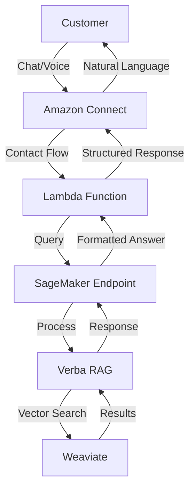
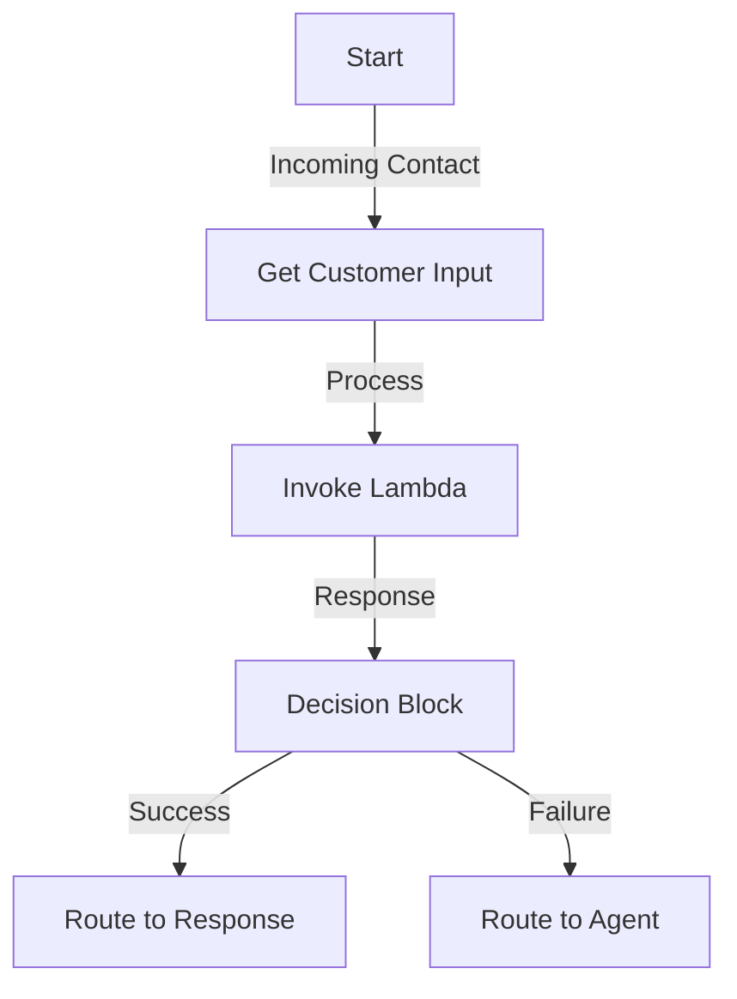

# Amazon Connect RAG Integration Workflow

A comprehensive workflow for integrating Amazon Connect with Verba RAG using SageMaker endpoints for natural language interactions.

## Architecture Overview



## Workflow Components

### 1. Customer Entry Points
- **Chat Interface**
  - Web chat widget
  - Mobile chat interface
  - SMS integration
- **Voice Interface**
  - Phone calls
  - Voice recognition
  - Speech-to-text conversion

### 2. Amazon Connect Contact Flow


### 3. Lambda Function Processing
```python
def process_customer_input(event, context):
    # Extract customer input
    customer_input = event['Details']['ContactData']['Attributes']['customerInput']
    
    # Generate RAG prompt
    rag_prompt = {
        'customer_query': customer_input,
        'context': 'customer_service',
        'metadata': {
            'channel': event['Details']['ContactData']['Channel'],
            'timestamp': event['Details']['ContactData']['InitiationTimestamp']
        }
    }
    
    # Invoke SageMaker endpoint
    response = invoke_sagemaker(rag_prompt)
    
    return format_response(response)
```

### 4. RAG Processing Pipeline

1. **Input Processing**
   ```mermaid
   graph LR
       A[Raw Input] -->|Preprocessing| B[Cleaned Input]
       B -->|Embedding| C[Vector Representation]
       C -->|Search| D[Knowledge Retrieval]
   ```

2. **Knowledge Retrieval**
   - Vector similarity search
   - Context aggregation
   - Relevance scoring

3. **Response Generation**
   - Context integration
   - Natural language generation
   - Response formatting

## Implementation Steps

### 1. Contact Flow Setup

1. **Create Basic Flow**
   ```plaintext
   Start
   ├── Get Customer Input
   │   ├── Chat: Capture text
   │   └── Voice: Convert speech to text
   ├── Process Input
   │   └── Invoke Lambda function
   ├── Handle Response
   │   ├── Success: Play/Display response
   │   └── Failure: Route to agent
   └── End
   ```

2. **Configure Lambda Integration**
   - Set up Lambda invocation
   - Configure timeout settings
   - Handle error cases

### 2. Lambda Function Implementation

1. **Input Processing**
   ```python
   def preprocess_input(customer_input, channel):
       return {
           'text': clean_text(customer_input),
           'channel': channel,
           'timestamp': get_current_timestamp()
       }
   ```

2. **RAG Integration**
   ```python
   def query_rag_system(preprocessed_input):
       # Generate embeddings
       embeddings = generate_embeddings(preprocessed_input['text'])
       
       # Query vector database
       context = query_vector_db(embeddings)
       
       # Generate response
       response = generate_response(context, preprocessed_input)
       
       return response
   ```

3. **Response Formatting**
   ```python
   def format_response(rag_response):
       return {
           'natural_language': rag_response['generated_text'],
           'confidence': rag_response['confidence'],
           'sources': rag_response['source_documents']
       }
   ```

### 3. SageMaker Endpoint Configuration

1. **Model Setup**
   ```python
   def configure_endpoint():
       model = RAGModel(
           model_data="s3://path/to/model",
           role=role_arn,
           entry_point="inference.py",
           framework_version="1.0.0"
       )
       return model.deploy()
   ```

2. **Inference Configuration**
   ```python
   def inference_config():
       return {
           'MaxConcurrentTransforms': 4,
           'BatchStrategy': 'MULTI_RECORD',
           'MaxPayloadInMB': 6
       }
   ```

### 4. Verba RAG Setup

1. **Knowledge Base Configuration**
   ```python
   def setup_knowledge_base():
       verba_client = Verba(
           deployment='Custom',
           weaviate_url=WEAVIATE_URL,
           weaviate_api_key=WEAVIATE_API_KEY
       )
       return verba_client
   ```

2. **Query Processing**
   ```python
   def process_rag_query(query, context):
       response = verba_client.query(
           query=query,
           context=context,
           max_tokens=150
       )
       return response
   ```

## Monitoring and Logging

### 1. CloudWatch Integration
- Log all interactions
- Track performance metrics
- Monitor error rates

### 2. Performance Metrics
- Response times
- Query success rates
- Customer satisfaction scores

### 3. Error Handling
- Input validation errors
- RAG processing errors
- Connection timeouts

## Best Practices

1. **Input Validation**
   - Sanitize customer input
   - Validate data formats
   - Handle edge cases

2. **Response Quality**
   - Monitor response relevance
   - Track customer satisfaction
   - Implement feedback loops

3. **Performance Optimization**
   - Cache common queries
   - Batch similar requests
   - Optimize vector search

4. **Security**
   - Implement encryption
   - Validate authentication
   - Monitor access patterns

## Deployment Checklist

1. **Pre-deployment**
   - [ ] Test contact flows
   - [ ] Validate Lambda functions
   - [ ] Verify SageMaker endpoints
   - [ ] Check Verba configuration

2. **Deployment**
   - [ ] Deploy contact flows
   - [ ] Update Lambda functions
   - [ ] Start SageMaker endpoints
   - [ ] Enable monitoring

3. **Post-deployment**
   - [ ] Monitor performance
   - [ ] Collect metrics
   - [ ] Gather feedback
   - [ ] Optimize based on usage

---
Created with 🚀 by Your Organization