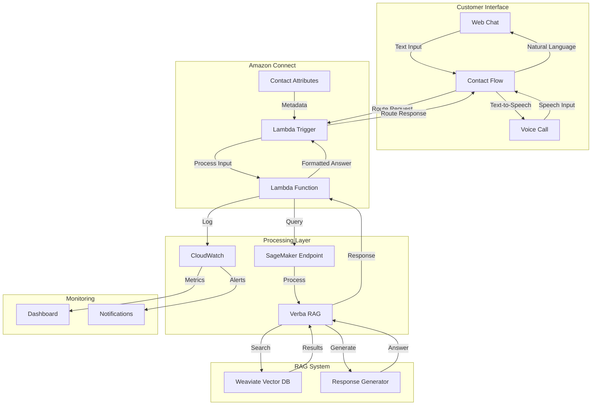
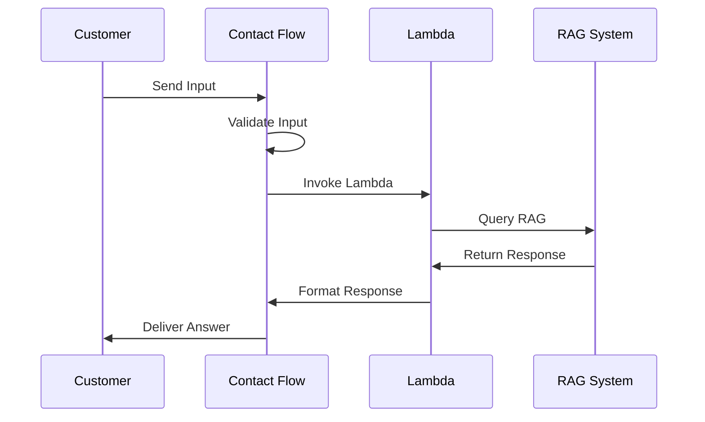
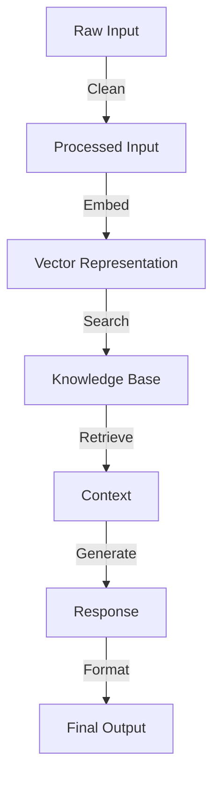
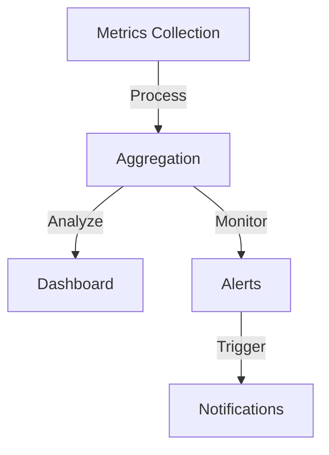
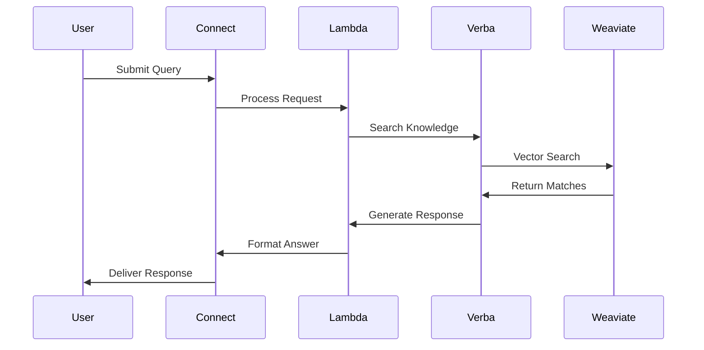
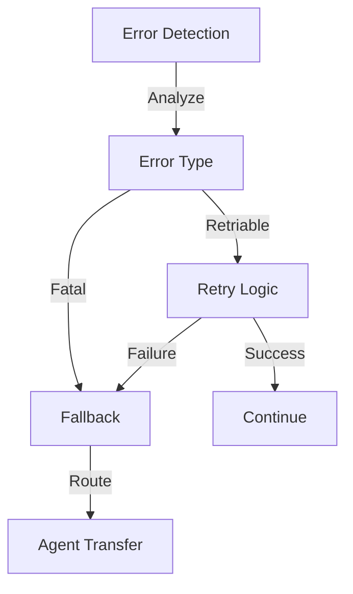
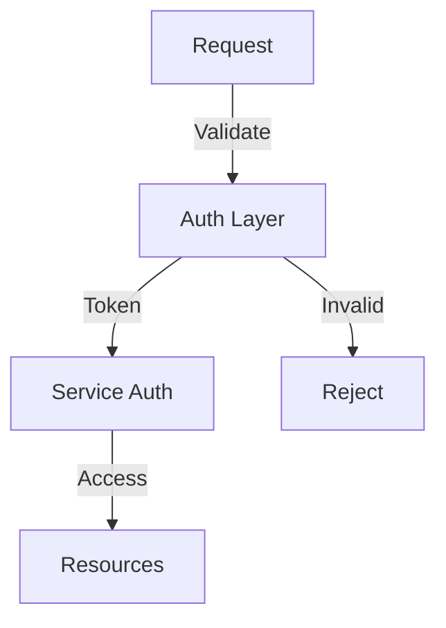

# Detailed Architecture Overview: Amazon Connect RAG Integration

## System Architecture



## Component Interactions

### 1. Entry Points
- **Web Chat Interface**
  ```mermaid
  graph LR
      A[Customer] -->|Type Message| B[Web Widget]
      B -->|Send| C[Connect API]
      C -->|Route| D[Contact Flow]
  ```

- **Voice Interface**
  ```mermaid
  graph LR
      A[Customer] -->|Speak| B[Phone System]
      B -->|Transcribe| C[Speech-to-Text]
      C -->|Text| D[Contact Flow]
  ```

### 2. Contact Flow Processing


### 3. Data Processing Pipeline


## Detailed Component Descriptions

### 1. Customer Interface Layer

#### Web Chat Components
- **Web Widget**
  - Real-time message handling
  - Session management
  - Typing indicators
  - Message history

#### Voice Components
- **Phone System**
  - Call routing
  - Voice quality monitoring
  - Speech recognition
  - Audio processing

### 2. Amazon Connect Layer

#### Contact Flow Engine
```plaintext
Start
├── Input Reception
│   ├── Text Validation
│   └── Speech Processing
├── Attribute Management
│   ├── Customer Context
│   └── Session Data
├── Lambda Integration
│   ├── Function Invocation
│   └── Response Handling
└── Response Routing
    ├── Success Path
    └── Fallback Path
```

#### Contact Attributes
- Customer ID
- Session Data
- Interaction History
- Channel Information

### 3. Processing Layer

#### Lambda Function Architecture
```plaintext
Lambda Handler
├── Input Processing
│   ├── Text Cleaning
│   ├── Metadata Extraction
│   └── Validation
├── RAG Integration
│   ├── Query Formation
│   ├── Context Management
│   └── Response Processing
├── Error Handling
│   ├── Retry Logic
│   ├── Fallback Mechanisms
│   └── Error Reporting
└── Response Formatting
    ├── Structure Building
    ├── Validation
    └── Delivery
```

#### SageMaker Integration
- Model Endpoint Management
- Scaling Configuration
- Performance Monitoring
- Resource Optimization

### 4. RAG System Layer

#### Verba Components
- **Query Processor**
  - Query Analysis
  - Context Integration
  - Response Generation

#### Weaviate Integration
- Vector Storage
- Similarity Search
- Metadata Management
- Index Optimization

### 5. Monitoring Layer

#### CloudWatch Integration


#### Performance Metrics
- Response Times
- Query Success Rates
- Model Performance
- Resource Utilization

## Data Flow Patterns

### 1. Query Processing Flow


### 2. Error Handling Flow


## System Optimization

### 1. Caching Strategy
- Query Results
- Common Responses
- Vector Embeddings
- Session Data

### 2. Performance Tuning
- Batch Processing
- Connection Pooling
- Resource Allocation
- Load Balancing

### 3. Scaling Considerations
- Horizontal Scaling
- Vertical Scaling
- Auto-scaling Rules
- Resource Limits

## Security Architecture

### 1. Authentication Flow


### 2. Data Protection
- Encryption at Rest
- Encryption in Transit
- Access Controls
- Audit Logging

---
This architecture provides a robust foundation for integrating Amazon Connect with RAG capabilities, ensuring scalability, reliability, and maintainability of the system.