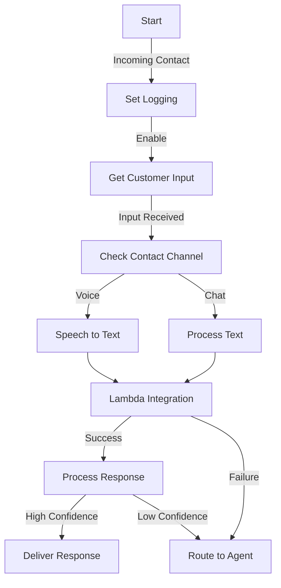

# Detailed Implementation Components

## 1. Contact Flow Setup

### Basic Contact Flow Structure


### Contact Flow Configuration

1. **Initial Setup**
```json
{
  "Version": "2019-10-30",
  "StartAction": "SetLogging",
  "Metadata": {
    "entryPointPosition": {"x": 20, "y": 20},
    "snapToGrid": true,
    "ActionMetadata": {
      "SetLogging": {
        "position": {"x": 160, "y": 20}
      }
    }
  }
}
```

2. **Get Customer Input Block**
```json
{
  "Type": "GetUserInput",
  "Parameters": {
    "TextInput": {
      "Timeout": "5",
      "MaxLength": "500"
    },
    "VoiceInput": {
      "MaxLength": "30",
      "TerminationCharacter": "#"
    }
  }
}
```

3. **Lambda Integration Block**
```json
{
  "Type": "InvokeLambdaFunction",
  "Parameters": {
    "FunctionArn": "arn:aws:lambda:region:account:function:rag-processor",
    "TimeLimit": "8"
  }
}
```

## 2. Lambda Function Implementation

### Core Lambda Function
```python
class RAGProcessor:
    def __init__(self):
        self.sagemaker_client = boto3.client('sagemaker-runtime')
        self.verba_client = self._init_verba_client()
        self.config = self._load_config()

    def process_request(self, event):
        # Extract input and metadata
        input_data = self._extract_input(event)
        
        # Process through RAG
        rag_response = self._query_rag(input_data)
        
        # Format response
        return self._format_response(rag_response)

    def _extract_input(self, event):
        return {
            'text': event['Details']['ContactData']['Attributes']['customerInput'],
            'channel': event['Details']['ContactData']['Channel'],
            'contactId': event['Details']['ContactData']['ContactId']
        }

    def _query_rag(self, input_data):
        try:
            # Query Verba
            response = self.verba_client.query(
                text=input_data['text'],
                context={'channel': input_data['channel']}
            )
            return response
        except Exception as e:
            logger.error(f"RAG query failed: {str(e)}")
            return None
```

### Error Handling Implementation
```python
class ErrorHandler:
    def __init__(self):
        self.max_retries = 3
        self.backoff_base = 2

    def handle_error(self, error, attempt):
        if attempt < self.max_retries:
            wait_time = self.backoff_base ** attempt
            time.sleep(wait_time)
            return True
        return False

    def log_error(self, error, context):
        logger.error(f"Error: {str(error)}, Context: {context}")
        # Log to CloudWatch
```

## 3. SageMaker Configuration

### Endpoint Configuration
```python
def configure_sagemaker_endpoint():
    return {
        'EndpointConfig': {
            'EndpointConfigName': 'rag-endpoint-config',
            'ProductionVariants': [{
                'VariantName': 'AllTraffic',
                'ModelName': 'rag-model',
                'InstanceType': 'ml.g4dn.xlarge',
                'InitialInstanceCount': 1,
                'InitialVariantWeight': 1.0
            }]
        },
        'Tags': [
            {
                'Key': 'Environment',
                'Value': 'Production'
            }
        ]
    }
```

### Model Deployment Script
```python
def deploy_model():
    sagemaker = boto3.client('sagemaker')
    
    # Create model
    model_response = sagemaker.create_model(
        ModelName='rag-model',
        ExecutionRoleArn=ROLE_ARN,
        PrimaryContainer={
            'Image': CONTAINER_URI,
            'ModelDataUrl': MODEL_S3_PATH,
            'Environment': {
                'SAGEMAKER_PROGRAM': 'inference.py'
            }
        }
    )
    
    # Create endpoint configuration
    config_response = sagemaker.create_endpoint_config(
        EndpointConfigName='rag-endpoint-config',
        ProductionVariants=[{
            'VariantName': 'AllTraffic',
            'ModelName': 'rag-model',
            'InstanceType': 'ml.g4dn.xlarge',
            'InitialInstanceCount': 1
        }]
    )
    
    # Create endpoint
    endpoint_response = sagemaker.create_endpoint(
        EndpointName='rag-endpoint',
        EndpointConfigName='rag-endpoint-config'
    )
    
    return endpoint_response
```

## 4. Verba RAG Integration

### Verba Client Setup
```python
def initialize_verba():
    return Verba(
        deployment='Custom',
        weaviate_url=WEAVIATE_URL,
        weaviate_api_key=WEAVIATE_API_KEY
    )
```

### Query Processing
```python
class VerbaProcessor:
    def __init__(self):
        self.verba_client = initialize_verba()
        self.embeddings = self._initialize_embeddings()

    def process_query(self, query, context=None):
        # Generate embeddings
        query_embedding = self.embeddings.embed_query(query)
        
        # Search vector database
        search_results = self.verba_client.similarity_search(
            query_embedding,
            k=3  # Number of results
        )
        
        # Generate response
        response = self.verba_client.generate_response(
            query=query,
            context=search_results,
            additional_context=context
        )
        
        return response

    def _initialize_embeddings(self):
        return HuggingFaceEmbeddings(
            model_name="sentence-transformers/all-mpnet-base-v2"
        )
```

### Knowledge Base Management
```python
class KnowledgeBase:
    def __init__(self, verba_client):
        self.verba_client = verba_client

    def add_document(self, document):
        # Process document
        chunks = self._chunk_document(document)
        
        # Generate embeddings
        embeddings = self._generate_embeddings(chunks)
        
        # Store in vector database
        self.verba_client.add_embeddings(
            embeddings,
            metadata={
                'source': document['source'],
                'timestamp': document['timestamp']
            }
        )

    def _chunk_document(self, document):
        return self.verba_client.chunk_text(
            text=document['content'],
            chunk_size=1000,
            chunk_overlap=200
        )

    def _generate_embeddings(self, chunks):
        return self.verba_client.get_embeddings(chunks)
```

## Implementation Best Practices

### 1. Contact Flow
- Implement proper error handling
- Set appropriate timeouts
- Include logging
- Handle multiple channels

### 2. Lambda Function
- Use environment variables
- Implement retry logic
- Monitor performance
- Handle edge cases

### 3. SageMaker
- Configure auto-scaling
- Monitor endpoint health
- Implement model versioning
- Optimize instance selection

### 4. Verba RAG
- Maintain index freshness
- Monitor search quality
- Implement caching
- Optimize chunk sizes

## Monitoring and Logging

### CloudWatch Metrics
```python
def log_metrics(metrics_data):
    cloudwatch = boto3.client('cloudwatch')
    
    cloudwatch.put_metric_data(
        Namespace='Connect/RAG',
        MetricData=[
            {
                'MetricName': 'QueryLatency',
                'Value': metrics_data['latency'],
                'Unit': 'Milliseconds'
            },
            {
                'MetricName': 'QuerySuccess',
                'Value': metrics_data['success'],
                'Unit': 'Count'
            }
        ]
    )
```

### Performance Monitoring
```python
def monitor_performance():
    return {
        'Metrics': [
            'SuccessRate',
            'ResponseTime',
            'ErrorRate',
            'ModelLatency'
        ],
        'Dimensions': [
            'ContactId',
            'Channel',
            'ModelEndpoint'
        ],
        'Period': 300,  # 5 minutes
        'Statistics': ['Average', 'Sum', 'Count']
    }
```

---
These implementation components provide a robust foundation for integrating Amazon Connect with RAG capabilities using Verba and SageMaker.