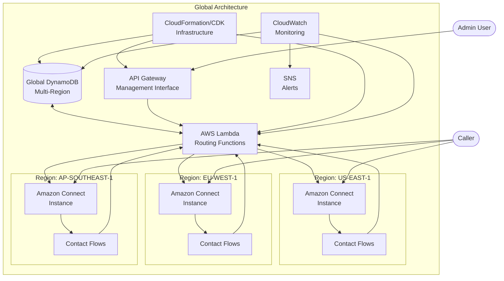

# Global Call Routing System with DynamoDB

This README provides a comprehensive guide for implementing a global call routing system using Amazon DynamoDB as the centralized database for Amazon Connect instances deployed across multiple regions.

## Table of Contents

1. [Overview](#overview)
2. [Architecture](#architecture)
3. [Prerequisites](#prerequisites)
4. [Implementation Steps](#implementation-steps)
   - [Step 1: Setting Up DynamoDB Global Tables](#step-1-setting-up-dynamodb-global-tables)
   - [Step 2: Creating the Data Model](#step-2-creating-the-data-model)
   - [Step 3: Implementing Lambda Functions](#step-3-implementing-lambda-functions)
   - [Step 4: API Gateway Integration](#step-4-api-gateway-integration)
   - [Step 5: Amazon Connect Integration](#step-5-amazon-connect-integration)
   - [Step 6: Failover Configuration](#step-6-failover-configuration)
   - [Step 7: Monitoring and Alerting](#step-7-monitoring-and-alerting)
5. [Testing the Solution](#testing-the-solution)
6. [Maintenance and Operations](#maintenance-and-operations)
7. [Troubleshooting](#troubleshooting)
8. [Security Considerations](#security-considerations)

## Overview

This solution provides a globally distributed call routing system that allows multiple Amazon Connect instances to share a single source of truth for routing information. By leveraging DynamoDB's global tables feature, routing data is replicated across regions, ensuring high availability and fault tolerance.

Key benefits:
- Centralized management of routing rules
- Consistent customer experience across global contact centers
- High availability with cross-region failover
- Business hours and time zone awareness
- Dynamic routing based on real-time conditions

## Architecture


The system consists of the following components:
- **DynamoDB Global Tables**: Store routing rules, agent skills, and business hours
- **Lambda Functions**: Provide the business logic for routing decisions
- **API Gateway**: Exposes management endpoints for updating routing rules
- **Amazon Connect Instances**: Contact centers in multiple regions
- **CloudWatch and SNS**: Monitoring and alerting

## Prerequisites

Before implementing this solution, ensure you have:

1. AWS account with appropriate permissions
2. Amazon Connect instances set up in target regions
3. AWS CLI and AWS CDK installed and configured
4. Node.js 14+ for Lambda development
5. Basic understanding of DynamoDB, Lambda, and Amazon Connect

## Implementation Steps

### Step 1: Setting Up DynamoDB Global Tables

1. **Create the primary tables in your main region:**

```bash
# Using AWS CLI
aws dynamodb create-table \
    --table-name GlobalCallRouting \
    --attribute-definitions \
        AttributeName=phoneNumber,AttributeType=S \
        AttributeName=region,AttributeType=S \
    --key-schema \
        AttributeName=phoneNumber,KeyType=HASH \
        AttributeName=region,KeyType=RANGE \
    --billing-mode PAY_PER_REQUEST \
    --stream-specification StreamEnabled=true,StreamViewType=NEW_AND_OLD_IMAGES \
    --region us-east-1
```

2. **Create secondary tables:**

```bash
# Create AgentSkills table
aws dynamodb create-table \
    --table-name AgentSkills \
    --attribute-definitions \
        AttributeName=agentId,AttributeType=S \
    --key-schema \
        AttributeName=agentId,KeyType=HASH \
    --billing-mode PAY_PER_REQUEST \
    --stream-specification StreamEnabled=true,StreamViewType=NEW_AND_OLD_IMAGES \
    --region us-east-1

# Create BusinessHours table
aws dynamodb create-table \
    --table-name BusinessHours \
    --attribute-definitions \
        AttributeName=regionId,AttributeType=S \
    --key-schema \
        AttributeName=regionId,KeyType=HASH \
    --billing-mode PAY_PER_REQUEST \
    --stream-specification StreamEnabled=true,StreamViewType=NEW_AND_OLD_IMAGES \
    --region us-east-1
```

3. **Convert to global tables:**

```bash
# Enable replication for GlobalCallRouting table
aws dynamodb update-table \
    --table-name GlobalCallRouting \
    --replica-updates 'Create={RegionName=eu-west-1},Create={RegionName=ap-southeast-1}' \
    --region us-east-1

# Repeat for other tables
aws dynamodb update-table \
    --table-name AgentSkills \
    --replica-updates 'Create={RegionName=eu-west-1},Create={RegionName=ap-southeast-1}' \
    --region us-east-1

aws dynamodb update-table \
    --table-name BusinessHours \
    --replica-updates 'Create={RegionName=eu-west-1},Create={RegionName=ap-southeast-1}' \
    --region us-east-1
```

### Step 2: Creating the Data Model

1. **Define the basic data structures for your tables:**

Create a file named `schema.js` with the following sample data:

```javascript
// Sample routing rule
const sampleRoutingRule = {
  phoneNumber: '+18005551234',
  region: 'us-east-1',
  routingProfile: 'sales',
  priority: 1,
  fallbackRegions: ['eu-west-1', 'ap-southeast-1'],
  businessHoursId: 'US_BUSINESS',
  contactFlowId: 'arn:aws:connect:us-east-1:123456789012:instance/instance-id/contact-flow/contact-flow-id',
  queueId: 'arn:aws:connect:us-east-1:123456789012:instance/instance-id/queue/queue-id',
  attributes: {
    department: 'sales',
    priority: 'high',
    language: 'en-US'
  },
  lastUpdated: '2025-02-26T12:00:00Z',
  version: 1
};

// Sample agent skills
const sampleAgentSkills = {
  agentId: 'agent123',
  name: 'John Doe',
  skills: ['english', 'spanish', 'sales', 'technical'],
  level: {
    sales: 5,
    technical: 3,
    customer_service: 4
  },
  regions: ['us-east-1', 'eu-west-1'],
  schedule: {
    timezone: 'America/New_York',
    shifts: [
      { day: 'monday', start: '09:00', end: '17:00' },
      { day: 'tuesday', start: '09:00', end: '17:00' }
      // Other days...
    ]
  },
  maxConcurrentChats: 3,
  lastUpdated: '2025-02-26T12:00:00Z'
};

// Sample business hours
const sampleBusinessHours = {
  regionId: 'US_BUSINESS',
  name: 'US Business Hours',
  timezone: 'America/New_York',
  schedule: {
    monday: { isOpen: true, hours: [{ open: '09:00', close: '17:00' }] },
    tuesday: { isOpen: true, hours: [{ open: '09:00', close: '17:00' }] },
    wednesday: { isOpen: true, hours: [{ open: '09:00', close: '17:00' }] },
    thursday: { isOpen: true, hours: [{ open: '09:00', close: '17:00' }] },
    friday: { isOpen: true, hours: [{ open: '09:00', close: '17:00' }] },
    saturday: { isOpen: false, hours: [] },
    sunday: { isOpen: false, hours: [] }
  },
  holidays: [
    { date: '2025-01-01', name: 'New Year\'s Day' },
    { date: '2025-12-25', name: 'Christmas Day' }
  ],
  emergencyClose: {
    isActive: false,
    message: 'We are currently closed due to unforeseen circumstances.'
  },
  lastUpdated: '2025-02-26T12:00:00Z'
};

module.exports = {
  sampleRoutingRule,
  sampleAgentSkills,
  sampleBusinessHours
};
```

2. **Populate the tables with initial data:**

Create a script named `populate-tables.js`:

```javascript
const AWS = require('aws-sdk');
const { sampleRoutingRule, sampleAgentSkills, sampleBusinessHours } = require('./schema');

// Configure AWS SDK
AWS.config.update({ region: 'us-east-1' });
const dynamodb = new AWS.DynamoDB.DocumentClient();

async function populateTables() {
  try {
    // Add sample routing rule
    await dynamodb.put({
      TableName: 'GlobalCallRouting',
      Item: sampleRoutingRule
    }).promise();
    console.log('Added sample routing rule');
    
    // Add sample agent skills
    await dynamodb.put({
      TableName: 'AgentSkills',
      Item: sampleAgentSkills
    }).promise();
    console.log('Added sample agent skills');
    
    // Add sample business hours
    await dynamodb.put({
      TableName: 'BusinessHours',
      Item: sampleBusinessHours
    }).promise();
    console.log('Added sample business hours');
    
    console.log('All sample data added successfully');
  } catch (error) {
    console.error('Error populating tables:', error);
  }
}

populateTables();
```

3. **Run the script to populate the tables:**

```bash
node populate-tables.js
```

### Step 3: Implementing Lambda Functions

1. **Create the routing function:**

Create a directory for your Lambda functions:

```bash
mkdir -p lambda/route-call
cd lambda/route-call
```

Create a file named `index.js`:

```javascript
const AWS = require('aws-sdk');

// Get routing information for a phone number
async function getRoutingForPhoneNumber(phoneNumber, region) {
  const dynamodb = new AWS.DynamoDB.DocumentClient({ region });
  
  try {
    const params = {
      TableName: 'GlobalCallRouting',
      Key: {
        phoneNumber: phoneNumber,
        region: region
      }
    };
    
    const result = await dynamodb.get(params).promise();
    
    if (!result.Item) {
      // Try to find a generic routing rule (e.g., default for country code)
      const countryCode = phoneNumber.substring(0, 3); // Example: +1 for US
      const genericParams = {
        TableName: 'GlobalCallRouting',
        FilterExpression: 'begins_with(phoneNumber, :countryCode) AND region = :region',
        ExpressionAttributeValues: {
          ':countryCode': countryCode,
          ':region': region
        },
        Limit: 1
      };
      
      const genericResult = await dynamodb.scan(genericParams).promise();
      
      if (genericResult.Items && genericResult.Items.length > 0) {
        return genericResult.Items[0];
      }
      
      // Check fallback regions
      const fallbackRegions = ['us-east-1', 'eu-west-1', 'ap-southeast-1'].filter(r => r !== region);
      
      for (const fallbackRegion of fallbackRegions) {
        const fbDynamodb = new AWS.DynamoDB.DocumentClient({ region: fallbackRegion });
        const fallbackParams = {
          TableName: 'GlobalCallRouting',
          Key: {
            phoneNumber: phoneNumber,
            region: fallbackRegion
          }
        };
        
        const fallbackResult = await fbDynamodb.get(fallbackParams).promise();
        
        if (fallbackResult.Item) {
          return fallbackResult.Item;
        }
      }
      
      // Return default routing if no specific rule found
      return {
        phoneNumber: 'default',
        region: region,
        contactFlowId: process.env.DEFAULT_CONTACT_FLOW_ID,
        queueId: process.env.DEFAULT_QUEUE_ID
      };
    }
    
    return result.Item;
  } catch (error) {
    console.error('Error getting routing information:', error);
    throw error;
  }
}

// Check if current time is within business hours
async function isWithinBusinessHours(businessHoursId, region) {
  const dynamodb = new AWS.DynamoDB.DocumentClient({ region });
  
  try {
    const params = {
      TableName: 'BusinessHours',
      Key: {
        regionId: businessHoursId
      }
    };
    
    const result = await dynamodb.get(params).promise();
    
    if (!result.Item) {
      // Default to open if no business hours defined
      return true;
    }
    
    const businessHours = result.Item;
    const now = new Date();
    const timezone = businessHours.timezone || 'UTC';
    
    // Get current day and time in the specified timezone
    const options = { timeZone: timezone, hour12: false };
    const localDateString = now.toLocaleString('en-US', options);
    const localDate = new Date(localDateString);
    
    // Check if today is a holiday
    const todayString = now.toISOString().split('T')[0]; // YYYY-MM-DD
    const isHoliday = businessHours.holidays && 
                      businessHours.holidays.some(h => h.date === todayString);
    
    if (isHoliday || businessHours.emergencyClose.isActive) {
      return false;
    }
    
    // Get day of week (lowercase)
    const days = ['sunday', 'monday', 'tuesday', 'wednesday', 'thursday', 'friday', 'saturday'];
    const dayOfWeek = days[localDate.getDay()];
    
    // Check if the business is open today
    const todaySchedule = businessHours.schedule[dayOfWeek];
    if (!todaySchedule || !todaySchedule.isOpen || !todaySchedule.hours.length) {
      return false;
    }
    
    // Check if current time is within any of the open hours
    const currentHour = localDate.getHours();
    const currentMinute = localDate.getMinutes();
    const currentTimeMinutes = currentHour * 60 + currentMinute;
    
    return todaySchedule.hours.some(period => {
      const [openHour, openMinute] = period.open.split(':').map(Number);
      const [closeHour, closeMinute] = period.close.split(':').map(Number);
      
      const openTimeMinutes = openHour * 60 + openMinute;
      const closeTimeMinutes = closeHour * 60 + closeMinute;
      
      return currentTimeMinutes >= openTimeMinutes && currentTimeMinutes < closeTimeMinutes;
    });
    
  } catch (error) {
    console.error('Error checking business hours:', error);
    // Default to open in case of error
    return true;
  }
}

// Lambda handler for Amazon Connect to call
exports.handler = async (event, context) => {
  try {
    const phoneNumber = event.Details.ContactData.CustomerEndpoint.Address;
    const region = event.Details.ContactData.InstanceARN.split(':')[3]; // Extract region from ARN
    
    // Get routing information
    const routingInfo = await getRoutingForPhoneNumber(phoneNumber, region);
    
    // Check business hours
    const withinBusinessHours = await isWithinBusinessHours(routingInfo.businessHoursId, region);
    
    let resultContactFlow;
    let resultQueue;
    
    if (withinBusinessHours) {
      // Use normal business hours flow
      resultContactFlow = routingInfo.contactFlowId;
      resultQueue = routingInfo.queueId;
    } else {
      // Use after-hours flow
      resultContactFlow = routingInfo.afterHoursContactFlowId || process.env.AFTER_HOURS_FLOW_ID;
      resultQueue = routingInfo.afterHoursQueueId || process.env.AFTER_HOURS_QUEUE_ID;
    }
    
    // Return results to Amazon Connect
    return {
      contactFlowId: resultContactFlow,
      queueId: resultQueue,
      attributes: routingInfo.attributes || {}
    };
  } catch (error) {
    console.error('Error in routeCall:', error);
    
    // Return fallback routing in case of error
    return {
      contactFlowId: process.env.DEFAULT_CONTACT_FLOW_ID,
      queueId: process.env.DEFAULT_QUEUE_ID,
      attributes: {
        errorMessage: error.message
      }
    };
  }
};
```

2. **Create the management API function:**

```bash
mkdir -p lambda/update-routing
cd lambda/update-routing
```

Create a file named `index.js`:

```javascript
const AWS = require('aws-sdk');

exports.handler = async (event, context) => {
  const body = JSON.parse(event.body);
  
  // Validate input
  if (!body.phoneNumber || !body.region) {
    return {
      statusCode: 400,
      body: JSON.stringify({ message: 'phoneNumber and region are required' })
    };
  }
  
  try {
    const dynamodb = new AWS.DynamoDB.DocumentClient({ region: body.region });
    
    // Add metadata
    body.lastUpdated = new Date().toISOString();
    body.version = (body.version || 0) + 1;
    
    const params = {
      TableName: 'GlobalCallRouting',
      Item: body,
      ConditionExpression: 'attribute_not_exists(version) OR version < :version',
      ExpressionAttributeValues: {
        ':version': body.version
      }
    };
    
    await dynamodb.put(params).promise();
    
    return {
      statusCode: 200,
      body: JSON.stringify({ 
        message: 'Routing rule updated successfully',
        data: body
      })
    };
  } catch (error) {
    console.error('Error updating routing rule:', error);
    
    return {
      statusCode: 500,
      body: JSON.stringify({ 
        message: 'Error updating routing rule',
        error: error.message
      })
    };
  }
};
```

3. **Create the health check function:**

```bash
mkdir -p lambda/health-check
cd lambda/health-check
```

Create a file named `index.js`:

```javascript
const AWS = require('aws-sdk');

exports.handler = async (event, context) => {
  const regions = ['us-east-1', 'eu-west-1', 'ap-southeast-1'];
  const results = {};
  
  for (const region of regions) {
    try {
      const dynamodb = new AWS.DynamoDB({ region });
      
      // Test if the table is accessible
      const response = await dynamodb.describeTable({ TableName: 'GlobalCallRouting' }).promise();
      
      results[region] = {
        status: 'healthy',
        tableStatus: response.Table.TableStatus
      };
    } catch (error) {
      results[region] = {
        status: 'unhealthy',
        error: error.message
      };
      
      // Publish an SNS alert for unhealthy regions
      try {
        const sns = new AWS.SNS({ region: 'us-east-1' });
        await sns.publish({
          TopicArn: process.env.ALERT_TOPIC_ARN,
          Subject: `DynamoDB Region ${region} Unhealthy`,
          Message: `The DynamoDB Global Table in region ${region} is reporting errors: ${error.message}`
        }).promise();
      } catch (snsError) {
        console.error('Error publishing SNS alert:', snsError);
      }
    }
  }
  
  // Log results
  console.log('Health check results:', results);
  
  return {
    statusCode: 200,
    body: JSON.stringify(results)
  };
};
```

4. **Package and deploy the Lambda functions:**

For each function, create a `package.json` file:

```json
{
  "name": "global-call-routing-function",
  "version": "1.0.0",
  "description": "Lambda function for global call routing",
  "main": "index.js",
  "dependencies": {
    "aws-sdk": "^2.1152.0"
  }
}
```

Then install dependencies and create a deployment package:

```bash
npm install
zip -r function.zip index.js node_modules

# Deploy the Lambda function
aws lambda create-function \
    --function-name RouteCall \
    --runtime nodejs18.x \
    --role arn:aws:iam::123456789012:role/lambda-dynamodb-role \
    --handler index.handler \
    --zip-file fileb://function.zip \
    --environment Variables={DEFAULT_CONTACT_FLOW_ID=default-flow-id,DEFAULT_QUEUE_ID=default-queue-id,AFTER_HOURS_FLOW_ID=after-hours-flow-id,AFTER_HOURS_QUEUE_ID=after-hours-queue-id} \
    --region us-east-1
```

Repeat the process for the other Lambda functions.

### Step 4: API Gateway Integration

1. **Create an API Gateway REST API:**

```bash
# Create the API
aws apigateway create-rest-api \
    --name "GlobalRoutingAPI" \
    --description "API for managing global call routing" \
    --region us-east-1

# Get the API ID
API_ID=$(aws apigateway get-rest-apis --query "items[?name=='GlobalRoutingAPI'].id" --output text --region us-east-1)

# Get the root resource ID
ROOT_RESOURCE_ID=$(aws apigateway get-resources --rest-api-id $API_ID --query "items[?path=='/'].id" --output text --region us-east-1)

# Create a resource for routing
aws apigateway create-resource \
    --rest-api-id $API_ID \
    --parent-id $ROOT_RESOURCE_ID \
    --path-part "routing" \
    --region us-east-1

# Get the routing resource ID
ROUTING_RESOURCE_ID=$(aws apigateway get-resources --rest-api-id $API_ID --query "items[?path=='/routing'].id" --output text --region us-east-1)

# Create a POST method for updating routing rules
aws apigateway put-method \
    --rest-api-id $API_ID \
    --resource-id $ROUTING_RESOURCE_ID \
    --http-method POST \
    --authorization-type "AWS_IAM" \
    --region us-east-1

# Set up Lambda integration
UPDATE_ROUTING_LAMBDA_ARN="arn:aws:lambda:us-east-1:123456789012:function:UpdateRouting"

aws apigateway put-integration \
    --rest-api-id $API_ID \
    --resource-id $ROUTING_RESOURCE_ID \
    --http-method POST \
    --type AWS_PROXY \
    --integration-http-method POST \
    --uri "arn:aws:apigateway:us-east-1:lambda:path/2015-03-31/functions/$UPDATE_ROUTING_LAMBDA_ARN/invocations" \
    --region us-east-1

# Deploy the API
aws apigateway create-deployment \
    --rest-api-id $API_ID \
    --stage-name "prod" \
    --region us-east-1
```

2. **Grant Lambda permissions to API Gateway:**

```bash
aws lambda add-permission \
    --function-name UpdateRouting \
    --statement-id apigateway-test-2 \
    --action lambda:InvokeFunction \
    --principal apigateway.amazonaws.com \
    --source-arn "arn:aws:execute-api:us-east-1:123456789012:$API_ID/*/POST/routing" \
    --region us-east-1
```

### Step 5: Amazon Connect Integration

1. **Set up Amazon Connect permissions to invoke Lambda:**

Create an IAM policy to allow Amazon Connect to invoke the Lambda function:

```json
{
  "Version": "2012-10-17",
  "Statement": [
    {
      "Effect": "Allow",
      "Action": "lambda:InvokeFunction",
      "Resource": "arn:aws:lambda:us-east-1:123456789012:function:RouteCall"
    }
  ]
}
```

2. **Create a contact flow in Amazon Connect that uses the Lambda function:**

   a. Log in to the Amazon Connect admin console
   b. Navigate to "Routing" > "Contact flows"
   c. Create a new contact flow or edit an existing one
   d. Add a "Get customer input" block to capture the caller's phone number
   e. Add an "Invoke AWS Lambda function" block and select the `RouteCall` function
   f. Add a "Check contact attributes" block to evaluate the Lambda response
   g. Add branches based on the contactFlowId returned by Lambda
   h. Add "Set working queue" blocks using the queueId from Lambda
   i. Add "Transfer to queue" blocks to route the call
   j. Publish the contact flow

3. **Associate the contact flow with phone numbers:**

   a. Navigate to "Channels" > "Phone numbers"
   b. Select or claim a phone number
   c. Associate it with the contact flow you created
   d. Save the configuration

4. **Repeat for other regions:**

Deploy the same Lambda functions and contact flows in each region where you have Amazon Connect instances.

### Step 6: Failover Configuration

1. **Set up a CloudWatch Events rule to regularly invoke the health check Lambda:**

```bash
aws events put-rule \
    --name "DynamoDBHealthCheck" \
    --schedule-expression "rate(5 minutes)" \
    --state ENABLED \
    --region us-east-1

aws events put-targets \
    --rule "DynamoDBHealthCheck" \
    --targets "Id"="1","Arn"="arn:aws:lambda:us-east-1:123456789012:function:HealthCheck" \
    --region us-east-1
```

2. **Create an SNS topic for health alerts:**

```bash
aws sns create-topic \
    --name "DynamoDBHealthAlerts" \
    --region us-east-1

# Get the topic ARN
TOPIC_ARN=$(aws sns create-topic --name "DynamoDBHealthAlerts" --query 'TopicArn' --output text --region us-east-1)

# Add an email subscription
aws sns subscribe \
    --topic-arn $TOPIC_ARN \
    --protocol email \
    --notification-endpoint "admin@example.com" \
    --region us-east-1

# Update the Lambda environment variable
aws lambda update-function-configuration \
    --function-name HealthCheck \
    --environment Variables={ALERT_TOPIC_ARN=$TOPIC_ARN} \
    --region us-east-1
```

### Step 7: Monitoring and Alerting

1. **Create a CloudWatch Dashboard:**

```bash
aws cloudwatch put-dashboard \
    --dashboard-name "GlobalCallRoutingDashboard" \
    --dashboard-body file://dashboard.json \
    --region us-east-1
```

Create a file named `dashboard.json` with the appropriate metrics:

```json
{
  "widgets": [
    {
      "type": "metric",
      "properties": {
        "metrics": [
          ["AWS/DynamoDB", "SuccessfulRequestLatency", "TableName", "GlobalCallRouting", "Operation", "GetItem"],
          ["AWS/DynamoDB", "SuccessfulRequestLatency", "TableName", "GlobalCallRouting", "Operation", "PutItem"]
        ],
        "view": "timeSeries",
        "stacked": false,
        "region": "us-east-1",
        "title": "DynamoDB Latency",
        "period": 300
      }
    },
    {
      "type": "metric",
      "properties": {
        "metrics": [
          ["AWS/Lambda", "Invocations", "FunctionName", "RouteCall"],
          ["AWS/Lambda", "Errors", "FunctionName", "RouteCall"]
        ],
        "view": "timeSeries",
        "stacked": false,
        "region": "us-east-1",
        "title": "Lambda Invocations and Errors",
        "period": 300
      }
    }
  ]
}
```

2. **Set up CloudWatch Alarms:**

```bash
# Create an alarm for Lambda errors
aws cloudwatch put-metric-alarm \
    --alarm-name "RouteCallLambdaErrors" \
    --alarm-description "Alarm when the RouteCall Lambda has errors" \
    --metric-name Errors \
    --namespace AWS/Lambda \
    --statistic Sum \
    --period 60 \
    --threshold 1 \
    --comparison-operator GreaterThanOrEqualToThreshold \
    --dimensions Name=FunctionName,Value=RouteCall \
    --evaluation-periods 1 \
    --alarm-actions $TOPIC_ARN \
    --region us-east-1

# Create an alarm for DynamoDB latency
aws cloudwatch put-metric-alarm \
    --alarm-name "DynamoDBHighLatency" \
    --alarm-description "Alarm when DynamoDB latency is high" \
    --metric-name SuccessfulRequestLatency \
    --namespace AWS/DynamoDB \
    --statistic Average \
    --period 60 \
    --threshold 200 \
    --comparison-operator GreaterThanOrEqualToThreshold \
    --dimensions Name=TableName,Value=GlobalCallRouting Name=Operation,Value=GetItem \
    --evaluation-periods 3 \
    --alarm-actions $TOPIC_ARN \
    --region us-east-1
```

## Testing the Solution

1. **Test the routing Lambda function:**

```bash
aws lambda invoke \
    --function-name RouteCall \
    --payload '{"Details":{"ContactData":{"CustomerEndpoint":{"Address":"+18005551234"},"InstanceARN":"arn:aws:connect:us-east-1:123456789012:instance/instance-id"}}}' \
    --cli-binary-format raw-in-base64-out \
    response.json

cat response.json
```

2. **Test the API:**

```bash
API_URL="https://$API_ID.execute-api.us-east-1.amazonaws.com/prod/routing"

curl -X POST \
  $API_URL \
  -H "Content-Type: application/json" \
  -d '{
    "phoneNumber": "+18005551235",
    "region": "us-east-1",
    "contactFlowId": "arn:aws:connect:us-east-1:123456789012:instance/instance-id/contact-flow/new-flow-id",
    "queueId": "arn:aws:connect:us-east-1:123456789012:instance/instance-id/queue/new-queue-id",
    "businessHoursId": "US_BUSINESS"
  }'
```

3. **Test from Amazon Connect:**

- Make test calls to your contact center
- Verify that calls are routed according to the rules in DynamoDB
- Test during and outside business hours
- Test failover scenarios by temporarily disabling a region

## Maintenance and Operations

1. **Regular backups:**

```bash
# Create an on-
