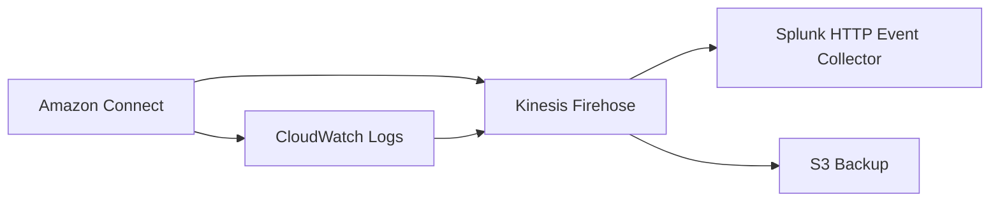

# Amazon Connect Implementation Guide

A comprehensive guide for implementing Amazon Connect contact center with advanced routing, CRM integration, and analytics.

## Table of Contents
1. [Instance Setup](#instance-setup)
2. [Routing Configuration](#routing-configuration)
3. [Queue Management](#queue-management)
4. [Agent Configuration](#agent-configuration)
5. [Contact Flows](#contact-flows)
6. [CRM Integration](#crm-integration)
7. [Analytics and Insights](#analytics-and-insights)
8. [Monitoring Setup](#monitoring-setup)

## Instance Setup

### Create Amazon Connect Instance
```hcl
module "connect_instance" {
  source         = "./modules/connect_instance"
  instance_alias = "my-contact-center"
  region         = "us-west-2"
}
```

### Telephony Configuration
- VoIP Configuration
- Carrier Integration (if applicable)
- Phone Number Assignment

## Routing Configuration

### Routing Profiles
```hcl
resource "aws_connect_routing_profile" "main" {
  instance_id     = module.connect_instance.id
  name            = "standard-routing"
  description     = "Standard agent routing profile"
  default_outbound_queue_id = aws_connect_queue.outbound.id
}
```

### Skills Configuration
- Voice Support
- Chat Support
- Technical Skills
- Language Proficiency

## Queue Management

### Inbound Queues
```hcl
resource "aws_connect_queue" "voice" {
  instance_id = module.connect_instance.id
  name        = "voice-queue"
  description = "Main voice queue"
  hours_of_operation_id = aws_connect_hours_of_operation.main.id
}
```

### Queue Types
1. Voice Queues
   - voice1 (General Support)
   - voice2 (Technical Support)
   - voice3 (Premium Support)

2. Chat Queues
   - chat1 (General Inquiries)
   - chat2 (Technical Chat)
   - chat3 (Sales Chat)

3. Outbound Queues
   - outvoice1 (Follow-up Calls)
   - outvoice2 (Campaign Calls)

## Agent Configuration

### Agent Groups
```hcl
resource "aws_connect_user_hierarchy_group" "support" {
  instance_id = module.connect_instance.id
  name        = "support-team"
  parent_group_id = aws_connect_user_hierarchy_group.root.id
}
```

### Group Structure
- Tier 1 Support
- Tier 2 Support
- Sales Team
- Technical Specialists

## Contact Flows

### Basic Flow Structure
```json
{
  "Version": "2019-10-30",
  "StartAction": "12345678-1234-1234-1234-123456789012",
  "Actions": [
    {
      "Identifier": "12345678-1234-1234-1234-123456789012",
      "Type": "TransferToQueue",
      "Parameters": {
        "QueueId": "${aws_connect_queue.voice.id}"
      }
    }
  ]
}
```

### Flow Types
1. Inbound Voice
2. Customer Queue
3. Agent Whisper
4. Transfer Flow
5. Quick Connect

## CRM Integration

### Salesforce Integration
```hcl
module "salesforce_integration" {
  source = "./modules/salesforce"
  connect_instance_id = module.connect_instance.id
  salesforce_instance_url = var.salesforce_url
  salesforce_credentials = var.sf_credentials
}
```

### Integration Features
- Contact Lookup
- Case Creation
- Activity Logging
- Screen Pop

## Analytics and Insights

### Contact Lens Configuration
```hcl
resource "aws_connect_instance_storage_config" "contact_lens" {
  instance_id   = module.connect_instance.id
  resource_type = "CONTACT_TRACE_RECORDS"
  storage_config {
    storage_type = "KINESIS_FIREHOSE"
    kinesis_firehose_config {
      firehose_arn = aws_kinesis_firehose_delivery_stream.main.arn
    }
  }
}
```

### Analytics Features
- Call Recording Analysis
- Sentiment Analysis
- Conversation Analytics
- Performance Metrics

## Monitoring Setup

### CloudWatch Dashboard
```hcl
resource "aws_cloudwatch_dashboard" "connect" {
  dashboard_name = "connect-monitoring"
  dashboard_body = jsonencode({
    widgets = [
      {
        type = "metric"
        properties = {
          metrics = [
            ["AWS/Connect", "ContactsHandled"],
            ["AWS/Connect", "ContactsAbandoned"]
          ]
          period = 300
          stat   = "Sum"
        }
      }
    ]
  })
}
```

### Monitoring Components
1. Real-time Metrics
   - Queue Length
   - Handle Time
   - Abandonment Rate

2. Historical Analytics
   - Call Volume Trends
   - Agent Performance
   - Service Level Adherence

3. Alert Configuration
   - Queue Thresholds
   - Service Level Breaches
   - System Health

## Implementation Steps

1. Instance Setup
   - Create Connect instance
   - Configure telephony settings
   - Set up basic security

2. Routing Configuration
   - Create routing profiles
   - Define skills
   - Set up queues

3. Agent Setup
   - Create agent groups
   - Assign skills
   - Configure permissions

4. Contact Flow Design
   - Create basic flows
   - Set up transfers
   - Configure IVR

5. Integration Setup
   - Configure CRM connection
   - Set up data sync
   - Test integration

6. Analytics Configuration
   - Enable Contact Lens
   - Set up dashboards
   - Configure alerts

## Best Practices

1. Security
   - Use IAM roles
   - Implement least privilege
   - Regular audits

2. Performance
   - Monitor queue metrics
   - Optimize routing
   - Regular flow reviews

3. Maintenance
   - Regular backups
   - Version control
   - Documentation updates

## Troubleshooting

Common Issues:
1. Queue Routing
   - Check routing profiles
   - Verify agent availability
   - Review queue priorities

2. Integration
   - Validate credentials
   - Check API limits
   - Monitor latency

3. Performance
   - Review CloudWatch metrics
   - Check resource utilization
   - Analyze error logs

## Splunk Integration

### Overview
Configure Amazon Connect to forward Contact Detail Records (CDR) and Contact Control Panel (CCP) data to Splunk for advanced logging and analysis.

### Architecture


### Kinesis Firehose Configuration
```hcl
resource "aws_kinesis_firehose_delivery_stream" "splunk_stream" {
  name        = "connect-to-splunk"
  destination = "http_endpoint"

  http_endpoint_configuration {
    url                = var.splunk_hec_url
    name              = "Splunk"
    access_key        = var.splunk_hec_token
    buffering_size    = 5
    buffering_interval = 300
    retry_duration    = 300
    
    request_configuration {
      content_encoding = "GZIP"
    }

    s3_backup_mode = "FailedDataOnly"
  }

  s3_configuration {
    role_arn   = aws_iam_role.firehose_role.arn
    bucket_arn = aws_s3_bucket.backup_bucket.arn
    prefix     = "connect/failed-events/"
  }
}
```

### Contact Trace Records (CTR) Configuration
```hcl
resource "aws_connect_instance_storage_config" "ctr_config" {
  instance_id   = var.connect_instance_id
  resource_type = "CONTACT_TRACE_RECORDS"
  
  storage_config {
    storage_type = "KINESIS_FIREHOSE"
    kinesis_firehose_config {
      firehose_arn = aws_kinesis_firehose_delivery_stream.splunk_stream.arn
    }
  }
}
```

### CCP Logging Configuration
```hcl
resource "aws_cloudwatch_log_group" "ccp_logs" {
  name              = "/aws/connect/${var.connect_instance_id}/ccp"
  retention_in_days = 30
}

resource "aws_cloudwatch_log_subscription_filter" "ccp_to_firehose" {
  name            = "ccp-to-splunk"
  log_group_name  = aws_cloudwatch_log_group.ccp_logs.name
  filter_pattern  = ""
  destination_arn = aws_kinesis_firehose_delivery_stream.splunk_stream.arn
  role_arn        = aws_iam_role.cloudwatch_to_firehose.arn
}
```

### Splunk HEC Setup
1. Create HEC Token:
   ```bash
   curl -X POST https://your-splunk-instance:8088/services/collector/token \
     -H "Authorization: Bearer your-admin-token" \
     -d '{"name": "connect-hec", "index": "connect_logs"}'
   ```

2. Configure HEC Settings:
   ```bash
   curl -X POST https://your-splunk-instance:8088/services/collector/settings \
     -H "Authorization: Bearer your-admin-token" \
     -d '{"enableSSL": true, "disabled": false}'
   ```

### Data Types Logged

1. Contact Detail Records
   - Contact ID
   - Agent Information
   - Queue Details
   - Duration Metrics
   - Contact Attributes
   - Routing Information

2. CCP Events
   - Agent State Changes
   - Contact State Changes
   - System Events
   - Error Events
   - Performance Metrics

### Splunk Dashboards

1. Agent Performance Dashboard
```xml
<dashboard>
  <label>Connect Agent Performance</label>
  <row>
    <panel>
      <title>Contact Duration by Agent</title>
      <chart>
        <search>
          <query>index="connect_logs" sourcetype="connect:ctr" 
          | stats avg(duration) by agent_username</query>
        </search>
        <option name="charting.chart">bar</option>
      </chart>
    </panel>
  </row>
</dashboard>
```

2. Queue Metrics Dashboard
```xml
<dashboard>
  <label>Connect Queue Metrics</label>
  <row>
    <panel>
      <title>Queue Wait Times</title>
      <chart>
        <search>
          <query>index="connect_logs" sourcetype="connect:ctr" 
          | stats avg(queue_duration) by queue_name</query>
        </search>
        <option name="charting.chart">line</option>
      </chart>
    </panel>
  </row>
</dashboard>
```

### Splunk Alerts

1. Long Queue Time Alert
```xml
<saved>
  <search>
    <query>index="connect_logs" sourcetype="connect:ctr" queue_duration > 300
    | stats count by queue_name</query>
    <alert>
      <condition>
        <count>10</count>
      </condition>
      <actions>
        <email>
          <to>alerts@example.com</to>
          <subject>High Queue Time Alert</subject>
        </email>
      </actions>
    </alert>
  </search>
</saved>
```

### Maintenance and Troubleshooting

1. Monitor Firehose Delivery
```bash
aws firehose describe-delivery-stream \
  --delivery-stream-name connect-to-splunk \
  --region us-west-2
```

2. Check Failed Deliveries
```bash
aws s3 ls s3://backup-bucket/connect/failed-events/ \
  --recursive \
  --human-readable \
  --summarize
```

3. Validate HEC Connection
```bash
curl -k https://your-splunk-instance:8088/services/collector/health \
  -H "Authorization: Bearer your-hec-token"
```

### Best Practices

1. Data Management
   - Set appropriate retention periods
   - Configure data rollover policies
   - Implement data backup strategy

2. Performance Optimization
   - Adjust buffer sizes based on volume
   - Monitor Firehose performance
   - Scale HEC capacity as needed

3. Security
   - Use TLS for data transmission
   - Rotate HEC tokens regularly
   - Implement least privilege access

## Support and Resources

- AWS Documentation
- Connect Forums
- AWS Support
- Community Resources
- Splunk Documentation
- Splunk Connect for AWS