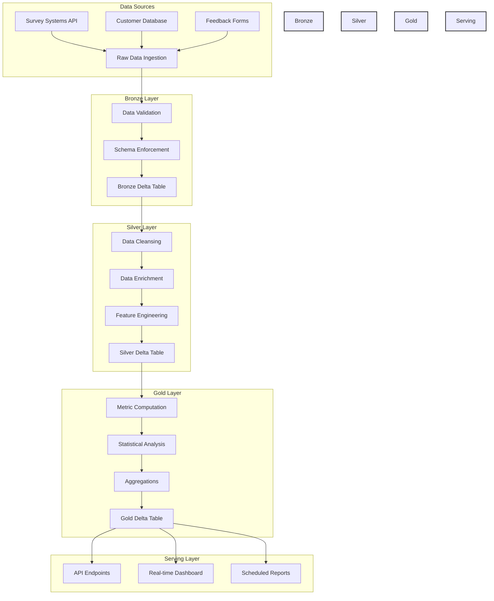

# Customer Experience Analytics Data Pipeline

## Project Structure

```
cx-analytics-pipeline/
├── databricks/
│   ├── notebooks/
│   │   ├── ingestion/
│   │   │   ├── survey_ingestion.py
│   │   │   ├── customer_db_ingestion.py
│   │   │   └── feedback_forms_ingestion.py
│   │   ├── processing/
│   │   │   ├── data_validation.py
│   │   │   ├── data_cleansing.py
│   │   │   └── feature_engineering.py
│   │   ├── analytics/
│   │   │   ├── metric_computation.py
│   │   │   ├── statistical_analysis.py
│   │   │   └── trend_analysis.py
│   │   └── monitoring/
│   │       ├── data_quality_checks.py
│   │       ├── performance_monitoring.py
│   │       └── alert_system.py
│   ├── jobs/
│   │   ├── bronze_layer_job.json
│   │   ├── silver_layer_job.json
│   │   └── gold_layer_job.json
│   └── config/
│       ├── spark_config.json
│       ├── schema_definitions.py
│       └── monitoring_config.json
├── delta_tables/
│   ├── bronze/
│   │   ├── surveys/
│   │   ├── customer_data/
│   │   └── feedback/
│   ├── silver/
│   │   ├── cleaned_surveys/
│   │   ├── enriched_customer_data/
│   │   └── features/
│   └── gold/
│       ├── metrics/
│       ├── trends/
│       └── aggregations/
├── tests/
│   ├── unit/
│   │   ├── test_data_validation.py
│   │   ├── test_cleansing.py
│   │   └── test_metrics.py
│   └── integration/
│       ├── test_pipeline_flow.py
│       └── test_data_quality.py
├── api/
│   ├── endpoints/
│   │   ├── metrics_api.py
│   │   ├── trends_api.py
│   │   └── reports_api.py
│   └── swagger/
│       └── api_spec.yaml
├── docs/
│   ├── architecture/
│   │   ├── pipeline_overview.md
│   │   └── data_flow.md
│   ├── deployment/
│   │   ├── setup_guide.md
│   │   └── configuration.md
│   └── monitoring/
│       ├── alerts_guide.md
│       └── metrics_definition.md
├── scripts/
│   ├── deployment/
│   │   ├── deploy_jobs.sh
│   │   └── setup_clusters.sh
│   └── maintenance/
│       ├── backup_tables.sh
│       └── optimize_tables.sh
├── requirements.txt
├── setup.py
└── README.md
```

## Directory Structure Overview

### 1. databricks/
- **notebooks/**: Contains all Databricks notebooks organized by pipeline stage
- **jobs/**: Job definitions for each layer of the medallion architecture
- **config/**: Configuration files for Spark, schemas, and monitoring

### 2. delta_tables/
- Organized following the medallion architecture (Bronze, Silver, Gold)
- Each layer contains subdirectories for different data categories

### 3. tests/
- **unit/**: Unit tests for individual components
- **integration/**: End-to-end pipeline tests

### 4. api/
- **endpoints/**: API implementation for different data access patterns
- **swagger/**: API documentation and specifications

### 5. docs/
- Comprehensive documentation organized by topic
- Includes architecture diagrams, deployment guides, and monitoring setup

### 6. scripts/
- Automation scripts for deployment and maintenance tasks

## Architecture Overview

This data pipeline processes customer experience survey data using Apache Spark on Databricks, implementing a robust ETL process with data quality checks, transformations, and analytics computations.

## Pipeline DAG



## Implementation Details

### 1. Data Ingestion (Bronze Layer)

```python
# Databricks notebook: 01_data_ingestion

from pyspark.sql import SparkSession
from pyspark.sql.functions import *
from pyspark.sql.types import *

# Define schema for survey data
survey_schema = StructType([
    StructField("response_id", StringType(), False),
    StructField("timestamp", TimestampType(), False),
    StructField("customer_id", StringType(), False),
    StructField("satisfaction_score", IntegerType(), True),
    StructField("nps_score", IntegerType(), True),
    StructField("feedback_text", StringType(), True),
    StructField("survey_type", StringType(), True),
    StructField("channel", StringType(), True)
])

def ingest_survey_data():
    # Read from various sources
    survey_df = spark.read.format("json") \
        .schema(survey_schema) \
        .load("/mnt/survey-data/")
    
    # Write to Delta Lake bronze table
    survey_df.write \
        .format("delta") \
        .mode("append") \
        .save("/mnt/delta/bronze/surveys")

# COMMAND ----------
# Schedule job
dbutils.notebook.run("01_data_ingestion", 600, {})
```

### 2. Data Processing (Silver Layer)

```python
# Databricks notebook: 02_data_processing

def clean_survey_data():
    # Read from bronze layer
    bronze_df = spark.read.format("delta").load("/mnt/delta/bronze/surveys")
    
    # Clean and transform data
    silver_df = bronze_df \
        .dropDuplicates(["response_id"]) \
        .filter(col("satisfaction_score").isNotNull()) \
        .withColumn("processed_timestamp", current_timestamp()) \
        .withColumn("satisfaction_category", 
            when(col("satisfaction_score") >= 8, "High")
            .when(col("satisfaction_score") >= 5, "Medium")
            .otherwise("Low"))
    
    # Write to silver layer
    silver_df.write \
        .format("delta") \
        .mode("append") \
        .save("/mnt/delta/silver/surveys")

# Add data quality checks
def validate_data_quality(df):
    # Check for nulls in critical columns
    null_checks = df.select([
        count(when(col(c).isNull(), c)).alias(c)
        for c in ["customer_id", "satisfaction_score", "nps_score"]
    ])
    
    # Check for score ranges
    range_checks = df.select(
        count(when((col("satisfaction_score") < 0) | 
                  (col("satisfaction_score") > 10), True)).alias("invalid_satisfaction"),
        count(when((col("nps_score") < 0) | 
                  (col("nps_score") > 10), True)).alias("invalid_nps")
    )
    
    return null_checks, range_checks
```

### 3. Analytics Computation (Gold Layer)

```python
# Databricks notebook: 03_analytics_computation

from pyspark.sql.window import Window

def compute_analytics():
    # Read from silver layer
    silver_df = spark.read.format("delta").load("/mnt/delta/silver/surveys")
    
    # Calculate key metrics
    metrics_df = silver_df.groupBy("survey_type") \
        .agg(
            avg("satisfaction_score").alias("avg_satisfaction"),
            avg("nps_score").alias("avg_nps"),
            count("*").alias("response_count"),
            approx_count_distinct("customer_id").alias("unique_customers")
        )
    
    # Calculate trending metrics
    window_spec = Window.orderBy("timestamp") \
        .rowsBetween(-6, 0)  # 7-day rolling window
    
    trending_df = silver_df \
        .withColumn("rolling_avg_satisfaction", 
                   avg("satisfaction_score").over(window_spec)) \
        .withColumn("rolling_avg_nps",
                   avg("nps_score").over(window_spec))
    
    # Write to gold layer
    metrics_df.write \
        .format("delta") \
        .mode("overwrite") \
        .save("/mnt/delta/gold/metrics")
    
    trending_df.write \
        .format("delta") \
        .mode("overwrite") \
        .save("/mnt/delta/gold/trends")
```

### 4. API Integration (Serving Layer)

```python
# Databricks notebook: 04_api_endpoints

from flask import Flask, jsonify
from pyspark.sql import SparkSession

app = Flask(__name__)

@app.route('/api/metrics/summary')
def get_metrics_summary():
    metrics_df = spark.read.format("delta").load("/mnt/delta/gold/metrics")
    return jsonify(metrics_df.toPandas().to_dict('records'))

@app.route('/api/metrics/trends')
def get_metrics_trends():
    trends_df = spark.read.format("delta").load("/mnt/delta/gold/trends")
    return jsonify(trends_df.toPandas().to_dict('records'))
```

## Deployment Configuration

### Databricks Job Configuration

```json
{
  "name": "CX_Analytics_Pipeline",
  "email_notifications": {
    "on_failure": ["data-team@company.com"]
  },
  "schedule": {
    "quartz_cron_expression": "0 0 * * * ?",
    "timezone_id": "UTC"
  },
  "tasks": [
    {
      "task_key": "ingest_data",
      "notebook_task": {
        "notebook_path": "/Shared/CX_Analytics/01_data_ingestion",
        "base_parameters": {}
      },
      "timeout_seconds": 600
    },
    {
      "task_key": "process_data",
      "notebook_task": {
        "notebook_path": "/Shared/CX_Analytics/02_data_processing",
        "base_parameters": {}
      },
      "depends_on": [
        {"task_key": "ingest_data"}
      ]
    },
    {
      "task_key": "compute_analytics",
      "notebook_task": {
        "notebook_path": "/Shared/CX_Analytics/03_analytics_computation",
        "base_parameters": {}
      },
      "depends_on": [
        {"task_key": "process_data"}
      ]
    }
  ]
}
```

## Data Quality Monitoring

```python
# Databricks notebook: monitoring/data_quality_checks

def monitor_data_quality():
    metrics = {
        "null_rates": {},
        "invalid_scores": {},
        "processing_latency": {},
        "record_counts": {}
    }
    
    # Monitor each layer
    for layer in ["bronze", "silver", "gold"]:
        df = spark.read.format("delta").load(f"/mnt/delta/{layer}/surveys")
        
        # Calculate quality metrics
        null_rates = calculate_null_rates(df)
        invalid_scores = validate_score_ranges(df)
        latency = calculate_processing_latency(df)
        record_counts = df.count()
        
        # Store metrics
        metrics["null_rates"][layer] = null_rates
        metrics["invalid_scores"][layer] = invalid_scores
        metrics["processing_latency"][layer] = latency
        metrics["record_counts"][layer] = record_counts
    
    return metrics
```

## Performance Optimization

1. **Partition Strategy**
```python
# Optimize for time-based queries
df.write \
    .format("delta") \
    .partitionBy("year", "month") \
    .save("/mnt/delta/surveys")
```

2. **Cache Management**
```python
# Cache frequently accessed data
spark.sql("CACHE TABLE daily_metrics")
spark.sql("CACHE TABLE customer_segments")
```

3. **Optimization Settings**
```python
# Spark configuration for optimal performance
spark.conf.set("spark.sql.adaptive.enabled", "true")
spark.conf.set("spark.sql.adaptive.coalescePartitions.enabled", "true")
spark.conf.set("spark.sql.shuffle.partitions", "200")
```

## Monitoring and Alerting

1. **Metrics Collection**
- Processing time per stage
- Record counts per layer
- Error rates and types
- Data quality scores

2. **Alert Configuration**
```python
def send_alert(metric_name, threshold, current_value):
    if current_value > threshold:
        send_notification(
            subject=f"Alert: {metric_name} exceeded threshold",
            body=f"Current value: {current_value}, Threshold: {threshold}"
        )
```

## Security Configuration

1. **Access Control**
```sql
-- Set up access control for different user groups
GRANT SELECT ON delta.`/mnt/delta/gold/metrics` TO group_analytics_users;
GRANT ALL PRIVILEGES ON delta.`/mnt/delta/bronze/` TO group_data_engineers;
```

2. **Encryption Configuration**
```python
# Enable encryption for sensitive data
spark.conf.set("spark.sql.encryption.enabled", "true")
spark.conf.set("spark.sql.encryption.masterKeyName", "data-key")
```

## Disaster Recovery

1. **Backup Configuration**
```python
# Schedule regular backups
def backup_delta_tables():
    for layer in ["bronze", "silver", "gold"]:
        spark.sql(f"""
            COPY INTO 'dbfs:/mnt/backup/{layer}'
            FROM 'dbfs:/mnt/delta/{layer}'
            COPY_OPTIONS ('type' = 'full')
        """)
```

2. **Recovery Procedures**
```python
def restore_from_backup(layer, timestamp):
    spark.sql(f"""
        RESTORE TABLE delta.`/mnt/delta/{layer}`
        TO TIMESTAMP AS OF '{timestamp}'
    """)
```
