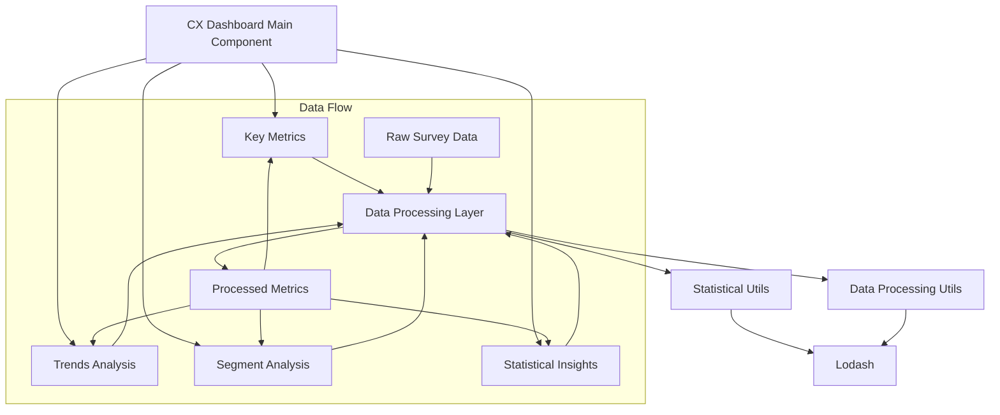

# Customer Experience Survey Analytics Dashboard

A modern, interactive dashboard built with React for analyzing customer experience survey data. This tool provides data scientists with powerful analytics capabilities including trend analysis, segmentation, and statistical insights.

## Project Structure

```
cx-analytics-dashboard/
├── src/
│   ├── components/
│   │   ├── dashboard/
│   │   │   ├── CXDashboard.jsx
│   │   │   ├── KeyMetrics.jsx
│   │   │   ├── TrendsChart.jsx
│   │   │   ├── SegmentAnalysis.jsx
│   │   │   └── StatisticalInsights.jsx
│   │   └── ui/
│   │       ├── card/
│   │       └── alert/
│   ├── utils/
│   │   ├── statistics.js
│   │   └── dataProcessing.js
│   ├── hooks/
│   │   └── useMetrics.js
│   └── App.jsx
├── public/
├── package.json
└── README.md
```

## Architecture



## Prerequisites

- Node.js (v16.0.0 or higher)
- npm (v7.0.0 or higher)
- Basic understanding of React and statistical analysis

## Installation Steps

1. **Create a New React Project**
   ```bash
   npx create-next-app cx-analytics-dashboard
   cd cx-analytics-dashboard
   ```

2. **Install Dependencies**
   ```bash
   npm install lodash recharts @radix-ui/react-alert @radix-ui/react-card
   npm install -D tailwindcss postcss autoprefixer
   ```

3. **Initialize Tailwind CSS**
   ```bash
   npx tailwindcss init -p
   ```

4. **Add Required shadcn/ui Components**
   ```bash
   npx shadcn-ui@latest init
   npx shadcn-ui@latest add card
   npx shadcn-ui@latest add alert
   ```

5. **Project Setup**

   Create the following directory structure:
   ```bash
   mkdir -p src/components/dashboard src/utils src/hooks
   ```

6. **Implementation Steps**

   a. Create Statistical Utilities (src/utils/statistics.js):
   ```javascript
   import _ from 'lodash';

   export const calculateStandardDeviation = (values) => {
     const mean = _.mean(values);
     const squareDiffs = _.map(values, value => Math.pow(value - mean, 2));
     return Math.sqrt(_.mean(squareDiffs));
   };

   export const calculateCorrelation = (x, y) => {
     // Implement correlation calculation
   };
   ```

   b. Create Data Processing Utilities (src/utils/dataProcessing.js):
   ```javascript
   import _ from 'lodash';

   export const processMetrics = (data) => {
     return {
       nps: calculateNPS(data),
       csat: calculateCSAT(data),
       ces: calculateCES(data)
     };
   };
   ```

   c. Implement Custom Hook (src/hooks/useMetrics.js):
   ```javascript
   import { useState, useMemo } from 'react';
   import { processMetrics } from '../utils/dataProcessing';

   export const useMetrics = (data) => {
     return useMemo(() => processMetrics(data), [data]);
   };
   ```

   d. Create Dashboard Components:
   - Create separate components for each dashboard section
   - Implement data processing and visualization logic
   - Add interactive features and filters

7. **Component Integration**

   In your main App.jsx:
   ```javascript
   import { CXDashboard } from './components/dashboard/CXDashboard';

   function App() {
     return (
       <div className="container mx-auto p-4">
         <CXDashboard />
       </div>
     );
   }
   ```

## Features

1. **Key Metrics Display**
   - Net Promoter Score (NPS)
   - Customer Satisfaction Score (CSAT)
   - Customer Effort Score (CES)
   - Response Volume Tracking


2. **Trends Analysis**
   - Time series visualization
   - Multi-metric comparison
   - Customizable time ranges

3. **Segment Analysis**
   - Customer segmentation
   - Comparative metrics
   - Response distribution

4. **Statistical Insights**
   - Correlation analysis
   - Standard deviation calculations
   - Percentile rankings

## Data Processing Pipeline

1. **Data Ingestion**
   - Load survey response data
   - Validate data structure
   - Handle missing values

2. **Metric Calculation**
   - Calculate core metrics (NPS, CSAT, CES)
   - Generate trend data
   - Compute statistical measures

3. **Visualization**
   - Transform data for charts
   - Apply filtering and aggregation
   - Generate visual components

## Best Practices

1. **Performance Optimization**
   - Use memoization for expensive calculations
   - Implement lazy loading for charts
   - Optimize data processing with Lodash

2. **Code Organization**
   - Maintain separation of concerns
   - Use custom hooks for data processing
   - Implement proper error handling

3. **State Management**
   - Use appropriate React hooks
   - Implement proper data flow
   - Handle loading and error states

## Advanced Usage

### Custom Metrics
To add custom metrics, extend the metrics calculation in `src/utils/dataProcessing.js`:

```javascript
export const calculateCustomMetric = (data, params) => {
  // Implement custom metric calculation
};
```

### Data Export
Implement data export functionality:

```javascript
export const exportMetrics = (data, format = 'csv') => {
  // Implement export logic
};
```

## Troubleshooting

Common issues and solutions:

1. **Performance Issues**
   - Implement pagination for large datasets
   - Use windowing for long lists
   - Optimize chart rendering

2. **Data Processing Errors**
   - Validate data structure
   - Handle edge cases
   - Implement proper error boundaries

## Contributing

Guidelines for contributing to the project:

1. Fork the repository
2. Create a feature branch
3. Submit a pull request with detailed description
4. Follow code style guidelines
5. Include tests for new features

## License

MIT License - see LICENSE file for details
