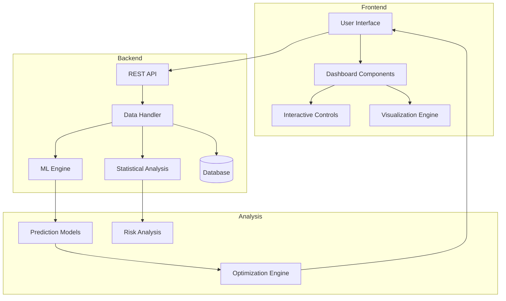

# Actuarial Data Science Dashboard

## Overview
This dashboard provides actuaries with a powerful interface to analyze, manipulate, and make predictions using insurance and risk-related data. The system integrates statistical modeling, machine learning, and traditional actuarial methods to support data-driven decision-making.

## Table of Contents
- [Features](#features)
- [System Architecture](#system-architecture)
- [Prerequisites](#prerequisites)
- [Installation](#installation)
- [Implementation Guide](#implementation-guide)
- [Data Integration](#data-integration)
- [Model Development](#model-development)
- [Dashboard Components](#dashboard-components)
- [Usage Guide](#usage-guide)
- [Maintenance](#maintenance)

## Features
- Interactive data visualization
- Risk modeling and analysis
- Claims prediction
- Portfolio optimization
- Reserve calculation
- Mortality/morbidity analysis
- Premium pricing support
- Real-time risk assessment

## System Architecture



## Prerequisites
- Python 3.9+
- R 4.0+ (for specific actuarial packages)
- PostgreSQL 13+
- Node.js 16+ (for frontend)

### Required Python Packages
```python
pandas>=1.4.0
numpy>=1.21.0
scikit-learn>=1.0.0
tensorflow>=2.8.0
plotly>=5.6.0
dash>=2.3.0
lifelines>=0.26.0
actuary>=1.2.0
```

## Installation

1. Clone the repository:
```bash
git clone https://github.com/your-org/actuarial-dashboard.git
cd actuarial-dashboard
```

2. Set up virtual environment:
```bash
python -m venv venv
source venv/bin/activate  # On Windows: .\venv\Scripts\activate
```

3. Install dependencies:
```bash
pip install -r requirements.txt
npm install  # for frontend dependencies
```

4. Configure database:
```bash
python scripts/setup_database.py
```

## Implementation Guide

### Step 1: Data Integration Setup

1. Configure data sources in `config/data_sources.yaml`:
```yaml
sources:
  claims_data:
    type: postgresql
    host: localhost
    database: insurance_data
    tables:
      - claims_history
      - policy_details
      - customer_info
  
  external_data:
    type: api
    endpoints:
      - mortality_tables
      - market_indices
```

2. Implement data connectors:
```python
class DataConnector:
    def __init__(self, config):
        self.config = config
        self.connections = {}
    
    def connect(self):
        for source, details in self.config['sources'].items():
            if details['type'] == 'postgresql':
                self.connections[source] = PostgresConnector(details)
            elif details['type'] == 'api':
                self.connections[source] = APIConnector(details)
```

### Step 2: Model Development

1. Create base prediction model:
```python
class ActuarialModel:
    def __init__(self):
        self.models = {
            'mortality': MortalityModel(),
            'claims': ClaimsPredictionModel(),
            'reserves': ReserveCalculationModel()
        }
    
    def train(self, data, model_type):
        model = self.models[model_type]
        model.fit(data)
        return model.get_metrics()
```

2. Implement specific models:
```python
class MortalityModel:
    def __init__(self):
        self.model = lifelines.CoxPHFitter()
        
    def fit(self, data):
        self.model.fit(
            data,
            duration_col='exposure_time',
            event_col='death_indicator'
        )
```

### Step 3: Dashboard Components

1. Set up main layout:
```python
app.layout = html.Div([
    dcc.Tabs([
        dcc.Tab(label='Data Analysis', children=[
            data_analysis_layout
        ]),
        dcc.Tab(label='Risk Modeling', children=[
            risk_modeling_layout
        ]),
        dcc.Tab(label='Predictions', children=[
            predictions_layout
        ])
    ])
])
```

2. Create interactive components:
```python
def create_analysis_controls():
    return html.Div([
        dcc.Dropdown(
            id='analysis-type',
            options=[
                {'label': 'Mortality Analysis', 'value': 'mortality'},
                {'label': 'Claims Prediction', 'value': 'claims'},
                {'label': 'Reserve Calculation', 'value': 'reserves'}
            ]
        ),
        dcc.DatePickerRange(
            id='date-range',
            start_date=date(2020, 1, 1),
            end_date=date.today()
        ),
        html.Button('Run Analysis', id='run-analysis-btn')
    ])
```

### Step 4: Analysis Implementation

1. Create analysis pipelines:
```python
class AnalysisPipeline:
    def __init__(self):
        self.data_connector = DataConnector()
        self.model = ActuarialModel()
        
    def run_analysis(self, analysis_type, parameters):
        data = self.data_connector.get_data(parameters)
        processed_data = self.preprocess(data)
        results = self.model.analyze(processed_data, analysis_type)
        return self.format_results(results)
```

2. Implement specific analyses:
```python
def mortality_analysis(data, parameters):
    analysis = MortalityAnalysis(parameters)
    return analysis.run(data)

def claims_prediction(data, parameters):
    model = ClaimsPredictionModel()
    return model.predict(data)
```

## Usage Guide

### Data Manipulation

1. Data Loading:
```python
# Load policy data
data_loader = DataLoader()
policy_data = data_loader.load_policies()

# Apply filters
filtered_data = data_loader.filter(
    policy_data,
    start_date='2020-01-01',
    end_date='2023-12-31',
    policy_type='life'
)
```

2. Feature Engineering:
```python
# Create derived features
features = FeatureEngine()
engineered_data = features.create_features(filtered_data)
```

### Running Predictions

1. Select model type:
```python
model_type = 'mortality'  # or 'claims', 'reserves'
```

2. Configure parameters:
```python
parameters = {
    'confidence_level': 0.95,
    'time_horizon': 12,
    'risk_factors': ['age', 'gender', 'smoking_status']
}
```

3. Execute prediction:
```python
predictor = Predictor(model_type)
results = predictor.predict(engineered_data, parameters)
```

## Maintenance

### Regular Updates

1. Update data sources:
```bash
python scripts/update_data_sources.py
```

2. Retrain models:
```bash
python scripts/retrain_models.py
```

### Performance Monitoring

1. Monitor prediction accuracy:
```python
monitor = ModelMonitor()
metrics = monitor.get_metrics()
```

2. Check system health:
```python
health_checker = HealthChecker()
status = health_checker.run_checks()
```

## Directory Structure
```
actuarial-dashboard/
├── frontend/
│   ├── src/
│   │   ├── components/
│   │   ├── pages/
│   │   └── utils/
│   └── public/
├── backend/
│   ├── models/
│   ├── analysis/
│   ├── data/
│   └── api/
├── config/
├── scripts/
├── tests/
└── docs/
```

## Contributing
Please read CONTRIBUTING.md for details on our code of conduct and the process for submitting pull requests.

## License
This project is licensed under the MIT License - see the LICENSE file for details.
