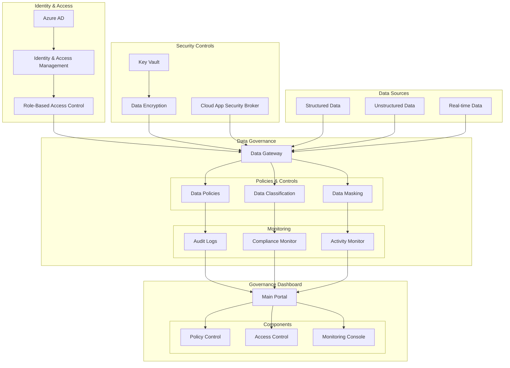

# Data Governance and Security Implementation Guide

A comprehensive guide for implementing data governance and security controls using Azure services.

## Table of Contents
- [Architecture Overview](#architecture-overview)
- [Directory Structure](#directory-structure)
- [Implementation Steps](#implementation-steps)
- [Configuration Guide](#configuration-guide)
- [Monitoring and Compliance](#monitoring-and-compliance)
- [Best Practices](#best-practices)

## Directory Structure

```
data_governance/
├── src/
│   ├── identity/
│   │   ├── __init__.py
│   │   ├── azure_ad.py          # Azure AD integration
│   │   ├── rbac.py              # Role-based access control
│   │   └── user_management.py   # User and group management
│   ├── security/
│   │   ├── __init__.py
│   │   ├── key_vault.py         # Key Vault operations
│   │   ├── encryption.py        # Data encryption services
│   │   └── secrets_manager.py   # Secrets management
│   ├── governance/
│   │   ├── __init__.py
│   │   ├── policies.py          # Data governance policies
│   │   ├── classification.py    # Data classification
│   │   └── masking.py          # Data masking rules
│   ├── monitoring/
│   │   ├── __init__.py
│   │   ├── audit_logger.py      # Audit logging
│   │   ├── activity_monitor.py  # Activity monitoring
│   │   └── compliance.py        # Compliance checking
│   └── dashboard/
│       ├── __init__.py
│       ├── app.py              # Main dashboard application
│       ├── routes/
│       │   ├── __init__.py
│       │   ├── main.py         # Main routes
│       │   ├── admin.py        # Admin routes
│       │   └── api.py          # API routes
│       └── templates/
│           ├── base.html
│           ├── dashboard.html
│           └── reports.html
├── config/
│   ├── key_vault/
│   │   ├── dev.yaml
│   │   └── prod.yaml
│   ├── classification/
│   │   ├── rules.yaml
│   │   └── patterns.yaml
│   ├── compliance/
│   │   ├── policies.yaml
│   │   └── requirements.yaml
│   └── monitoring/
│       ├── audit_config.yaml
│       └── alerts_config.yaml
├── tests/
│   ├── unit/
│   │   ├── test_encryption.py
│   │   ├── test_rbac.py
│   │   └── test_audit.py
│   └── integration/
│       ├── test_key_vault.py
│       ├── test_governance.py
│       └── test_monitoring.py
├── scripts/
│   ├── setup/
│   │   ├── init_key_vault.sh
│   │   ├── setup_ad.sh
│   │   └── configure_rbac.sh
│   └── maintenance/
│       ├── rotate_keys.sh
│       └── backup_config.sh
├── docs/
│   ├── architecture/
│   │   ├── security_design.md
│   │   └── data_flow.md
│   ├── deployment/
│   │   ├── key_vault_setup.md
│   │   └── rbac_setup.md
│   └── maintenance/
│       ├── backup_procedures.md
│       └── disaster_recovery.md
├── terraform/
│   ├── modules/
│   │   ├── key_vault/
│   │   ├── monitoring/
│   │   └── security/
│   ├── environments/
│   │   ├── dev/
│   │   └── prod/
│   └── variables.tf
├── requirements.txt
├── setup.py
└── README.md
```

The directory structure is organized into several key areas:

1. **src/**: Core implementation code
   - `identity/`: Azure AD and RBAC implementation
   - `security/`: Key Vault and encryption services
   - `governance/`: Data governance and classification
   - `monitoring/`: Audit logging and compliance monitoring
   - `dashboard/`: Governance dashboard implementation

2. **config/**: Configuration files
   - `key_vault/`: Key Vault configurations for different environments
   - `classification/`: Data classification rules and patterns
   - `compliance/`: Compliance policies and requirements
   - `monitoring/`: Audit and alert configurations

3. **tests/**: Test suites
   - `unit/`: Unit tests for individual components
   - `integration/`: Integration tests for system components

4. **scripts/**: Automation scripts
   - `setup/`: Initial setup and configuration scripts
   - `maintenance/`: Maintenance and operation scripts

5. **docs/**: Documentation
   - `architecture/`: System design and architecture docs
   - `deployment/`: Deployment and setup guides
   - `maintenance/`: Maintenance procedures

6. **terraform/**: Infrastructure as Code
   - `modules/`: Reusable Terraform modules
   - `environments/`: Environment-specific configurations

## Architecture Overview



## Implementation Steps

### 1. Azure AD and IAM Setup

```powershell
# Azure AD Configuration
# Create Security Groups
az ad group create --display-name "Data Admins" --mail-nickname "dataadmins"
az ad group create --display-name "Data Analysts" --mail-nickname "dataanalysts"

# Assign Roles
az role assignment create \
    --role "Data Governance Admin" \
    --assignee-object-id "" \
    --scope "/subscriptions/"
```

### 2. Key Vault Setup and Integration

```python
# Key Vault Integration Code
from azure.identity import DefaultAzureCredential
from azure.keyvault.secrets import SecretClient

class KeyVaultManager:
    def __init__(self, vault_url):
        self.credential = DefaultAzureCredential()
        self.client = SecretClient(vault_url=vault_url, credential=self.credential)

    def get_secret(self, secret_name):
        return self.client.get_secret(secret_name)

    def set_secret(self, secret_name, secret_value):
        return self.client.set_secret(secret_name, secret_value)

    def rotate_key(self, key_name):
        # Key rotation logic
        pass
```

### 3. Data Encryption Implementation

```python
# Data Encryption Service
from cryptography.fernet import Fernet
from azure.storage.blob import BlobServiceClient

class DataEncryptionService:
    def __init__(self, key_vault_manager):
        self.key_vault_manager = key_vault_manager
        self.encryption_key = self.key_vault_manager.get_secret("encryption-key")

    def encrypt_data(self, data):
        f = Fernet(self.encryption_key)
        return f.encrypt(data.encode())

    def encrypt_blob(self, container_name, blob_name, data):
        encrypted_data = self.encrypt_data(data)
        blob_service_client = BlobServiceClient.from_connection_string(
            self.key_vault_manager.get_secret("storage-connection-string")
        )
        blob_client = blob_service_client.get_blob_client(
            container=container_name, 
            blob=blob_name
        )
        blob_client.upload_blob(encrypted_data, overwrite=True)
```

### 4. Role-Based Access Control Setup

```python
# RBAC Configuration
class RBACManager:
    def __init__(self):
        self.roles = {
            'data_admin': {
                'permissions': ['read', 'write', 'delete', 'manage'],
                'scope': 'all'
            },
            'data_analyst': {
                'permissions': ['read'],
                'scope': 'analytics_data'
            }
        }

    def assign_role(self, user_id, role_name):
        if role_name in self.roles:
            # Assign role using Azure AD Graph API
            pass

    def check_permission(self, user_id, action, resource):
        # Check permissions using Azure AD
        pass
```

### 5. Audit Logging Implementation

```python
# Audit Logging Service
from azure.monitor import MonitorClient
import logging

class AuditLogger:
    def __init__(self, workspace_id):
        self.workspace_id = workspace_id
        self.monitor_client = MonitorClient()

    def log_activity(self, user_id, action, resource, status):
        log_entry = {
            'timestamp': datetime.utcnow().isoformat(),
            'user_id': user_id,
            'action': action,
            'resource': resource,
            'status': status
        }
        self.monitor_client.write_logging_data(
            self.workspace_id,
            log_entry
        )

    def query_logs(self, start_time, end_time, filters=None):
        # Query logs using Log Analytics
        pass
```

### 6. Data Governance Dashboard Implementation

```python
# Dashboard Components
from flask import Flask, render_template
from azure.mgmt.monitor import MonitorManagementClient

class GovernanceDashboard:
    def __init__(self):
        self.app = Flask(__name__)
        self.monitor_client = MonitorManagementClient()

    def get_compliance_metrics(self):
        return {
            'data_classification': self.get_classification_metrics(),
            'encryption_status': self.get_encryption_metrics(),
            'access_control': self.get_access_metrics()
        }

    def get_activity_logs(self):
        return self.monitor_client.activity_logs.list(
            filter="timespan=last24h"
        )

    @app.route('/dashboard')
    def render_dashboard(self):
        metrics = self.get_compliance_metrics()
        logs = self.get_activity_logs()
        return render_template(
            'dashboard.html',
            metrics=metrics,
            logs=logs
        )
```

## Configuration Guide

### 1. Azure Key Vault Configuration

```yaml
# key-vault-config.yaml
key_vault:
  name: "governance-keyvault"
  sku: "standard"
  access_policies:
    - tenant_id: ""
      object_id: ""
      permissions:
        keys: ["get", "create", "delete", "list"]
        secrets: ["get", "set", "delete", "list"]
```

### 2. Data Classification Rules

```yaml
# classification-rules.yaml
classification_rules:
  - name: "PII Data"
    patterns:
      - type: "regex"
        pattern: "\b\d{3}-\d{2}-\d{4}\b"  # SSN
      - type: "regex"
        pattern: "\b[A-Za-z0-9._%+-]+@[A-Za-z0-9.-]+\.[A-Z|a-z]{2,}\b"  # Email
    actions:
      - "encrypt"
      - "mask"
      - "audit"
```

### 3. Compliance Settings

```yaml
# compliance-config.yaml
compliance:
  data_retention:
    pii_data: "7 years"
    financial_data: "5 years"
    general_data: "3 years"
  
  encryption:
    at_rest: true
    in_transit: true
    key_rotation: "90 days"
  
  audit:
    log_retention: "365 days"
    alert_thresholds:
      unauthorized_access: 5
      encryption_failures: 1
```

## Monitoring and Compliance

### 1. Compliance Monitoring Setup

```python
# Compliance Monitoring
class ComplianceMonitor:
    def __init__(self):
        self.rules = self.load_compliance_rules()

    def check_compliance(self, resource):
        violations = []
        for rule in self.rules:
            if not self.check_rule(resource, rule):
                violations.append({
                    'rule': rule.name,
                    'resource': resource.id,
                    'status': 'non-compliant'
                })
        return violations

    def generate_compliance_report(self):
        # Generate detailed compliance report
        pass
```

### 2. Activity Monitoring

```python
# Activity Monitor
class ActivityMonitor:
    def __init__(self, alert_manager):
        self.alert_manager = alert_manager

    def monitor_activity(self, activity_log):
        if self.is_suspicious(activity_log):
            self.alert_manager.raise_alert(
                level='high',
                message=f'Suspicious activity detected: {activity_log}'
            )

    def is_suspicious(self, activity_log):
        # Implement suspicious activity detection logic
        pass
```

## Best Practices

1. **Key Management**
   - Rotate encryption keys regularly
   - Use separate keys for different environments
   - Implement key backup and recovery procedures

2. **Access Control**
   - Follow principle of least privilege
   - Regular access reviews
   - Implement just-in-time access

3. **Monitoring**
   - Set up real-time alerts
   - Regular compliance audits
   - Maintain comprehensive audit logs

4. **Data Protection**
   - Classify data appropriately
   - Implement data masking
   - Regular backup and recovery testing

## Troubleshooting Guide

1. **Access Issues**
   - Check Azure AD group membership
   - Verify role assignments
   - Review access policies

2. **Encryption Problems**
   - Verify key vault access
   - Check encryption key status
   - Review encryption logs

3. **Compliance Alerts**
   - Review violation details
   - Check policy configurations
   - Verify monitoring settings

## Support

For issues and questions:
- Review Azure documentation
- Contact security team
- Check compliance documentation
- Monitor Azure Service Health

Remember to replace placeholder values with your actual Azure configuration before implementation.
