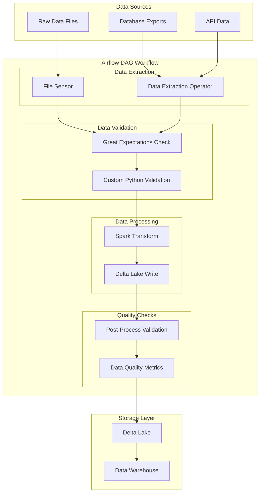

# Batch Processing with Apache Airflow

This component handles scheduled batch processing of large-scale data using Apache Airflow, integrating with Delta Lake for ACID transactions and Great Expectations for data quality validation.

## Table of Contents
- [Architecture Overview](#architecture-overview)
- [Directory Structure](#directory-structure)
- [Setup Instructions](#setup-instructions)
- [Implementation Guide](#implementation-guide)
- [Configuration](#configuration)
- [Monitoring and Maintenance](#monitoring-and-maintenance)

## Architecture Overview

The following diagram illustrates the batch processing workflow using Apache Airflow, showing data flow from sources through various processing stages to final storage:



The workflow consists of several key stages:

1. **Data Sources**: Multiple input sources including raw files, database exports, and API data
2. **Data Extraction**: File sensors and extraction operators to detect and fetch data
3. **Data Validation**: Initial quality checks using Great Expectations and custom validation rules
4. **Data Processing**: Transformation using Spark and writing to Delta Lake
5. **Quality Checks**: Post-processing validation and metrics collection
6. **Storage**: Final storage in Delta Lake and Data Warehouse

## Directory Structure

```
batch_processing/
├── dags/
│   ├── __init__.py
│   ├── batch_processor_dag.py
│   └── common/
│       ├── __init__.py
│       └── utils.py
├── operators/
│   ├── __init__.py
│   ├── data_validation.py
│   └── delta_lake.py
├── great_expectations/
│   ├── expectations/
│   │   └── batch_suite.json
│   └── validations/
├── spark/
│   ├── jobs/
│   │   └── transform.py
│   └── config/
│       └── spark-config.yml
├── tests/
│   ├── unit/
│   └── integration/
└── config/
    ├── airflow.cfg
    └── variables.json
```

## Setup Instructions

1. **Install Required Packages**
```bash
pip install apache-airflow apache-airflow-providers-apache-spark
pip install great-expectations delta-spark
```

2. **Configure Airflow Environment**
```bash
export AIRFLOW_HOME=/path/to/airflow
airflow db init
airflow users create --username admin --password admin --firstname Admin --lastname User --role Admin --email admin@example.com
```

3. **Setup Delta Lake**
```bash
# Install Delta Lake dependencies
pip install delta-spark

# Configure Spark with Delta Lake
export SPARK_HOME=/path/to/spark
export PYTHONPATH=$SPARK_HOME/python:$PYTHONPATH
```

## Implementation Guide

### 1. Scheduled Data Processing

```python
# dags/batch_processor_dag.py
from airflow import DAG
from airflow.operators.python import PythonOperator
from datetime import datetime, timedelta

default_args = {
    'owner': 'data_engineer',
    'depends_on_past': False,
    'start_date': datetime(2024, 2, 21),
    'email_on_failure': True,
    'retries': 3,
    'retry_delay': timedelta(minutes=5),
}

dag = DAG(
    'batch_processor',
    default_args=default_args,
    description='Batch data processing pipeline',
    schedule_interval='0 2 * * *',  # Run at 2 AM daily
    catchup=False
)

# Define tasks
extract_task = PythonOperator(
    task_id='extract_data',
    python_callable=extract_data,
    dag=dag
)
```

### 2. Data Validation with Great Expectations

```python
# operators/data_validation.py
from great_expectations.core import ExpectationSuite
from great_expectations.dataset import SparkDFDataset

def validate_data(df, suite_name):
    """
    Validate DataFrame using Great Expectations
    """
    dataset = SparkDFDataset(df)
    suite = ExpectationSuite(suite_name)
    
    # Add expectations
    suite.expect_column_values_to_not_be_null('id')
    suite.expect_column_values_to_be_unique('id')
    suite.expect_column_values_to_be_between('amount', 0, 1000000)
    
    # Run validation
    results = dataset.validate(suite)
    return results.success
```

### 3. Delta Lake Integration

```python
# operators/delta_lake.py
from delta.tables import DeltaTable
from pyspark.sql import SparkSession

def write_to_delta_lake(df, table_path):
    """
    Write DataFrame to Delta Lake with ACID guarantees
    """
    spark = SparkSession.builder \
        .config("spark.jars.packages", "io.delta:delta-core_2.12:1.0.0") \
        .config("spark.sql.extensions", "io.delta.sql.DeltaSparkSessionExtension") \
        .getOrCreate()

    df.write \
        .format("delta") \
        .mode("overwrite") \
        .save(table_path)
```

### 4. Parallel Processing Configuration

```python
# config/airflow.cfg
[celery]
worker_concurrency = 16

[scheduler]
max_threads = 4
```

## Configuration

1. **Airflow Variables**
```json
{
    "batch_source_path": "/data/source",
    "delta_lake_path": "/data/delta",
    "validation_threshold": 0.95
}
```

2. **Spark Configuration**
```yaml
# spark/config/spark-config.yml
spark.executor.instances: 5
spark.executor.cores: 4
spark.executor.memory: 8g
spark.driver.memory: 4g
```

## Example DAG Implementation

```python
# Complete DAG with all components
from airflow import DAG
from airflow.operators.python import PythonOperator
from operators.data_validation import validate_data
from operators.delta_lake import write_to_delta_lake

def process_batch():
    # Initialize Spark session
    spark = get_spark_session()
    
    # Extract data
    df = extract_data(spark)
    
    # Validate data
    if not validate_data(df, 'batch_suite'):
        raise ValueError("Data validation failed")
    
    # Transform data
    df_transformed = transform_data(df)
    
    # Write to Delta Lake
    write_to_delta_lake(df_transformed, '/data/delta/batch')

with DAG('batch_processor', ...) as dag:
    task_process = PythonOperator(
        task_id='process_batch',
        python_callable=process_batch
    )
```

## Monitoring and Maintenance

1. **Monitoring Metrics**
- Task success rate
- Processing duration
- Data quality scores
- Resource utilization

2. **Alerting Setup**
```python
default_args = {
    'email': ['alert@company.com'],
    'email_on_failure': True,
    'email_on_retry': False,
}
```

3. **Logging Configuration**
```python
import logging

logging.basicConfig(
    level=logging.INFO,
    format='%(asctime)s - %(name)s - %(levelname)s - %(message)s'
)
```

## Best Practices

1. **Data Quality**
- Always implement pre and post-validation checks
- Set appropriate thresholds for data quality metrics
- Document validation rules

2. **Performance**
- Use appropriate partitioning in Delta Lake
- Configure Spark resources based on data volume
- Monitor and tune parallel processing settings

3. **Error Handling**
- Implement proper retry mechanisms
- Set up comprehensive error notifications
- Maintain detailed error logs

4. **Security**
- Use Airflow connections for sensitive credentials
- Implement appropriate access controls
- Encrypt sensitive data

## Troubleshooting

Common issues and solutions:

1. **Task Failures**
- Check Airflow logs
- Verify resource availability
- Validate input data

2. **Performance Issues**
- Review Spark configurations
- Check data partitioning
- Monitor resource utilization

3. **Data Quality Failures**
- Review validation rules
- Check input data quality
- Verify transformation logic

## Support

For issues and questions:
- Check Airflow documentation
- Review Delta Lake guides
- Contact the data engineering team

Remember to replace placeholder values and paths with your actual project information before implementation.
