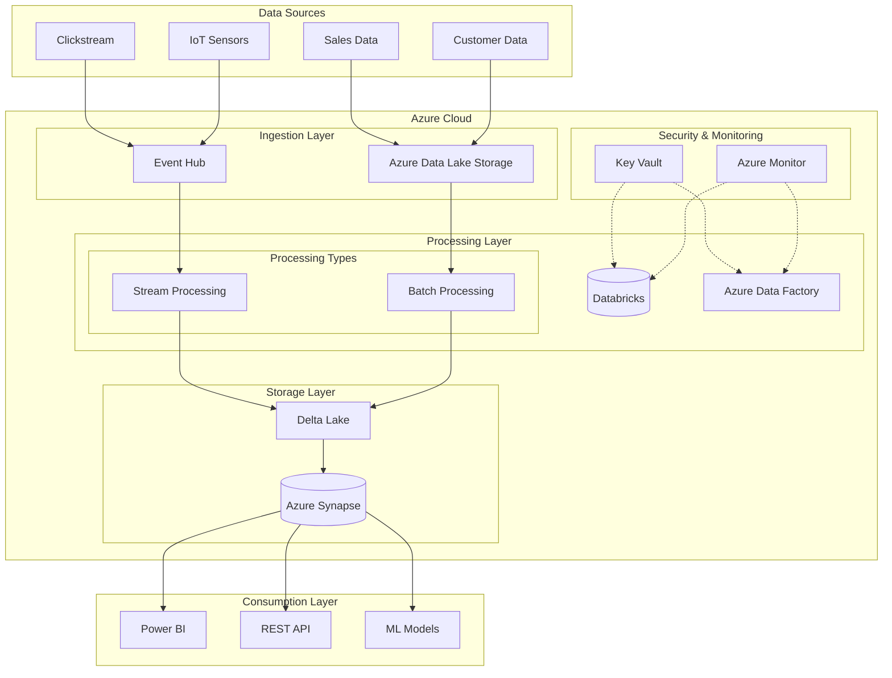

# Azure Data Pipeline Project

A scalable, secure, and robust data pipeline solution for processing terabytes of data using Azure cloud services. This project implements both batch and stream processing capabilities with industry-standard practices for data engineering.

## Table of Contents
- [Architecture Overview](#architecture-overview)
- [Features](#features)
- [Prerequisites](#prerequisites)
- [Project Structure](#project-structure)
- [Setup Instructions](#setup-instructions)
- [Configuration](#configuration)
- [Security](#security)
- [Development Guidelines](#development-guidelines)
- [Testing](#testing)
- [Deployment](#deployment)
- [Monitoring](#monitoring)
- [Troubleshooting](#troubleshooting)

## Architecture Overview



The architecture diagram above illustrates the high-level design of our data pipeline system. Key components include:

1. **Data Sources**: Multiple data sources including batch files and real-time streams
2. **Ingestion Layer**: Azure Event Hub and Data Lake Storage
3. **Processing Layer**: Databricks for both batch and stream processing
4. **Storage Layer**: Delta Lake and Azure Synapse
5. **Security Layer**: Azure Key Vault and monitoring solutions
6. **Consumption Layer**: Various data consumers including BI tools and APIs

## Features

- **Batch Processing**
  - Scheduled data processing
  - Data validation and quality checks
  - Delta Lake integration for ACID transactions
  - Parallel processing capabilities

- **Stream Processing**
  - Real-time data processing
  - Event-driven architecture
  - Checkpointing and fault tolerance
  - Low-latency processing

- **Security & Privacy**
  - Azure Key Vault integration
  - Data encryption at rest and in transit
  - Role-based access control
  - Audit logging
  - Compliance with data privacy requirements

- **Monitoring & Maintenance**
  - Comprehensive logging
  - Performance metrics
  - Alert system
  - Automated recovery procedures

## Prerequisites

1. **Azure Subscriptions and Services**
   - Azure Databricks workspace
   - Azure Storage Account
   - Azure Key Vault
   - Azure Event Hub (for streaming)

2. **Development Tools**
   - Python 3.8+
   - Terraform 1.0+
   - Git
   - Azure CLI
   - Visual Studio Code with Python extensions

3. **Authentication**
   - Azure Service Principal with appropriate permissions
   - Databricks access tokens

## Project Structure

```
project_root/
├── .github/
│   └── workflows/          # CI/CD pipeline configurations
├── src/
│   ├── batch_processing/   # Batch processing logic
│   ├── stream_processing/  # Stream processing logic
│   ├── common/            # Shared utilities
│   └── data_models/       # Data schemas and models
├── config/
│   ├── prod/             # Production configurations
│   └── dev/              # Development configurations
├── tests/
│   ├── unit/            # Unit tests
│   └── integration/     # Integration tests
├── notebooks/           # Databricks notebooks
├── deployment/          # Infrastructure as Code
├── docs/               # Documentation
└── requirements.txt    # Python dependencies
```

## Setup Instructions

1. **Clone the Repository**
   ```bash
   git clone https://github.com/your-org/data-pipeline.git
   cd data-pipeline
   ```

2. **Set Up Python Environment**
   ```bash
   python -m venv venv
   source venv/bin/activate  # On Windows: venv\Scripts\activate
   pip install -r requirements.txt
   ```

3. **Configure Azure Resources**
   ```bash
   cd deployment/terraform
   terraform init
   terraform plan
   terraform apply
   ```

4. **Set Up Environment Variables**
   ```bash
   export AZURE_TENANT_ID="your-tenant-id"
   export AZURE_CLIENT_ID="your-client-id"
   export AZURE_CLIENT_SECRET="your-client-secret"
   ```

5. **Deploy Databricks Resources**
   ```bash
   python deployment/databricks/deploy.py
   ```

## Configuration

1. **Environment Configuration**
   - Edit `config/{env}/config.yaml` for environment-specific settings
   - Configure data source connections
   - Set processing parameters

2. **Security Configuration**
   - Set up Azure Key Vault secrets
   - Configure RBAC permissions
   - Set up encryption keys

## Security

Security is implemented at multiple levels:

1. **Authentication**
   - Azure AD integration
   - Service Principal authentication
   - Managed Identities

2. **Data Protection**
   - Encryption at rest
   - Encryption in transit
   - Key rotation policies

3. **Access Control**
   - RBAC implementation
   - Least privilege principle
   - Regular access reviews

## Development Guidelines

1. **Code Standards**
   - Follow PEP 8 guidelines
   - Use type hints
   - Document all functions and classes
   - Write unit tests for new features

2. **Git Workflow**
   - Create feature branches from `develop`
   - Use meaningful commit messages
   - Submit PRs for review
   - Squash commits when merging

## Testing

1. **Unit Testing**
   ```bash
   pytest tests/unit
   ```

2. **Integration Testing**
   ```bash
   pytest tests/integration
   ```

3. **Performance Testing**
   ```bash
   python tests/performance/run_tests.py
   ```

## Deployment

1. **Development Deployment**
   ```bash
   make deploy-dev
   ```

2. **Production Deployment**
   ```bash
   make deploy-prod
   ```

## Monitoring

1. **Metrics Collection**
   - Processing latency
   - Data volume
   - Error rates
   - Resource utilization

2. **Alerting**
   - Configure alerts in Azure Monitor
   - Set up email notifications
   - Define escalation procedures

## Troubleshooting

Common issues and their solutions:

1. **Connection Issues**
   - Check network connectivity
   - Verify service principal permissions
   - Validate connection strings

2. **Processing Errors**
   - Check logs in Azure Monitor
   - Verify data quality
   - Check resource allocation

3. **Performance Issues**
   - Monitor Spark configurations
   - Check data skew
   - Verify partitioning strategy

## Contributing

1. Fork the repository
2. Create a feature branch
3. Submit a pull request
4. Follow code review process

## License

This project is licensed under the MIT License - see the LICENSE file for details.

## Support

For support and questions:
- Open an issue in the repository
- Contact the data engineering team
- Check the documentation in the `docs` folder

Remember to replace placeholder values (like URLs and credentials) with your actual project information before using this README.