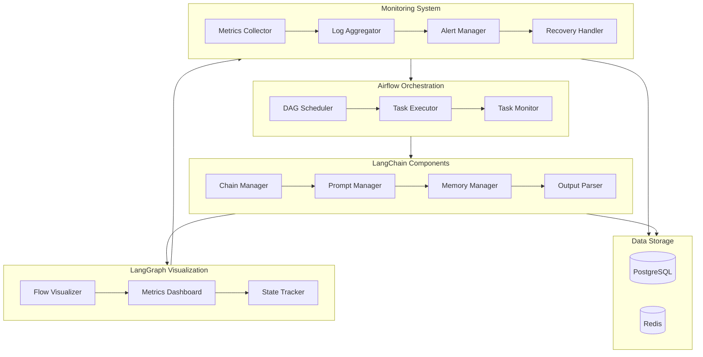

# Data Pipeline Monitoring & Maintenance System

## Overview
This repository contains a comprehensive implementation of a monitoring and maintenance system for LLM pipelines using Apache Airflow, LangChain, and LangGraph. The system provides robust logging, performance tracking, alerting, and automated recovery procedures.

## Table of Contents
- [Prerequisites](#prerequisites)
- [Installation](#installation)
- [Architecture](#architecture)
- [Components](#components)
- [Configuration](#configuration)
- [Usage](#usage)
- [Monitoring Features](#monitoring-features)
- [Troubleshooting](#troubleshooting)
- [Contributing](#contributing)

## Prerequisites
- Python 3.9+
- Apache Airflow 2.7+
- LangChain 0.1.0+
- LangGraph 0.0.10+
- Redis (for message queue)
- PostgreSQL (for metrics storage)

## Installation

1. Clone the repository:
```bash
git clone https://github.com/your-org/llm-monitoring-system.git
cd llm-monitoring-system
```

2. Create and activate virtual environment:
```bash
python -m venv venv
source venv/bin/activate  # On Windows: .\venv\Scripts\activate
```

3. Install dependencies:
```bash
pip install -r requirements.txt
```

4. Set up environment variables:
```bash
cp .env.example .env
# Edit .env with your configuration
```

## Architecture

### System Architecture Diagram

The following diagram illustrates the high-level architecture and component interactions of the monitoring system:



### Directory Structure

```
llm-monitoring-system/
├── airflow/
│   ├── dags/
│   │   ├── monitoring_dag.py
│   │   └── recovery_dag.py
│   └── plugins/
│       └── llm_operators/
├── src/
│   ├── langchain_components/
│   │   ├── __init__.py
│   │   ├── chain_manager.py
│   │   ├── memory_manager.py
│   │   ├── prompt_manager.py
│   │   └── output_parser.py
│   ├── langgraph_components/
│   │   ├── __init__.py
│   │   ├── flow_visualizer.py
│   │   ├── metrics_dashboard.py
│   │   └── state_tracker.py
│   └── monitoring/
│       ├── __init__.py
│       ├── metrics_collector.py
│       ├── log_aggregator.py
│       ├── alert_manager.py
│       └── recovery_handler.py
├── config/
│   ├── alerts.yaml
│   ├── logging.yaml
│   └── metrics.yaml
├── tests/
│   ├── unit/
│   └── integration/
├── docs/
│   ├── setup.md
│   ├── monitoring.md
│   └── recovery.md
├── scripts/
│   ├── setup.sh
│   └── start_monitoring.sh
├── requirements.txt
├── README.md
└── .env.example
```

The monitoring system consists of several interconnected components:

1. **Airflow DAGs**
   - Pipeline execution orchestration
   - Task dependency management
   - Retry mechanisms
   - Schedule management

2. **LangChain Components**
   - LLM chain execution
   - Prompt management
   - Output parsing
   - Memory management

3. **LangGraph Integration**
   - Flow visualization
   - Chain performance tracking
   - Dependency mapping
   - State management

4. **Monitoring Infrastructure**
   - Metrics collection
   - Log aggregation
   - Alert management
   - Recovery automation

## Components

### 1. Comprehensive Logging System

```python
from langchain.callbacks import FileCallbackHandler
from langchain.callbacks.streaming_stdout import StreamingStdOutCallbackHandler

class EnhancedLogger:
    def __init__(self):
        self.file_handler = FileCallbackHandler("llm_logs.txt")
        self.stream_handler = StreamingStdOutCallbackHandler()
        
    def log_chain_start(self, chain_name, inputs):
        timestamp = datetime.now().isoformat()
        log_entry = {
            "timestamp": timestamp,
            "event": "chain_start",
            "chain": chain_name,
            "inputs": inputs
        }
        self.file_handler.write(json.dumps(log_entry))
```

### 2. Performance Metrics Collection

```python
from prometheus_client import Counter, Histogram, start_http_server

class MetricsCollector:
    def __init__(self):
        self.llm_latency = Histogram(
            'llm_request_latency_seconds',
            'LLM request latency in seconds',
            ['model', 'chain']
        )
        self.llm_tokens = Counter(
            'llm_tokens_total',
            'Total tokens used',
            ['model', 'type']
        )
        
    def record_latency(self, model, chain, duration):
        self.llm_latency.labels(model=model, chain=chain).observe(duration)
```

### 3. Alert System

```python
class AlertManager:
    def __init__(self, config):
        self.alert_thresholds = config['thresholds']
        self.notification_channels = config['channels']
        
    def check_metrics(self, metrics):
        for metric, value in metrics.items():
            if value > self.alert_thresholds[metric]:
                self.trigger_alert(metric, value)
                
    def trigger_alert(self, metric, value):
        alert = {
            "metric": metric,
            "value": value,
            "timestamp": datetime.now().isoformat(),
            "severity": self.determine_severity(metric, value)
        }
        self.send_notifications(alert)
```

### 4. Recovery Procedures

```python
class RecoveryManager:
    def __init__(self):
        self.recovery_strategies = {
            "token_limit_exceeded": self.handle_token_limit,
            "rate_limit_exceeded": self.handle_rate_limit,
            "model_error": self.handle_model_error
        }
        
    async def handle_token_limit(self, chain):
        await chain.reduce_context_window()
        return await chain.retry_execution()
        
    async def handle_rate_limit(self, chain):
        await asyncio.sleep(exponential_backoff())
        return await chain.retry_execution()
```

## Configuration

### Airflow DAG Configuration

```python
default_args = {
    'owner': 'airflow',
    'depends_on_past': False,
    'email_on_failure': True,
    'email_on_retry': False,
    'retries': 3,
    'retry_delay': timedelta(minutes=5)
}

monitoring_dag = DAG(
    'llm_pipeline_monitoring',
    default_args=default_args,
    description='Monitor LLM pipeline performance',
    schedule_interval=timedelta(minutes=15),
    start_date=days_ago(1),
    catchup=False,
    tags=['llm', 'monitoring']
)
```

### Alert Thresholds

```yaml
thresholds:
  latency:
    warning: 2.0  # seconds
    critical: 5.0  # seconds
  error_rate:
    warning: 0.05  # 5%
    critical: 0.10  # 10%
  token_usage:
    warning: 0.8  # 80% of quota
    critical: 0.95  # 95% of quota
```

## Usage

### 1. Start the Monitoring System

```bash
# Start Airflow webserver and scheduler
airflow webserver --port 8080
airflow scheduler

# Start metrics server
python metrics_server.py

# Start alert manager
python alert_manager.py
```

### 2. Monitor Pipeline Performance

Access the monitoring dashboard at `http://localhost:8080/monitoring`

### 3. Configure Alerts

Edit `config/alerts.yaml` to set up alert thresholds and notification channels.

## Monitoring Features

### 1. Metrics Dashboard
- Request latency
- Token usage
- Error rates
- Chain performance
- Resource utilization

### 2. Log Analysis
- Structured logging
- Log correlation
- Error tracking
- Performance bottleneck identification

### 3. Alert Management
- Multi-channel notifications
- Alert severity levels
- Alert grouping
- Alert acknowledgment

### 4. Recovery Automation
- Automatic retries
- Fallback strategies
- Circuit breakers
- Rate limiting

## Troubleshooting

### Common Issues

1. **High Latency**
   - Check model response times
   - Verify network connectivity
   - Review concurrent requests

2. **Token Usage Spikes**
   - Analyze prompt lengths
   - Check for infinite loops
   - Review context window settings

3. **Error Rates**
   - Monitor API stability
   - Check input validation
   - Review error patterns

### Debug Mode

Enable debug mode for detailed logging:

```python
import logging
logging.basicConfig(level=logging.DEBUG)
```

## Contributing

1. Fork the repository
2. Create a feature branch
3. Commit your changes
4. Push to the branch
5. Create a Pull Request

## License

This project is licensed under the MIT License - see the LICENSE file for details.
