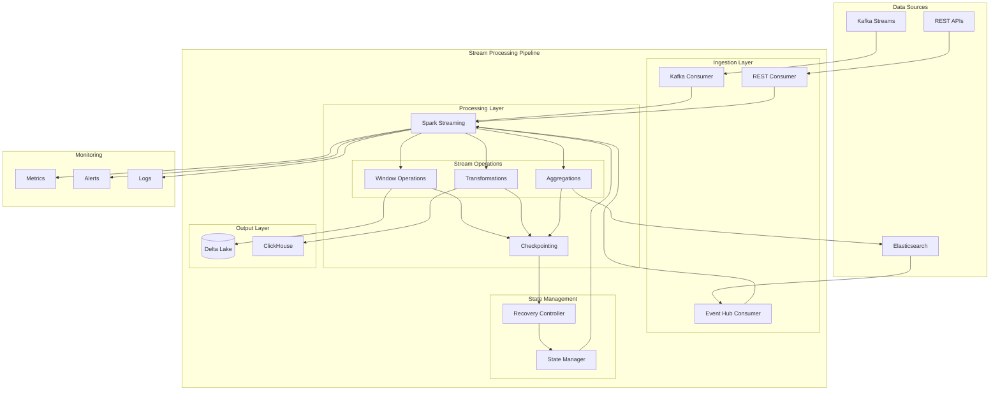

# Stream Processing with Apache Airflow and Spark Streaming

A comprehensive guide for implementing real-time stream processing using Apache Airflow for orchestration and Spark Streaming for data processing.

## Table of Contents
- [Architecture Overview](#architecture-overview)
- [Directory Structure](#directory-structure)
- [Implementation Guide](#implementation-guide)
- [Configuration](#configuration)
- [Monitoring and Maintenance](#monitoring-and-maintenance)

## Architecture Overview

The following diagram illustrates the stream processing architecture and data flow:



## Directory Structure

```
stream_processing/
├── src/
│   ├── consumers/
│   │   ├── __init__.py
│   │   ├── kafka_consumer.py
│   │   ├── eventhub_consumer.py
│   │   └── rest_consumer.py
│   ├── processors/
│   │   ├── __init__.py
│   │   ├── stream_processor.py
│   │   └── window_operations.py
│   ├── state/
│   │   ├── __init__.py
│   │   ├── checkpointing.py
│   │   └── recovery.py
│   └── monitoring/
│       ├── __init__.py
│       ├── metrics.py
│       └── alerts.py
├── dags/
│   ├── __init__.py
│   └── stream_processor_dag.py
├── config/
│   ├── spark_config.yaml
│   └── stream_config.yaml
├── tests/
│   ├── unit/
│   └── integration/
└── scripts/
    ├── setup.sh
    └── deploy.sh
```

## Implementation Guide

### 1. Real-time Data Processing Setup

```python
# src/processors/stream_processor.py
from pyspark.sql import SparkSession
from pyspark.sql.functions import *
from pyspark.sql.types import *

class StreamProcessor:
    def __init__(self, config):
        self.spark = SparkSession.builder \
            .appName("RealTimeProcessor") \
            .config("spark.streaming.stopGracefullyOnShutdown", "true") \
            .config("spark.streaming.backpressure.enabled", "true") \
            .getOrCreate()
        self.config = config

    def process_stream(self, stream_df):
        return stream_df \
            .withWatermark("timestamp", "2 minutes") \
            .groupBy(
                window("timestamp", "5 minutes", "1 minute"),
                "event_type"
            ) \
            .agg(count("*").alias("event_count"))

    def start(self):
        stream_df = self.spark \
            .readStream \
            .format("kafka") \
            .option("kafka.bootstrap.servers", self.config.kafka_servers) \
            .option("subscribe", self.config.topic) \
            .load()

        query = self.process_stream(stream_df) \
            .writeStream \
            .outputMode("append") \
            .format("delta") \
            .option("checkpointLocation", self.config.checkpoint_path) \
            .start()

        return query
```

### 2. Event-Driven Architecture Implementation

```python
# src/consumers/kafka_consumer.py
from kafka import KafkaConsumer
from confluent_kafka import Consumer, KafkaError
import json

class EventConsumer:
    def __init__(self, config):
        self.consumer = Consumer({
            'bootstrap.servers': config.kafka_servers,
            'group.id': config.consumer_group,
            'auto.offset.reset': 'earliest',
            'enable.auto.commit': False
        })
        self.topic = config.topic

    def process_events(self, callback):
        try:
            self.consumer.subscribe([self.topic])
            while True:
                msg = self.consumer.poll(timeout=1.0)
                if msg is None:
                    continue
                if msg.error():
                    if msg.error().code() == KafkaError._PARTITION_EOF:
                        continue
                    else:
                        raise Exception(msg.error())
                
                data = json.loads(msg.value().decode('utf-8'))
                callback(data)
                self.consumer.commit()
        finally:
            self.consumer.close()
```

### 3. Checkpointing and Fault Tolerance

```python
# src/state/checkpointing.py
from datetime import datetime
import json

class CheckpointManager:
    def __init__(self, checkpoint_path):
        self.checkpoint_path = checkpoint_path
        self.state = {}

    def save_checkpoint(self, stream_id, offset, metadata):
        checkpoint = {
            'stream_id': stream_id,
            'offset': offset,
            'metadata': metadata,
            'timestamp': datetime.utcnow().isoformat()
        }
        
        checkpoint_file = f"{self.checkpoint_path}/{stream_id}.json"
        with open(checkpoint_file, 'w') as f:
            json.dump(checkpoint, f)

    def load_checkpoint(self, stream_id):
        try:
            checkpoint_file = f"{self.checkpoint_path}/{stream_id}.json"
            with open(checkpoint_file, 'r') as f:
                return json.load(f)
        except FileNotFoundError:
            return None

    def recover_from_checkpoint(self, stream_id):
        checkpoint = self.load_checkpoint(stream_id)
        if checkpoint:
            return checkpoint['offset'], checkpoint['metadata']
        return None, None
```

### 4. Low-Latency Processing Configuration

```yaml
# config/spark_config.yaml
spark:
  streaming:
    trigger:
      processingTime: "1 second"
    backpressure:
      enabled: true
    minBatchesToRetain: 100
    receiver:
      maxRate: 10000
    kafka:
      minPartitions: 10
      maxOffsetsPerTrigger: 100000
    watermark: "10 seconds"
```

### 5. Airflow DAG Implementation

```python
# dags/stream_processor_dag.py
from airflow import DAG
from airflow.operators.python import PythonOperator
from datetime import datetime, timedelta

default_args = {
    'owner': 'airflow',
    'depends_on_past': False,
    'start_date': datetime(2024, 2, 21),
    'email_on_failure': True,
    'email_on_retry': False,
    'retries': 3,
    'retry_delay': timedelta(minutes=5),
}

dag = DAG(
    'stream_processor',
    default_args=default_args,
    description='Stream processing pipeline',
    schedule_interval=None,  # Triggered by events
    catchup=False
)

def start_stream_processing(**context):
    processor = StreamProcessor(config)
    query = processor.start()
    query.awaitTermination()

start_streaming = PythonOperator(
    task_id='start_streaming',
    python_callable=start_stream_processing,
    dag=dag
)
```

## Configuration

### 1. Stream Processing Configuration

```yaml
# config/stream_config.yaml
kafka:
  bootstrap_servers: "localhost:9092"
  topics:
    - "events"
    - "metrics"
  consumer_group: "stream_processor"

processing:
  window_size: "5 minutes"
  slide_duration: "1 minute"
  watermark: "2 minutes"
  output_mode: "append"

checkpointing:
  base_path: "/data/checkpoints"
  interval: "1 minute"

monitoring:
  metrics_enabled: true
  alert_threshold: 100
```

## Monitoring and Maintenance

### 1. Metrics Collection

```python
# src/monitoring/metrics.py
from prometheus_client import Counter, Gauge, Histogram

class StreamMetrics:
    def __init__(self):
        self.events_processed = Counter(
            'stream_events_processed_total',
            'Total number of events processed'
        )
        self.processing_latency = Histogram(
            'stream_processing_latency_seconds',
            'Event processing latency in seconds'
        )
        self.lag_gauge = Gauge(
            'stream_processing_lag',
            'Current lag in event processing'
        )

    def record_event_processed(self):
        self.events_processed.inc()

    def record_latency(self, latency):
        self.processing_latency.observe(latency)

    def update_lag(self, lag):
        self.lag_gauge.set(lag)
```

### 2. Alert Configuration

```python
# src/monitoring/alerts.py
import logging
from typing import Callable

class AlertManager:
    def __init__(self, config):
        self.config = config
        self.alert_handlers = []

    def add_handler(self, handler: Callable):
        self.alert_handlers.append(handler)

    def trigger_alert(self, alert_type, message):
        for handler in self.alert_handlers:
            handler(alert_type, message)

    def check_thresholds(self, metrics):
        if metrics.lag_gauge._value > self.config.alert_threshold:
            self.trigger_alert(
                'high_lag',
                f'Processing lag exceeded threshold: {metrics.lag_gauge._value}'
            )
```

## Best Practices

1. **Performance Optimization**
   - Use appropriate batch sizes
   - Implement backpressure handling
   - Optimize window operations
   - Monitor and adjust parallelism

2. **Fault Tolerance**
   - Implement robust checkpointing
   - Handle duplicate events
   - Implement dead-letter queues
   - Monitor consumer lag

3. **Monitoring**
   - Track processing latency
   - Monitor resource utilization
   - Set up alerting thresholds
   - Log important events

4. **Security**
   - Implement encryption
   - Use secure connections
   - Implement authentication
   - Monitor access patterns

## Troubleshooting Guide

1. **High Latency Issues**
   - Check resource utilization
   - Verify batch sizes
   - Monitor backpressure
   - Adjust parallelism

2. **Data Loss Prevention**
   - Verify checkpointing
   - Check consumer commit settings
   - Monitor offset management
   - Validate recovery procedures

3. **Resource Management**
   - Monitor memory usage
   - Track CPU utilization
   - Check network bandwidth
   - Verify disk space

## Support

For issues and questions:
- Check Spark Streaming documentation
- Review Kafka documentation
- Contact the streaming team
- Check monitoring dashboards

Remember to replace placeholder values and paths with your actual project information before implementation.
