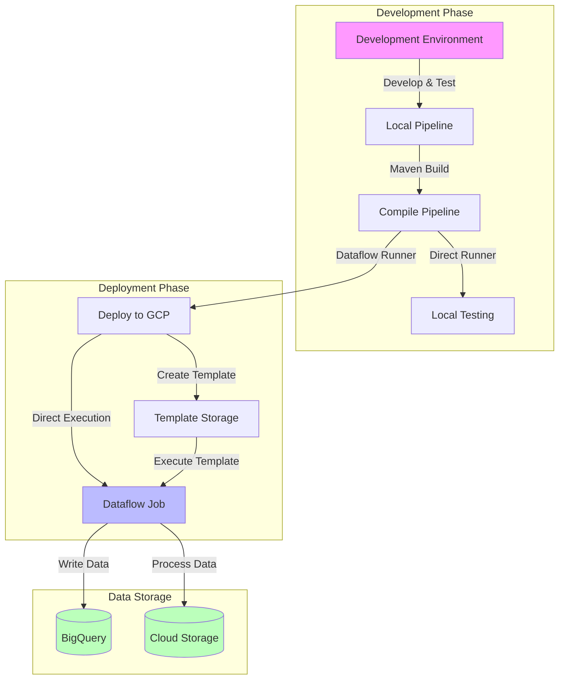
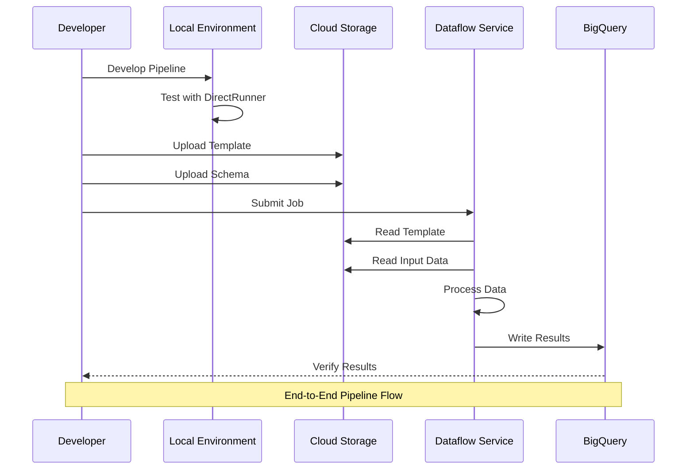

# Apache Beam Pipeline Deployment Tutorial

## Project Structure
```
apache-beam-project/
├── src/
│   ├── main/
│   │   ├── java/
│   │   │   └── com/
│   │   │       └── mypackage/
│   │   │           └── pipeline/
│   │   │               ├── MyPipeline.java
│   │   │               ├── transforms/
│   │   │               │   ├── ParseJsonDoFn.java
│   │   │               │   └── CustomTransforms.java
│   │   │               └── models/
│   │   │                   └── CommonLog.java
│   │   └── resources/
│   │       └── application.properties
│   └── test/
│       └── java/
│           └── com/
│               └── mypackage/
│                   └── pipeline/
│                       └── MyPipelineTest.java
├── scripts/
│   ├── deploy.sh
│   └── generate_schema.sh
├── pom.xml
├── schema.json
├── transform.js
└── README.md
```

## Deployment Workflow



## Table of Contents
- [Introduction](#introduction)
- [Setting Up Your Development Environment](#setting-up-your-development-environment)
- [Pipeline Development Workflow](#pipeline-development-workflow)
- [Basic ETL Pipeline Implementation](#basic-etl-pipeline-implementation)
- [Deploying to Dataflow](#deploying-to-dataflow)
- [Using Dataflow Templates](#using-dataflow-templates)
- [Troubleshooting and Best Practices](#troubleshooting-and-best-practices)

## Introduction

Apache Beam is a powerful framework for building both batch and streaming data processing pipelines. This tutorial focuses on deploying Apache Beam pipelines to Google Cloud Dataflow, covering everything from initial setup to production deployment.

## Setting Up Your Development Environment

### 1. Maven Dependencies
Add these essential dependencies to your `pom.xml`:

```xml
<dependencies>
    <!-- Apache Beam Core -->
    <dependency>
        <groupId>org.apache.beam</groupId>
        <artifactId>beam-sdks-java-core</artifactId>
        <version>${beam.version}</version>
    </dependency>

    <!-- Direct Runner for local testing -->
    <dependency>
        <groupId>org.apache.beam</groupId>
        <artifactId>beam-runners-direct-java</artifactId>
        <version>${beam.version}</version>
    </dependency>

    <!-- Google Cloud Platform I/O -->
    <dependency>
        <groupId>org.apache.beam</groupId>
        <artifactId>beam-sdks-java-io-google-cloud-platform</artifactId>
        <version>${beam.version}</version>
    </dependency>

    <!-- Dataflow Runner -->
    <dependency>
        <groupId>org.apache.beam</groupId>
        <artifactId>beam-runners-google-cloud-dataflow-java</artifactId>
        <version>${beam.version}</version>
    </dependency>

    <!-- GCP Core Extensions -->
    <dependency>
        <groupId>org.apache.beam</groupId>
        <artifactId>beam-sdks-java-extensions-google-cloud-platform-core</artifactId>
        <version>${beam.version}</version>
    </dependency>
</dependencies>
```

### 2. Required Imports
Essential imports for a basic pipeline:

```java
import org.apache.beam.runners.dataflow.options.DataflowPipelineOptions;
import org.apache.beam.sdk.Pipeline;
import org.apache.beam.sdk.PipelineResult;
import org.apache.beam.sdk.io.TextIO;
import org.apache.beam.sdk.io.gcp.bigquery.BigQueryIO;
import org.apache.beam.sdk.options.PipelineOptionsFactory;
import org.apache.beam.sdk.transforms.DoFn;
import org.apache.beam.sdk.transforms.ParDo;
import org.apache.beam.sdk.values.PCollection;
```

## Pipeline Development Workflow

### 1. Local Development Cycle
```bash
# Set up environment variables
export MAIN_CLASS_NAME=com.mypackage.pipeline.MyPipeline
export RUNNER=DirectRunner

# Compile and run locally
mvn compile exec:java \
-Dexec.mainClass=${MAIN_CLASS_NAME} \
-Dexec.cleanupDaemonThreads=false
```

### 2. Testing with Sample Data
```java
// Create test PCollection
Pipeline pipeline = Pipeline.create(options);
PCollection<String> lines = pipeline.apply(
    "ReadTestData",
    TextIO.read().from("gs://your-bucket/test-data.json")
);
```

## Basic ETL Pipeline Implementation

### 1. Schema Definition
```java
@DefaultSchema(JavaFieldSchema.class)
class CommonLog {
    String user_id;
    String ip;
    String timestamp;
    String http_request;
    Double lat;
    Double lng;
    Long http_response;
    String user_agent;
    Long num_bytes;
}
```

### 2. Transformation Logic
```java
static class ParseJsonDoFn extends DoFn<String, CommonLog> {
    @ProcessElement
    public void processElement(@Element String json, OutputReceiver<CommonLog> receiver) {
        Gson gson = new Gson();
        CommonLog commonLog = gson.fromJson(json, CommonLog.class);
        receiver.output(commonLog);
    }
}
```

### 3. Writing to BigQuery
```java
// Configure BigQuery write
pCollection.apply("WriteToBigQuery",
    BigQueryIO.<CommonLog>write()
        .to("project:dataset.table")
        .useBeamSchema()
        .withWriteDisposition(BigQueryIO.Write.WriteDisposition.WRITE_TRUNCATE)
);
```

## Deploying to Dataflow

### 1. Deployment Configuration
```bash
# Set up deployment environment variables
export PROJECT_ID=$(gcloud config get-value project)
export REGION='your-region'
export PIPELINE_FOLDER=gs://${PROJECT_ID}
export RUNNER=DataflowRunner

# Deploy to Dataflow
mvn compile exec:java \
-Dexec.mainClass=${MAIN_CLASS_NAME} \
-Dexec.args=" \
--project=${PROJECT_ID} \
--region=${REGION} \
--stagingLocation=${PIPELINE_FOLDER}/staging \
--tempLocation=${PIPELINE_FOLDER}/temp \
--runner=${RUNNER}"
```

### 2. Monitoring Deployment
1. Visit the [Dataflow Console](https://console.cloud.google.com/dataflow)
2. Monitor job progress, worker allocation, and data processing
3. Check Compute Engine for worker instances

## Using Dataflow Templates

### 1. Creating a Template Schema
```bash
# Export BigQuery schema
bq show --schema --format=prettyjson dataset.table | \
sed '1s/^/{"BigQuery Schema":/' | \
sed '$s/$/}/' > schema.json

# Upload to GCS
gsutil cp schema.json gs://${PROJECT_ID}/
```

### 2. JavaScript Transformation Function
```javascript
// transform.js
function transform(line) {
    // Add any necessary transformations
    return line;
}
```

### 3. Template Deployment Steps
1. Navigate to Dataflow Web UI
2. Click "CREATE JOB FROM TEMPLATE"
3. Select appropriate template (e.g., "Text Files on Cloud Storage to BigQuery")
4. Configure template parameters:
   - Input path: `gs://${PROJECT_ID}/input.json`
   - Schema file: `gs://${PROJECT_ID}/schema.json`
   - Output table: `${PROJECT_ID}:dataset.table`
   - JavaScript UDF: `gs://${PROJECT_ID}/transform.js`

## Troubleshooting and Best Practices

### 1. Development Best Practices
- Use DirectRunner for rapid development and testing
- Implement proper error handling in transformations
- Use appropriate WriteDisposition based on requirements
- Leverage Beam Schemas for type safety

### 2. Performance Optimization
- Monitor worker allocation in Dataflow console
- Use appropriate number of workers based on data volume
- Consider implementing combiners for GroupByKey operations
- Optimize external system calls in ParDo transforms

### 3. Common Issues and Solutions
- Schema mismatches: Verify schema compatibility before deployment
- Memory issues: Monitor worker memory usage and adjust machine types
- Data skew: Implement proper data partitioning strategies
- Failed workers: Check logs for transformation errors

### 4. Pipeline Orchestration Diagram



### 5. Production Deployment Checklist
- [ ] Test pipeline with representative data volume
- [ ] Verify all dependencies are included in deployment
- [ ] Configure appropriate monitoring and alerting
- [ ] Set up appropriate IAM permissions
- [ ] Document pipeline parameters and configuration
- [ ] Plan for disaster recovery and data backup

Remember to always test your pipeline thoroughly in a development environment before deploying to production. Use appropriate logging and monitoring to ensure proper operation of your pipeline in production.
