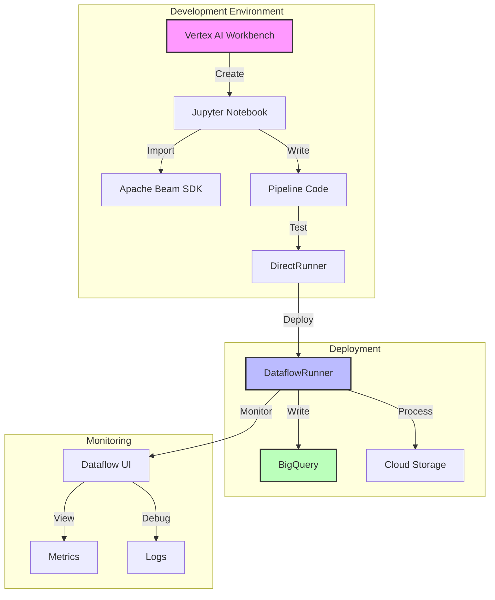
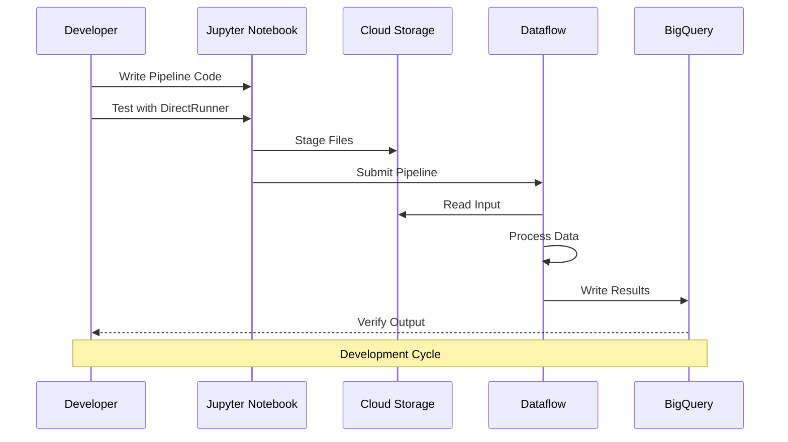

# Apache Beam Jupyter Notebook and BigQuery Dataflow Deployment

## Project Structure
```
apache-beam-notebook/
├── notebooks/
│   ├── development/
│   │   ├── etl_pipeline.ipynb
│   │   └── pipeline_testing.ipynb
│   └── production/
│       └── deployment.ipynb
├── src/
│   ├── transforms/
│   │   ├── __init__.py
│   │   └── custom_transforms.py
│   ├── utils/
│   │   ├── __init__.py
│   │   └── beam_utils.py
│   └── pipeline/
│       └── my_pipeline.py
├── data/
│   ├── input/
│   │   └── events.json
│   └── output/
├── scripts/
│   ├── setup_env.sh
│   └── deploy_pipeline.sh
└── requirements.txt
```

## Development Workflow



## Setup Instructions

1. **Create Vertex AI Workbench Instance**
```bash
# Enable required APIs
gcloud services enable notebooks.googleapis.com
gcloud services enable dataflow.googleapis.com

# Create notebook instance
gcloud notebooks instances create beam-dev \
    --vm-image-project=deeplearning-platform-release \
    --vm-image-family=apache-beam \
    --machine-type=n1-standard-4 \
    --location=your-region
```

2. **Set Up Python Environment**
```python
# In your Jupyter notebook
!python -m pip install apache-beam[gcp]
!python -m pip install google-cloud-bigquery
!python -m pip install google-cloud-storage
```

3. **Basic Pipeline Template**
```python
import apache_beam as beam
from apache_beam.options.pipeline_options import PipelineOptions, StandardOptions

def run_pipeline():
    options = PipelineOptions()
    options.view_as(StandardOptions).runner = 'DirectRunner'
    
    with beam.Pipeline(options=options) as p:
        # Read input
        lines = p | 'ReadInput' >> beam.io.ReadFromText('gs://your-bucket/input.json')
        
        # Parse JSON
        records = lines | 'ParseJSON' >> beam.Map(json.loads)
        
        # Write to BigQuery
        records | 'WriteToBQ' >> beam.io.WriteToBigQuery(
            'your-project:dataset.table',
            schema='field1:STRING,field2:INTEGER',
            create_disposition=beam.io.BigQueryDisposition.CREATE_IF_NEEDED,
            write_disposition=beam.io.BigQueryDisposition.WRITE_TRUNCATE
        )
```

## Development to Production Pipeline



## Required Dependencies

Create a `requirements.txt`:
```text
apache-beam[gcp]
google-cloud-bigquery
google-cloud-storage
jupyter
pandas
```

## Pipeline Components

### 1. Data Reading
```python
# Read from Cloud Storage
lines = p | 'ReadFromGCS' >> beam.io.ReadFromText('gs://your-bucket/events.json')

# Read from BigQuery
query_results = p | 'ReadFromBQ' >> beam.io.ReadFromBigQuery(
    query='SELECT * FROM `project.dataset.table`',
    use_standard_sql=True
)
```

### 2. Transformations
```python
class ParseEventsFn(beam.DoFn):
    def process(self, element):
        """Parse JSON events."""
        event = json.loads(element)
        yield event

# Apply transformation
parsed_events = lines | 'ParseEvents' >> beam.ParDo(ParseEventsFn())
```

### 3. Writing Results
```python
# Write to BigQuery
TABLE_SCHEMA = {
    'fields': [
        {'name': 'user_id', 'type': 'STRING'},
        {'name': 'timestamp', 'type': 'TIMESTAMP'},
        {'name': 'event_type', 'type': 'STRING'}
    ]
}

events | 'WriteToBQ' >> beam.io.WriteToBigQuery(
    'project:dataset.table',
    schema=TABLE_SCHEMA,
    create_disposition=beam.io.BigQueryDisposition.CREATE_IF_NEEDED,
    write_disposition=beam.io.BigQueryDisposition.WRITE_TRUNCATE
)
```

## Deployment Steps

1. **Local Testing**
```python
# Run with DirectRunner
python my_pipeline.py \
    --runner=DirectRunner \
    --project=your-project \
    --region=your-region
```

2. **Dataflow Deployment**
```python
# Deploy to Dataflow
python my_pipeline.py \
    --runner=DataflowRunner \
    --project=your-project \
    --region=your-region \
    --temp_location=gs://your-bucket/temp \
    --staging_location=gs://your-bucket/staging
```

## Best Practices

1. **Development**
   - Use DirectRunner for initial development and testing
   - Break down complex transformations into smaller, testable units
   - Implement proper error handling and logging
   - Use type hints for better code maintainability

2. **Performance**
   - Monitor pipeline execution in Dataflow UI
   - Use appropriate machine types for workers
   - Implement combiners for GroupByKey operations
   - Optimize file reading and writing operations

3. **Deployment**
   - Always test with a sample dataset first
   - Use staging environment before production
   - Monitor resource usage and costs
   - Implement proper error handling and recovery

## Troubleshooting

1. **Common Issues**
   - Pipeline hanging: Check worker logs
   - Memory issues: Adjust machine type
   - Quota limits: Request quota increases
   - Data skew: Implement proper partitioning

2. **Debugging Tools**
   - Dataflow monitoring interface
   - Cloud Logging integration
   - Pipeline validation checks
   - Local debugging with DirectRunner

## Security Considerations

1. **Authentication**
   - Use service accounts with minimal permissions
   - Rotate credentials regularly
   - Implement proper IAM roles

2. **Data Protection**
   - Enable Cloud KMS for sensitive data
   - Implement data encryption at rest
   - Use VPC Service Controls where needed

Remember to monitor your pipeline execution through the Dataflow UI and set up appropriate alerting for production deployments.
