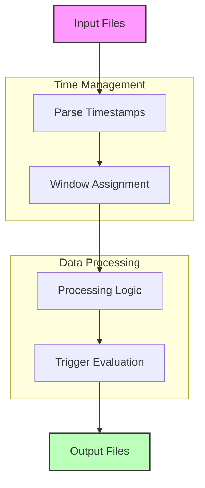

# Apache Beam Batch Processing: Windows, Watermarks, and Triggers

## Batch Pipeline Flow



## 1. Windows in Batch Processing

### Fixed Windows for Daily Aggregations
```python
class DailyAggregationPipeline(beam.PTransform):
    def expand(self, pcoll):
        return (pcoll
            # Extract timestamp from data
            | "AddTimestamps" >> beam.Map(
                lambda x: beam.window.TimestampedValue(
                    x, 
                    datetime.strptime(x['date'], '%Y-%m-%d').timestamp()
                )
            )
            # Apply daily windows
            | "DailyWindows" >> beam.WindowInto(
                beam.window.FixedWindows(24 * 60 * 60)  # 24 hours
            )
            | "GroupAndSum" >> beam.CombinePerKey(sum)
        )

# Example usage for sales data
with beam.Pipeline() as p:
    data = (p 
        | "ReadData" >> beam.io.ReadFromText('sales_data.csv')
        | "ParseCSV" >> beam.Map(lambda x: {"date": x.split(',')[0], 
                                          "amount": float(x.split(',')[1])})
        | "DailyTotals" >> DailyAggregationPipeline()
        | "WriteResults" >> beam.io.WriteToText('daily_totals')
    )
```

### Sliding Windows for Historical Analysis
```python
class HistoricalAnalysisPipeline(beam.PTransform):
    def expand(self, pcoll):
        return (pcoll
            # Add timestamps
            | "AddTimestamps" >> beam.Map(
                lambda x: beam.window.TimestampedValue(
                    x,
                    datetime.strptime(x['timestamp'], '%Y-%m-%d %H:%M:%S').timestamp()
                )
            )
            # 7-day windows, sliding every day
            | "WeeklyWindows" >> beam.WindowInto(
                beam.window.SlidingWindows(
                    7 * 24 * 60 * 60,  # 7 days
                    24 * 60 * 60       # Slide every day
                )
            )
            | "CalculateAverages" >> beam.CombineGlobally(
                beam.combiners.MeanCombineFn()
            ).without_defaults()
        )
```

### Global Windows with Batch Processing
```python
class GlobalWindowAnalysis(beam.PTransform):
    def expand(self, pcoll):
        return (pcoll
            | "GlobalWindow" >> beam.WindowInto(
                beam.window.GlobalWindows(),
                trigger=beam.trigger.AfterCount(1000),
                accumulation_mode=beam.trigger.AccumulationMode.DISCARDING
            )
            | "GroupAndProcess" >> beam.GroupByKey()
            | "ProcessEntireBatch" >> beam.ParDo(ProcessEntireBatchFn())
        )

class ProcessEntireBatchFn(beam.DoFn):
    def process(self, element):
        key, values = element
        # Process entire batch of values for the key
        result = self.process_batch(values)
        yield result
```

## 2. Watermarks in Batch Processing

### Processing Historical Data with Watermarks
```python
class HistoricalDataProcessor(beam.PTransform):
    def expand(self, pcoll):
        return (pcoll
            # Add timestamps from historical data
            | "AddHistoricalTimestamps" >> beam.Map(
                lambda x: beam.window.TimestampedValue(
                    x,
                    self.extract_timestamp(x)
                )
            )
            # Use fixed windows with allowed lateness
            | "WindowWithLateness" >> beam.WindowInto(
                beam.window.FixedWindows(60 * 60),  # 1 hour windows
                allowed_lateness=beam.Duration(hours=1)
            )
            | "ProcessWindows" >> beam.GroupByKey()
        )

    def extract_timestamp(self, record):
        # Extract timestamp from historical record
        return datetime.strptime(
            record['timestamp'], 
            '%Y-%m-%d %H:%M:%S'
        ).timestamp()
```

### Handling Out-of-Order Data in Batch
```python
class OutOfOrderDataHandler(beam.PTransform):
    def expand(self, pcoll):
        return (pcoll
            | "AddTimestamps" >> beam.Map(
                lambda x: beam.window.TimestampedValue(x, x['event_time'])
            )
            | "Windows" >> beam.WindowInto(
                beam.window.FixedWindows(60 * 60),
                allowed_lateness=beam.Duration(hours=2),
                timestamp_fn=lambda x: x['event_time']
            )
            | "GroupEvents" >> beam.GroupByKey()
            | "OrderAndProcess" >> beam.ParDo(OrderedProcessingFn())
        )

class OrderedProcessingFn(beam.DoFn):
    def process(self, element, window=beam.DoFn.WindowParam):
        key, events = element
        # Sort events by timestamp before processing
        sorted_events = sorted(events, key=lambda x: x['event_time'])
        for event in sorted_events:
            yield self.process_event(event)
```

## 3. Triggers in Batch Processing

### Count-Based Triggers for Large Datasets
```python
class BatchCountTrigger(beam.PTransform):
    def expand(self, pcoll):
        return (pcoll
            | "Window" >> beam.WindowInto(
                beam.window.GlobalWindows(),
                trigger=beam.trigger.Repeatedly(
                    beam.trigger.AfterCount(10000)  # Process every 10,000 records
                ),
                accumulation_mode=beam.trigger.AccumulationMode.DISCARDING
            )
            | "GroupAndProcess" >> beam.GroupByKey()
            | "ProcessBatch" >> beam.ParDo(ProcessBatchFn())
        )

class ProcessBatchFn(beam.DoFn):
    def process(self, element, pane_info=beam.DoFn.PaneInfoParam):
        key, batch = element
        # Process batch of records
        result = self.process_batch(batch)
        yield result
```

### Size-Based Processing with Triggers
```python
class SizeBasedBatchProcessor(beam.PTransform):
    def expand(self, pcoll):
        return (pcoll
            | "Window" >> beam.WindowInto(
                beam.window.GlobalWindows(),
                trigger=beam.trigger.AfterProcessingTime(60),  # Fire every minute
                accumulation_mode=beam.trigger.AccumulationMode.DISCARDING
            )
            | "BatchElements" >> beam.GroupIntoBatches(
                batch_size=1000,  # Process in batches of 1000
                batch_size_bytes=5 * 1024 * 1024  # Or 5MB
            )
            | "ProcessBatches" >> beam.ParDo(ProcessBatchesFn())
        )
```

## Common Batch Processing Use Cases

### 1. Historical Data Analysis
```python
class HistoricalDataAnalysis(beam.PTransform):
    def expand(self, pcoll):
        return (pcoll
            | "ParseDates" >> beam.Map(
                lambda x: beam.window.TimestampedValue(
                    x,
                    datetime.strptime(x['date'], '%Y-%m-%d').timestamp()
                )
            )
            | "MonthlyWindows" >> beam.WindowInto(
                beam.window.FixedWindows(30 * 24 * 60 * 60),  # Monthly windows
                trigger=beam.trigger.AfterWatermark(),
                accumulation_mode=beam.trigger.AccumulationMode.ACCUMULATING
            )
            | "CalculateMetrics" >> beam.CombinePerKey(
                beam.combiners.CountCombineFn()
            )
        )
```

### 2. Log File Processing
```python
class LogFileProcessor(beam.PTransform):
    def expand(self, pcoll):
        return (pcoll
            | "ParseLogTimestamp" >> beam.Map(
                lambda x: beam.window.TimestampedValue(
                    x,
                    self.parse_log_timestamp(x)
                )
            )
            | "HourlyWindows" >> beam.WindowInto(
                beam.window.FixedWindows(60 * 60),
                trigger=beam.trigger.AfterCount(10000),
                accumulation_mode=beam.trigger.AccumulationMode.DISCARDING
            )
            | "ProcessLogBatch" >> beam.ParDo(ProcessLogBatchFn())
        )

    def parse_log_timestamp(self, log_line):
        # Extract timestamp from log line
        return datetime.strptime(
            log_line.split()[0], 
            '%Y-%m-%d-%H:%M:%S'
        ).timestamp()
```

## Best Practices for Batch Processing

1. **Window Selection**
   - Use appropriate window sizes for your data volume
   - Consider memory constraints when setting window sizes
   - Use global windows for full dataset processing

2. **Performance Optimization**
   - Set reasonable batch sizes for triggers
   - Balance memory usage with processing speed
   - Monitor resource utilization

3. **Data Handling**
   - Implement proper error handling
   - Validate timestamps before windowing
   - Handle missing or invalid data

4. **Resource Management**
   - Control batch sizes to manage memory
   - Use appropriate trigger frequencies
   - Monitor processing bottlenecks

Remember to test your pipeline with representative data volumes to ensure optimal performance.