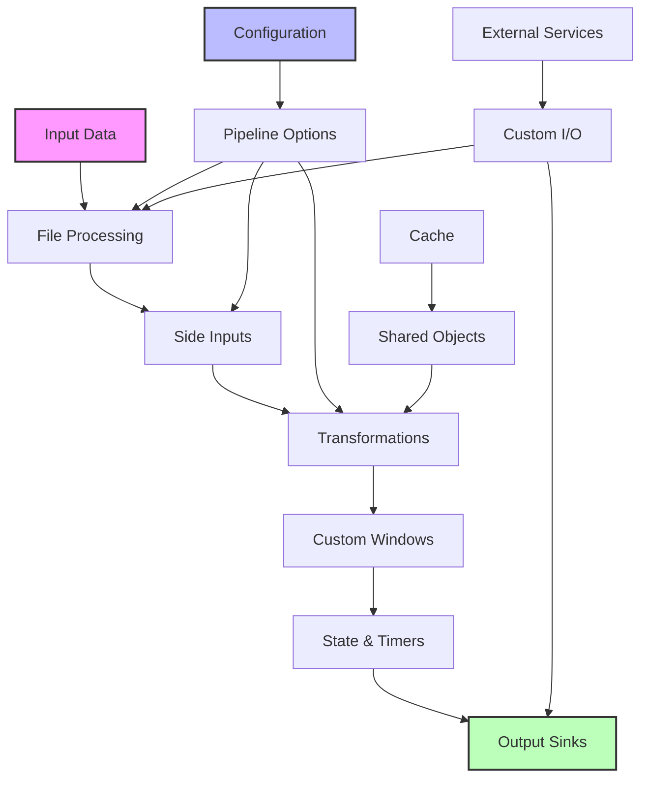

# Apache Beam Pipeline Patterns Implementation Guide

## Table of Contents
- [File Processing Patterns](#file-processing-patterns)
- [Side Input Patterns](#side-input-patterns)
- [Pipeline Option Patterns](#pipeline-option-patterns)
- [Custom I/O Patterns](#custom-io-patterns)
- [Custom Window Patterns](#custom-window-patterns)
- [BigQuery Patterns](#bigquery-patterns)
- [AI Platform Integration Patterns](#ai-platform-integration-patterns)
- [Schema Patterns](#schema-patterns)
- [BQML Integration Patterns](#bqml-integration-patterns)
- [Cross-language Patterns](#cross-language-patterns)
- [State & Timers Patterns](#state-timers-patterns)
- [Cache with Shared Object Patterns](#cache-patterns)

## Pipeline Pattern Flow



## File Processing Patterns

### Processing Files as They Arrive
```python
class FileProcessor(beam.DoFn):
    def process(self, file_name, timestamp=beam.DoFn.TimestampParam):
        with beam.io.filesystems.FileSystems.open(file_name) as f:
            content = f.read()
            # Process file content
            yield (file_name, content)

with beam.Pipeline() as p:
    files = (p 
        | 'Watch Directory' >> beam.io.fileio.MatchFiles('gs://bucket/input/*.csv')
        | 'Process Files' >> beam.ParDo(FileProcessor()))
```

### Accessing Filenames
```python
class ExtractFileMetadata(beam.DoFn):
    def process(self, file_name):
        metadata = {
            'name': os.path.basename(file_name),
            'path': file_name,
            'timestamp': self.get_file_timestamp(file_name)
        }
        yield metadata

pipeline | beam.ParDo(ExtractFileMetadata())
```

## Side Input Patterns

### Slowly Updating Global Window Side Inputs
```python
def apply_config(element, config):
    return {**element, **config.get(element['type'], {})}

with beam.Pipeline() as p:
    main_data = p | 'Read Data' >> beam.io.ReadFromText('data.txt')
    
    # Side input that updates periodically
    config = (p 
        | 'Read Config' >> beam.io.ReadFromText('config.txt')
        | 'Parse Config' >> beam.Map(json.loads)
        | 'Global Window' >> beam.WindowInto(window.GlobalWindows())
    )
    
    # Apply configuration using side input
    result = main_data | beam.Map(apply_config, config=beam.pvalue.AsDict(config))
```

## Pipeline Option Patterns

### Retroactively Logging Runtime Parameters
```python
class CustomPipelineOptions(PipelineOptions):
    @classmethod
    def _add_argparse_args(cls, parser):
        parser.add_argument('--input', default='input.txt')
        parser.add_argument('--output', default='output.txt')

def run_pipeline():
    options = CustomPipelineOptions()
    
    # Log parameters at startup
    logging.info(f"Pipeline started with: {options.get_all_options()}")
    
    with beam.Pipeline(options=options) as p:
        # Pipeline logic here
        pass
```

## Custom I/O Patterns

### Custom Source Implementation
```python
class CustomSource(beam.io.Source):
    def __init__(self, config):
        self.config = config

    def split(self, desired_bundle_size, start_position=None, stop_position=None):
        # Implement splitting logic
        pass

    def get_range_tracker(self, start_position, stop_position):
        # Implement range tracking
        pass

    def read(self, range_tracker):
        # Implement reading logic
        pass

# Usage
pipeline | beam.io.Read(CustomSource(config))
```

## Custom Window Patterns

### Dynamic Session Windows
```python
class DynamicSessionWindows(window.WindowFn):
    def __init__(self, gap_fn):
        self.gap_fn = gap_fn

    def assign(self, context):
        timestamp = context.timestamp
        return [window.IntervalWindow(
            start=timestamp,
            end=timestamp + self.gap_fn(context.element)
        )]

# Usage
events | beam.WindowInto(DynamicSessionWindows(
    gap_fn=lambda element: element['session_timeout']
))
```

## BigQuery Patterns

### Dynamic Table Writing
```python
def get_table_name(element):
    return f"{element['date']}_events"

with beam.Pipeline() as p:
    events = p | beam.io.ReadFromText('events.txt')
    
    events | beam.io.WriteToBigQuery(
        table=get_table_name,
        schema='timestamp:TIMESTAMP,event_id:STRING,data:STRING',
        create_disposition=beam.io.BigQueryDisposition.CREATE_IF_NEEDED,
        write_disposition=beam.io.BigQueryDisposition.WRITE_APPEND
    )
```

## AI Platform Integration Patterns

### Text Analysis with AI Platform
```python
class AnalyzeTextFn(beam.DoFn):
    def setup(self):
        self.client = language.LanguageServiceClient()

    def process(self, element):
        document = language.Document(
            content=element['text'],
            type_=language.Document.Type.PLAIN_TEXT
        )
        sentiment = self.client.analyze_sentiment(document=document)
        yield {
            'text': element['text'],
            'sentiment': sentiment.document_sentiment.score
        }

pipeline | beam.ParDo(AnalyzeTextFn())
```

## Schema Patterns

### Join Implementation
```python
with beam.Pipeline() as p:
    users = p | 'Read Users' >> beam.io.ReadFromText('users.txt')
    orders = p | 'Read Orders' >> beam.io.ReadFromText('orders.txt')
    
    # Join users and orders
    joined = (
        {'users': users, 'orders': orders}
        | beam.CoGroupByKey()
        | beam.Map(lambda x: {
            'user_id': x[0],
            'user_data': x[1]['users'],
            'orders': x[1]['orders']
        })
    )
```

## BQML Integration Patterns

### Model Export and Serving
```python
class PredictDoFn(beam.DoFn):
    def setup(self):
        self.model = tfx_bsl.public.beam.LoadModel('gs://model/path')

    def process(self, element):
        features = self.prepare_features(element)
        prediction = self.model.predict(features)
        yield {**element, 'prediction': prediction}

predictions = data | beam.ParDo(PredictDoFn())
```

## State & Timers Patterns

### Batching Elements for External Service Calls
```python
class BatchAndProcess(beam.DoFn):
    BATCH_SIZE = 100
    
    def process(self, element, state=beam.DoFn.StateParam(batch_state)):
        current_batch = list(state.read())
        current_batch.append(element)
        
        if len(current_batch) >= self.BATCH_SIZE:
            # Process batch
            result = self.process_batch(current_batch)
            state.clear()
            yield result
        else:
            state.write(current_batch)

pipeline | beam.ParDo(BatchAndProcess())
```

## Cache with Shared Object Patterns

### Batch Pipeline Cache
```python
class SharedCache(object):
    def __init__(self):
        self._cache = {}
        
    def get(self, key):
        return self._cache.get(key)
        
    def set(self, key, value):
        self._cache[key] = value

class CachingDoFn(beam.DoFn):
    def setup(self):
        self.cache = SharedCache()
        
    def process(self, element):
        cached_value = self.cache.get(element['key'])
        if cached_value:
            yield cached_value
        else:
            result = self.expensive_computation(element)
            self.cache.set(element['key'], result)
            yield result

pipeline | beam.ParDo(CachingDoFn())
```

### Streaming Pipeline Cache Update
```python
class StreamingCache(beam.DoFn):
    def __init__(self, update_interval):
        self.update_interval = update_interval
        self.cache = {}

    @beam.DoFn.timer('refresh')
    def refresh_timer(self):
        self.update_cache()
        
    def process(self, element, timestamp=beam.DoFn.TimestampParam):
        self.cache[element['key']] = element['value']
        yield element

pipeline | beam.ParDo(StreamingCache(update_interval=60))
```

## Best Practices

1. **Pattern Selection**
   - Choose patterns based on your specific use case
   - Consider scalability requirements
   - Evaluate maintenance overhead

2. **Implementation**
   - Keep transforms modular and reusable
   - Implement proper error handling
   - Use appropriate windowing strategies

3. **Testing**
   - Test patterns with small datasets first
   - Verify pattern behavior in both batch and streaming
   - Monitor performance metrics

4. **Optimization**
   - Use appropriate batch sizes
   - Implement caching where beneficial
   - Monitor resource usage

Remember to adapt these patterns to your specific use case and requirements. The implementations shown are examples and may need modification for production use.