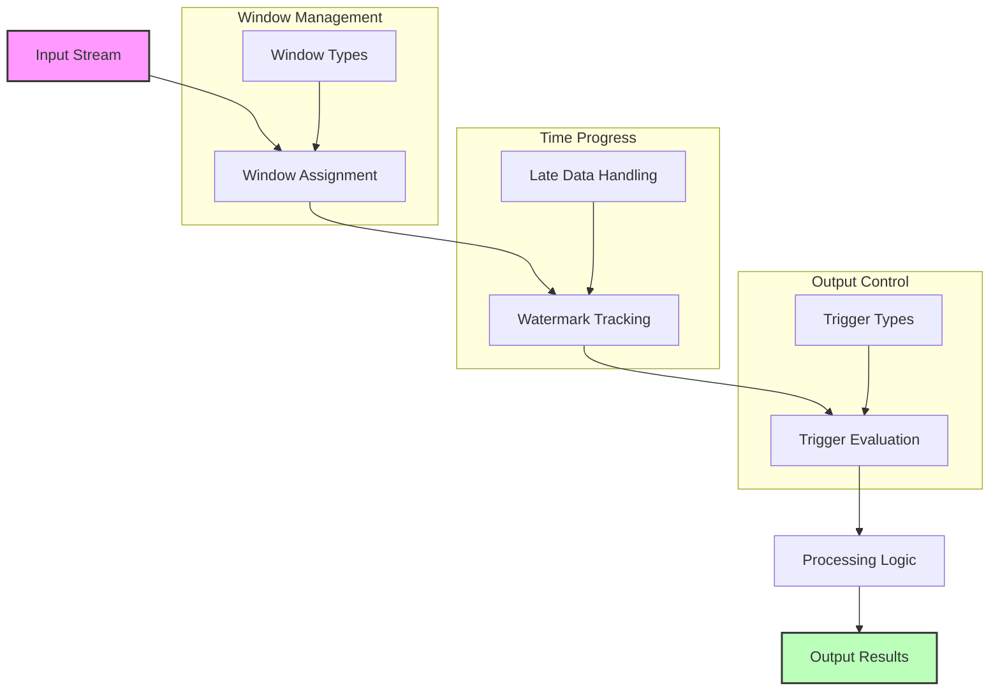

# Apache Beam Streaming Patterns: Windows, Watermarks, and Triggers

## Streaming Pipeline Flow



## 1. Windows Implementation Examples

### Fixed Windows (Hourly Analytics)
```python
from apache_beam.transforms import window

class ComputeHourlyStats(beam.PTransform):
    def expand(self, pcoll):
        return (pcoll
            | "Window" >> beam.WindowInto(window.FixedWindows(60 * 60))  # 1-hour windows
            | "GroupByKey" >> beam.GroupByKey()
            | "CalculateStats" >> beam.ParDo(CalculateStatsFn()))

# Example usage for web traffic analysis
with beam.Pipeline() as p:
    events = (p 
        | "ReadEvents" >> beam.io.ReadFromPubSub(topic="projects/your-project/topics/events")
        | "ParseJSON" >> beam.Map(json.loads)
        | "AddEventTimestamp" >> beam.Map(
            lambda x: beam.window.TimestampedValue(x, x['timestamp'])
        )
        | "HourlyStats" >> ComputeHourlyStats())
```

### Sliding Windows (Moving Average)
```python
class ComputeMovingAverage(beam.PTransform):
    def expand(self, pcoll):
        return (pcoll
            | "Window" >> beam.WindowInto(
                window.SlidingWindows(
                    size=300,  # 5-minute window
                    period=60   # Sliding every 1 minute
                ))
            | "GroupAndAverage" >> beam.CombineGlobally(
                beam.combiners.MeanCombineFn()
            ).without_defaults())

# Example usage for sensor data
with beam.Pipeline() as p:
    sensor_data = (p
        | "ReadSensorData" >> beam.io.ReadFromPubSub(
            subscription="projects/your-project/subscriptions/sensors")
        | "ParseData" >> beam.Map(lambda x: float(x))
        | "MovingAverage" >> ComputeMovingAverage())
```

### Session Windows (User Activity)
```python
class TrackUserSessions(beam.PTransform):
    def expand(self, pcoll):
        return (pcoll
            | "Window" >> beam.WindowInto(
                window.Sessions(gap_size=300),  # 5-minute gap
                timestamp_fn=lambda x: x['timestamp']
            )
            | "GroupByUser" >> beam.GroupByKey()
            | "AnalyzeSession" >> beam.ParDo(AnalyzeSessionFn()))

# Example usage for user activity tracking
with beam.Pipeline() as p:
    user_events = (p
        | "ReadUserEvents" >> beam.io.ReadFromPubSub(
            topic="projects/your-project/topics/user-events")
        | "ParseEvents" >> beam.Map(json.loads)
        | "TrackSessions" >> TrackUserSessions())
```

## 2. Watermark Implementation Examples

### Basic Watermark Tracking
```python
class WatermarkMonitor(beam.DoFn):
    def process(self, element, timestamp=beam.DoFn.TimestampParam,
                window=beam.DoFn.WindowParam):
        yield {
            'element': element,
            'timestamp': timestamp,
            'window_start': window.start,
            'window_end': window.end
        }

# Example usage
with beam.Pipeline() as p:
    events = (p
        | "ReadEvents" >> beam.io.ReadFromPubSub(...)
        | "Window" >> beam.WindowInto(
            window.FixedWindows(60),
            timestamp_fn=lambda x: x['event_time']
        )
        | "MonitorWatermarks" >> beam.ParDo(WatermarkMonitor()))
```

### Late Data Handling
```python
class ProcessWithLateness(beam.PTransform):
    def expand(self, pcoll):
        return (pcoll
            | "Window" >> beam.WindowInto(
                window.FixedWindows(60),
                allowed_lateness=beam.Duration(minutes=30),
                timestamp_fn=lambda x: x['timestamp']
            )
            | "GroupAndProcess" >> beam.GroupByKey()
            | "HandleLateData" >> beam.ParDo(LateDataHandlerFn()))

class LateDataHandlerFn(beam.DoFn):
    def process(self, element, window=beam.DoFn.WindowParam,
                pane_info=beam.DoFn.PaneInfoParam):
        if pane_info.timing == beam.transforms.trigger.PaneInfo.Timing.LATE:
            # Handle late data
            yield self.process_late_data(element)
        else:
            # Handle on-time data
            yield self.process_ontime_data(element)
```

## 3. Trigger Implementation Examples

### Event-Time Triggers
```python
class EventTimeTriggerExample(beam.PTransform):
    def expand(self, pcoll):
        return (pcoll
            | "Window" >> beam.WindowInto(
                window.FixedWindows(60),
                trigger=trigger.AfterWatermark(
                    early=trigger.AfterProcessingTime(10),
                    late=trigger.AfterCount(1)
                ),
                accumulation_mode=trigger.AccumulationMode.ACCUMULATING,
                timestamp_fn=lambda x: x['timestamp']
            )
            | "GroupAndProcess" >> beam.GroupByKey())
```

### Processing-Time Triggers
```python
class ProcessingTimeTriggerExample(beam.PTransform):
    def expand(self, pcoll):
        return (pcoll
            | "Window" >> beam.WindowInto(
                window.FixedWindows(300),
                trigger=trigger.Repeatedly(
                    trigger.AfterProcessingTime(60)
                ),
                accumulation_mode=trigger.AccumulationMode.DISCARDING
            )
            | "GroupAndProcess" >> beam.GroupByKey())
```

### Composite Triggers (Complex Scenarios)
```python
class CompositeTriggerExample(beam.PTransform):
    def expand(self, pcoll):
        return (pcoll
            | "Window" >> beam.WindowInto(
                window.FixedWindows(300),
                trigger=trigger.AfterAll(
                    trigger.AfterCount(100),
                    trigger.AfterProcessingTime(60)
                ).orFinally(trigger.AfterWatermark()),
                accumulation_mode=trigger.AccumulationMode.ACCUMULATING,
                allowed_lateness=beam.Duration(minutes=30)
            )
            | "GroupAndProcess" >> beam.GroupByKey())
```

## Common Use Cases and Best Practices

### 1. Real-Time Analytics Dashboard
```python
class RealTimeAnalytics(beam.PTransform):
    def expand(self, pcoll):
        return (pcoll
            | "Window" >> beam.WindowInto(
                window.SlidingWindows(
                    size=300,  # 5-minute windows
                    period=60   # Update every minute
                ),
                trigger=trigger.Repeatedly(
                    trigger.AfterProcessingTime(30)  # Update every 30 seconds
                ),
                accumulation_mode=trigger.AccumulationMode.DISCARDING
            )
            | "CalculateMetrics" >> beam.CombineGlobally(
                beam.combiners.CountCombineFn()
            ).without_defaults())
```

### 2. Session-Based User Analytics
```python
class UserSessionAnalytics(beam.PTransform):
    def expand(self, pcoll):
        return (pcoll
            | "Window" >> beam.WindowInto(
                window.Sessions(gap_size=1800),  # 30-minute gap
                trigger=trigger.AfterWatermark(
                    early=trigger.AfterProcessingTime(300),  # Early results every 5 minutes
                    late=trigger.AfterCount(1)  # Process each late arrival
                ),
                allowed_lateness=beam.Duration(hours=24),
                accumulation_mode=trigger.AccumulationMode.ACCUMULATING
            )
            | "AnalyzeSessions" >> beam.ParDo(SessionAnalyzerFn()))
```

### 3. Fraud Detection System
```python
class FraudDetection(beam.PTransform):
    def expand(self, pcoll):
        return (pcoll
            | "Window" >> beam.WindowInto(
                window.SlidingWindows(
                    size=300,    # 5-minute windows
                    period=60    # Slide every minute
                ),
                trigger=trigger.AfterAny(
                    trigger.AfterCount(1000),  # Process after 1000 events
                    trigger.AfterProcessingTime(30)  # Or every 30 seconds
                ),
                accumulation_mode=trigger.AccumulationMode.ACCUMULATING
            )
            | "DetectAnomalies" >> beam.ParDo(AnomalyDetectorFn()))
```

## Best Practices

1. **Window Selection**
   - Choose window size based on data characteristics
   - Consider data arrival patterns
   - Balance between accuracy and latency

2. **Watermark Configuration**
   - Set appropriate allowed lateness
   - Monitor watermark progress
   - Handle late data explicitly

3. **Trigger Design**
   - Use composite triggers for complex scenarios
   - Balance between freshness and processing cost
   - Choose appropriate accumulation mode

4. **Performance Optimization**
   - Monitor window sizes
   - Adjust trigger frequencies
   - Handle state efficiently

Remember to test your windowing strategy with representative data volumes and arrival patterns to ensure optimal performance.