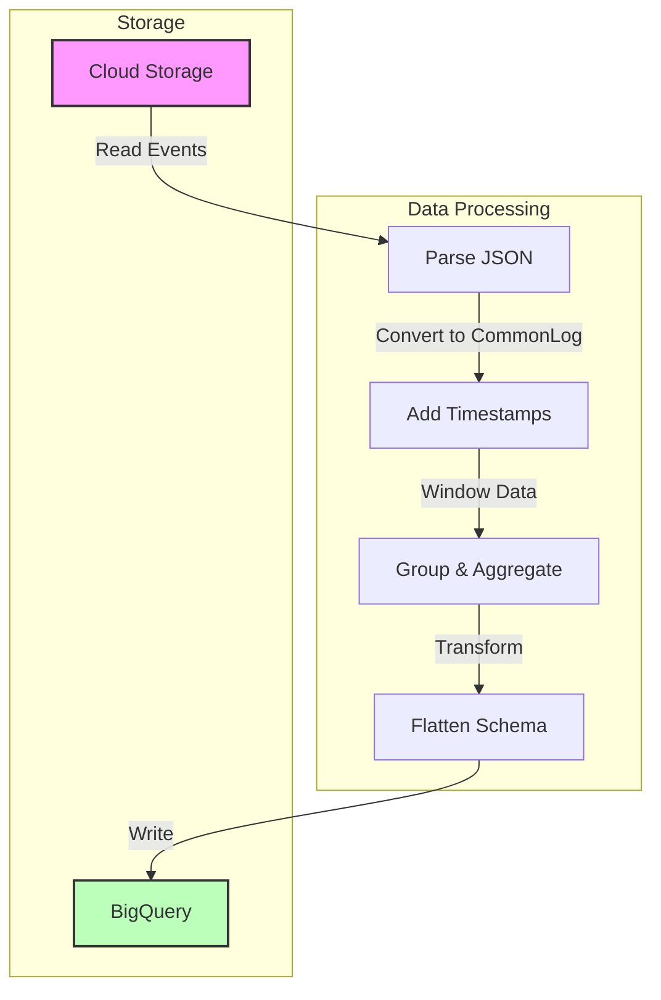

# Apache Beam Batch Pipeline for BigQuery Analytics

## Pipeline Architecture



## Project Structure
```
batch-analytics/
├── src/
│   └── main/
│       └── java/
│           └── com/
│               └── mypackage/
│                   └── pipeline/
│                       ├── BatchUserTrafficPipeline.java
│                       ├── BatchMinuteTrafficPipeline.java
│                       └── model/
│                           └── CommonLog.java
├── data/
│   └── events.json
└── pom.xml
```

## 1. User Traffic Analysis Pipeline

### Step 1: Define CommonLog Schema
```java
@DefaultSchema(JavaFieldSchema.class)
public class CommonLog {
    String user_id;
    String ip;
    String timestamp;
    String http_request;
    Double lat;
    Double lng;
    Long http_response;
    String user_agent;
    Long num_bytes;
}
```

### Step 2: Pipeline Implementation
```java
public class BatchUserTrafficPipeline {
    public interface Options extends PipelineOptions {
        @Description("Input file path")
        String getInputPath();
        void setInputPath(String value);

        @Description("BigQuery table name")
        String getTableName();
        void setTableName(String value);
    }

    public static void main(String[] args) {
        Options options = PipelineOptionsFactory.fromArgs(args)
            .withValidation()
            .as(Options.class);

        Pipeline pipeline = Pipeline.create(options);

        // Read and process events
        pipeline.apply("ReadEvents", TextIO.read().from(options.getInputPath()))
            .apply("ParseJson", ParDo.of(new DoFn<String, CommonLog>() {
                @ProcessElement
                public void processElement(@Element String json, OutputReceiver<CommonLog> r) {
                    Gson gson = new Gson();
                    CommonLog commonLog = gson.fromJson(json, CommonLog.class);
                    r.output(commonLog);
                }
            }))
            // Group by user and aggregate
            .apply("AggregateByUser", Group.<CommonLog>byFieldNames("user_id")
                .aggregateField("*", Count.combineFn(), "pageviews")
                .aggregateField("num_bytes", Sum.ofLongs(), "total_bytes"))
            // Flatten schema
            .apply("FlattenSchema", Select.fieldNames(
                "key.user_id", 
                "value.pageviews",
                "value.total_bytes"))
            // Write to BigQuery
            .apply("WriteToBQ", BigQueryIO.<Row>write()
                .to(options.getTableName())
                .useBeamSchema()
                .withWriteDisposition(WriteDisposition.WRITE_TRUNCATE));

        pipeline.run();
    }
}
```

## 2. Minute-based Traffic Analysis Pipeline

### Step 1: Add Timestamp Processing
```java
public class BatchMinuteTrafficPipeline {
    private static final Schema pageViewsSchema = Schema
        .builder()
        .addStringField("minute")
        .addInt64Field("pageviews")
        .build();

    static class AddTimestamps extends DoFn<CommonLog, CommonLog> {
        @ProcessElement
        public void processElement(@Element CommonLog log, OutputReceiver<CommonLog> r) {
            r.outputWithTimestamp(
                log,
                Instant.parse(log.timestamp)
            );
        }
    }

    public static void main(String[] args) {
        Pipeline pipeline = Pipeline.create(options);

        pipeline.apply("ReadEvents", TextIO.read().from(options.getInputPath()))
            .apply("ParseJson", ParDo.of(new ParseEventFn()))
            .apply("AddTimestamps", ParDo.of(new AddTimestamps()))
            .apply("WindowByMinute", Window.<CommonLog>into(
                FixedWindows.of(Duration.standardMinutes(1))))
            .apply("CountPerWindow", Combine.globally(Count.<CommonLog>combineFn())
                .withoutDefaults())
            .apply("FormatWindowOutput", ParDo.of(new FormatWindowOutputFn()))
            .apply("WriteToBQ", BigQueryIO.<Row>write()
                .to(options.getTableName())
                .useBeamSchema()
                .withWriteDisposition(WriteDisposition.WRITE_TRUNCATE));

        pipeline.run();
    }
}
```

### Step 2: Window Processing
```java
static class FormatWindowOutputFn extends DoFn<Long, Row> {
    @ProcessElement
    public void processElement(@Element Long count, 
                             OutputReceiver<Row> r,
                             IntervalWindow window) {
        Instant windowStart = Instant.ofEpochMilli(window.start().getMillis());
        String minute = windowStart.toString();
        
        Row row = Row.withSchema(pageViewsSchema)
            .addValues(minute, count)
            .build();
        
        r.output(row);
    }
}
```

## 3. Deployment Instructions

### Step 1: Build Project
```bash
# Set up environment
export BASE_DIR=$(pwd)
mvn clean dependency:resolve

# Generate test data
source create_batch_sinks.sh
source generate_batch_events.sh
```

### Step 2: Run Pipeline
```bash
# Set environment variables
export PROJECT_ID=$(gcloud config get-value project)
export REGION="your-region"
export BUCKET=gs://${PROJECT_ID}
export PIPELINE_FOLDER=${BUCKET}
export INPUT_PATH=${PIPELINE_FOLDER}/events.json
export TABLE_NAME=${PROJECT_ID}:logs.user_traffic

# Run pipeline
mvn compile exec:java \
  -Dexec.mainClass=com.mypackage.pipeline.BatchUserTrafficPipeline \
  -Dexec.args=" \
    --project=${PROJECT_ID} \
    --region=${REGION} \
    --stagingLocation=${PIPELINE_FOLDER}/staging \
    --tempLocation=${PIPELINE_FOLDER}/temp \
    --runner=DataflowRunner \
    --inputPath=${INPUT_PATH} \
    --tableName=${TABLE_NAME}"
```

## 4. Best Practices

1. **Schema Management**
   - Use Beam schemas for type safety
   - Flatten nested schemas before writing to BigQuery
   - Define clear schema structures

2. **Performance Optimization**
   - Use appropriate window sizes
   - Implement efficient aggregations
   - Monitor resource usage

3. **Error Handling**
   - Validate input data
   - Handle parsing errors gracefully
   - Monitor pipeline execution

4. **Development Workflow**
   - Test with DirectRunner first
   - Use small datasets for testing
   - Monitor BigQuery loads

## 5. Monitoring and Verification

1. **Pipeline Monitoring**
```sql
-- Verify user traffic data
SELECT user_id, pageviews, total_bytes
FROM `your-project.logs.user_traffic`
ORDER BY pageviews DESC
LIMIT 10;

-- Verify minute-based traffic
SELECT minute, pageviews
FROM `your-project.logs.minute_traffic`
ORDER BY minute ASC;
```

2. **Common Issues and Solutions**
   - Schema mismatch: Verify schema definition
   - Data parsing errors: Check input data format
   - Performance issues: Monitor worker counts
   - Resource errors: Check quota limits

Remember to test your pipeline thoroughly with representative data before deploying to production.