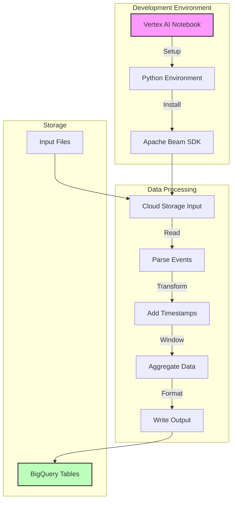

# Google Dataflow Analytics Pipeline Implementation Guide

## Pipeline Architecture



## Project Structure
```
dataflow-analytics/
├── pipelines/
│   ├── batch_user_traffic_pipeline.py
│   └── batch_minute_traffic_pipeline.py
├── data/
│   └── events.json
├── utils/
│   └── beam_utils.py
└── requirements.txt
```

## 1. Development Environment Setup

### Step 1: Create Vertex AI Notebook
```bash
# Enable required APIs
gcloud services enable notebooks.googleapis.com
gcloud services enable dataflow.googleapis.com

# Create Python virtual environment
python3 -m venv df-env
source df-env/bin/activate

# Install dependencies
pip install apache-beam[gcp]
```

### Step 2: Initialize Project Structure
```bash
# Clone repository
git clone https://github.com/GoogleCloudPlatform/training-data-analyst
cd training-data-analyst/quests/dataflow_python/

# Set up environment variables
export BASE_DIR=$(pwd)
export PROJECT_ID=$(gcloud config get-value project)
export BUCKET=gs://${PROJECT_ID}
```

## 2. User Traffic Analysis Pipeline

### Step 1: Pipeline Configuration
```python
import apache_beam as beam
from apache_beam.options.pipeline_options import PipelineOptions

class UserTrafficOptions(PipelineOptions):
    @classmethod
    def _add_argparse_args(cls, parser):
        parser.add_argument('--input_path')
        parser.add_argument('--table_name')

def run():
    options = UserTrafficOptions()
    with beam.Pipeline(options=options) as pipeline:
        # Pipeline steps here
```

### Step 2: Event Processing
```python
class ParseEventFn(beam.DoFn):
    def process(self, element):
        """Parse JSON event data."""
        import json
        event = json.loads(element)
        yield event

def create_pipeline(p, input_path, table_name):
    return (p 
        | 'ReadEvents' >> beam.io.ReadFromText(input_path)
        | 'ParseEvents' >> beam.ParDo(ParseEventFn())
    )
```

### Step 3: User Aggregation
```python
class PerUserAggregation(typing.NamedTuple):
    user_id: str
    pageviews: int
    total_bytes: int
    max_bytes: int
    min_bytes: int

beam.coders.registry.register_coder(PerUserAggregation, beam.coders.RowCoder)

def aggregate_user_metrics(events):
    return (events
        | 'GroupByUser' >> beam.GroupBy('user_id')
            .aggregate_field('*', beam.combiners.CountCombineFn(), 'pageviews')
            .aggregate_field('num_bytes', sum, 'total_bytes')
            .aggregate_field('num_bytes', max, 'max_bytes')
            .aggregate_field('num_bytes', min, 'min_bytes')
        | 'TypeConversion' >> beam.WithType(PerUserAggregation)
    )
```

## 3. Minute Traffic Analysis Pipeline

### Step 1: Add Timestamps
```python
def add_timestamps(element):
    """Add timestamps to events."""
    from datetime import datetime
    ts = datetime.strptime(element['timestamp'], '%Y-%m-%d %H:%M:%S')
    return beam.window.TimestampedValue(element, ts.timestamp())

def create_timestamped_events(events):
    return events | 'AddTimestamps' >> beam.Map(add_timestamps)
```

### Step 2: Window Implementation
```python
def apply_fixed_windows(events):
    """Apply one-minute fixed windows."""
    return events | 'WindowEvents' >> beam.WindowInto(
        beam.window.FixedWindows(60)  # 60-second windows
    )
```

### Step 3: Count and Format
```python
class FormatWindowOutputFn(beam.DoFn):
    def process(self, element, window=beam.DoFn.WindowParam):
        import datetime
        window_start = window.start.to_utc_datetime()
        yield {
            'timestamp': window_start.strftime('%Y-%m-%d %H:%M:%S'),
            'pageviews': element
        }

def count_and_format(windowed_events):
    return (windowed_events
        | 'CountPerWindow' >> beam.CombineGlobally(
            beam.combiners.CountCombineFn()
        ).without_defaults()
        | 'FormatOutput' >> beam.ParDo(FormatWindowOutputFn())
    )
```

## 4. Pipeline Deployment

### Step 1: User Traffic Pipeline
```bash
# Set environment variables
export PIPELINE_FOLDER=${BUCKET}
export INPUT_PATH=${PIPELINE_FOLDER}/events.json
export TABLE_NAME=${PROJECT_ID}:logs.user_traffic

# Run pipeline
python batch_user_traffic_pipeline.py \
    --project=${PROJECT_ID} \
    --region=${REGION} \
    --staging_location=${PIPELINE_FOLDER}/staging \
    --temp_location=${PIPELINE_FOLDER}/temp \
    --runner=DataflowRunner \
    --input_path=${INPUT_PATH} \
    --table_name=${TABLE_NAME}
```

### Step 2: Minute Traffic Pipeline
```bash
# Update table name for minute traffic
export TABLE_NAME=${PROJECT_ID}:logs.minute_traffic

# Run pipeline
python batch_minute_traffic_pipeline.py \
    --project=${PROJECT_ID} \
    --region=${REGION} \
    --staging_location=${PIPELINE_FOLDER}/staging \
    --temp_location=${PIPELINE_FOLDER}/temp \
    --runner=DataflowRunner \
    --input_path=${INPUT_PATH} \
    --table_name=${TABLE_NAME}
```

## 5. Verification and Monitoring

### Step 1: BigQuery Verification
```sql
-- Verify user traffic
SELECT user_id, pageviews, total_bytes
FROM `your-project.logs.user_traffic`
ORDER BY pageviews DESC
LIMIT 10;

-- Verify minute traffic
SELECT timestamp, pageviews
FROM `your-project.logs.minute_traffic`
ORDER BY timestamp
LIMIT 10;
```

### Step 2: Pipeline Monitoring
```python
def add_monitoring(pipeline):
    """Add monitoring to pipeline."""
    (pipeline
        | 'CreateMetrics' >> beam.Map(create_metrics)
        | 'WriteMetrics' >> beam.io.WriteToText('metrics.txt')
    )
```

## Best Practices

1. **Development Workflow**
   - Use DirectRunner for initial testing
   - Test with small data samples
   - Implement proper error handling

2. **Performance Optimization**
   - Choose appropriate window sizes
   - Monitor memory usage
   - Use efficient aggregations

3. **Resource Management**
   - Set appropriate machine types
   - Monitor worker counts
   - Handle quota limits

4. **Error Handling**
   - Validate input data
   - Handle parsing errors
   - Implement retry logic

Remember to thoroughly test your pipelines locally before deploying to Dataflow, and monitor resource usage during execution.