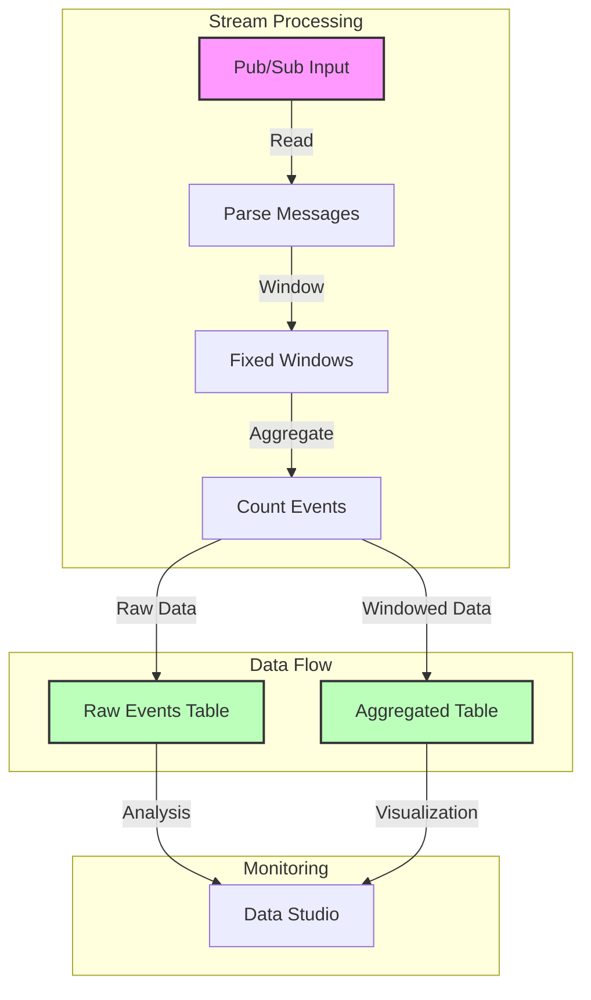
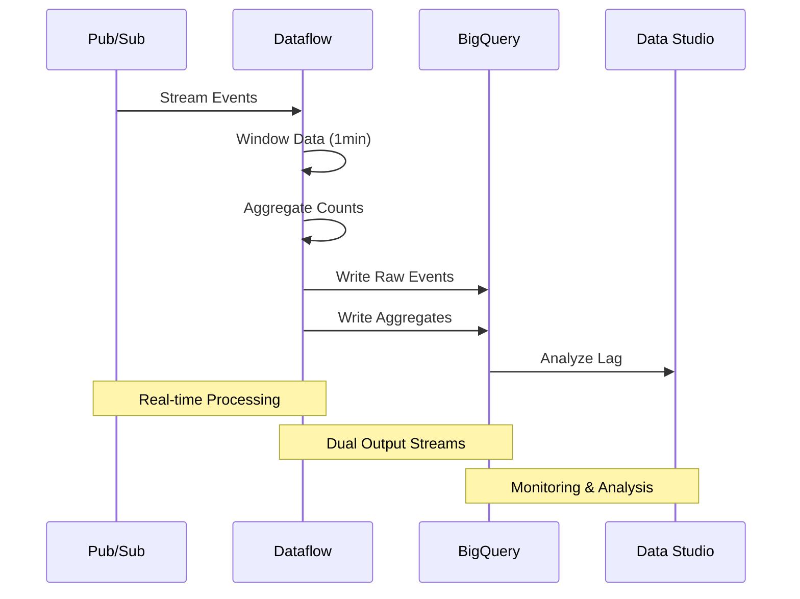

# Google BigQuery Streaming Analytics Pipeline Implementation Guide

## Pipeline Architecture



## Stream Processing Flow



## 1. Project Setup

### Step 1: Environment Configuration
```bash
# Set up environment variables
export BASE_DIR=$(pwd)
export PROJECT_ID=$(gcloud config get-value project)
export REGION="your-region"
export BUCKET=gs://${PROJECT_ID}

# Create required resources
source create_streaming_sinks.sh
```

### Step 2: Project Structure
```
streaming-analytics/
├── src/
│   └── main/
│       └── java/
│           └── com/
│               └── mypackage/
│                   └── pipeline/
│                       ├── StreamingMinuteTrafficPipeline.java
│                       └── model/
│                           └── CommonLog.java
├── scripts/
│   └── generate_streaming_events.sh
└── pom.xml
```

## 2. Pipeline Implementation

### Step 1: Define Pipeline Options
```java
public interface StreamingOptions extends PipelineOptions {
    @Description("Input Pub/Sub topic")
    String getInputTopic();
    void setInputTopic(String value);

    @Description("Window duration in seconds")
    Integer getWindowDuration();
    void setWindowDuration(Integer value);

    @Description("BigQuery aggregate table")
    String getAggregateTableName();
    void setAggregateTableName(String value);

    @Description("BigQuery raw events table")
    String getRawTableName();
    void setRawTableName(String value);
}
```

### Step 2: Implement Streaming Source
```java
public static void main(String[] args) {
    StreamingOptions options = PipelineOptionsFactory.fromArgs(args)
        .withValidation()
        .as(StreamingOptions.class);

    Pipeline pipeline = Pipeline.create(options);

    // Read from Pub/Sub
    PCollection<String> messages = pipeline
        .apply("ReadPubSub", PubsubIO.readStrings()
            .fromTopic(options.getInputTopic())
            .withTimestampAttribute("timestamp"));

    // Parse messages
    PCollection<CommonLog> events = messages
        .apply("ParseJson", ParDo.of(new JsonToCommonLog()));
}
```

### Step 3: Implement Windowing
```java
// Window definition
private static PCollection<CommonLog> applyWindowing(
    PCollection<CommonLog> events, 
    Integer windowDuration) {
    
    return events.apply("FixedWindows", 
        Window.<CommonLog>into(
            FixedWindows.of(Duration.standardSeconds(windowDuration))
        ));
}

// Window aggregation schema
private static final Schema pageViewsSchema = Schema
    .builder()
    .addStringField("minute")
    .addInt64Field("pageviews")
    .build();
```

### Step 4: Implement Aggregation
```java
static class CountEvents extends PTransform<
    PCollection<CommonLog>, 
    PCollection<Row>> {
    
    @Override
    public PCollection<Row> expand(PCollection<CommonLog> input) {
        return input
            .apply("CountPerWindow", 
                Combine.globally(Count.<CommonLog>combineFn())
                    .withoutDefaults())
            .apply("FormatCounts", ParDo.of(new FormatCountsFn()))
            .setRowSchema(pageViewsSchema);
    }
}

static class FormatCountsFn extends DoFn<Long, Row> {
    @ProcessElement
    public void processElement(
        @Element Long count,
        OutputReceiver<Row> receiver,
        IntervalWindow window) {
        
        Instant windowEnd = Instant.ofEpochMilli(
            window.end().getMillis());
            
        Row row = Row.withSchema(pageViewsSchema)
            .addValues(
                windowEnd.toString(),
                count
            )
            .build();
            
        receiver.output(row);
    }
}
```

### Step 5: Write to BigQuery
```java
// Write aggregated data
events
    .apply("WindowAndCount", new CountEvents())
    .apply("WriteAggregates", BigQueryIO.<Row>write()
        .to(options.getAggregateTableName())
        .useBeamSchema()
        .withWriteDisposition(WriteDisposition.WRITE_APPEND)
        .withCreateDisposition(CreateDisposition.CREATE_IF_NEEDED));

// Write raw events
events
    .apply("AddProcessingTime", ParDo.of(new AddProcessingTimeFn()))
    .apply("WriteRawEvents", BigQueryIO.<Row>write()
        .to(options.getRawTableName())
        .useBeamSchema()
        .withWriteDisposition(WriteDisposition.WRITE_APPEND)
        .withCreateDisposition(CreateDisposition.CREATE_IF_NEEDED));
```

## 3. Deployment and Execution

### Step 1: Deploy Pipeline
```bash
export PUBSUB_TOPIC=projects/${PROJECT_ID}/topics/my_topic
export WINDOW_DURATION=60
export AGGREGATE_TABLE_NAME=${PROJECT_ID}:logs.windowed_traffic
export RAW_TABLE_NAME=${PROJECT_ID}:logs.raw

mvn compile exec:java \
  -Dexec.mainClass=com.mypackage.pipeline.StreamingMinuteTrafficPipeline \
  -Dexec.args=" \
    --project=${PROJECT_ID} \
    --region=${REGION} \
    --stagingLocation=${BUCKET}/staging \
    --tempLocation=${BUCKET}/temp \
    --runner=DataflowRunner \
    --inputTopic=${PUBSUB_TOPIC} \
    --windowDuration=${WINDOW_DURATION} \
    --aggregateTableName=${AGGREGATE_TABLE_NAME} \
    --rawTableName=${RAW_TABLE_NAME}"
```

### Step 2: Generate Test Data
```bash
# Generate events without lag
bash generate_streaming_events.sh

# Generate events with lag
bash generate_streaming_events.sh true
```

## 4. Monitoring and Analysis

### Step 1: Basic Traffic Analysis
```sql
-- Monitor windowed traffic
SELECT minute, pageviews
FROM `logs.windowed_traffic`
ORDER BY minute ASC
LIMIT 1000;
```

### Step 2: Lag Analysis
```sql
-- Analyze processing lag
SELECT
    UNIX_MILLIS(event_timestamp) - min_millis.min_event_millis AS event_millis,
    UNIX_MILLIS(processing_timestamp) - min_millis.min_event_millis AS processing_millis,
    user_id
FROM `logs.raw`
CROSS JOIN (
    SELECT MIN(UNIX_MILLIS(event_timestamp)) AS min_event_millis
    FROM `logs.raw`
) min_millis
WHERE event_timestamp IS NOT NULL
ORDER BY event_millis ASC;
```

### Step 3: Data Studio Visualization
1. Create new Data Studio report
2. Connect to BigQuery tables
3. Create scatter plot:
   - X-axis: event_millis
   - Y-axis: processing_millis
   - Dimension: unique identifier

## Best Practices

1. **Stream Processing**
   - Handle late data appropriately
   - Use appropriate window sizes
   - Monitor processing lag

2. **Data Quality**
   - Validate incoming messages
   - Handle parsing errors
   - Monitor data completeness

3. **Performance**
   - Monitor streaming quotas
   - Balance window size vs. latency
   - Use appropriate machine types

4. **Monitoring**
   - Set up alerts for lag
   - Monitor streaming errors
   - Track processing latency

Remember to adjust window sizes and processing parameters based on your specific use case and latency requirements.