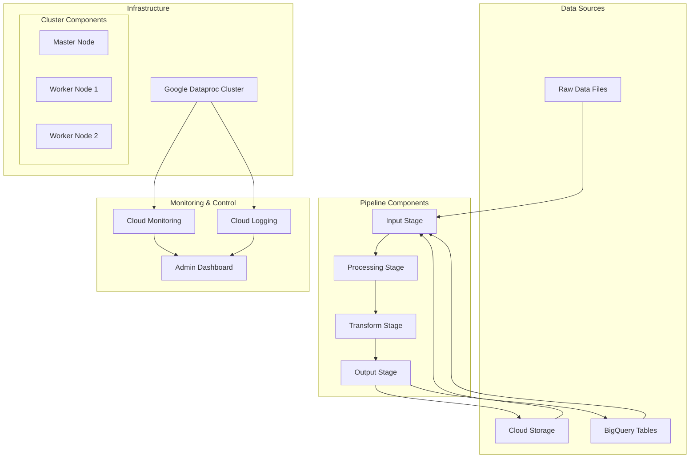

# Spark Data Pipeline Implementation Guide

## Table of Contents
- [Architecture Overview](#architecture-overview)
- [Project Structure](#project-structure)
- [Installation](#installation)
- [Configuration](#configuration)
- [Implementation Guide](#implementation-guide)
- [Deployment](#deployment)
- [Monitoring](#monitoring)
- [Best Practices](#best-practices)

## Architecture Overview

The following diagram illustrates the high-level architecture of the data pipeline:



## Project Structure

```
spark-pipeline/
├── config/
│   ├── cluster_config.yaml     # Cluster configuration
│   ├── job_config.yaml        # Job-specific configurations
│   └── monitoring_config.yaml # Monitoring settings
├── scripts/
│   ├── deploy/
│   │   ├── deploy_cluster.py  # Cluster deployment script
│   │   └── deploy_jobs.py     # Job deployment utilities
│   └── init-actions/
│       └── install_deps.sh    # Cluster initialization script
├── src/
│   ├── pipeline/
│   │   ├── __init__.py
│   │   ├── input_stage.py     # Data ingestion logic
│   │   ├── process_stage.py   # Data processing logic
│   │   ├── transform_stage.py # Data transformation logic
│   │   └── output_stage.py    # Data output handling
│   └── utils/
│       ├── __init__.py
│       ├── monitoring.py      # Monitoring utilities
│       └── validation.py      # Data validation utilities
├── tests/
│   ├── test_input_stage.py
│   ├── test_process_stage.py
│   └── test_transform_stage.py
├── README.md
└── requirements.txt
```

## Installation

1. Clone the repository:
```bash
git clone https://github.com/your-org/spark-pipeline.git
cd spark-pipeline
```

2. Set up Python virtual environment:
```bash
python -m venv venv
source venv/bin/activate  # On Windows: venv\Scripts\activate
```

3. Install dependencies:
```bash
pip install -r requirements.txt
```

## Configuration

### Cluster Configuration
```yaml
# config/cluster_config.yaml
cluster_name: spark-pipeline-cluster
zone: us-central1-a
master_config:
  machine_type: n1-standard-4
  disk_size_gb: 500
worker_config:
  num_instances: 2
  machine_type: n1-standard-4
  disk_size_gb: 500
optional_components:
  - JUPYTER
  - DOCKER
spark_properties:
  spark.dynamicAllocation.enabled: "true"
  spark.shuffle.service.enabled: "true"
```

### Pipeline Configuration
```yaml
# config/job_config.yaml
input:
  source_type: "gcs"  # or "bigquery"
  location: "gs://your-bucket/input-data"
  format: "parquet"
processing:
  validation_rules:
    - column: "value"
      condition: "value > 0"
  transformations:
    - output_col: "transformed_value"
      expression: "value * 2"
output:
  destination_type: "bigquery"
  location: "project.dataset.table"
  write_mode: "overwrite"
```

## Implementation Guide

### 1. Data Ingestion Stage
```python
# src/pipeline/input_stage.py
from pyspark.sql import SparkSession
from pyspark.sql.functions import col, to_timestamp
import yaml

class DataIngestion:
    def __init__(self, spark: SparkSession, config_path: str):
        self.spark = spark
        with open(config_path, 'r') as f:
            self.config = yaml.safe_load(f)
    
    def read_from_storage(self, path: str, format: str = "parquet"):
        """Read data from Cloud Storage"""
        return self.spark.read.format(format).load(path)
    
    def read_from_bigquery(self, table: str):
        """Read data from BigQuery"""
        return self.spark.read.format('bigquery') \
                   .option('table', table) \
                   .load()
```

### 2. Data Processing Stage
```python
# src/pipeline/process_stage.py
from pyspark.sql import DataFrame
from pyspark.sql.functions import *
from typing import List

class DataProcessor:
    def __init__(self, validation_rules: dict):
        self.validation_rules = validation_rules
    
    def validate_data(self, df: DataFrame) -> DataFrame:
        """Apply validation rules to DataFrame"""
        for rule in self.validation_rules:
            df = df.filter(rule['condition'])
        return df
    
    def transform_data(self, df: DataFrame, transformations: List[dict]) -> DataFrame:
        """Apply transformations to DataFrame"""
        for transform in transformations:
            df = df.withColumn(
                transform['output_col'],
                expr(transform['expression'])
            )
        return df
```

### 3. Data Transformation Stage
```python
# src/pipeline/transform_stage.py
from pyspark.sql import DataFrame
from pyspark.ml import Pipeline
from pyspark.ml.feature import StringIndexer, VectorAssembler

class DataTransformer:
    def __init__(self, feature_cols: List[str], label_col: str):
        self.feature_cols = feature_cols
        self.label_col = label_col
    
    def prepare_features(self, df: DataFrame) -> DataFrame:
        """Prepare features for modeling"""
        stages = []
        
        # Handle categorical columns
        for col in self.feature_cols:
            if df.select(col).dtypes[0][1] == 'string':
                indexer = StringIndexer(
                    inputCol=col,
                    outputCol=f"{col}_indexed"
                )
                stages.append(indexer)
        
        # Create feature vector
        assembler = VectorAssembler(
            inputCols=self.feature_cols,
            outputCol="features"
        )
        stages.append(assembler)
        
        # Create and run pipeline
        pipeline = Pipeline(stages=stages)
        return pipeline.fit(df).transform(df)
```

## Deployment

### Deploy Cluster
```bash
python scripts/deploy/deploy_cluster.py \
  --config config/cluster_config.yaml \
  --project your-project-id \
  --region us-central1
```

### Submit Pipeline Job
```bash
python scripts/deploy/deploy_jobs.py \
  --job-config config/job_config.yaml \
  --cluster spark-pipeline-cluster \
  --region us-central1
```

## Monitoring

### Setup Monitoring Dashboard
```python
# src/utils/monitoring.py
from google.cloud import monitoring_v3

def create_dashboard(project_id: str, cluster_name: str):
    client = monitoring_v3.DashboardsServiceClient()
    dashboard = {
        "displayName": f"{cluster_name} Monitoring",
        "gridLayout": {
            "columns": "2",
            "widgets": [
                {
                    "title": "Cluster CPU Usage",
                    "xyChart": {
                        "dataSets": [{
                            "timeSeriesQuery": {
                                "timeSeriesFilter": {
                                    "filter": f'metric.type="dataproc.googleapis.com/cluster/cpu/utilization" AND resource.label.cluster_name="{cluster_name}"'
                                }
                            }
                        }]
                    }
                }
                # Add more widgets as needed
            ]
        }
    }
    return client.create_dashboard(parent=f"projects/{project_id}", dashboard=dashboard)
```

## Best Practices

### Error Handling
```python
def execute_pipeline():
    try:
        # Pipeline execution steps
        df = input_stage.read_data()
        df = process_stage.transform(df)
        output_stage.write_data(df)
    except Exception as e:
        logging.error(f"Pipeline failed: {str(e)}")
        # Send notification
        notify_team(f"Pipeline failure: {str(e)}")
        raise
    finally:
        # Cleanup resources
        cleanup_temporary_files()
```

### Performance Optimization
- Use appropriate partition sizes
- Enable dynamic allocation
- Implement caching strategies
- Monitor memory usage

### Security
- Implement access controls
- Enable data encryption
- Set up audit logging
- Use secure configurations

## Contributing

Please read [CONTRIBUTING.md](CONTRIBUTING.md) for details on our code of conduct and the process for submitting pull requests.

## License

This project is licensed under the MIT License - see the [LICENSE.md](LICENSE.md) file for details
