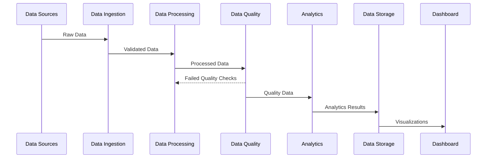
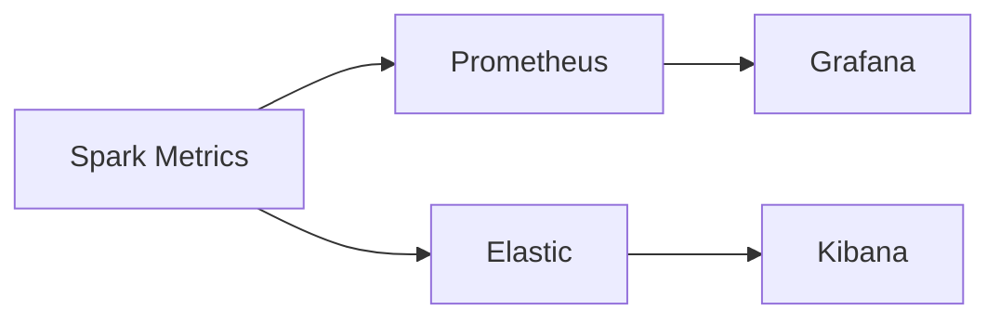

# Production Spark System Implementation Guide

## Table of Contents
- [Overview](#overview)
- [System Architecture](#system-architecture)
- [Directory Structure](#directory-structure)
- [Implementation Steps](#implementation-steps)
- [Components](#components)
- [Deployment](#deployment)
- [Monitoring](#monitoring)
- [Troubleshooting](#troubleshooting)

## Overview

This document provides a comprehensive guide for implementing a production-grade Apache Spark system for data processing, analysis, and visualization. The system handles data ingestion, transformation, analysis, and presents insights through a data science dashboard.

## System Architecture


### Data Pipeline Flow


## Directory Structure

```
spark-production/
├── .github/
│   └── workflows/
│       ├── ci.yml
│       └── cd.yml
├── airflow/
│   ├── dags/
│   │   ├── ingestion_dag.py
│   │   └── processing_dag.py
│   └── plugins/
├── config/
│   ├── prod/
│   ├── stage/
│   └── dev/
├── data/
│   ├── raw/
│   ├── processed/
│   └── analytics/
├── notebooks/
│   ├── exploration/
│   └── analysis/
├── src/
│   ├── ingestion/
│   │   ├── __init__.py
│   │   ├── readers.py
│   │   └── validators.py
│   ├── processing/
│   │   ├── __init__.py
│   │   ├── transformers.py
│   │   └── enrichers.py
│   ├── quality/
│   │   ├── __init__.py
│   │   └── checks.py
│   ├── analytics/
│   │   ├── __init__.py
│   │   ├── models.py
│   │   └── features.py
│   └── dashboard/
│       ├── __init__.py
│       ├── app.py
│       └── views/
├── tests/
│   ├── unit/
│   ├── integration/
│   └── e2e/
├── docker/
│   ├── spark/
│   ├── airflow/
│   └── dashboard/
├── docs/
│   ├── architecture/
│   ├── api/
│   └── deployment/
├── requirements/
│   ├── base.txt
│   ├── dev.txt
│   └── prod.txt
├── Makefile
├── README.md
└── setup.py
```

## Implementation Steps

### 1. Environment Setup

```bash
# Create virtual environment
python -m venv venv
source venv/bin/activate

# Install dependencies
pip install -r requirements/dev.txt

# Setup pre-commit hooks
pre-commit install
```
## Building Spark

Spark is built using [Apache Maven](https://maven.apache.org/).
To build Spark and its example programs, run:

```bash
./build/mvn -DskipTests clean package
```

(You do not need to do this if you downloaded a pre-built package.)

More detailed documentation is available from the project site, at
["Building Spark"](https://spark.apache.org/docs/latest/building-spark.html).

For general development tips, including info on developing Spark using an IDE, see ["Useful Developer Tools"](https://spark.apache.org/developer-tools.html).

## Interactive Scala Shell

The easiest way to start using Spark is through the Scala shell:

```bash
./bin/spark-shell
```

Try the following command, which should return 1,000,000,000:

```scala
scala> spark.range(1000 * 1000 * 1000).count()
```

## Interactive Python Shell

Alternatively, if you prefer Python, you can use the Python shell:

```bash
./bin/pyspark
```

And run the following command, which should also return 1,000,000,000:

```python
>>> spark.range(1000 * 1000 * 1000).count()
```

## Example Programs

Spark also comes with several sample programs in the `examples` directory.
To run one of them, use `./bin/run-example <class> [params]`. For example:

```bash
./bin/run-example SparkPi
```

will run the Pi example locally.

You can set the MASTER environment variable when running examples to submit
examples to a cluster. This can be spark:// URL,
"yarn" to run on YARN, and "local" to run
locally with one thread, or "local[N]" to run locally with N threads. You
can also use an abbreviated class name if the class is in the `examples`
package. For instance:

```bash
MASTER=spark://host:7077 ./bin/run-example SparkPi
```

Many of the example programs print usage help if no params are given.

## Running Tests

Testing first requires [building Spark](#building-spark). Once Spark is built, tests
can be run using:

```bash
./dev/run-tests
```

Please see the guidance on how to
[run tests for a module, or individual tests](https://spark.apache.org/developer-tools.html#individual-tests).

There is also a Kubernetes integration test, see resource-managers/kubernetes/integration-tests/README.md

## A Note About Hadoop Versions

Spark uses the Hadoop core library to talk to HDFS and other Hadoop-supported
storage systems. Because the protocols have changed in different versions of
Hadoop, you must build Spark against the same version that your cluster runs.

Please refer to the build documentation at
["Specifying the Hadoop Version and Enabling YARN"](https://spark.apache.org/docs/latest/building-spark.html#specifying-the-hadoop-version-and-enabling-yarn)
for detailed guidance on building for a particular distribution of Hadoop, including
building for particular Hive and Hive Thriftserver distributions.

## Configuration

Please refer to the [Configuration Guide](https://spark.apache.org/docs/latest/configuration.html)
in the online documentation for an overview on how to configure Spark.

## Contributing

Please review the [Contribution to Spark guide](https://spark.apache.org/contributing.html)
for information on how to get started contributing to the project.
### 2. Data Ingestion Implementation

```python
# src/ingestion/readers.py
from pyspark.sql import SparkSession
from typing import Dict, Any

class DataReader:
    def __init__(self, spark: SparkSession, config: Dict[str, Any]):
        self.spark = spark
        self.config = config

    def read_csv(self, path: str) -> DataFrame:
        return self.spark.read.csv(
            path,
            header=True,
            inferSchema=True
        )

    def read_json(self, path: str) -> DataFrame:
        return self.spark.read.json(path)
```

### 3. Data Processing Setup

```python
# src/processing/transformers.py
from pyspark.sql import DataFrame
from pyspark.sql.functions import *

class DataTransformer:
    def clean_data(self, df: DataFrame) -> DataFrame:
        return df.dropDuplicates().na.fill(0)

    def transform_features(self, df: DataFrame) -> DataFrame:
        return df.withColumn(
            "processed_date",
            current_timestamp()
        )
```

### 4. Quality Checks Implementation

```python
# src/quality/checks.py
from great_expectations.dataset import SparkDFDataset

class QualityChecker:
    def check_data_quality(self, df: DataFrame) -> bool:
        ge_df = SparkDFDataset(df)
        
        results = ge_df.expect_column_values_to_not_be_null(
            "customer_id"
        )
        return results["success"]
```

### 5. Analytics Pipeline Setup

```python
# src/analytics/models.py
from pyspark.ml import Pipeline
from pyspark.ml.feature import VectorAssembler
from pyspark.ml.classification import RandomForestClassifier

class ModelTrainer:
    def create_pipeline(self) -> Pipeline:
        assembler = VectorAssembler(
            inputCols=["feature1", "feature2"],
            outputCol="features"
        )
        
        rf = RandomForestClassifier(
            labelCol="label",
            featuresCol="features"
        )
        
        return Pipeline(stages=[assembler, rf])
```

### 6. Dashboard Implementation

```python
# src/dashboard/app.py
import streamlit as st
import plotly.express as px

def create_dashboard():
    st.title("Data Science Dashboard")
    
    # Load data
    data = load_processed_data()
    
    # Create visualizations
    fig = px.line(
        data,
        x="date",
        y="metric",
        title="Trend Analysis"
    )
    st.plotly_chart(fig)
```

## Deployment

### Docker Deployment

```yaml
# docker-compose.yml
version: '3'
services:
  spark-master:
    build: ./docker/spark
    ports:
      - "8080:8080"
    volumes:
      - ./data:/data

  airflow:
    build: ./docker/airflow
    ports:
      - "8081:8081"
    depends_on:
      - spark-master

  dashboard:
    build: ./docker/dashboard
    ports:
      - "8501:8501"
    depends_on:
      - spark-master
```

### Kubernetes Deployment

```yaml
# k8s/spark-deployment.yaml
apiVersion: apps/v1
kind: Deployment
metadata:
  name: spark-master
spec:
  replicas: 1
  template:
    spec:
      containers:
      - name: spark-master
        image: spark-master:latest
        ports:
        - containerPort: 8080
```

## Monitoring

### Metrics Collection


### Alert Configuration
```yaml
# prometheus/alerts.yml
groups:
- name: spark-alerts
  rules:
  - alert: SparkJobFailed
    expr: spark_job_status == 0
    for: 5m
    labels:
      severity: critical
```

## Troubleshooting

Common issues and their solutions:

1. **Spark Job Failures**
   - Check logs: `kubectl logs -f spark-master-pod`
   - Verify resource allocation
   - Check data quality issues

2. **Dashboard Performance**
   - Monitor memory usage
   - Optimize queries
   - Check caching implementation

3. **Data Quality Issues**
   - Review validation logs
   - Check source data integrity
   - Verify transformation logic

## Contributing

1. Fork the repository
2. Create feature branch
3. Commit changes
4. Create pull request

## License

MIT License - see LICENSE file for details
