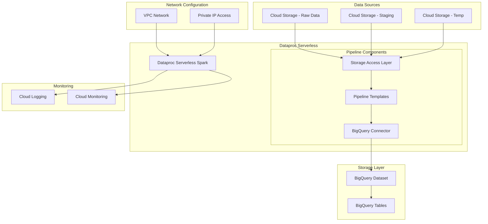

# Serverless Spark Data Pipeline Implementation Guide

## Table of Contents
- [Overview](#overview)
- [Architecture](#architecture)
- [Project Structure](#project-structure)
- [Prerequisites](#prerequisites)
- [Implementation Steps](#implementation-steps)
- [Configuration](#configuration)
- [Deployment](#deployment)
- [Monitoring](#monitoring)
- [Best Practices](#best-practices)

## Overview

This guide provides a comprehensive implementation of a serverless Spark data pipeline using Google Cloud Dataproc. The pipeline processes data from Cloud Storage and loads it into BigQuery using Dataproc's serverless capabilities.

## Architecture



## Project Structure

```
serverless-pipeline/
├── config/
│   ├── pipeline_config.yaml       # Pipeline configuration
│   └── monitoring_config.yaml     # Monitoring settings
├── scripts/
│   ├── deploy/
│   │   ├── deploy_pipeline.py     # Main deployment script
│   │   └── setup_environment.sh   # Environment setup script
│   └── templates/
│       └── gcs_to_bq.py          # GCS to BigQuery template
├── src/
│   ├── processors/
│   │   ├── __init__.py
│   │   ├── data_processor.py      # Data processing logic
│   │   └── data_validator.py      # Data validation logic
│   └── utils/
│       ├── __init__.py
│       ├── monitoring.py          # Monitoring utilities
│       └── storage.py             # Storage utilities
├── tests/
│   ├── test_processor.py
│   └── test_validator.py
└── README.md
```

## Prerequisites

1. Google Cloud SDK installed
2. Python 3.7+
3. Required permissions:
   - Dataproc Admin
   - Storage Admin
   - BigQuery Admin
   - Network Admin

## Implementation Steps

### 1. Environment Setup

First, set up your environment variables:

```bash
export PROJECT_ID=your-project-id
export REGION=your-region
export BUCKET_NAME=$PROJECT_ID-spark-pipeline
```

Create the required GCP resources:

```bash
# Enable required APIs
gcloud services enable dataproc.googleapis.com
gcloud services enable bigquery.googleapis.com

# Configure network
gcloud compute networks subnets update default \
    --region=$REGION \
    --enable-private-ip-google-access

# Create storage buckets
gsutil mb -p $PROJECT_ID gs://$BUCKET_NAME
gsutil mb -p $PROJECT_ID gs://$BUCKET_NAME-bqtemp

# Create BigQuery dataset
bq mk -d pipeline_dataset
```

### 2. Pipeline Implementation

Create the main pipeline deployment script (`scripts/deploy/deploy_pipeline.py`):

```python
#!/usr/bin/env python3

import os
import argparse
import yaml
from google.cloud import storage, bigquery, dataproc_v1
from google.cloud.dataproc_v1 import BatchController

class ServerlessSparkDeployer:
    def __init__(self, project_id: str, region: str):
        self.project_id = project_id
        self.region = region
        self.batch_client = BatchController(
            client_options={"api_endpoint": f"{region}-dataproc.googleapis.com:443"}
        )

    def submit_batch_job(self, config: dict):
        """Submit Dataproc serverless batch job"""
        batch = {
            "runtime_config": {
                "version": "1.0",
                "properties": {
                    "spark.jars": config['spark_jars'],
                    "spark.submit.deployMode": "cluster"
                }
            },
            "pyspark_batch": {
                "main_python_file_uri": config['main_python_file'],
                "args": [
                    "--template=GCSTOBIGQUERY",
                    f"--gcs.bigquery.input.format={config['input_format']}",
                    f"--gcs.bigquery.input.location={config['input_location']}",
                    f"--gcs.bigquery.output.dataset={config['output_dataset']}",
                    f"--gcs.bigquery.output.table={config['output_table']}",
                    f"--gcs.bigquery.temp.bucket.name={config['temp_bucket']}"
                ]
            }
        }

        parent = f"projects/{self.project_id}/locations/{self.region}"
        operation = self.batch_client.create_batch(
            request={
                "parent": parent,
                "batch": batch
            }
        )
        return operation.result()

def main():
    parser = argparse.ArgumentParser(description='Deploy Serverless Spark Pipeline')
    parser.add_argument('--project-id', required=True)
    parser.add_argument('--region', required=True)
    parser.add_argument('--config', required=True)
    
    args = parser.parse_args()

    with open(args.config, 'r') as f:
        config = yaml.safe_load(f)

    deployer = ServerlessSparkDeployer(args.project_id, args.region)
    
    try:
        result = deployer.submit_batch_job(config)
        print(f"Batch job submitted successfully: {result.name}")
    except Exception as e:
        print(f"Deployment failed: {str(e)}")
        raise

if __name__ == "__main__":
    main()
```

### 3. Data Processing Template

Create the GCS to BigQuery template (`scripts/templates/gcs_to_bq.py`):

```python
from pyspark.sql import SparkSession
import argparse

def process_data(spark, args):
    # Read data from Cloud Storage
    df = spark.read.format(args.input_format) \
        .option("inferSchema", "true") \
        .load(args.input_location)

    # Write to BigQuery
    df.write \
        .format("bigquery") \
        .option("table", f"{args.output_dataset}.{args.output_table}") \
        .option("temporaryGcsBucket", args.temp_bucket) \
        .mode("overwrite") \
        .save()

def main():
    parser = argparse.ArgumentParser()
    parser.add_argument("--input_format", required=True)
    parser.add_argument("--input_location", required=True)
    parser.add_argument("--output_dataset", required=True)
    parser.add_argument("--output_table", required=True)
    parser.add_argument("--temp_bucket", required=True)
    
    args = parser.parse_args()

    spark = SparkSession.builder \
        .appName("GCS to BigQuery") \
        .getOrCreate()

    process_data(spark, args)

if __name__ == "__main__":
    main()
```

### 4. Configuration

Create the pipeline configuration (`config/pipeline_config.yaml`):

```yaml
# Pipeline Configuration
input_format: "avro"
input_location: "gs://${PROJECT_ID}/input"
output_dataset: "pipeline_dataset"
output_table: "processed_data"

# Spark Configuration
spark_jars: "gs://spark-lib/bigquery/spark-bigquery-latest_2.12.jar"
main_python_file: "gs://${PROJECT_ID}/scripts/gcs_to_bq.py"

# Resource Configuration
machine_type: "n1-standard-4"
max_instances: 10

# Monitoring Configuration
monitoring:
  logging_level: "INFO"
  metrics_collection: true
```

## Deployment

1. Upload the processing template:
```bash
gsutil cp scripts/templates/gcs_to_bq.py gs://$BUCKET_NAME/scripts/
```

2. Deploy the pipeline:
```bash
python scripts/deploy/deploy_pipeline.py \
    --project-id=$PROJECT_ID \
    --region=$REGION \
    --config=config/pipeline_config.yaml
```

## Monitoring

### Setup Monitoring Dashboard

```python
from google.cloud import monitoring_v3

def create_dashboard(project_id: str):
    client = monitoring_v3.DashboardsServiceClient()
    dashboard = {
        "displayName": "Serverless Spark Pipeline",
        "gridLayout": {
            "widgets": [
                {
                    "title": "Job Status",
                    "xyChart": {
                        "dataSets": [{
                            "timeSeriesQuery": {
                                "timeSeriesFilter": {
                                    "filter": 'metric.type="dataproc.googleapis.com/batch/job/status"'
                                }
                            }
                        }]
                    }
                }
            ]
        }
    }
    return client.create_dashboard(
        parent=f"projects/{project_id}",
        dashboard=dashboard
    )
```

## Best Practices

### Performance Optimization
- Use appropriate machine types
- Enable dynamic allocation
- Optimize data partitioning
- Use efficient file formats (Parquet/Avro)

### Security
- Enable VPC Service Controls
- Use minimal IAM permissions
- Encrypt data at rest
- Enable audit logging

### Cost Optimization
- Use preemptible instances where possible
- Set appropriate timeout values
- Clean up temporary resources
- Monitor resource usage

### Error Handling
- Implement retry mechanisms
- Set up alerting
- Log relevant information
- Validate input data

## Common Operations

### Check Job Status
```bash
gcloud dataproc batches list \
    --region=$REGION \
    --filter="state=RUNNING"
```

### View Logs
```bash
gcloud logging read "resource.type=dataproc_batch" \
    --project=$PROJECT_ID \
    --limit=10
```

### Monitor Resources
```bash
gcloud monitoring dashboards list \
    --filter="displayName:Serverless Spark Pipeline"
```

## Contributing

Please read [CONTRIBUTING.md](CONTRIBUTING.md) for details on our code of conduct and the process for submitting pull requests.

## License

This project is licensed under the MIT License - see the [LICENSE.md](LICENSE.md) file for details.
