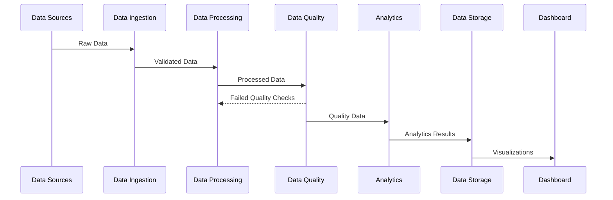
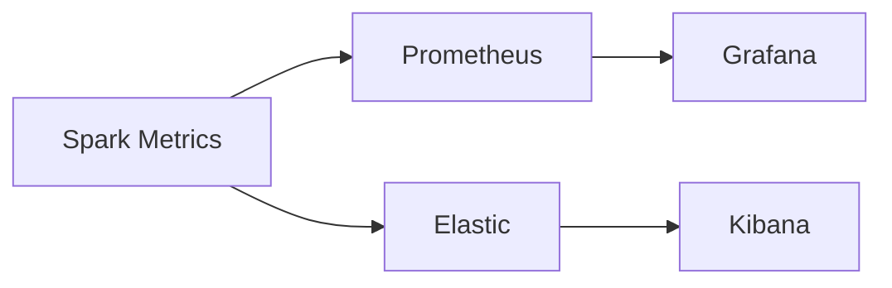

# Production Spark System Implementation Guide

## Table of Contents
- [Overview](#overview)
- [System Architecture](#system-architecture)
- [Directory Structure](#directory-structure)
- [Implementation Steps](#implementation-steps)
- [Components](#components)
- [Deployment](#deployment)
- [Monitoring](#monitoring)
- [Troubleshooting](#troubleshooting)

## Overview

This document provides a comprehensive guide for implementing a production-grade Apache Spark system for data processing, analysis, and visualization. The system handles data ingestion, transformation, analysis, and presents insights through a data science dashboard.

## System Architecture

### High-Level Architecture
```mermaid
flowchart TB
    subgraph Data Sources
        S1[CSV Files]
        S2[JSON Data]
        S3[External APIs]
        S4[Databases]
    end

    subgraph Data Lake
        DL[Raw Data Zone]
        DC[Curated Zone]
        DT[Transformed Zone]
    end

    subgraph Processing Layer
        P1[Spark Batch Jobs]
        P2[Spark Streaming]
        P3[Data Quality Checks]
    end

    subgraph Analytics Layer
        A1[Feature Store]
        A2[ML Models]
        A3[Analytics DB]
    end

    subgraph Presentation Layer
        V1[Dashboard]
        V2[Reports]
        V3[APIs]
    end

    Data Sources --> DL
    DL --> Processing Layer
    Processing Layer --> DC
    DC --> Analytics Layer
    Analytics Layer --> Presentation Layer
```

### Data Pipeline Flow


## Directory Structure

```
spark-production/
├── .github/
│   └── workflows/
│       ├── ci.yml
│       └── cd.yml
├── airflow/
│   ├── dags/
│   │   ├── ingestion_dag.py
│   │   └── processing_dag.py
│   └── plugins/
├── config/
│   ├── prod/
│   ├── stage/
│   └── dev/
├── data/
│   ├── raw/
│   ├── processed/
│   └── analytics/
├── notebooks/
│   ├── exploration/
│   └── analysis/
├── src/
│   ├── ingestion/
│   │   ├── __init__.py
│   │   ├── readers.py
│   │   └── validators.py
│   ├── processing/
│   │   ├── __init__.py
│   │   ├── transformers.py
│   │   └── enrichers.py
│   ├── quality/
│   │   ├── __init__.py
│   │   └── checks.py
│   ├── analytics/
│   │   ├── __init__.py
│   │   ├── models.py
│   │   └── features.py
│   └── dashboard/
│       ├── __init__.py
│       ├── app.py
│       └── views/
├── tests/
│   ├── unit/
│   ├── integration/
│   └── e2e/
├── docker/
│   ├── spark/
│   ├── airflow/
│   └── dashboard/
├── docs/
│   ├── architecture/
│   ├── api/
│   └── deployment/
├── requirements/
│   ├── base.txt
│   ├── dev.txt
│   └── prod.txt
├── Makefile
├── README.md
└── setup.py
```

## Implementation Steps

### 1. Environment Setup

```bash
# Create virtual environment
python -m venv venv
source venv/bin/activate

# Install dependencies
pip install -r requirements/dev.txt

# Setup pre-commit hooks
pre-commit install
```

### 2. Data Ingestion Implementation

```python
# src/ingestion/readers.py
from pyspark.sql import SparkSession
from typing import Dict, Any

class DataReader:
    def __init__(self, spark: SparkSession, config: Dict[str, Any]):
        self.spark = spark
        self.config = config

    def read_csv(self, path: str) -> DataFrame:
        return self.spark.read.csv(
            path,
            header=True,
            inferSchema=True
        )

    def read_json(self, path: str) -> DataFrame:
        return self.spark.read.json(path)
```

### 3. Data Processing Setup

```python
# src/processing/transformers.py
from pyspark.sql import DataFrame
from pyspark.sql.functions import *

class DataTransformer:
    def clean_data(self, df: DataFrame) -> DataFrame:
        return df.dropDuplicates().na.fill(0)

    def transform_features(self, df: DataFrame) -> DataFrame:
        return df.withColumn(
            "processed_date",
            current_timestamp()
        )
```

### 4. Quality Checks Implementation

```python
# src/quality/checks.py
from great_expectations.dataset import SparkDFDataset

class QualityChecker:
    def check_data_quality(self, df: DataFrame) -> bool:
        ge_df = SparkDFDataset(df)
        
        results = ge_df.expect_column_values_to_not_be_null(
            "customer_id"
        )
        return results["success"]
```

### 5. Analytics Pipeline Setup

```python
# src/analytics/models.py
from pyspark.ml import Pipeline
from pyspark.ml.feature import VectorAssembler
from pyspark.ml.classification import RandomForestClassifier

class ModelTrainer:
    def create_pipeline(self) -> Pipeline:
        assembler = VectorAssembler(
            inputCols=["feature1", "feature2"],
            outputCol="features"
        )
        
        rf = RandomForestClassifier(
            labelCol="label",
            featuresCol="features"
        )
        
        return Pipeline(stages=[assembler, rf])
```

### 6. Dashboard Implementation

```python
# src/dashboard/app.py
import streamlit as st
import plotly.express as px

def create_dashboard():
    st.title("Data Science Dashboard")
    
    # Load data
    data = load_processed_data()
    
    # Create visualizations
    fig = px.line(
        data,
        x="date",
        y="metric",
        title="Trend Analysis"
    )
    st.plotly_chart(fig)
```

## Deployment

### Docker Deployment

```yaml
# docker-compose.yml
version: '3'
services:
  spark-master:
    build: ./docker/spark
    ports:
      - "8080:8080"
    volumes:
      - ./data:/data

  airflow:
    build: ./docker/airflow
    ports:
      - "8081:8081"
    depends_on:
      - spark-master

  dashboard:
    build: ./docker/dashboard
    ports:
      - "8501:8501"
    depends_on:
      - spark-master
```

### Kubernetes Deployment

```yaml
# k8s/spark-deployment.yaml
apiVersion: apps/v1
kind: Deployment
metadata:
  name: spark-master
spec:
  replicas: 1
  template:
    spec:
      containers:
      - name: spark-master
        image: spark-master:latest
        ports:
        - containerPort: 8080
```

## Monitoring

### Metrics Collection


### Alert Configuration
```yaml
# prometheus/alerts.yml
groups:
- name: spark-alerts
  rules:
  - alert: SparkJobFailed
    expr: spark_job_status == 0
    for: 5m
    labels:
      severity: critical
```

## Troubleshooting

Common issues and their solutions:

1. **Spark Job Failures**
   - Check logs: `kubectl logs -f spark-master-pod`
   - Verify resource allocation
   - Check data quality issues

2. **Dashboard Performance**
   - Monitor memory usage
   - Optimize queries
   - Check caching implementation

3. **Data Quality Issues**
   - Review validation logs
   - Check source data integrity
   - Verify transformation logic

## Contributing

1. Fork the repository
2. Create feature branch
3. Commit changes
4. Create pull request

## License

MIT License - see LICENSE file for details
