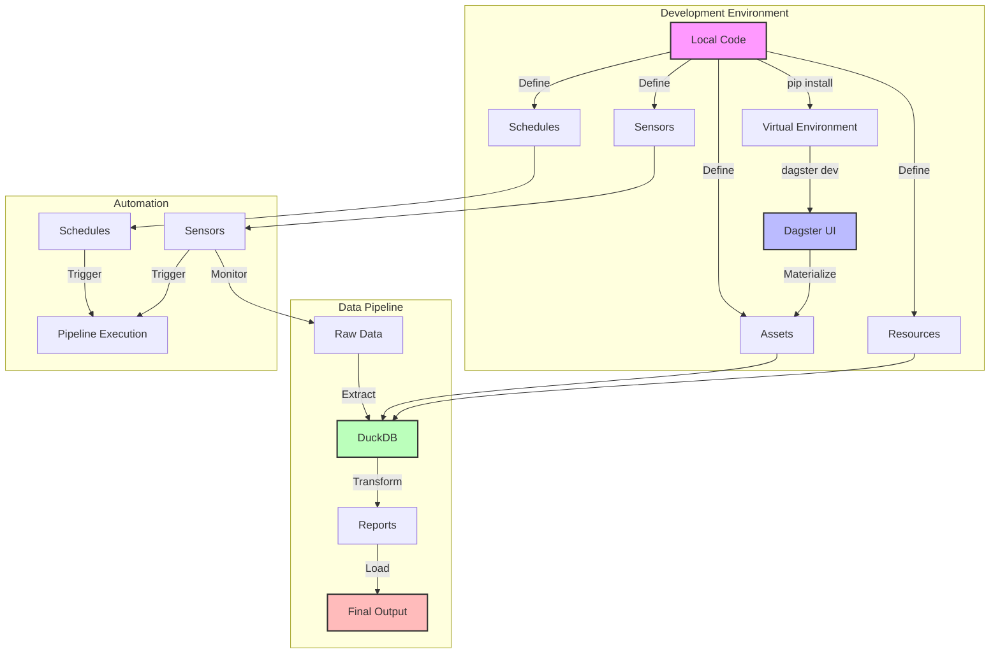
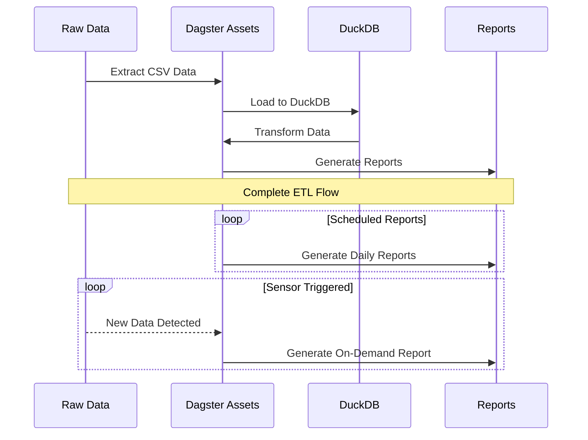

# Dagster Local Development Environment Setup Guide

## Project Structure
```
dagster-etl-project/
├── data/                           # Raw data directory
│   ├── products.csv
│   ├── sales_data.csv
│   ├── sales_reps.csv
│   └── sample_request/
│       └── request.json
├── etl_project/                    # Main package directory
│   ├── __init__.py
│   ├── assets/                     # Asset definitions
│   │   ├── __init__.py
│   │   ├── core.py
│   │   ├── raw.py
│   │   └── reports.py
│   ├── resources/                  # Resource configurations
│   │   ├── __init__.py
│   │   └── duckdb_io_manager.py
│   ├── sensors/                    # Sensor definitions
│   │   ├── __init__.py
│   │   └── file_sensors.py
│   ├── schedules/                  # Schedule definitions
│   │   ├── __init__.py
│   │   └── report_schedules.py
│   └── definitions.py              # Main Dagster definitions
├── notebooks/                      # Development notebooks
│   └── exploration.ipynb
├── tests/                         # Test directory
│   ├── __init__.py
│   └── test_assets.py
├── dagster_tutorial/              # Virtual environment
├── README.md
├── pyproject.toml                 # Project metadata and dependencies
├── setup.cfg                      # Package configuration
└── setup.py                       # Package setup script
```

## Development Workflow



## Setup Instructions

1. **Create Project Environment**
```bash
# Create project directory
mkdir dagster-etl-project
cd dagster-etl-project

# Create virtual environment
python -m venv dagster_tutorial
source dagster_tutorial/bin/activate  # For Unix/MacOS
# or
dagster_tutorial\Scripts\activate     # For Windows
```

2. **Install Dependencies**
```bash
pip install dagster dagster-webserver pandas dagster-duckdb
```

3. **Generate Project Structure**
```bash
dagster project from-example --example getting_started_etl_tutorial
```

4. **Required Package Configuration**

`pyproject.toml`:
```toml
[build-system]
requires = ["setuptools"]
build-backend = "setuptools.build_meta"

[tool.dagster]
module_name = "etl_project"
```

`setup.py`:
```python
from setuptools import find_packages, setup

setup(
    name="etl_project",
    packages=find_packages(exclude=["etl_project_tests"]),
    install_requires=[
        "dagster",
        "dagster-duckdb",
        "pandas",
    ],
    extras_require={"dev": ["dagster-webserver", "pytest"]},
)
```

## Asset Definition Example

```python
# etl_project/assets/raw.py
from dagster import asset
import pandas as pd

@asset
def raw_products():
    """Load raw products data from CSV."""
    return pd.read_csv("data/products.csv")

@asset
def raw_sales():
    """Load raw sales data from CSV."""
    return pd.read_csv("data/sales_data.csv")

@asset
def transformed_sales(raw_sales, raw_products):
    """Transform and combine sales and product data."""
    return raw_sales.merge(raw_products, on="product_id")
```

## Resource Configuration

```python
# etl_project/resources/duckdb_io_manager.py
from dagster import IOManager, io_manager
from dagster_duckdb import DuckDBResource

class DuckDBIOManager(IOManager):
    def __init__(self, database: str):
        self._database = database

    def handle_output(self, context, obj):
        table_name = context.asset_key.path[-1]
        obj.to_sql(table_name, self._database, if_exists="replace")

    def load_input(self, context):
        table_name = context.asset_key.path[-1]
        return pd.read_sql(f"SELECT * FROM {table_name}", self._database)

@io_manager
def duckdb_io_manager(init_context):
    return DuckDBIOManager(database="data/etl.duckdb")
```

## Launch Development Environment

1. **Start Dagster UI**
```bash
dagster dev
```

2. **Access Web Interface**
   - Open browser at http://localhost:3000
   - View assets, jobs, and schedules
   - Monitor pipeline execution

## ETL Pipeline Sequence



## Best Practices

1. **Project Organization**
   - Keep assets, resources, and schedules in separate modules
   - Use meaningful names for assets and jobs
   - Document asset dependencies clearly

2. **Development Workflow**
   - Test locally before deployment
   - Use version control for all code changes
   - Maintain separate development and production configurations

3. **Data Quality**
   - Implement asset checks for data validation
   - Monitor asset materialization
   - Handle errors gracefully

4. **Performance**
   - Optimize asset dependencies
   - Use appropriate materialization policies
   - Monitor resource usage

Remember to always start with the development server (`dagster dev`) when working locally, and use the Dagster UI to monitor and debug your pipelines.
