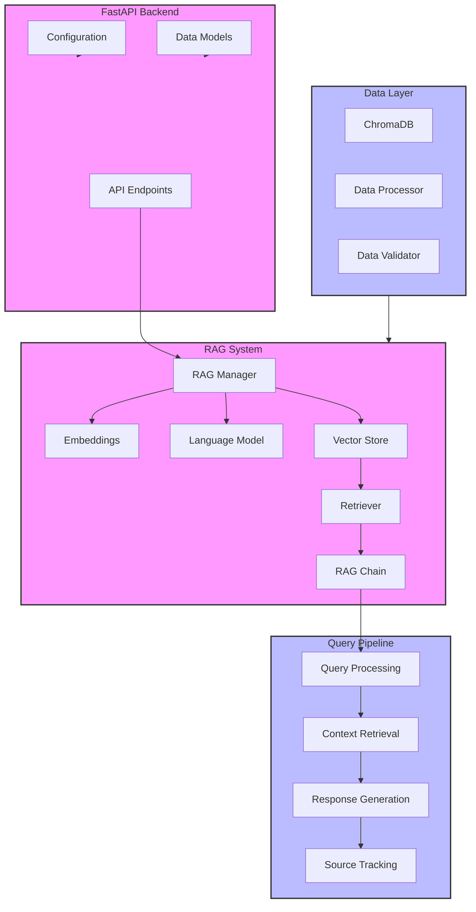
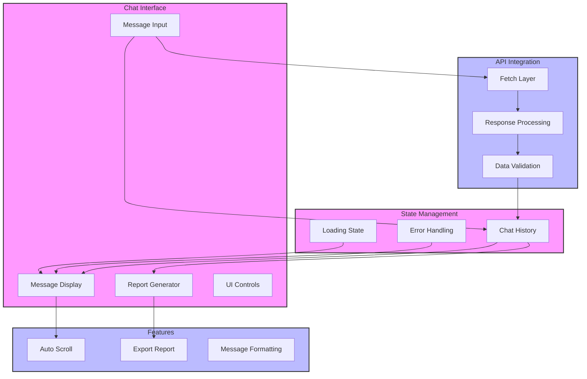

# RAG Chat Dashboard Implementation Guide

## Table of Contents
- [Overview](#overview)
- [System Architecture](#system-architecture)
- [Project Structure](#project-structure)
- [Backend Implementation](#backend-implementation)
- [Frontend Implementation](#frontend-implementation)
- [Development Setup](#development-setup)
- [Deployment](#deployment)
- [Testing](#testing)
- [Troubleshooting](#troubleshooting)

## Overview
This guide covers the implementation of a RAG (Retrieval Augmented Generation) chat dashboard that combines a FastAPI backend with a React frontend. The system enables users to query data through natural language and generate reports based on the responses.

## System Architecture

### Backend Architecture


### Frontend Architecture


## Project Structure
```
rag-chat-dashboard/
├── backend/
│   ├── __init__.py
│   ├── main.py
│   ├── api.py
│   ├── config.py
│   ├── database.py
│   ├── models.py
│   ├── rag_manager.py
│   └── tests/
│       ├── __init__.py
│       ├── test_api.py
│       └── test_rag.py
├── frontend/
│   ├── src/
│   │   ├── components/
│   │   │   ├── ChatInterface.jsx
│   │   │   ├── MessageList.jsx
│   │   │   ├── InputForm.jsx
│   │   │   └── ReportGenerator.jsx
│   │   ├── hooks/
│   │   │   ├── useChat.js
│   │   │   └── useReport.js
│   │   ├── utils/
│   │   │   ├── api.js
│   │   │   └── formatting.js
│   │   └── App.jsx
│   ├── public/
│   └── package.json
├── data/
│   ├── raw/
│   └── processed/
├── docker/
│   ├── backend.Dockerfile
│   ├── frontend.Dockerfile
│   └── docker-compose.yml
└── requirements.txt
```

## Backend Implementation

### 1. Setup Environment
```bash
# Create virtual environment
python -m venv venv
source venv/bin/activate

# Install dependencies
pip install -r requirements.txt
```

### 2. Configure Environment Variables
```bash
# .env
OPENAI_API_KEY=your_api_key
MODEL_NAME=gpt-3.5-turbo
CHROMA_DB_DIR=chroma_db
```

### 3. Initialize RAG System
```python
# backend/rag_manager.py
from langchain.chat_models import ChatOpenAI
from langchain.embeddings import OpenAIEmbeddings
from langchain.vectorstores import Chroma

class RAGManager:
    def __init__(self):
        self.setup_components()
        self.initialize_vector_store()
```

### 4. API Endpoints
```python
# backend/api.py
@app.post("/api/v1/chat")
async def chat(request: ChatRequest):
    response = await rag_manager.process_query(request.query)
    return ChatResponse(response=response)
```

## Frontend Implementation

### 1. Setup Project
```bash
# Create React project
npx create-react-app frontend
cd frontend

# Install dependencies
npm install @heroicons/react recharts tailwindcss
```

### 2. Configure Components
```jsx
// src/components/ChatInterface.jsx
const ChatInterface = () => {
  const [messages, setMessages] = useState([]);
  const [loading, setLoading] = useState(false);
  
  // Component implementation
};
```

### 3. API Integration
```javascript
// src/utils/api.js
export const sendMessage = async (message) => {
  const response = await fetch('/api/v1/chat', {
    method: 'POST',
    body: JSON.stringify({ message })
  });
  return response.json();
};
```

## Development Setup

### 1. Start Backend Server
```bash
# From project root
cd backend
uvicorn main:app --reload
```

### 2. Start Frontend Development Server
```bash
# From project root
cd frontend
npm start
```

### 3. Load Initial Data
```bash
curl -X POST http://localhost:8000/api/v1/load-data \
  -H "Content-Type: application/json" \
  -d @data/sample.json
```

## Deployment

### 1. Docker Setup
```yaml
# docker-compose.yml
version: '3.8'
services:
  backend:
    build:
      context: .
      dockerfile: docker/backend.Dockerfile
    ports:
      - "8000:8000"
    
  frontend:
    build:
      context: .
      dockerfile: docker/frontend.Dockerfile
    ports:
      - "3000:3000"
```

### 2. Deploy Services
```bash
docker-compose up -d
```

## Testing

### Backend Tests
```bash
# Run backend tests
pytest backend/tests/
```

### Frontend Tests
```bash
# Run frontend tests
cd frontend
npm test
```

## Troubleshooting

### Common Issues

1. Connection Issues
```python
# Check API connectivity
curl http://localhost:8000/health
```

2. RAG System Issues
```python
# Verify vector store
python -c "from backend.rag_manager import RAGManager; RAGManager().verify()"
```

3. Frontend Issues
```bash
# Clear cache and reinstall dependencies
rm -rf node_modules
npm install
```

## Best Practices

1. Error Handling
```python
try:
    response = await rag_manager.process_query(query)
except Exception as e:
    logger.error(f"Query processing failed: {e}")
    raise HTTPException(status_code=500)
```

2. Performance Optimization
```python
# Cache expensive operations
@lru_cache(maxsize=100)
def get_embeddings(text: str):
    return embeddings.embed_query(text)
```

3. Security Considerations
```python
# Implement rate limiting
app.add_middleware(
    RateLimitMiddleware,
    calls=10,
    period=60
)
```

## Next Steps
1. Implement user authentication
2. Add real-time updates using WebSocket
3. Enhance report generation capabilities
4. Add data visualization components
5. Implement caching layer

Remember to:
- Regularly update dependencies
- Monitor system performance
- Back up vector store data
- Implement proper logging
- Follow security best practices

This implementation provides a solid foundation for a RAG-based chat system that can be extended based on specific requirements.