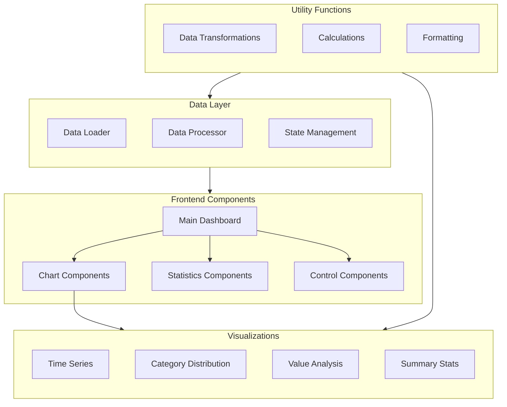

# Data Analytics Dashboard Implementation Guide

## Table of Contents
- [Overview](#overview)
- [System Architecture](#system-architecture)
- [Project Setup](#project-setup)
- [Implementation Steps](#implementation-steps)
- [Component Structure](#component-structure)
- [Data Management](#data-management)
- [Styling Guide](#styling-guide)
- [Testing](#testing)
- [Deployment](#deployment)

## Overview
This guide provides step-by-step instructions for implementing the data analytics dashboard using React and modern visualization libraries.

## System Architecture



## Project Setup

### Directory Structure
```
dashboard/
├── src/
│   ├── components/
│   │   ├── charts/
│   │   │   ├── TimeSeriesChart.jsx
│   │   │   ├── CategoryDistribution.jsx
│   │   │   ├── ValueAnalysis.jsx
│   │   │   └── SummaryStats.jsx
│   │   ├── common/
│   │   │   ├── Card.jsx
│   │   │   ├── Loading.jsx
│   │   │   └── Error.jsx
│   │   └── Dashboard.jsx
│   ├── utils/
│   │   ├── dataTransforms.js
│   │   ├── calculations.js
│   │   └── formatting.js
│   ├── hooks/
│   │   ├── useData.js
│   │   └── useChartConfig.js
│   ├── styles/
│   │   └── tailwind.css
│   └── App.jsx
├── public/
│   └── index.html
└── package.json
```

## Implementation Steps

### 1. Initial Setup
```bash
# Create project directory
mkdir data-dashboard
cd data-dashboard

# Install dependencies
npm install recharts @heroicons/react lodash
npm install -D tailwindcss postcss autoprefixer
```

### 2. Configure Tailwind CSS
```javascript
// tailwind.config.js
module.exports = {
  content: ['./src/**/*.{js,jsx}'],
  theme: {
    extend: {
      // Custom theme configurations
    }
  },
  plugins: []
}
```

### 3. Component Implementation

#### Base Dashboard Component
```jsx
// src/components/Dashboard.jsx
import React from 'react';
import TimeSeriesChart from './charts/TimeSeriesChart';
import CategoryDistribution from './charts/CategoryDistribution';
// ... other imports

const Dashboard = () => {
  // Implementation details
};

export default Dashboard;
```

### 4. Data Management

#### Data Hook Implementation
```javascript
// src/hooks/useData.js
import { useState, useEffect } from 'react';

export const useData = () => {
  // Implementation details
};
```

### 5. Chart Components

#### Time Series Chart
```jsx
// src/components/charts/TimeSeriesChart.jsx
import { LineChart, Line, XAxis, YAxis } from 'recharts';

const TimeSeriesChart = ({ data }) => {
  // Implementation details
};
```

## Component Structure

### Core Components
1. **Dashboard Container**
   - Main layout and data management
   - Component composition
   - Error boundary implementation

2. **Chart Components**
   - Time Series Analysis
   - Category Distribution
   - Value Analysis
   - Summary Statistics

3. **Control Components**
   - Date Range Selector
   - Category Filters
   - View Options

### Utility Functions
1. **Data Transformations**
   ```javascript
   // src/utils/dataTransforms.js
   export const transformTimeSeriesData = (data) => {
     // Implementation
   };
   ```

2. **Calculations**
   ```javascript
   // src/utils/calculations.js
   export const calculateStatistics = (data) => {
     // Implementation
   };
   ```

## Data Management

### State Management
```javascript
// Implementation of data loading and state management
const [data, setData] = useState([]);
const [loading, setLoading] = useState(true);
const [error, setError] = useState(null);
```

### Data Processing
```javascript
// Data transformation pipeline
const processData = (rawData) => {
  // Implementation steps
};
```

## Styling Guide

### Tailwind CSS Classes
```jsx
// Common styling patterns
const cardStyles = "rounded-lg shadow-md p-4";
const chartStyles = "h-64 w-full";
```

### Component-Specific Styles
```jsx
// Chart container styling
<div className="grid grid-cols-1 md:grid-cols-2 gap-4">
  {/* Chart components */}
</div>
```

## Testing

### Unit Tests
```javascript
// src/__tests__/Dashboard.test.js
import { render, screen } from '@testing-library/react';
import Dashboard from '../components/Dashboard';

describe('Dashboard', () => {
  // Test implementations
});
```

### Integration Tests
```javascript
// src/__tests__/integration/DataFlow.test.js
describe('Data Flow', () => {
  // Test implementations
});
```

## Deployment

### Build Process
```bash
# Production build
npm run build

# Start local server
npm start
```

### Environment Configuration
```javascript
// .env
REACT_APP_API_URL=http://localhost:3000
REACT_APP_REFRESH_INTERVAL=30000
```

## Next Steps
1. Implement real-time data updates
2. Add more interactive features
3. Enhance error handling
4. Add data export functionality
5. Implement user preferences storage

## Troubleshooting

### Common Issues
1. Data loading errors
   ```javascript
   // Error handling example
   try {
     // Data loading logic
   } catch (error) {
     console.error('Data loading failed:', error);
   }
   ```

2. Chart rendering issues
   ```javascript
   // Chart error boundary
   <ErrorBoundary fallback={<ErrorMessage />}>
     <ChartComponent />
   </ErrorBoundary>
   ```

## Performance Optimization

### Data Caching
```javascript
// Implement data caching
const cachedData = useMemo(() => {
  return processData(rawData);
}, [rawData]);
```

### Render Optimization
```javascript
// Optimize rendering
const MemoizedChart = memo(ChartComponent);
```

Remember to:
1. Start with the basic structure
2. Implement core features first
3. Add interactivity gradually
4. Test thoroughly
5. Optimize performance
6. Document code and features

This implementation guide provides a solid foundation for building a robust and scalable dashboard. Follow each section systematically for best results.