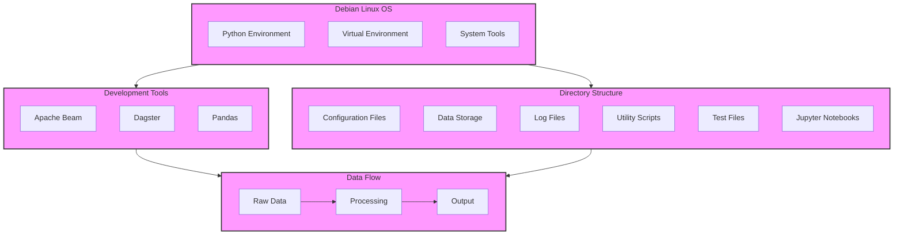

# Local Data Pipeline Development Guide
A comprehensive guide for setting up and using Apache Beam, Pandas, and Dagster for local data pipeline development.

## Table of Contents
- [Prerequisites](#prerequisites)
- [Project Setup](#project-setup)
- [Installation Guide](#installation-guide)
- [Project Structure](#project-structure)
- [Development Workflow](#development-workflow)
- [Running the Pipelines](#running-the-pipelines)
- [Debugging and Testing](#debugging-and-testing)
- [Best Practices](#best-practices)
- [Troubleshooting](#troubleshooting)
- [Local OS and Dev Server Build](https://github.com/rodneypuplampu/site-reliability-engineering-best-practices/blob/main/data-pipelines/data-pipeline-dev-server/debian-setup-guide.md)

## System Architecture



The diagram above illustrates the overall system architecture and how different components interact with each other. The system is built on Debian Linux OS, with a well-organized directory structure and essential development tools that handle the data flow through the pipeline.

## Prerequisites
Before starting, ensure you have the following installed:
- Python 3.8 or later
- pip (Python package installer)
- Git (optional, for version control)
- A code editor (VS Code, PyCharm, etc.)

## Project Setup

### 1. Create Project Directory
```bash
mkdir data-pipeline-local
cd data-pipeline-local
```

### 2. Set Up Virtual Environment
```bash
# Create virtual environment
python -m venv venv

# Activate virtual environment
# For Windows:
venv\Scripts\activate
# For Unix/MacOS:
source venv/bin/activate
```

### 3. Create Project Structure
```bash
mkdir -p data_processing/tests
mkdir notebooks
mkdir data
touch requirements.txt
touch README.md
```

## Installation Guide

### 1. Install Dependencies
Create requirements.txt with the following content:
```txt
apache-beam==2.50.0
dagster==1.5.11
dagster-pandas==0.21.11
pandas==2.1.1
notebook==7.0.6
pytest==7.4.0
```

Install the dependencies:
```bash
pip install -r requirements.txt
```

### 2. Verify Installation
```bash
python -c "import apache_beam; import dagster; import pandas"
```

## Project Structure
```
data-pipeline-local/
├── data_processing/
│   ├── __init__.py
│   ├── beam_pipeline.py
│   ├── dagster_ops.py
│   └── tests/
│       ├── __init__.py
│       ├── test_beam_pipeline.py
│       └── test_dagster_ops.py
├── notebooks/
│   └── local_development.ipynb
├── data/
│   ├── input/
│   └── output/
├── requirements.txt
└── README.md
```

## Development Workflow

### 1. Set Up Development Environment
1. Activate virtual environment:
   ```bash
   source venv/bin/activate  # Unix/MacOS
   venv\Scripts\activate     # Windows
   ```

2. Launch Jupyter Notebook:
   ```bash
   jupyter notebook
   ```

### 2. Create Sample Data
Use the notebook to generate sample data:
```python
import pandas as pd

# Create sample dataset
sample_data = pd.DataFrame({
    'category': ['A', 'B', 'A', 'C', 'B'],
    'value': [10, 20, 15, 25, 30]
})
sample_data.to_csv('data/input/sample_data.csv', index=False)
```

## Running the Pipelines

### 1. Apache Beam Pipeline
```python
from data_processing.beam_pipeline import run_beam_pipeline

# Run pipeline
run_beam_pipeline(
    input_path='data/input/sample_data.csv',
    output_path='data/output/beam_output'
)
```

### 2. Dagster Pipeline
```python
from data_processing.dagster_ops import process_data_job
from dagster import RunConfig

# Configure and run job
run_config = {
    'ops': {
        'load_data': {'config': {'path': 'data/input/sample_data.csv'}},
        'save_data': {'config': {'output_path': 'data/output/dagster_output.csv'}}
    }
}

result = process_data_job.execute_in_process(run_config=run_config)
```

## Debugging and Testing

### 1. Debug Apache Beam Pipeline
- Use Direct Runner for local debugging
- Add logging statements:
```python
import logging
logging.getLogger().setLevel(logging.INFO)
```

### 2. Debug Dagster Pipeline
- Use Dagster Debug Console:
```bash
dagster dev
```

### 3. Run Tests
```bash
pytest data_processing/tests/
```

## Best Practices

### 1. Code Organization
- Keep transformations modular and reusable
- Use type hints for better code clarity
- Document functions and classes
- Follow PEP 8 style guide

### 2. Data Processing
- Validate input data before processing
- Handle edge cases and errors gracefully
- Use appropriate data types
- Implement proper error logging

### 3. Testing
- Write unit tests for all transformations
- Test with different data scenarios
- Use mock objects for external dependencies
- Test error handling

## Troubleshooting

### Common Issues and Solutions

1. Import Errors
```
Error: No module named 'apache_beam'
Solution: Ensure virtual environment is activated and requirements are installed
```

2. Memory Issues
```
Error: MemoryError during processing
Solution: Reduce batch size or implement chunking
```

3. Path Issues
```
Error: FileNotFoundError
Solution: Verify file paths are relative to project root
```

### Environment Setup Issues

1. Virtual Environment
```bash
# If venv creation fails
python -m pip install --user virtualenv
python -m virtualenv venv
```

2. Jupyter Kernel
```bash
# If Jupyter can't find the virtual environment
python -m ipykernel install --user --name=data-pipeline-local
```

### Getting Help
- Check Apache Beam documentation
- Visit Dagster documentation
- Use GitHub issues for specific problems
- Join community forums for support

## Next Steps
1. Customize transformations for your data
2. Add more complex processing logic
3. Implement error handling
4. Add monitoring and logging
5. Scale up to larger datasets

Remember to always test thoroughly in the local environment before deploying to production. This setup provides a solid foundation for data pipeline development and can be extended based on specific requirements.
