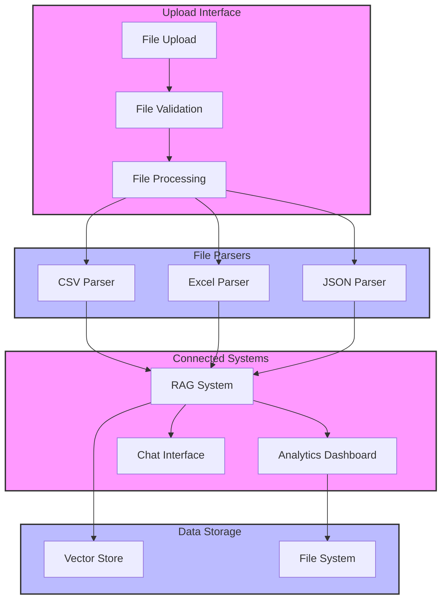

# Data Upload Interface Implementation Guide

## Table of Contents
- [Overview](#overview)
- [System Architecture](#system-architecture)
- [Project Structure](#project-structure)
- [Implementation Steps](#implementation-steps)
- [Component Details](#component-details)
- [Testing](#testing)
- [Deployment](#deployment)
- [Troubleshooting](#troubleshooting)

## Overview
This guide covers the implementation of a data upload interface that handles multiple file formats and updates connected systems including RAG backend, analytics dashboard, and chat interface.

## System Architecture

### Data Flow Architecture


## Project Structure
```
data-upload/
├── src/
│   ├── components/
│   │   ├── upload/
│   │   │   ├── DataUploadInterface.jsx
│   │   │   ├── FileDropZone.jsx
│   │   │   ├── ProcessingIndicator.jsx
│   │   │   └── FileInfo.jsx
│   │   └── common/
│   │       ├── Alert.jsx
│   │       └── Card.jsx
│   ├── utils/
│   │   ├── fileProcessors/
│   │   │   ├── csvProcessor.js
│   │   │   ├── excelProcessor.js
│   │   │   └── jsonProcessor.js
│   │   ├── validation/
│   │   │   ├── fileValidation.js
│   │   │   └── dataValidation.js
│   │   └── api/
│   │       ├── ragApi.js
│   │       └── storageApi.js
│   ├── hooks/
│   │   ├── useFileUpload.js
│   │   └── useDataProcessor.js
│   ├── styles/
│   │   └── upload.css
│   └── App.jsx
├── public/
│   └── index.html
├── tests/
│   ├── components/
│   │   └── DataUploadInterface.test.js
│   └── utils/
│       └── fileProcessors.test.js
└── package.json
```

## Implementation Steps

### 1. Initial Setup

```bash
# Create project directory
mkdir data-upload
cd data-upload

# Initialize React project
npx create-react-app .

# Install dependencies
npm install @heroicons/react papaparse xlsx tailwindcss
```

### 2. Configure Tailwind CSS

```javascript
// tailwind.config.js
module.exports = {
  content: ['./src/**/*.{js,jsx}'],
  theme: {
    extend: {
      // Custom configurations
    }
  }
}
```

### 3. Implement File Processors

```javascript
// utils/fileProcessors/csvProcessor.js
import Papa from 'papaparse';

export const processCSV = (file) => {
  return new Promise((resolve, reject) => {
    Papa.parse(file, {
      header: true,
      dynamicTyping: true,
      complete: (results) => resolve(results.data),
      error: (error) => reject(error)
    });
  });
};
```

### 4. Create Upload Hook

```javascript
// hooks/useFileUpload.js
import { useState, useCallback } from 'react';

export const useFileUpload = () => {
  const [dragActive, setDragActive] = useState(false);
  
  const handleDrop = useCallback((e) => {
    e.preventDefault();
    // Implementation
  }, []);

  return { dragActive, handleDrop };
};
```

### 5. Implement Main Component

```jsx
// components/upload/DataUploadInterface.jsx
import React from 'react';
import { useFileUpload } from '../../hooks/useFileUpload';

const DataUploadInterface = () => {
  // Implementation
};
```

## Component Details

### 1. File Drop Zone
```jsx
// components/upload/FileDropZone.jsx
const FileDropZone = ({ onDrop, loading }) => {
  return (
    <div
      className="border-2 border-dashed rounded-lg p-8"
      onDrop={onDrop}
    >
      {/* Implementation */}
    </div>
  );
};
```

### 2. Processing Indicator
```jsx
// components/upload/ProcessingIndicator.jsx
const ProcessingIndicator = ({ progress }) => {
  return (
    <div className="flex items-center">
      <div className="animate-spin rounded-full h-8 w-8" />
      <span>{progress}%</span>
    </div>
  );
};
```

## Data Validation

### 1. File Validation
```javascript
// utils/validation/fileValidation.js
export const validateFile = (file) => {
  const validTypes = ['text/csv', 'application/json'];
  
  if (!validTypes.includes(file.type)) {
    throw new Error('Invalid file type');
  }
  
  // Additional validation
};
```

### 2. Data Validation
```javascript
// utils/validation/dataValidation.js
export const validateData = (data) => {
  if (!Array.isArray(data)) {
    throw new Error('Data must be an array');
  }
  
  // Additional validation
};
```

## System Integration

### 1. RAG System Update
```javascript
// utils/api/ragApi.js
export const updateRAGSystem = async (data) => {
  const response = await fetch('http://localhost:8000/api/v1/load-data', {
    method: 'POST',
    body: JSON.stringify(data)
  });
  
  return response.json();
};
```

### 2. Storage Integration
```javascript
// utils/api/storageApi.js
export const saveToStorage = async (data) => {
  await window.fs.writeFile(
    'data/processed/current_data.json',
    JSON.stringify(data)
  );
};
```

## Testing

### 1. Component Tests
```javascript
// tests/components/DataUploadInterface.test.js
import { render, fireEvent } from '@testing-library/react';

describe('DataUploadInterface', () => {
  test('handles file drop correctly', () => {
    // Test implementation
  });
});
```

### 2. Integration Tests
```javascript
// tests/integration/fileProcessing.test.js
describe('File Processing Integration', () => {
  test('processes CSV and updates systems', async () => {
    // Test implementation
  });
});
```

## Deployment

### 1. Build Process
```bash
# Create production build
npm run build

# Start local server
npm start
```

### 2. Environment Configuration
```javascript
// .env
REACT_APP_API_URL=http://localhost:8000
REACT_APP_MAX_FILE_SIZE=5242880  // 5MB
```

## Troubleshooting

### Common Issues

1. File Upload Errors
```javascript
try {
  await processFile(file);
} catch (error) {
  console.error('File processing failed:', error);
  setError(error.message);
}
```

2. System Update Failures
```javascript
try {
  await Promise.all([
    updateRAGSystem(data),
    saveToStorage(data)
  ]);
} catch (error) {
  handleSystemUpdateError(error);
}
```

## Performance Optimization

### 1. File Processing
```javascript
const processLargeFile = async (file) => {
  const chunkSize = 1024 * 1024; // 1MB chunks
  // Chunked processing implementation
};
```

### 2. Memory Management
```javascript
const cleanupProcessedData = () => {
  // Cleanup implementation
};
```

## Best Practices

1. Error Handling
- Implement comprehensive error catching
- Provide clear error messages
- Handle system-specific errors

2. User Experience
- Show clear progress indicators
- Provide immediate feedback
- Handle edge cases gracefully

3. Performance
- Process files in chunks
- Implement proper cleanup
- Cache results when appropriate

## Next Steps
1. Add support for more file formats
2. Implement file preview
3. Add batch processing
4. Enhance error reporting
5. Add data transformation options

Remember to:
- Test thoroughly
- Handle edge cases
- Document changes
- Monitor performance
- Back up data regularly

This implementation guide provides a solid foundation for building a robust data upload interface that integrates with multiple systems.