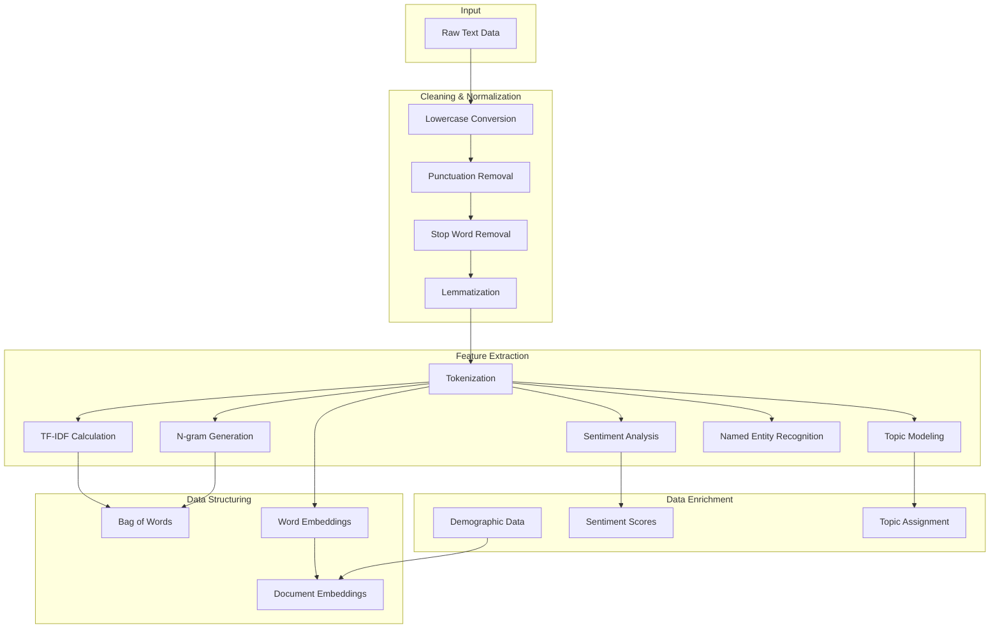

# Text Data Transformation Implementation Guide

## Table of Contents
- [Overview](#overview)
- [Pipeline Architecture](#pipeline-architecture)
- [Implementation Steps](#implementation-steps)
- [Code Examples](#code-examples)
- [Usage Examples](#usage-examples)

## Overview

This guide provides a detailed implementation of text data transformation pipeline, including cleaning, feature extraction, structuring, and enrichment.

## Pipeline Architecture



## Implementation Steps

### 1. Text Cleaning and Normalization

```python
import nltk
import string
from nltk.corpus import stopwords
from nltk.tokenize import word_tokenize
from nltk.stem import WordNetLemmatizer
from typing import List, Dict

class TextCleaner:
    def __init__(self):
        nltk.download('punkt')
        nltk.download('stopwords')
        nltk.download('wordnet')
        self.stop_words = set(stopwords.words('english'))
        self.lemmatizer = WordNetLemmatizer()
        
    def clean_text(self, text: str) -> str:
        """
        Clean and normalize text data
        
        Args:
            text (str): Input text
            
        Returns:
            str: Cleaned text
        """
        # Convert to lowercase
        text = text.lower()
        
        # Remove punctuation
        text = text.translate(str.maketrans('', '', string.punctuation))
        
        # Tokenize
        tokens = word_tokenize(text)
        
        # Remove stop words and lemmatize
        cleaned_tokens = [
            self.lemmatizer.lemmatize(token)
            for token in tokens
            if token not in self.stop_words
        ]
        
        return ' '.join(cleaned_tokens)

```

### 2. Feature Extraction

```python
from sklearn.feature_extraction.text import TfidfVectorizer, CountVectorizer
from textblob import TextBlob
import gensim
from gensim import corpora
import spacy

class FeatureExtractor:
    def __init__(self):
        self.nlp = spacy.load('en_core_web_sm')
        
    def extract_ngrams(self, text: str, n: int) -> List[str]:
        """
        Extract n-grams from text
        
        Args:
            text (str): Input text
            n (int): N-gram size
            
        Returns:
            List[str]: List of n-grams
        """
        vectorizer = CountVectorizer(ngram_range=(n, n))
        ngrams = vectorizer.fit_transform([text])
        return vectorizer.get_feature_names_out()
    
    def calculate_tfidf(self, documents: List[str]) -> Dict:
        """
        Calculate TF-IDF scores
        
        Args:
            documents (List[str]): List of documents
            
        Returns:
            Dict: TF-IDF scores for each term
        """
        vectorizer = TfidfVectorizer()
        tfidf_matrix = vectorizer.fit_transform(documents)
        return dict(zip(vectorizer.get_feature_names_out(), 
                       tfidf_matrix.toarray()[0]))
    
    def analyze_sentiment(self, text: str) -> Dict:
        """
        Perform sentiment analysis
        
        Args:
            text (str): Input text
            
        Returns:
            Dict: Sentiment scores
        """
        blob = TextBlob(text)
        return {
            'polarity': blob.sentiment.polarity,
            'subjectivity': blob.sentiment.subjectivity
        }
    
    def extract_topics(self, documents: List[str], num_topics: int) -> List[List[str]]:
        """
        Perform topic modeling
        
        Args:
            documents (List[str]): List of documents
            num_topics (int): Number of topics to extract
            
        Returns:
            List[List[str]]: List of topics with their top terms
        """
        # Tokenize documents
        tokenized_docs = [doc.split() for doc in documents]
        
        # Create dictionary and corpus
        dictionary = corpora.Dictionary(tokenized_docs)
        corpus = [dictionary.doc2bow(doc) for doc in tokenized_docs]
        
        # Train LDA model
        lda_model = gensim.models.LdaModel(
            corpus=corpus,
            id2word=dictionary,
            num_topics=num_topics,
            random_state=42
        )
        
        return [
            [word for word, _ in lda_model.show_topic(topic_id)]
            for topic_id in range(num_topics)
        ]
    
    def extract_entities(self, text: str) -> Dict[str, List[str]]:
        """
        Perform named entity recognition
        
        Args:
            text (str): Input text
            
        Returns:
            Dict[str, List[str]]: Dictionary of entity types and their values
        """
        doc = self.nlp(text)
        entities = {}
        for ent in doc.ents:
            if ent.label_ not in entities:
                entities[ent.label_] = []
            entities[ent.label_].append(ent.text)
        return entities
```

### 3. Data Structuring

```python
import numpy as np
from gensim.models import Word2Vec
from sentence_transformers import SentenceTransformer

class TextStructurer:
    def __init__(self):
        self.sentence_transformer = SentenceTransformer('all-MiniLM-L6-v2')
        
    def create_bow(self, text: str) -> Dict[str, int]:
        """
        Create bag-of-words representation
        
        Args:
            text (str): Input text
            
        Returns:
            Dict[str, int]: Word frequencies
        """
        vectorizer = CountVectorizer()
        bow = vectorizer.fit_transform([text])
        return dict(zip(vectorizer.get_feature_names_out(), 
                       bow.toarray()[0]))
    
    def create_word_embeddings(self, documents: List[str]) -> Dict[str, np.ndarray]:
        """
        Create word embeddings
        
        Args:
            documents (List[str]): List of documents
            
        Returns:
            Dict[str, np.ndarray]: Word vectors
        """
        # Tokenize documents
        tokenized_docs = [doc.split() for doc in documents]
        
        # Train Word2Vec model
        model = Word2Vec(sentences=tokenized_docs, 
                        vector_size=100, 
                        window=5, 
                        min_count=1)
        
        return {word: model.wv[word] for word in model.wv.index_to_key}
    
    def create_document_embeddings(self, documents: List[str]) -> np.ndarray:
        """
        Create document embeddings
        
        Args:
            documents (List[str]): List of documents
            
        Returns:
            np.ndarray: Document vectors
        """
        return self.sentence_transformer.encode(documents)
```

### 4. Data Enrichment

```python
class DataEnricher:
    def __init__(self):
        pass
        
    def augment_demographics(self, text_data: Dict, demographics: Dict) -> Dict:
        """
        Augment text data with demographic information
        
        Args:
            text_data (Dict): Text data
            demographics (Dict): Demographic data
            
        Returns:
            Dict: Enriched data
        """
        return {**text_data, **demographics}
    
    def integrate_sentiment(self, text_data: Dict, sentiment_scores: Dict) -> Dict:
        """
        Integrate sentiment scores
        
        Args:
            text_data (Dict): Text data
            sentiment_scores (Dict): Sentiment scores
            
        Returns:
            Dict: Enriched data
        """
        return {**text_data, 'sentiment': sentiment_scores}
    
    def assign_topics(self, text_data: Dict, topics: List[str]) -> Dict:
        """
        Assign topics to text data
        
        Args:
            text_data (Dict): Text data
            topics (List[str]): Assigned topics
            
        Returns:
            Dict: Enriched data
        """
        return {**text_data, 'topics': topics}
```

## Usage Examples

### 1. Customer Feedback Analysis

```python
def analyze_customer_feedback(feedback: str):
    # Initialize components
    cleaner = TextCleaner()
    extractor = FeatureExtractor()
    structurer = TextStructurer()
    enricher = DataEnricher()
    
    # Clean text
    cleaned_text = cleaner.clean_text(feedback)
    
    # Extract features
    sentiment = extractor.analyze_sentiment(cleaned_text)
    entities = extractor.extract_entities(cleaned_text)
    
    # Create structured representation
    doc_embedding = structurer.create_document_embeddings([cleaned_text])
    
    # Enrich data
    enriched_data = enricher.integrate_sentiment(
        {'text': cleaned_text, 'entities': entities},
        sentiment
    )
    
    return enriched_data

# Example usage
feedback = "The customer service was excellent! John from support helped me quickly."
results = analyze_customer_feedback(feedback)
```

### 2. Customer Segmentation

```python
def segment_customers(customer_data: List[Dict]):
    # Initialize components
    cleaner = TextCleaner()
    structurer = TextStructurer()
    
    # Process each customer
    processed_data = []
    for customer in customer_data:
        # Clean text data
        cleaned_text = cleaner.clean_text(customer['feedback'])
        
        # Create document embedding
        embedding = structurer.create_document_embeddings([cleaned_text])
        
        # Combine with demographic data
        processed_data.append({
            'embedding': embedding,
            'demographics': customer['demographics']
        })
    
    return processed_data

# Example usage
customers = [
    {'feedback': 'Great product!', 'demographics': {'age': 25, 'location': 'NY'}},
    {'feedback': 'Could be better', 'demographics': {'age': 35, 'location': 'CA'}}
]
segments = segment_customers(customers)
```

## Best Practices

1. **Data Quality**
   - Validate input text data
   - Handle missing values
   - Remove duplicate content

2. **Performance**
   - Use batch processing for large datasets
   - Cache frequently used resources
   - Optimize model loading

3. **Scalability**
   - Use parallel processing
   - Implement proper error handling
   - Monitor resource usage

4. **Maintenance**
   - Document code and configurations
   - Version control models and data
   - Regular updates and testing

Remember to adapt these implementations based on your specific requirements and data characteristics.
