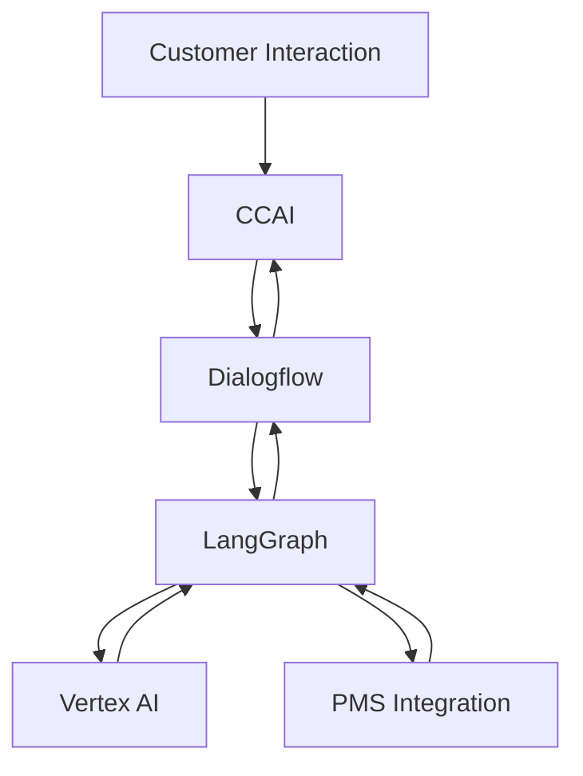

# Hotel Reservation System Architecture

## Overview
This system integrates Google Cloud Contact Center AI (CCAI), LangGraph, Dialogflow, Vertex AI, and hotel Property Management Systems (PMS) to create an intelligent hotel reservation and customer service platform.

## System Components

### 1. Contact Center AI (CCAI)
- Handles incoming customer interactions across multiple channels (voice, chat, email)
- Provides real-time transcription and sentiment analysis
- Integrates with Agent Assist for live agent support
- Manages call routing and queue management

### 2. LangGraph Integration
- Orchestrates complex conversation flows
- Manages state transitions between different dialogue stages
- Implements business logic for reservation processing
- Handles context management and memory across conversation turns

### 3. Dialogflow Natural Language Understanding
- Powers intent recognition and entity extraction
- Manages conversation context and session handling
- Implements custom fulfillment logic
- Provides fallback handling and error recovery
- Supports multi-language interactions

### 4. Vertex AI Endpoint
- Hosts custom machine learning models for:
  - Personalized room recommendations
  - Price optimization
  - Customer preference prediction
  - Availability forecasting
- Provides API endpoints for real-time inference
- Handles model versioning and deployment

### 5. Property Management System (PMS) Integration
- Real-time inventory synchronization
- Reservation creation and modification
- Guest profile management
- Payment processing
- Room assignment and management

## Architecture Flow



## Data Flow

1. **Customer Interaction**
   - Customer initiates contact through voice, chat, or email
   - CCAI processes initial interaction
   - Session context is created

2. **Intent Processing**
   - Dialogflow identifies customer intent
   - Entities are extracted and validated
   - Context is maintained across turns

3. **Conversation Management**
   - LangGraph manages conversation state
   - Implements business logic and validation
   - Maintains conversation memory

4. **AI Processing**
   - Vertex AI endpoints provide recommendations
   - Real-time inference for personalization
   - Dynamic pricing and availability checks

5. **PMS Operations**
   - Real-time inventory checks
   - Reservation creation/modification
   - Payment processing
   - Confirmation generation

## API Endpoints

### CCAI Endpoints
```
POST /api/v1/conversations
GET /api/v1/conversations/{id}
PUT /api/v1/conversations/{id}/state
```

### Dialogflow Endpoints
```
POST /api/v1/detect-intent
POST /api/v1/fulfill-intent
GET /api/v1/context/{session-id}
```

### Vertex AI Endpoints
```
POST /api/v1/predict/room-recommendation
POST /api/v1/predict/price-optimization
GET /api/v1/models/{model-id}/metadata
```

### PMS Integration Endpoints
```
GET /api/v1/inventory
POST /api/v1/reservations
PUT /api/v1/reservations/{id}
GET /api/v1/guests/{id}
```

## Configuration

### Environment Variables
```
GOOGLE_CLOUD_PROJECT=your-project-id
CCAI_AGENT_ID=your-agent-id
DIALOGFLOW_PROJECT_ID=your-dialogflow-project
VERTEX_AI_ENDPOINT=your-vertex-endpoint
PMS_API_ENDPOINT=your-pms-endpoint
PMS_API_KEY=your-pms-api-key
```

### Required Permissions
- Cloud Contact Center AI API access
- Dialogflow API access
- Vertex AI API access
- Cloud Storage access
- PMS API credentials

## Deployment

### Prerequisites
- Google Cloud Project with billing enabled
- Dialogflow project setup
- Vertex AI models deployed
- PMS API access configured

### Installation Steps
1. Clone the repository
2. Configure environment variables
3. Deploy Dialogflow agents
4. Deploy Vertex AI endpoints
5. Configure CCAI integration
6. Test end-to-end flow

## Security Considerations

### Authentication
- OAuth 2.0 implementation for all API endpoints
- JWT token validation
- API key management for PMS integration

### Data Protection
- End-to-end encryption for all communications
- PCI compliance for payment processing
- GDPR compliance for guest data
- Data retention policies

### Monitoring
- Real-time conversation monitoring
- Error tracking and logging
- Performance metrics collection
- Security audit logging

## Error Handling

### Graceful Degradation
- Fallback intents in Dialogflow
- Retry mechanisms for API calls
- Cache implementation for critical data
- Manual failover procedures

### Recovery Procedures
- Session recovery mechanisms
- Transaction rollback procedures
- Error notification system
- Automatic incident reporting

## Performance Optimization

### Caching Strategy
- Redis implementation for session data
- Inventory cache with time-based invalidation
- Response template caching
- API response caching

### Scaling Considerations
- Horizontal scaling for API endpoints
- Load balancing configuration
- Database sharding strategy
- Resource allocation guidelines

## Development Guidelines

### Code Standards
- Google Cloud Style Guide compliance
- API documentation requirements
- Testing requirements
- Code review process

### Testing Requirements
- Unit test coverage > 80%
- Integration test suite
- Load testing scenarios
- Security testing procedures

## Support and Maintenance

### Monitoring Setup
- Cloud Monitoring integration
- Alert configuration
- Performance dashboards
- Error tracking system

### Troubleshooting
- Common issues and solutions
- Debug logging configuration
- Support escalation process
- Incident response procedures

## Future Enhancements

### Planned Features
- Multi-language support expansion
- Advanced analytics integration
- Enhanced personalization
- Additional PMS integrations

### Roadmap
- Q1: Enhanced analytics
- Q2: Additional language support
- Q3: Advanced personalization
- Q4: New PMS integrations

## Contact Information

### Support Channels
- Technical Support: support@example.com
- Emergency Contact: emergency@example.com
- Feature Requests: features@example.com

### Documentation
- API Documentation: /docs/api
- Integration Guide: /docs/integration
- Troubleshooting Guide: /docs/troubleshooting
