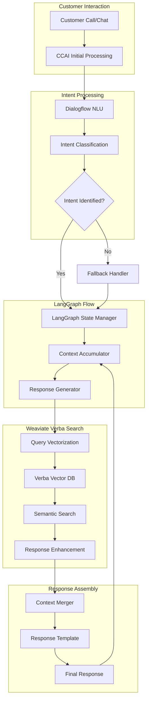

# Natural Language Processing Flow Architecture
## Using LangGraph, Weaviate Verba, and CCAI Dialogflow

## Overview
This document outlines the architecture for processing natural language queries in a hotel reservation system using LangGraph for conversation flow management, Weaviate Verba for vector search, and Google CCAI Dialogflow for intent recognition and response generation.

## Architecture Diagram



## Component Details

### 1. Customer Interaction Layer
- **Input Channels**
  - Voice calls (processed through CCAI Speech-to-Text)
  - Chat messages (direct text input)
  - Email inquiries (parsed text)

- **Initial Processing**
  - Language detection
  - Sentiment analysis
  - Initial context gathering

### 2. Intent Processing Layer
- **Dialogflow NLU**
  ```python
  class DialogflowProcessor:
      def process_input(self, text: str) -> Intent:
          intent = dialogflow.detect_intent(
              session_id=session_id,
              text=text,
              language_code='en'
          )
          return intent
  ```

- **Intent Classification**
  - Primary intents:
    - Reservation inquiries
    - Property information
    - Availability checks
    - Price queries
    - Special requests

### 3. LangGraph Flow Management
- **State Management**
  ```python
  class ConversationState(BaseModel):
      current_state: str
      context: Dict[str, Any]
      history: List[str]
      
  class LangGraphManager:
      def update_state(self, 
          current_state: ConversationState, 
          new_input: str
      ) -> ConversationState:
          # State transition logic
          return updated_state
  ```

- **Context Accumulation**
  - Maintains conversation history
  - Tracks entity mentions
  - Manages slot filling
  - Handles context window management

### 4. Weaviate Verba Integration
- **Query Processing**
  ```python
  class VerbaSearchProcessor:
      def __init__(self):
          self.client = weaviate.Client(
              url="http://localhost:8080",
              additional_headers={
                  "X-OpenAI-Api-Key": OPENAI_API_KEY
              }
          )

      def search(self, query: str) -> List[dict]:
          vector_query = self.client.query.get(
              "HotelInformation",
              ["content", "relevance"]
          ).with_near_text({
              "concepts": [query]
          })
          return vector_query.do()
  ```

- **Vector Database Schema**
  ```python
  hotel_schema = {
      "class": "HotelInformation",
      "vectorizer": "text2vec-openai",
      "properties": [
          {
              "name": "content",
              "dataType": ["text"],
              "description": "The hotel information content"
          },
          {
              "name": "category",
              "dataType": ["string"],
              "description": "Category of information"
          }
      ]
  }
  ```

### 5. Response Enhancement
- **Context Merging**
  ```python
  class ResponseEnhancer:
      def enhance_response(
          self,
          base_response: str,
          verba_results: List[dict],
          conversation_state: ConversationState
      ) -> str:
          # Merge context and enhance response
          return enhanced_response
  ```

- **Template Management**
  - Dynamic template selection
  - Personalization injection
  - Tone consistency maintenance

## Configuration

### Environment Setup
```bash
# Required environment variables
DIALOGFLOW_PROJECT_ID=your-project-id
WEAVIATE_ENDPOINT=your-weaviate-endpoint
OPENAI_API_KEY=your-openai-key
LANGGRAPH_CONFIG_PATH=path/to/config
```

### Weaviate Schema Configuration
```bash
# Initialize Weaviate schema
curl -X POST \
  http://localhost:8080/v1/schema \
  -H 'Content-Type: application/json' \
  -d @hotel_schema.json
```

## Implementation Steps

1. **Initial Setup**
   ```bash
   pip install langgraph weaviate-client google-cloud-dialogflow
   ```

2. **LangGraph Flow Definition**
   ```python
   from langgraph.graph import Graph
   
   def create_conversation_flow():
       graph = Graph()
       graph.add_node("intent_processor", DialogflowProcessor())
       graph.add_node("state_manager", LangGraphManager())
       graph.add_node("verba_search", VerbaSearchProcessor())
       graph.add_node("response_enhancer", ResponseEnhancer())
       
       # Define flow
       graph.add_edge("intent_processor", "state_manager")
       graph.add_edge("state_manager", "verba_search")
       graph.add_edge("verba_search", "response_enhancer")
       
       return graph
   ```

3. **Weaviate Integration**
   ```python
   def initialize_weaviate():
       client = weaviate.Client(
           url=WEAVIATE_ENDPOINT
       )
       
       # Create schema
       client.schema.create_class(hotel_schema)
       
       return client
   ```

4. **Response Flow Integration**
   ```python
   class ResponseFlow:
       def process_input(self, user_input: str) -> str:
           # Process through graph
           intent = self.dialog_processor.process(user_input)
           state = self.state_manager.update(intent)
           search_results = self.verba_search.search(user_input)
           
           return self.response_enhancer.generate(
               state, 
               search_results
           )
   ```

## Best Practices

### 1. Query Optimization
- Use semantic chunking for large texts
- Implement caching for frequent queries
- Maintain optimal vector dimensions

### 2. Context Management
- Implement rolling window for conversation history
- Prune irrelevant context periodically
- Maintain entity linking across turns

### 3. Response Generation
- Use temperature scaling for response variety
- Implement fallback mechanisms
- Maintain conversation coherence

## Monitoring and Maintenance

### 1. Performance Metrics
- Query response times
- Intent classification accuracy
- Vector search relevance scores

### 2. Error Handling
- Implement retry mechanisms
- Log failed queries
- Monitor vector database health

### 3. Continuous Improvement
- Regular model retraining
- Vector database reindexing
- Response template updates

## Future Enhancements

1. **Planned Features**
   - Multi-language vector search
   - Advanced context pruning
   - Dynamic response templating

2. **Integration Opportunities**
   - Sentiment-based routing
   - Personalization engine
   - A/B testing framework

## Support and Documentation

### API Documentation
- Dialogflow API reference
- Weaviate client documentation
- LangGraph flow definitions

### Troubleshooting
- Common issues and solutions
- Performance optimization tips
- Debug logging guidelines

## Contact Information
- Technical Support: `support@example.com`
- Documentation Updates: `docs@example.com`
- Feature Requests: `features@example.com`
