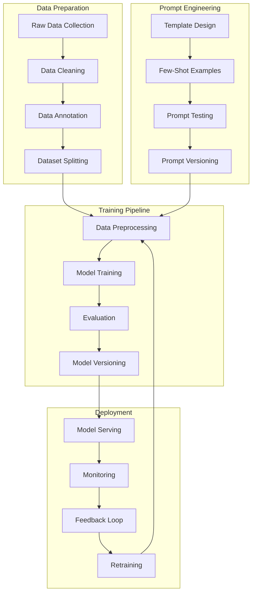

# AI Training Pipeline and Implementation Guide

## Architecture Overview



## Directory Structure

```
project_root/
├── data/
│   ├── raw/                     # Raw data files
│   ├── processed/               # Cleaned and processed data
│   ├── annotated/               # Annotated datasets
│   └── splits/                  # Train/val/test splits
│
├── prompts/
│   ├── templates/               # Prompt templates
│   ├── examples/                # Few-shot examples
│   └── versions/                # Versioned prompts
│
├── src/
│   ├── data_prep/
│   │   ├── cleaning.py
│   │   ├── annotation.py
│   │   └── splitting.py
│   │
│   ├── training/
│   │   ├── preprocessor.py
│   │   ├── trainer.py
│   │   └── evaluator.py
│   │
│   ├── deployment/
│   │   ├── serving.py
│   │   └── monitoring.py
│   │
│   └── utils/
│       ├── logging.py
│       └── metrics.py
│
├── config/
│   ├── data_config.yaml
│   ├── model_config.yaml
│   └── deployment_config.yaml
│
├── notebooks/
│   ├── data_analysis.ipynb
│   ├── prompt_testing.ipynb
│   └── model_evaluation.ipynb
│
├── tests/
│   ├── test_data_prep.py
│   ├── test_training.py
│   └── test_deployment.py
│
└── docs/
    ├── data_prep.md
    ├── prompt_engineering.md
    └── deployment.md
```

## Implementation Steps

### 1. Data Preparation

#### Raw Data Collection
```python
from src.data_prep.cleaning import DataCollector

collector = DataCollector(
    sources=[
        "customer_conversations",
        "chat_logs",
        "email_threads"
    ],
    output_format="jsonl"
)

data = collector.collect()
```

#### Data Cleaning
```python
from src.data_prep.cleaning import DataCleaner

cleaner = DataCleaner(
    operations=[
        "remove_pii",
        "normalize_text",
        "filter_noise"
    ]
)

cleaned_data = cleaner.clean(data)
```

#### Data Annotation
```python
from src.data_prep.annotation import Annotator

annotator = Annotator(
    schema="intent_schema.json",
    guidelines="annotation_guidelines.md"
)

annotated_data = annotator.annotate(cleaned_data)
```

### 2. Prompt Engineering

#### Template Design
```python
# prompts/templates/conversation.py
class ConversationTemplate:
    def __init__(self):
        self.base_template = """
        Given the following conversation context:
        {context}
        
        User query: {query}
        
        Generate a response that:
        1. Addresses the user's query
        2. Maintains context
        3. Follows hotel policies
        
        Response:"""
        
    def format(self, context, query):
        return self.base_template.format(
            context=context,
            query=query
        )
```

#### Few-Shot Examples
```python
# prompts/examples/reservation_examples.py
RESERVATION_EXAMPLES = [
    {
        "context": "First-time caller inquiring about room availability",
        "query": "Do you have any rooms available next weekend?",
        "response": "I'd be happy to check room availability for next weekend. Could you please specify your preferred check-in and check-out dates, and the number of guests?"
    },
    # More examples...
]
```

### 3. Training Pipeline

#### Data Preprocessing
```python
from src.training.preprocessor import DataPreprocessor

preprocessor = DataPreprocessor(
    tokenizer="gpt-4",
    max_length=1024,
    padding="max_length"
)

train_data = preprocessor.preprocess(annotated_data)
```

#### Model Training
```python
from src.training.trainer import ModelTrainer

trainer = ModelTrainer(
    model_name="gpt-4",
    training_args={
        "learning_rate": 1e-5,
        "batch_size": 16,
        "epochs": 3
    }
)

trained_model = trainer.train(train_data)
```

#### Evaluation
```python
from src.training.evaluator import ModelEvaluator

evaluator = ModelEvaluator(
    metrics=[
        "accuracy",
        "f1_score",
        "response_relevance"
    ]
)

metrics = evaluator.evaluate(trained_model, test_data)
```

### 4. Deployment

#### Model Serving
```python
from src.deployment.serving import ModelServer

server = ModelServer(
    model=trained_model,
    endpoint_config={
        "max_concurrent_requests": 100,
        "timeout_seconds": 30
    }
)

server.start()
```

#### Monitoring
```python
from src.deployment.monitoring import ModelMonitor

monitor = ModelMonitor(
    metrics=[
        "latency",
        "error_rate",
        "response_quality"
    ]
)

monitor.start_monitoring()
```

## Configuration

### Data Configuration
```yaml
# config/data_config.yaml
data_sources:
  - name: customer_conversations
    format: jsonl
    path: data/raw/conversations/
  - name: chat_logs
    format: csv
    path: data/raw/chats/

cleaning_operations:
  - remove_pii
  - normalize_text
  - filter_noise

annotation_schema:
  path: config/schemas/intent_schema.json
```

### Model Configuration
```yaml
# config/model_config.yaml
model:
  name: gpt-4
  version: v1.0.0
  parameters:
    max_length: 1024
    temperature: 0.7
    top_p: 0.9

training:
  batch_size: 16
  learning_rate: 1e-5
  epochs: 3
  evaluation_steps: 100
```

### Deployment Configuration
```yaml
# config/deployment_config.yaml
serving:
  endpoint: /api/v1/predict
  max_concurrent_requests: 100
  timeout_seconds: 30

monitoring:
  metrics:
    - latency
    - error_rate
    - response_quality
  alerts:
    error_rate_threshold: 0.01
    latency_threshold_ms: 500
```

## Best Practices

### Data Preparation
- Implement robust data validation
- Maintain data versioning
- Document data transformations
- Ensure consistent formatting

### Prompt Engineering
- Version control all prompts
- Test prompts systematically
- Document prompt patterns
- Maintain example databases

### Training Pipeline
- Log all training runs
- Version control models
- Implement early stopping
- Track experiment metrics

### Deployment
- Monitor model performance
- Implement gradual rollout
- Set up alerting
- Maintain feedback loops

## Quality Assurance

### Testing Strategy
```python
# tests/test_data_prep.py
def test_data_cleaning():
    cleaner = DataCleaner()
    raw_data = load_test_data()
    cleaned_data = cleaner.clean(raw_data)
    
    assert_no_pii(cleaned_data)
    assert_normalized_text(cleaned_data)
    assert_noise_filtered(cleaned_data)
```

### Monitoring Metrics
- Response latency
- Error rates
- Response quality
- Resource usage

## Documentation

### Required Documentation
- Data preparation guide
- Prompt engineering guidelines
- Model training documentation
- Deployment procedures
- Monitoring setup
- Troubleshooting guide

### API Documentation
```python
# API endpoint documentation
POST /api/v1/predict
Request:
{
    "query": string,
    "context": string,
    "parameters": object
}

Response:
{
    "response": string,
    "confidence": float,
    "metadata": object
}
```

## Maintenance

### Regular Tasks
- Data quality checks
- Prompt performance review
- Model retraining
- Performance optimization

### Update Procedures
- Data pipeline updates
- Prompt template updates
- Model version updates
- Deployment updates

## Support

### Contact Information
- Technical Support: support@example.com
- Data Team: data@example.com
- ML Team: ml@example.com
- Operations: ops@example.com

### Documentation Links
- Full Documentation: /docs
- API Reference: /docs/api
- Training Guide: /docs/training
- Deployment Guide: /docs/deployment
